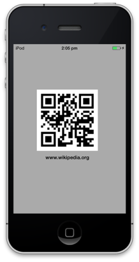

# Getting Started

## Create your first Barcode in Objective C

This section explains how to configure a Barcode for iOS application by using the Objective C. To get started with the Essential Barcode, refer to the following steps and in result, you get the output on iOS devices as follows.

                                
QR Barcode output
{:.caption}

### Add framework reference to the project

You can refer to the following link to learn how to refer to the framework to your project.

[Syncfusion iOS components installation](http://help.syncfusion.com/ios/introduction/installation-and-deployment) 

Similarly, the framework of SfBarcode is selected from the installed location to configure the Barcode.

###  Example

{unzipped location}\ syncfusionessentialios\ Frameworks\ SFBarcodeUI.framework

### Configure the Barcode control

The following steps explain you how to create and configure a Barcode.

1. Add reference to the SfBarcode in view controller as follows.

2. Create an instance of SfBarcode in view controller and add it as sub view in viewDidLoad override method.
   



    public override void ViewDidLoad ()
        {
            base.ViewDidLoad ();            
            SFBarcode barcode = new SFBarcode ();
            this.View.AddSubview (barcode);
        }



3. Then you can assign the text that you want to encode.     
   


    barcode.Text  =   (NSString)"www.wikipedia.org";



4. Specify the required symbology to encode the given text. By default, the given text is encoded by using the Code 39 symbology.    



    barcode.Symbology  =  SFBarcodeSymbolType.SFBarcodeSymbolTypeQRCode;    



5. To customize the Barcode, initialize the settings of the corresponding Barcode symbology.       
   


    SFQRBarcodeSettings settings  =  new SFQRBarcodeSettings  ();       
    settings.XDimension  =  6;      
    barcode.SymbologySettings  =  settings;



6. Finally, the Barcode is generated as displayed in the screenshot by using the following code example.         
7. 



    public override void ViewDidLoad ()
        {
            base.ViewDidLoad ();
            SFBarcode barcode = new SFBarcode ();
            barcode.Text  =   (NSString)"www.wikipedia.org";
            barcode.Symbology  = SFBarcodeSymbolType.SFBarcodeSymbolTypeQRCode;    
            SFQRBarcodeSettings settings  = new SFQRBarcodeSettings  ();       
            settings.XDimension  =  6;      
            barcode.SymbologySettings  =  settings;
            this.View.AddSubview (barcode);
        }



                             
  Final output of iOS getting started application
  {:.caption}

## Create your first Barcode in Swift

This section explains how to configure a Barcode for iOS application by using the Objective C. To get started with the Essential Barcode, refer to the following steps and in result, you get the output on iOS devices as follows.

                    
QR Barcode output
{:.caption}

Similarly, the framework of the SfBarcode is selected from the installed location to configure the Barcode.

### Example

_{unzipped location}\ syncfusionessentialios\ Frameworks\ SFBarcodeUI.framework_

### Configure the Barcode control

The following steps explain you how to create and configure a Barcode. 

1. Add reference to the SfBarcode in view controller as follows

2. Then, create an instance of the SfBarcode and add it as sub view in viewDidLoad override function.   



  public override void ViewDidLoad ()
        {
            base.ViewDidLoad ();            
  SFBarcode barcode = new SFBarcode ();
            this.View.AddSubview (barcode);
        }



3. Then you can assign the text that you want to encode.   
   


    barcode.Text  =   (NSString)"www.wikipedia.org";



4. Specify the required symbology to encode the given text. By default, the given text is encoded by using the Code 39 symbology.
   



    barcode.Symbology  =  SFBarcodeSymbolType.SFBarcodeSymbolTypeQRCode;    



5. To customize the Barcode, initialize the settings of the corresponding Barcode symbology. 
   


    SFQRBarcodeSettings settings  =  new SFQRBarcodeSettings  ();       
    settings.XDimension  =  6;      
    barcode.SymbologySettings  =  settings;


   
6. Finally, the Barcode is generated as displayed in the screenshot for the following code example.


    
    public override void ViewDidLoad ()
    {
    base.ViewDidLoad ();
    SFBarcode barcode = new SFBarcode ();
    barcode.Text  =   (NSString)"www.wikipedia.org";
    barcode.Symbology  =  SFBarcodeSymbolType.SFBarcodeSymbolTypeQRCode;    
    SFQRBarcodeSettings settings  =  new SFQRBarcodeSettings  ();       
    settings.XDimension  =  6;      
    barcode.SymbologySettings  =  settings;
    this.View.AddSubview (barcode);
    }



                      
Final output of iOS getting started application
{:.caption}