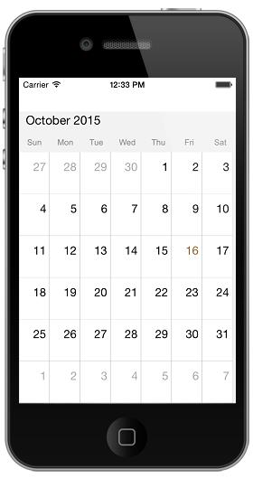
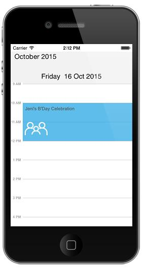

# Appearance & Styling 

## Cell Customization

Schedule views are designed as per the native calendar control with some enriched user interface for the control interaction and usability. Month view cell contains the date along with its appointments if available. There is an option available in Schedule control to change the default UI of Month View cell. By adopting <SFScheduleDelegate> protocol and using scheduleMonthCell to render custom UI for month view cell.



    public ScheduleViews ()
    {
    SFSchedule schedule= new SFSchedule ();
    schedule.ScheduleView = SFScheduleView.SFScheduleViewMonth;
    schedule.Delegate = new ScheduleDelegate ();
    this.AddSubview (schedule);
    this.control = this;
    }

    public class ScheduleDelegate : SFScheduleDelegate
    {
    public override SFMonthDayView ScheduleMonthCell(SFSchedule schedule){
    return new CustomMonthDayCell ();
    }
    }



Creating required custom UI to assign the month view cell.



    //CustomMonthDayCell
    public class CustomMonthDayCell:SFMonthDayView
    {
    NSDateComponents today;

    public override void Draw (CGRect rect)
    {
    today =NSCalendar.CurrentCalendar.Components(NSCalendarUnit.Day |
    NSCalendarUnit.Weekday| NSCalendarUnit.Year |
    NSCalendarUnit.Month,new NSDate());
    DrawAllBorders ();
    AddAppointments ();
    AddDayNumber ();
    }

    public void DrawAllBorders()
    {
    CGContext context = UIGraphics.GetCurrentContext ();
    context.SetLineWidth (1.0f);
    context.SaveState ();
    context.SetStrokeColor ((UIColor.LightGray).CGColor);

    //drawing right border
    context.MoveTo(this.Frame.Size.Width,0);
    context.AddLineToPoint (this.Frame.Size.Width, this.Frame.Size.Height);
    context.StrokePath ();
    context.RestoreState ();
    
    context.SetLineWidth (1.0f);
    context.SaveState ();
    context.SetStrokeColor ((UIColor.LightGray).CGColor);

    //drawing bottom border
    context.MoveTo(this.Frame.Size.Width,this.Frame.Size.Height);
    context.AddLineToPoint (0, this.Frame.Size.Height);
    context.StrokePath ();
    context.RestoreState ();

    context.SetLineWidth (1.0f);
    context.SaveState ();
    context.SetStrokeColor ((UIColor.LightGray).CGColor);

    //drawing left border
    context.MoveTo(0,this.Frame.Size.Height);
    context.AddLineToPoint (0, 0);
    context.StrokePath ();
    context.RestoreState ();

    context.SetLineWidth (1.0f);
    context.SaveState ();
    context.SetStrokeColor ((UIColor.LightGray).CGColor);

    //drawing left border
    context.MoveTo(0,0);
    context.AddLineToPoint (this.Frame.Size.Width, 0);
    context.StrokePath ();
    context.RestoreState ();

    }
    public void AddAppointments()
    {
    float xPosition=0;
    float yPosition=20;
    uint appCount = 0;
    if (this.VisibleAppointments != null) 
    {
    appCount = (uint)this.VisibleAppointments.Count;
    }
    for (int i=0;i<appCount;i++) {
    #if __UNIFIED__
    ScheduleAppointment app = this.VisibleAppointments.GetItem<ScheduleAppointment>((nuint)i);
    #else
    ScheduleAppointment app = this.VisibleAppointments.GetItem<ScheduleAppointment>(i);
    #endif
    CGContext context = UIGraphics.GetCurrentContext ();
    context.SetLineWidth (1.0f);
    context.SaveState ();
    context.SetStrokeColor ((app.AppointmentBackground).CGColor);
    context.SetFillColor((app.AppointmentBackground).CGColor);

    CGRect rect=new CGRect(xPosition,yPosition , 20, 5);
    context.FillRect (rect);
    context.StrokeRect (rect);
    context.RestoreState ();

    yPosition +=7;
    if(yPosition > this.Frame.Size.Height)
    {
    yPosition = (float)(this.Frame.Size.Height-10);
    }
    }
    }

    public void AddDayNumber()
    {
    NSString labelText = new NSString (this.Day.Day.ToString());
    UIFont textFont = UIFont.SystemFontOfSize (17.0f);
    UIColor textColor=UIColor.Black;
    int presentDay=(int)this.Day.Day;
    int presentMonth=(int)this.Day.Month;
    int presentYear=(int)this.Day.Year;
    if (!this.IsInCurrentMonth)
    {
    textColor = UIColor.LightGray;
    }
    if( presentDay== today.Day && presentMonth == today.Month &&  presentYear== today.Year)
    {
    textColor = UIColor.Blue;
    }
    if(this.IsSelected)
    {
    textColor = UIColor.Brown;
    }
    CGSize textSize = labelText.GetSizeUsingAttributes(new UIStringAttributes () {
    Font = textFont,ForegroundColor=textColor
    });

    CGRect textRect = new CGRect((float)Math.Ceiling(this.Bounds.Size.Width - (textSize.Width)-5), (float)Math.Ceiling(textSize.Height/2), textSize.Width, textSize.Height);
    UIStringAttributes attributes = new UIStringAttributes{ForegroundColor = textColor, Font= textFont};
    labelText.DrawString(textRect, attributes);
    }
    }



## Appointment Customization.

ScheduleAppointment created in schedule are arranged based on its duration, where the appointments viewed through day, week and work week view  are positioned in the timeslots. Default UI of the appointments in day, week and work week view can be changed by adopting <SFScheduleDelegate> protocol using scheduleDayAppointment to render custom UI for Appointments.



    public ScheduleViews ()
        {
            SFSchedule schedule= new SFSchedule ();
            schedule.ScheduleView = SFScheduleView.SFScheduleViewDay;
            schedule.Delegate = new ScheduleDelegate ();
            schedule.Appointments = CreateAppointments ();
            this.AddSubview (schedule);
            this.control = this;

        }

        NSMutableArray CreateAppointments()
        {
            NSDate today = new NSDate ();
            NSCalendar calendar = NSCalendar.CurrentCalendar;
            // Get the year, month, day from the date
            NSDateComponents components = calendar.Components(
                NSCalendarUnit.Year|NSCalendarUnit.Month|NSCalendarUnit.Day,today);

            // Set the hour, minute, second
            components.Hour = 10;
            components.Minute = 0;
            components.Second = 0;
            NSDate startDate = calendar.DateFromComponents(components);
            // Get the year, month, day from the date
            NSDateComponents endDateComponents = calendar.Components(NSCalendarUnit.Year|NSCalendarUnit.Month|NSCalendarUnit.Day,today);

            // Set the hour, minute, second
            endDateComponents.Hour = 12;
            endDateComponents.Minute = 0;
            endDateComponents.Second = 0;
            NSDate endDate = calendar.DateFromComponents(endDateComponents);
            ScheduleAppointment appointment = new ScheduleAppointment ();
            appointment.StartTime = startDate;
            appointment.EndTime = endDate;
            appointment.Subject = new NSString("Jeni's B'Day Celebration");
            appointment.AppointmentBackground = UIColor.FromRGB(0xA2, 0xC1, 0x39);
            NSDateComponents components1 = calendar.Components(NSCalendarUnit.Year|NSCalendarUnit.Month|NSCalendarUnit.Day,today);

            // Set the hour, minute, second
            components1.Hour = 11;
            components1.Minute = 0;
            components1.Second = 0;
            components1.Day=components1.Day+1;
            NSDate startDate1 = calendar.DateFromComponents(components1);
            // Get the year, month, day from the date
            NSDateComponents endDateComponents1 = calendar.Components(NSCalendarUnit.Year|NSCalendarUnit.Month|NSCalendarUnit.Day,today);

            // Set the hour, minute, second
            endDateComponents1.Hour = 13;
            endDateComponents1.Minute = 30;
            endDateComponents1.Second = 0;
            endDateComponents1.Day=endDateComponents1.Day+1;
            NSDate endDate1 = calendar.DateFromComponents(endDateComponents1);
            ScheduleAppointment appointment1 = new ScheduleAppointment ();
            appointment1.StartTime = startDate1;
            appointment1.EndTime = endDate1;
            appointment1.Subject = new NSString("Checkup");
            appointment1.AppointmentBackground = UIColor.FromRGB(0xD8,0x00,0x73);
            NSMutableArray appCollection= new NSMutableArray();
            appCollection.Add(appointment);
            appCollection.Add(appointment1);
            return appCollection;
        }

    public class ScheduleDelegate : SFScheduleDelegate
    {
        public override SFDayAppointment ScheduleDayAppointment (SFSchedule schedule)
        {
            return new CustomDayAppointment ();
        }

    }  



Creating custom UI to assign for schedule appointment.



    public class CustomDayAppointment:SFDayAppointment
    {
        static UIImage hospitalImage;
        static UIImage bDayImage;
        static UIImage businessImage;
        UIImage appointmentImage;
        public CustomDayAppointment ()
        {
            hospitalImage = new UIImage ("Images/Hospital.png");
            bDayImage =new  UIImage("Images/family.png"); 
            businessImage = new UIImage("Images/Team.png");
        }
        public override void Draw (CGRect rect)
        {
            if(this.Data.Subject== "Checkup")
            {
                appointmentImage = hospitalImage;
            }
            else
            {
                appointmentImage = bDayImage;
            }
            appointmentImage.Draw(new CGRect(50, 35, 50.0f, 50.0f));

            base.Draw (rect);
        }
        public override void LayoutSubviews ()
        {
            base.LayoutSubviews ();

        }
    }



