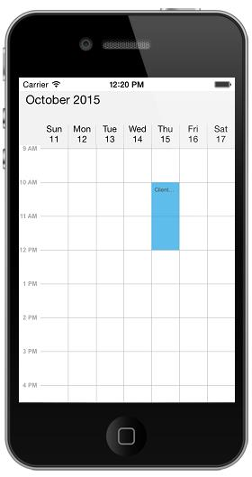
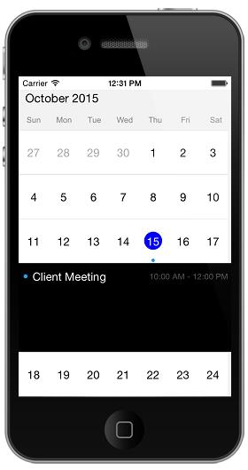

# Getting Started

This section explains you the steps required to render the Schedule control by populating  events(appointments), with inline support and min max dates support in the control. This section covers only the minimal features that you need to know to get started with the Schedule.

## Adding control reference to the application

Control reference can be added to the application through frameworks, to know more about adding and configuring the framework, refer [Syncfusion iOS components installation](http://help.syncfusion.com/ios/introduction/installation-and-deployment) 

## Initializing Schedule

Initialize SfSchedule instance in viewDidLoad method and then add the schedule as a sub view of  self view.



    public ScheduleViews ()
    {
    SFSchedule schedule= new SFSchedule ();
    schedule.ScheduleView = SFScheduleView.SFScheduleViewDay;
    schedule.Appointments = CreateAppointments ();
    this.AddSubview (schedule);
    this.control = this;
    }



You can change the default UI of schedule using ScheduleView to display the dates in different layouts available in the control.



    //setting schedule view.
    schedule.ScheduleView = SFScheduleView. SFScheduleViewWeek;
    this.AddSubview (schedule);
    this.control = this;



## Populating Events

You can add events to the schedule by creating collection of ScheduleAppointments  using  `ScheduleAppointmentCollection`. 



    public ScheduleViews ()
    {
    SFSchedule schedule= new SFSchedule ();
    schedule.ScheduleView = SFScheduleView.SFScheduleViewWeek;

    NSDate today = new NSDate ();

    NSMutableArray appCollection = new NSMutableArray ();
    NSCalendar calendar = NSCalendar.CurrentCalendar;
    // Get the year, month, day from the date
    NSDateComponents components = calendar.Components (
    NSCalendarUnit.Year | NSCalendarUnit.Month | NSCalendarUnit.Day, today);
    // Set the hour, minute, second
    components.Hour = 10;
    components.Minute = 0;
    components.Second = 0;

    // Get the year, month, day from the date
    NSDateComponents endDateComponents = calendar.Components (NSCalendarUnit.Year | NSCalendarUnit.Month | NSCalendarUnit.Day, today);
    // Set the hour, minute, second
    endDateComponents.Hour = 12;
    endDateComponents.Minute = 0;
    endDateComponents.Second = 0;

    NSDate startDate = calendar.DateFromComponents (components);
    NSDate endDate = calendar.DateFromComponents (endDateComponents);

    ScheduleAppointment appointment = new ScheduleAppointment ();
    appointment.StartTime = startDate;
    appointment.EndTime = endDate;
    components.Day = components.Day + 1;
    endDateComponents.Day = endDateComponents.Day + 1;
    appointment.Subject = (NSString)"Client Meeting";
    appointment.AppointmentBackground = UIColor.Red;

    appCollection.Add (appointment);

    schedule.Appointments = appCollection;
    this.AddSubview (schedule);
    this.control = this;

    }
    


## Populating Recursive Events

You can also add recursive appointments to Schedule, refer Recurrence section to know more about creating the recursive appointments using RRULE generator in schedule.



    public ScheduleViews ()
        {
            SFSchedule schedule= new SFSchedule ();
            schedule.ScheduleView = SFScheduleView.SFScheduleViewWeek;

            NSDate today = new NSDate ();

            NSMutableArray appCollection = new NSMutableArray ();
            NSCalendar calendar = NSCalendar.CurrentCalendar;

            // Get the year, month, day from the date
            NSDateComponents components = calendar.Components (
                NSCalendarUnit.Year | NSCalendarUnit.Month | NSCalendarUnit.Day, today);

            // Set the hour, minute, second
            components.Hour = 10;
            components.Minute = 0;
            components.Second = 0;

            // Get the year, month, day from the date
            NSDateComponents endDateComponents = calendar.Components (NSCalendarUnit.Year | NSCalendarUnit.Month | NSCalendarUnit.Day, today);
            // Set the hour, minute, second
            endDateComponents.Hour = 12;
            endDateComponents.Minute = 0;
            endDateComponents.Second = 0;

            NSDate startDate = calendar.DateFromComponents (components);
            NSDate endDate = calendar.DateFromComponents (endDateComponents);

            ScheduleAppointment appointment = new ScheduleAppointment ();
            appointment.StartTime = startDate;
            appointment.EndTime = endDate;
            components.Day = components.Day + 1;
            endDateComponents.Day = endDateComponents.Day + 1;
            appointment.Subject = (NSString)"Client Meeting";
            appointment.AppointmentBackground = UIColor.Red;

    //Setting Recurrence Rule
            appointment.RecurrenceRule = (NSString)@"FREQ=DAILY;INTERVAL=2;COUNT=25";
            appointment.IsRecursive = true;

    //Adding Appointment Collection 
            appCollection.Add (appointment);
            schedule.Appointments = appCollection;

            this.AddSubview (schedule);
            this.control = this;

        }



## Enabling Appointments Inline

When the schedule appointments are viewed in Month view, it will not display  much information about the appointments, you can view the appointments in inline  by setting `showAppointmentsInline` property of `MonthViewSettings` as `True`.



    public ScheduleViews ()
    {
    SFSchedule schedule= new SFSchedule ();
    schedule.ScheduleView = SFScheduleView.SFScheduleViewMonth;

    //Enabling Appointment inline in MonthView
    schedule.MonthViewSettings.ShowAppointmentsInline = true;

    NSDate today = new NSDate ();
    NSMutableArray appCollection = new NSMutableArray ();
    NSCalendar calendar = NSCalendar.CurrentCalendar;

    // Get the year, month, day from the date
    NSDateComponents components = calendar.Components (
    NSCalendarUnit.Year | NSCalendarUnit.Month | NSCalendarUnit.Day, today);

    // Set the hour, minute, second
    components.Hour = 10;
    components.Minute = 0;
    components.Second = 0;

    // Get the year, month, day from the date
    NSDateComponents endDateComponents = calendar.Components (NSCalendarUnit.Year | NSCalendarUnit.Month | NSCalendarUnit.Day, today);
    // Set the hour, minute, second
    endDateComponents.Hour = 12;
    endDateComponents.Minute = 0;
    endDateComponents.Second = 0;

    NSDate startDate = calendar.DateFromComponents (components);
    NSDate endDate = calendar.DateFromComponents (endDateComponents);

    ScheduleAppointment appointment = new ScheduleAppointment ();
    appointment.StartTime = startDate;
    appointment.EndTime = endDate;
    components.Day = components.Day + 1;
    endDateComponents.Day = endDateComponents.Day + 1;
    appointment.Subject = (NSString)"Client Meeting";
    appointment.AppointmentBackground = UIColor.Red;

    appCollection.Add (appointment);

    schedule.Appointments = appCollection;
    this.AddSubview (schedule);
    this.control = this;
    }



## Restricting Dates

Certain dates can be restricted in schedule by setting `minDisplayDate` and `maxDisplayDate` properties of `SfSchedule`.  To know more about restricting dates within a particular range of dates refer [Min Max dates] <http://help.syncfusion.com/android/sfschedule/date-navigation-and-gesture#min-max-dates>.



    public ScheduleViews ()
    {
    SFSchedule schedule= new SFSchedule ();
    schedule.ScheduleView = SFScheduleView.SFScheduleViewMonth;
    schedule.MonthViewSettings.ShowAppointmentsInline = true;
    NSDate today = new NSDate ();

    NSMutableArray appCollection = new NSMutableArray ();
    NSCalendar calendar = NSCalendar.CurrentCalendar;
    // Get the year, month, day from the date
    NSDateComponents components = calendar.Components (
    NSCalendarUnit.Year | NSCalendarUnit.Month | NSCalendarUnit.Day, today);
    // Set the hour, minute, second
    components.Month=3;
    components.Hour = 10;
    components.Minute = 0;
    components.Second = 0;

    // Get the year, month, day from the date
    NSDateComponents endDateComponents = calendar.Components (NSCalendarUnit.Year | NSCalendarUnit.Month-1 | NSCalendarUnit.Day, today);
    // Set the hour, minute, second
    endDateComponents.Year=2015;
    endDateComponents.Month = 11;
    endDateComponents.Hour = 12;
    endDateComponents.Minute = 0;
    endDateComponents.Second = 0;

    NSDate maxDate = calendar.DateFromComponents (components);
    NSDate minDate = calendar.DateFromComponents (endDateComponents);

    schedule.MinDisplayDate = minDate;
    schedule.MaxDisplayDate = maxDate;

    this.AddSubview (schedule);
    this.control = this;

