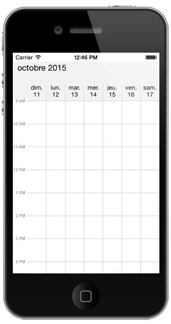

# Localization & Globalization

Schedule control is available with complete localization support . 

Localization can be specified by setting the Locale property of the control. In the format of `Language code` followed by `Country code`.  Based on the locale specified the strings in the control such as Date, time, days are localized accordingly.

By default schedule control is available with `en-US` locale. 

As the subject of the appointments are given in the application level, it can be set as localized strings as per the requirement. To know more about settings the subject refer ScheduleAppointment



    schedule.Locale =  new NSLocale("fr-FR");



## Schedule Custom String Localization

Schedule has a built in support for localizing the Custom Strings in it by specifying the corresponding string’s key and value in the `Localizable.strings` in the application. For an example in schedule there is a string “No Events” in Schedule Month View Inline. To localize the string, specify the key (“No Events”) and assign the corresponding localized string to it in `Localizable.strings` file. Please refer the following code for French language.

Schedule search for the key in corresponding language `Localizable.strings` file and displays the corresponding string in the schedule.
