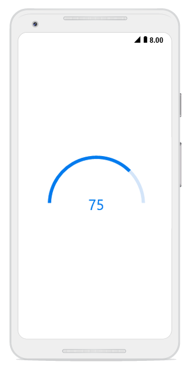
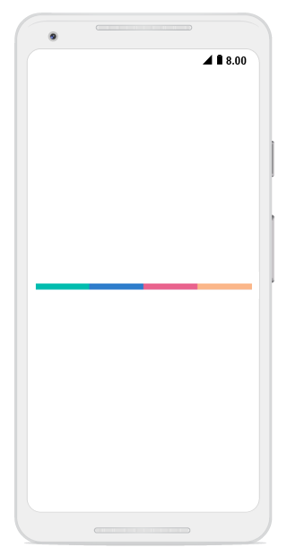
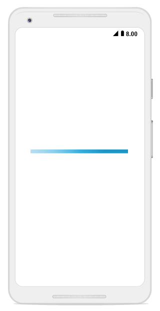
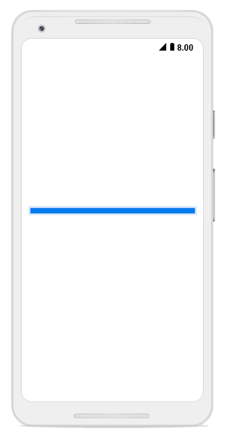
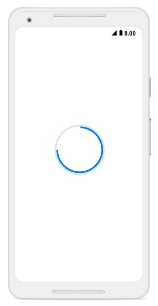
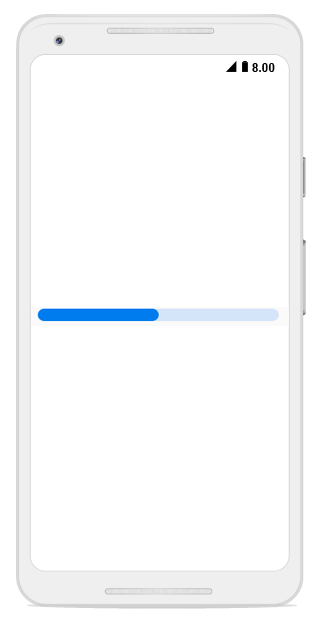
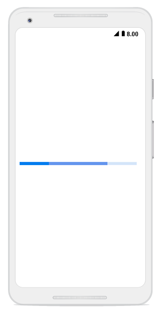

# Appearance

## Angle

The appearance of the circular progress bar can be customized to semi-circle, arc, etc. The start and end angles can be customized using the [`StartAngle`](https://help.syncfusion.com/cr/cref_files/xamarin-ios/Syncfusion.SfProgressBar.iOS~Syncfusion.iOS.ProgressBar.SfCircularProgressBar~StartAngle.html) and [`EndAngle`](https://help.syncfusion.com/cr/cref_files/xamarin-ios/Syncfusion.SfProgressBar.iOS~Syncfusion.iOS.ProgressBar.SfCircularProgressBar~EndAngle.html) properties. 

The following code example explains how to change the appearance of the circular progress bar to semi-circle.



SfCircularProgressBar circularProgressBar = new SfCircularProgressBar();

circularProgressBar.Progress = 75;

circularProgressBar.StartAngle = 180;

circularProgressBar.EndAngle = 360;

circularProgressBar.Frame = new CoreGraphics.CGRect(0, 160, this.View.Frame.Width, this.View.Frame.Height);

 

## Range colors

You can also visualize multiple ranges with different colors that are mapped to each range to enhance readability of progress.Currently, it is applicable only for linear progress bar.

The colors can be mapped to the specific ranges using the [`RangeColors`](https://help.syncfusion.com/cr/cref_files/xamarin-ios/Syncfusion.SfProgressBar.iOS~Syncfusion.iOS.ProgressBar.SfLinearProgressBar~RangeColors.html) property in the linear progress bar, which holds a collection of [`RangeColor`](https://help.syncfusion.com/cr/cref_files/xamarin-ios/Syncfusion.SfProgressBar.iOS~Syncfusion.iOS.ProgressBar.RangeColor.html). 

The following properties in [`RangeColor`](https://help.syncfusion.com/cr/cref_files/xamarin-ios/Syncfusion.SfProgressBar.iOS~Syncfusion.iOS.ProgressBar.RangeColor.html) are used to map the colors to range:

* [`Color`](https://help.syncfusion.com/cr/cref_files/xamarin-ios/Syncfusion.SfProgressBar.iOS~Syncfusion.iOS.ProgressBar.RangeColor~Color.html): Represents the color to the specified range.
* [`Start`](https://help.syncfusion.com/cr/cref_files/xamarin-ios/Syncfusion.SfProgressBar.iOS~Syncfusion.iOS.ProgressBar.RangeColor~Start.html): Represents the start range of the color.
* [`End`](https://help.syncfusion.com/cr/cref_files/xamarin-ios/Syncfusion.SfProgressBar.iOS~Syncfusion.iOS.ProgressBar.RangeColor~End.html): Represents the end range of the color.
* [`IsGradient`](https://help.syncfusion.com/cr/cref_files/xamarin-ios/Syncfusion.SfProgressBar.iOS~Syncfusion.iOS.ProgressBar.RangeColor~IsGradient.html): Represents whether the gradient effect is applied to the color.

The following code example shows mapping the solid color range in the linear progress bar.



SfLinearProgressBar linearProgressBar = new SfLinearProgressBar();
linearProgressBar.Progress = 100;
linearProgressBar.RangeColors.Add(new RangeColor() { Color = UIColor.FromRGB(0, 189, 175), Start = 0, End = 25 });
linearProgressBar.RangeColors.Add(new RangeColor() { Color = UIColor.FromRGB(47, 126, 204), Start = 25, End = 50 });
linearProgressBar.RangeColors.Add(new RangeColor() { Color = UIColor.FromRGB(233, 100, 142),Start=50, End=75 });
linearProgressBar.RangeColors.Add(new RangeColor() { Color = UIColor.FromRGB(251, 183, 138), Start = 75, End = 100 });

 

The following code example shows how to apply gradient transition effect to the range colors in the linear progress bar.



SfLinearProgressBar linearProgressBar = new SfLinearProgressBar();
linearProgressBar.Progress = 100;
linearProgressBar.RangeColors.Add(new RangeColor { IsGradient = true, Color = UIColor.FromRGB(233, 236, 247), Start = 0, End = 20 });
linearProgressBar.RangeColors.Add(new RangeColor { IsGradient = true, Color = UIColor.FromRGB(160, 217, 239), Start = 20, End = 40 });
linearProgressBar.RangeColors.Add(new RangeColor { IsGradient = true, Color = UIColor.FromRGB(98, 193, 229), Start = 40, End = 60 });
linearProgressBar.RangeColors.Add(new RangeColor { IsGradient = true, Color = UIColor.FromRGB(32, 167, 219), Start = 60, End = 80 })
linearProgressBar.RangeColors.Add(new RangeColor { IsGradient = true, Color = UIColor.FromRGB(8, 150, 197), Start = 80, End = 100 })
linearProgressBar.Frame = new CoreGraphics.CGRect(0, 160, this.View.Frame.Width, this.View.Frame.Height);



## Thickness

**Linear** **progress** **bar**

In the linear progress bar, the height of the track and padding of the progress indicator can be customized using the [`TrackHeight`](https://help.syncfusion.com/cr/cref_files/xamarin-ios/Syncfusion.SfProgressBar.iOS~Syncfusion.iOS.ProgressBar.SfLinearProgressBar~TrackHeight.html) and [`IndicatorPadding`](https://help.syncfusion.com/cr/cref_files/xamarin-ios/Syncfusion.SfProgressBar.iOS~Syncfusion.iOS.ProgressBar.SfLinearProgressBar~IndicatorPadding.html) properties, respectively.



SfLinearProgressBar linearProgressBar = new SfLinearProgressBar();

linearProgressBar.Progress = 100;

linearProgressBar.TrackHeight = 10;

linearProgressBar.IndicatorPadding = new UIEdgeInsets(2,2,2,2);

linearProgressBar.Frame = new CoreGraphics.CGRect(0, 160, this.View.Frame.Width, this.View.Frame.Height);



**Circular** **progress** **bar**

The following properties are used to customize the appearance of the circular progress bar:

* [`IndicatorOuterRadius`](https://help.syncfusion.com/cr/cref_files/xamarin-ios/Syncfusion.SfProgressBar.iOS~Syncfusion.iOS.ProgressBar.SfCircularProgressBar~IndicatorOuterRadius.html): Defines the outer radius of the progress indicator.
* [`IndicatorInnerRadius`](https://help.syncfusion.com/cr/cref_files/xamarin-ios/Syncfusion.SfProgressBar.iOS~Syncfusion.iOS.ProgressBar.SfCircularProgressBar~IndicatorInnerRadius.html): Defines the inner radius of the progress indicator.
* [`TrackOuterRadius`](https://help.syncfusion.com/cr/cref_files/xamarin-ios/Syncfusion.SfProgressBar.iOS~Syncfusion.iOS.ProgressBar.SfCircularProgressBar~TrackOuterRadius.html): Defines the outer radius of the track indicator.
* [`TrackInnerRadius`](https://help.syncfusion.com/cr/cref_files/xamarin-ios/Syncfusion.SfProgressBar.iOS~Syncfusion.iOS.ProgressBar.SfCircularProgressBar~TrackInnerRadius.html): Defines the inner radius of the track indicator.

The following code example shows how to customize the appearance of circular progress bar.



SfCircularProgressBar trackOutsideProgressBar = new SfCircularProgressBar();

trackOutsideProgressBar.Progress = 75;

trackOutsideProgressBar.IndicatorOuterRadius = 0.7f;

trackOutsideProgressBar.IndicatorInnerRadius = 0.65f;

trackOutsideProgressBar.ShowProgressValue = false;

 

## Corner radius

The [`CornerRadius`](https://help.syncfusion.com/cr/cref_files/xamarin-ios/Syncfusion.SfProgressBar.iOS~Syncfusion.iOS.ProgressBar.SfLinearProgressBar~CornerRadius.html) property is used to customize the rounded edges in the linear progress bar, as shown in the following code example.



SfLinearProgressBar linearProgressBar = new SfLinearProgressBar();

linearProgressBar.Progress = 50;

linearProgressBar.CornerRadius = 10;

 

## Color customization

The following properties are used to customize the color in the progress bar:

* [`ProgressColor`](https://help.syncfusion.com/cr/cref_files/xamarin-ios/Syncfusion.SfProgressBar.iOS~Syncfusion.iOS.ProgressBar.ProgressBarBase~ProgressColor.html): Represents the color of the progress indicator.
* [`TrackColor`](https://help.syncfusion.com/cr/cref_files/xamarin-ios/Syncfusion.SfProgressBar.iOS~Syncfusion.iOS.ProgressBar.ProgressBarBase~TrackColor.html): Represents the color of the track indicator.

The following code example shows the color customization in progress and track indicator.



SfLinearProgressBar linearProgressBar = new SfLinearProgressBar();

linearProgressBar.Progress = 75;

linearProgressBar.ProgressColor = = UIColor.FromRGB(28, 150, 197);

linearProgressBar.TrackColor = UIColor.FromRGB(28, 150, 197); 

 

The linear progress bar provides support to customize the color for the secondary progress bar using the [`SecondaryProgressColor`](https://help.syncfusion.com/cr/cref_files/xamarin-ios/Syncfusion.SfProgressBar.iOS~Syncfusion.iOS.ProgressBar.SfLinearProgressBar~SecondaryProgressColor.html) property,as shown in the following code example.


SfLinearProgressBar linearProgressBar = new SfLinearProgressBar();

linearProgressBar.Progress = 25;

linearProgressBar.SecondaryProgress = 75;

linearProgressBar.SecondaryProgressColor = UIColor.FromRGB(100, 149, 237);

 

