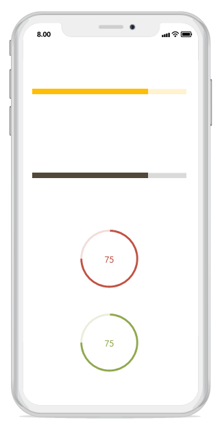

# Getting Started

This section explains the steps required to work with progress bar in Xamarin.iOS.

## Add progress bar reference

After installing Essential Studio for Xamarin, you can find all the required assemblies in the installation folders, typically:
{Syncfusion Installed location}\Essential Studio{version number}\lib

N>Assemblies are available in unzipped package location in Mac.

You have to add the following assembly reference to the iOS unified project
ios-unified\Syncfusion.SfProgressBar.iOS.dll

## Initialize the progress bar

Import the progress bar namespace as shown in the following codes in your respective page,

 

using Syncfusion.iOS.ProgressBar;

 

There are two variants of progress bar: SfLinearProgressBar and SfCircularProgressBar. Each render the progress in its own shape such as rectangle and circle respectively. Initialize both the progress bar with a progress value using Progress property as shown in the following code snippet.

 

        public override void ViewDidLoad()
        {
            base.ViewDidLoad();
            // Using linear progress bar. 
            SfLinearProgressBar linearProgressBar = new SfLinearProgressBar();
            linearProgressBar.Frame = new CoreGraphics.CGRect(10,150,this.View.Frame.Width,this.View.Frame.Height);            
            linearProgressBar.Progress = 75;
            this.View.AddSubview(linearProgressBar);

            // Using circular progress bar.
            SfCircularProgressBar circularProgressBar = new SfCircularProgressBar();
            circularProgressBar.Frame = new CoreGraphics.CGRect(0, 160, this.View.Frame.Width, this.View.Frame.Height);
            circularProgressBar.ShowProgressValue = false;
            circularProgressBar.Progress = 75;
            this.View.AddSubview(circularProgressBar);            
        }


 

N>By default, the value of progress should be specified between 0 and 100. If you need to specify progress value between 0 and 1, you should specify Minimum property to 0 and Maximum property to 1.

Run the project, and check if you get following output to make sure that you have configured your project properly to add the progress bar.

## Enable indeterminate state

When the progress of a task cannot be shown determinately, you can enable indeterminate state using [IsIndeterminate](https://help.syncfusion.com/cr/cref_files/xamarin-ios/sfprogressbar/Syncfusion.SfProgressBar.iOS~Syncfusion.iOS.ProgressBar.ProgressBarBase~IsIndeterminate.html) property to let user know that some progress is happening in the background.

 

            // Using linear progress bar. 
            SfLinearProgressBar linearProgressBar = new SfLinearProgressBar();
            linearProgressBar.Frame = new CoreGraphics.CGRect(10,150,this.View.Frame.Width,this.View.Frame.Height);            
            linearProgressBar.Progress = 75;
            linearProgressBar.IsIndeterminate = true;
            this.View.AddSubview(linearProgressBar);

            // Using circular progress bar.
            SfCircularProgressBar circularProgressBar = new SfCircularProgressBar();
            circularProgressBar.Frame = new CoreGraphics.CGRect(0, 160, this.View.Frame.Width, this.View.Frame.Height);
            circularProgressBar.ShowProgressValue = false;
            circularProgressBar.IsIndeterminate = true;
            circularProgressBar.Progress = 75;
            this.View.AddSubview(circularProgressBar);   


## Enable segments

To visualize the progress of a multiple sequential task, split the progress bar into the multiple segments by defining the [SegmentCount](https://help.syncfusion.com/cr/cref_files/xamarin-ios/sfprogressbar/Syncfusion.SfProgressBar.iOS~Syncfusion.iOS.ProgressBar.ProgressBarBase~SegmentCount.html) property as shown in the following code.

 

            // Using linear progress bar. 
            SfLinearProgressBar linearProgressBar = new SfLinearProgressBar();
            linearProgressBar.Frame = new CoreGraphics.CGRect(10,150,this.View.Frame.Width,this.View.Frame.Height);            
            linearProgressBar.Progress = 75;
            linearProgressBar.SegmentCount = 4;
            this.View.AddSubview(linearProgressBar);

            // Using circular progress bar.
            SfCircularProgressBar circularProgressBar = new SfCircularProgressBar();
            circularProgressBar.Frame = new CoreGraphics.CGRect(0, 160, this.View.Frame.Width, this.View.Frame.Height);
            circularProgressBar.ShowProgressValue = false;
            circularProgressBar.IsIndeterminate = true;
            circularProgressBar.SegmentCount = 4;
            this.View.AddSubview(circularProgressBar); 
 

## Apply colors

You can customize the color of the progress indicator and track by defining the [ProgressColor](https://help.syncfusion.com/cr/cref_files/xamarin-ios/sfprogressbar/Syncfusion.SfProgressBar.iOS~Syncfusion.iOS.ProgressBar.ProgressBarBase~ProgressColor.html) and [TrackColor](https://help.syncfusion.com/cr/cref_files/xamarin-ios/sfprogressbar/Syncfusion.SfProgressBar.iOS~Syncfusion.iOS.ProgressBar.ProgressBarBase~TrackColor.html) properties respectively.

 

            // Using linear progress bar. 
            SfLinearProgressBar linearProgressBar = new SfLinearProgressBar();
            linearProgressBar.Frame = new CoreGraphics.CGRect(10,50,this.View.Frame.Width,this.View.Frame.Height);            
            linearProgressBar.Progress = 75;
            linearProgressBar.TrackColor = UIColor.FromRGB(255,241,203);
            linearProgressBar.ProgressColor = UIColor.FromRGB(255, 183, 63);
            this.View.AddSubview(linearProgressBar);

            // Using linear progress bar. 
            SfLinearProgressBar sfLinearProgressBar = new SfLinearProgressBar();
            sfLinearProgressBar.Frame = new CoreGraphics.CGRect(10, 100, this.View.Frame.Width, this.View.Frame.Height);
            sfLinearProgressBar.Progress = 75;
            sfLinearProgressBar.TrackColor = UIColor.FromRGB(218, 218, 218);
            sfLinearProgressBar.ProgressColor = UIColor.FromRGB(82, 69,57);
            this.View.AddSubview(sfLinearProgressBar);

            // Using circular progress bar.
            SfCircularProgressBar circularProgressBar = new SfCircularProgressBar();
            circularProgressBar.Frame = new CoreGraphics.CGRect(0, 150, this.View.Frame.Width, 150);
            circularProgressBar.Progress = 75;                
            circularProgressBar.TrackColor = UIColor.FromRGB(237,224,224);
            circularProgressBar.ProgressColor = UIColor.FromRGB(150,84,81);
            this.View.AddSubview(circularProgressBar);

            // Using circular progress bar.
            SfCircularProgressBar sfCircularProgressBar = new SfCircularProgressBar();
            sfCircularProgressBar.Frame = new CoreGraphics.CGRect(0, 320, this.View.Frame.Width, 150);
            sfCircularProgressBar.Progress = 75;
            sfCircularProgressBar.TrackColor = UIColor.FromRGB(231,232,227);
            sfCircularProgressBar.ProgressColor = UIColor.FromRGB(168,179,127);
            this.View.AddSubview(sfCircularProgressBar);

 

You can find the complete getting started sample from this [link](http://www.syncfusion.com/downloads/support/directtrac/general/ze/ProgressBar_iOS266140402).
