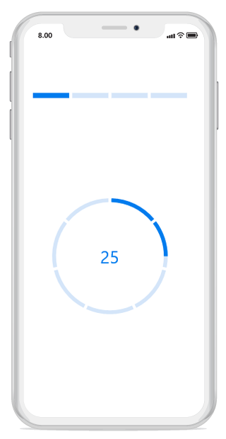
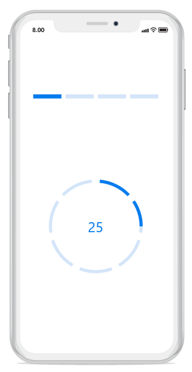

# Segments

To visualize the progress of multiple sequential tasks, split the progress bar into multiple segments by setting the [`SegmentCount`](https://help.syncfusion.com/cr/cref_files/xamarin-ios/Syncfusion.SfProgressBar.iOS~Syncfusion.iOS.ProgressBar.ProgressBarBase~SegmentCount.html) property, as shown in the following code example.



// Using linear progress bar.
SfLinearProgressBar sfLinearProgressBar = new SfLinearProgressBar(); 
sfLinearProgressBar.Progress = 25;
sfLinearProgressBar.Frame = new CoreGraphics.CGRect(10,150,this.View.Frame.Width,this.View.Frame.Height);  
sfLinearProgressBar.SegmentCount = 4;

// Using circular progress bar.
SfCircularProgressBar circularProgressBar = new SfCircularProgressBar();  
circularProgressBar.Progress = 25;
circularProgressBar.Frame = new CoreGraphics.CGRect(0, 160, this.View.Frame.Width, this.View.Frame.Height);
circularProgressBar.SegmentCount = 7;

 

**Gap** **Customization**

You can also customize the default spacing between the segments using the [`GapWidth`](https://help.syncfusion.com/cr/cref_files/xamarin-ios/Syncfusion.SfProgressBar.iOS~Syncfusion.iOS.ProgressBar.ProgressBarBase~GapWidth.html) property, as shown in following code example.


// Using linear progress bar.
SfLinearProgressBar sfLinearProgressBar = new SfLinearProgressBar(); 
sfLinearProgressBar.Frame = new CoreGraphics.CGRect(10,150,this.View.Frame.Width,this.View.Frame.Height);  
sfLinearProgressBar.Progress = 25;
sfLinearProgressBar.SegmentCount = 4;
sfLinearProgressBar.GapWidth = 5;

// Using circular progress bar.
SfCircularProgressBar circularProgressBar = new SfCircularProgressBar(); 
circularProgressBar.Frame = new CoreGraphics.CGRect(0, 160, this.View.Frame.Width, this.View.Frame.Height);
circularProgressBar.SegmentCount = 7;
circularProgressBar.Progress = 25; 
circularProgressBar.GapWidth = 10;



