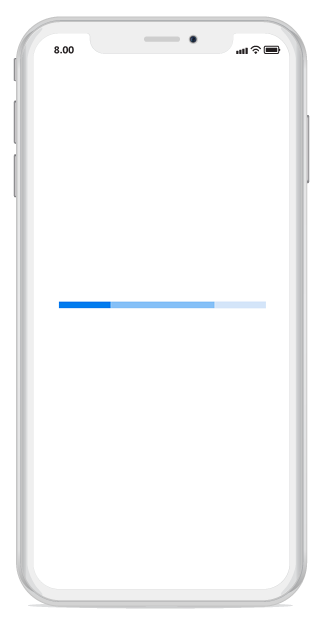

# States

Based on the progress estimation, you can configure the states of the progress bar.

## Determinate

This is the default state. You can use it when the progress estimation is known.

## Indeterminate

By enabling the [`IsIndeterminate`](https://help.syncfusion.com/cr/xamarin-ios/Syncfusion.iOS.ProgressBar.ProgressBarBase.html#Syncfusion_iOS_ProgressBar_ProgressBarBase_IsIndeterminate) property, the state of the progress bar can be changed to indeterminate when progress cannot be estimated or is not being calculated. It can be combined with determinate mode to let users know that the app is estimating progress before actual progress starts.



// Using linear progress bar. 
SfLinearProgressBar sfLinearProgressBar = new SfLinearProgressBar(); 
sfLinearProgressBar.Frame = new CoreGraphics.CGRect(10,150,this.View.Frame.Width,this.View.Frame.Height);            
sfLinearProgressBar.IsIndeterminate = true;   
         
// Using circular progress bar.
SfCircularProgressBar circularProgressBar = new SfCircularProgressBar();   
circularProgressBar.Frame = new CoreGraphics.CGRect(0, 160, this.View.Frame.Width, this.View.Frame.Height);         
circularProgressBar.IsIndeterminate = true;            

 

## Buffer

The secondary task’s progress can be defined by using the [`SecondaryProgress`](https://help.syncfusion.com/cr/xamarin-ios/Syncfusion.iOS.ProgressBar.SfLinearProgressBar.html#Syncfusion_iOS_ProgressBar_SfLinearProgressBar_SecondaryProgress) property as shown in the following code example.



SfLinearProgressBar sfLinearProgressBar = new SfLinearProgressBar();
sfLinearProgressBar.Frame = new CoreGraphics.CGRect(10,150,this.View.Frame.Width,this.View.Frame.Height); 
sfLinearProgressBar.Progress = 75;
sfLinearProgressBar.SecondaryProgress = 25;



