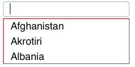

# Customizing the Suggestion DropDown

The suggestion list displaying behavior can be customized based on the entered text and delays in displaying the items.

## Set Minimum Prefix Character

Instead of displaying suggestion list on every text entry, the most possible match can be filtered and displayed after few text entries. This can be done by modifying `MinimumPrefixCharacters`.

N> The default property value is 1.





countryAutocomplete.MinimumPrefixCharacters=2;





## Set Popup Delay

We can delay the time taken to display the dropdown with suggestion list by using the `PopUpDelay` property in SfAutoComplete .

N> The default value is 0. The property value is maintained in milliseconds.





countryAutoComplete.PopUpDelay = 100;





## Set Maximum Height to the DropDown

The height of the drop-down portion of the SfAutocomplete control can be varied using `MaximumDropDownHeight` property. 

N> The `MaximumDropDownHeight` value can be any positive integer value





countryAutoComplete.MaxDropDownHeight = 90;





## Set border color to the DropDown

The DropDownBorderColor property is used to change the border color of DropDown. The following code example demonstrates how to change the border color of DropDown.





            SfAutoComplete countryAutoComplete = new SfAutoComplete();
            countryAutoComplete.Frame = new CGRect(10, 20, 250, 30);
            NSMutableArray countryList = new NSMutableArray();
            countryList.Add((NSString)"Afghanistan");
            countryList.Add((NSString)"Akrotiri");
            countryList.Add((NSString)"Albania");
            countryAutoComplete.AutoCompleteSource = countryList;
            countryAutoComplete.DropDownBorderColor = UIColor.Red;
            countryAutoComplete.ShowSuggestionsOnFocus = true;
            this.View.AddSubview(countryAutoComplete);





