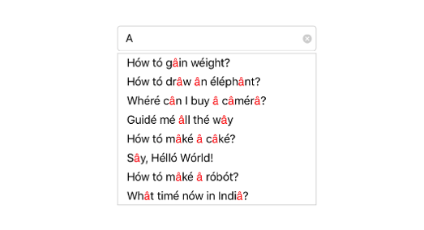

# Diacritic Sensitivity

The control does not stick with one type of keyboard, so you can populate items from a language with letters containing diacritics, and search for them with English characters from an en-US keyboard. Users can enable or disable the diacritic sensitivity with the `IgnoreDiacritic` porperty. In the below code example we have illustrate how to disable the diacritic sensitivity so that items in the suggestion list get populated by entering any diacritic character of that alphabet.





	NSMutableArray diacritic=new NSMutableArray();
	diacritic.Add((NSString)"Diréct mé tó hómé");
	diacritic.Add((NSString)"Hów tó drâw ân éléphânt?");
	diacritic.Add((NSString)"Whéré cân I buy â câmérâ?"); 
	diacritic.Add((NSString)"Guidé mé âll thé wây"); 
	diacritic.Add((NSString)"Sây, Hélló Wórld!"); 
	diacritic.Add((NSString)"Hów tó mâké â róbót?"); 
	diacritic.Add((NSString)"Whât timé nów in Indiâ?"); 
	diacritic.Add((NSString)"Whó is whó in thé wórld?"); 
	countryAutoComplete.AutoCompleteSource=diacritic;
	countryAutoComplete.TextHighlightMode=OccurrenceMode.FirstOccurrence;
	countryAutoComplete.SuggestionMode=SuggestionMode.StartsWith;
	countryAutoComplete.HighlightedTextColor = UIColor.Red;
    countryAutoComplete.IgnoreDiacritic = false;




