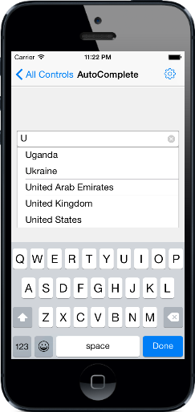

# Getting Started

This section explains you the steps to configure a SfAutoComplete control in a real-time scenario and also provides a walk-through on some of the customization features available in SfAutoComplete control.

## Referencing Essential Studio Components in Your Solution

After installing Essential Studio for Xamarin, you can find all the required assemblies in the installation folders, typically:

{Syncfusion Installed location}\Essential Studio {version number}\lib

And below assembly reference to the iOS unified project.

iOS-unifed\Syncfusion.SfAutoComplete.iOS.dll

## Add SfAutoComplete

* Adding namespace for the added assemblies.





	using Syncfusion.SfAutoComplete.iOS; 





* Now add the SfAutoComplete control with a required optimal name by using the included namespace.





SFAutoComplete countryAutoComplete=new SFAutoComplete(); 
this.AddSubview(countryAutoComplete); 





## Add Items

A list of string with country names are created and added to auto complete source. This list will be populated as suggestion list based on text entry.





NSMutableArray countryList=new NSMutableArray();
countryList.Add((NSString)"Uganda");
countryList.Add((NSString)"Ukraine");
countryList.Add((NSString)"United Arab Emirates"); 
countryList.Add((NSString)"United Kingdom");
countryList.Add((NSString)"United States"); 
countryAutoComplete.AutoCompleteSource= countryList;





## Set Filter Mode

Filters can be applied to the displayed items based on starting letter. We can also append the first item from the suggested list to the TextBox. This can be done by using the `SuggestionMode` and `AutoCompleteMode` properties in SfAutoComplete control.

The following example shows the SfAutoComplete control which suggest the country list starting with the letter U.





countryAutoComplete.SuggestionMode=SFAutoCompleteSuggestionMode.SFAutoCompleteSuggestionModeStartsWith;
countryAutoComplete.Watermark=(NSString)"Enter a country name";
countryAutoComplete.MaxDropDownHeight=90;
countryAutoComplete.AutoCompleteMode=SFAutoCompleteAutoCompleteMode.SFAutoCompleteAutoCompleteModeSuggest; 
countryAutoComplete.PopUpDelay = 100; 





