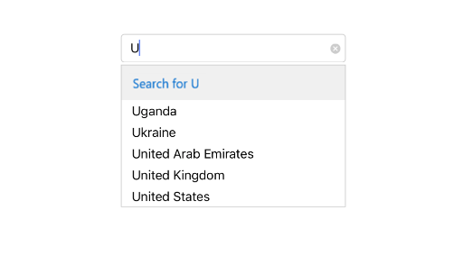

# Header and Footer

We can provide Header and Footer view in the suggestion list in SfAutoComplete by enabling `ShowDropDownHeaderView` and `ShowDropDownFooterView`. 

## Header Content

We can provide Header Content at the top of the AutoComplete's Suggestion box. `DropDownHeaderView` property is used to set the content of the header. The following code example illustrate how to set Header content in SfAutoComplete.





	NSMutableArray country=new NSMutableArray();
	country.Add((NSString)"Ukraine");
	country.Add((NSString)"United Arab Emirates");
	country.Add((NSString)"United Kingdom"); 
	country.Add((NSString)"United States"); 
	countryAutoComplete.AutoCompleteSource=country;
	countryAutoComplete.TextHighlightMode=OccurrenceMode.FirstOccurrence;
	countryAutoComplete.SuggestionMode=SuggestionMode.StartsWith;
	countryAutoComplete.HighlightedTextColor = UIColor.Red;
	countryAutoComplete.ShowDropDownHeaderView = true;
   
	UITableViewHeaderHeaderView header = new UITableViewHeaderHeaderView();
	UILabel label = new UILabel();
	label.Text = "Search for";
	label.TextColor = UIColor.Blue;
	header.AddSubview(label);
	countryAutoComplete.DropDownHeaderView = header;





## Header Height

The height of the Header in the SfAutoComplete can be adjusted by the property `DropDownHeaderViewHeight`.





	NSMutableArray country=new NSMutableArray();
	country.Add((NSString)"Ukraine");
	country.Add((NSString)"United Arab Emirates");
	country.Add((NSString)"United Kingdom"); 
	country.Add((NSString)"United States"); 
	countryAutoComplete.AutoCompleteSource=country;
	countryAutoComplete.TextHighlightMode=OccurrenceMode.FirstOccurrence;
	countryAutoComplete.SuggestionMode=SuggestionMode.StartsWith;
	countryAutoComplete.HighlightedTextColor = UIColor.Red;
	countryAutoComplete.ShowDropDownHeaderView = true;
	countryAutoComplete.DropDownHeaderViewHeight = 50;
   
	UITableViewHeaderHeaderView header = new UITableViewHeaderHeaderView();
	UILabel label = new UILabel();
	label.Text = "Search for";
	label.TextColor = UIColor.Blue;
	header.AddSubview(label);
	countryAutoComplete.DropDownHeaderView = header;

	

    

## Footer Content

We can provide Footer Content at the bottom of the AutoComplete's Suggestion box. `DropDownFooterView` property is used to set the content of the footer. The following code example illustrate how to set Footer content in SfAutoComplete.





	NSMutableArray country=new NSMutableArray();
	country.Add((NSString)"Ukraine");
	country.Add((NSString)"United Arab Emirates");
	country.Add((NSString)"United Kingdom"); 
	country.Add((NSString)"United States"); 
	countryAutoComplete.AutoCompleteSource=country;
	countryAutoComplete.TextHighlightMode=OccurrenceMode.FirstOccurrence;
	countryAutoComplete.SuggestionMode=SuggestionMode.StartsWith;
	countryAutoComplete.HighlightedTextColor = UIColor.Red;
	countryAutoComplete.ShowDropDownFooterView = true;
   
	UITableViewHeaderFooterView footer = new UITableViewHeaderFooterView();
	UILabel label = new UILabel();
	label.Text = "Add New";
	label.TextColor = UIColor.Blue;
	footer.AddSubview(label);
	countryAutoComplete.DropDownFooterView = footer;





## Footer Height

The height of the Header in the SfAutoComplete can be adjusted by the property `DropDownFooterViewHeight`.





	NSMutableArray country=new NSMutableArray();
	country.Add((NSString)"Ukraine");
	country.Add((NSString)"United Arab Emirates");
	country.Add((NSString)"United Kingdom"); 
	country.Add((NSString)"United States"); 
	countryAutoComplete.AutoCompleteSource=country;
	countryAutoComplete.TextHighlightMode=OccurrenceMode.FirstOccurrence;
	countryAutoComplete.SuggestionMode=SuggestionMode.StartsWith;
	countryAutoComplete.HighlightedTextColor = UIColor.Red;
	countryAutoComplete.ShowDropDownFooterView = true;
	countryAutoComplete.DropDownFooterViewHeight = 50;
   
	UITableViewHeaderFooterView footer = new UITableViewHeaderFooterView();
	UILabel label = new UILabel();
	label.Text = "Add New";
	label.TextColor = UIColor.Blue;
	footer.AddSubview(label);
	countryAutoComplete.DropDownFooterView = footer;

	

    

