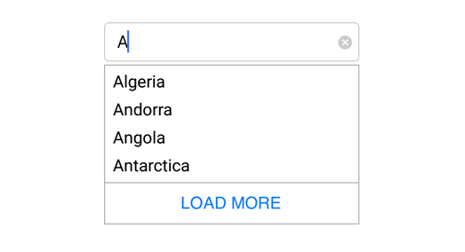

# Maximum Display Item with Expander

Restrict the number of suggestions displayed and have the remaining items loaded by selecting LoadMore. We can also set the maximum suggestion to be displayed using LoadMore method.





	NSMutableArray countryList=new NSMutableArray();
	countryList.Add((NSString)"Afghanistan");
	countryList.Add((NSString)"Akrotiri");
	countryList.Add((NSString)"Albania");
	countryList.Add((NSString)"America"); 
	countryAutoComplete.AutoCompleteSource=countryList;
	countryAutoComplete.MaximumSuggestion="2";
	countryAutoComplete.SuggestionMode=SuggestionMode.StartsWith;





