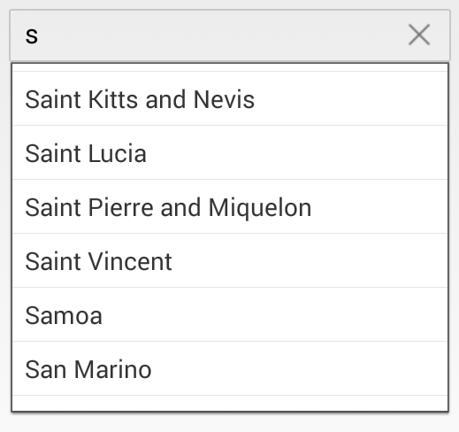

# MaximumDropDownHeight

`MaxDropDownHeight` property is used to set the maximum height of the drop-down portion of the SfAutocomplete control. The maximum drop down height value can be any integer value.



	countryAutoComplete.MaxDropDownHeight=90;



