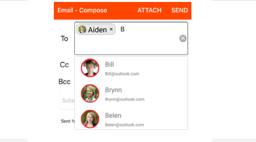

# Multi Selection

Select multiple items from a suggestion list. There are two ways to perform multi selection in autocomplete.

* Token Representation

* Delimiter

## Token Representation

Selected items will be displayed with a customizable token representation and the users can remove each tokenized item with the close button.





	NSMutableArray countryList=new NSMutableArray();
	countryList.Add((NSString)"Afghanistan");
	countryList.Add((NSString)"Akrotiri");
	countryList.Add((NSString)"Albania"); 
	countryList.Add((NSString)"America"); 
	countryAutoComplete.AutoCompleteSource=countryList;
	countryAutoComplete.MultiSelectMode=MultiSelectMode.Token;
	countryAutoComplete.TokensWrapMode=TokensWrapMode.Wrap;
	countryAutoComplete.SuggestionMode=SuggestionMode.StartsWith;





## Delimiter





	NSMutableArray countryList=new NSMutableArray();
	countryList.Add((NSString)"Afghanistan");
	countryList.Add((NSString)"Akrotiri");
	countryList.Add((NSString)"Albania"); 
	countryList.Add((NSString)"America"); 
	countryAutoComplete.AutoCompleteSource=countryList;
	countryAutoComplete.MultiSelectMode=MultiSelectMode.Delimiter;
	countryAutoComplete.Delimiter="*";





