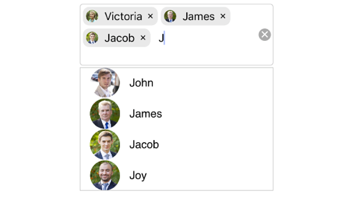
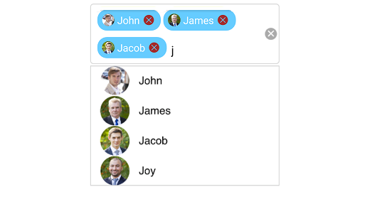

# Multiple Selection

Select multiple items from a suggestion list. There are two ways to perform multi selection in autocomplete.

* Token Representation

* Delimiter

## Token Representation

Selected items will be displayed with a customizable token representation and the users can remove each tokenized item with the close button.





countryAutoComplete.MultiSelectMode=MultiSelectMode.Token;
countryAutoComplete.TokensWrapMode=TokensWrapMode.Wrap;





### Wrap Mode of Token

The selected item can be displayed as token inside SfAutoComplete in two ways. They are

* `Wrap` - When `TokensWrapMode` is set to `Wrap` the selected items will be wrap to the next line of the SfAutoComplete.

* `None` - When `TokensWrapMode` is set to `None` the selected item will be wrap in horizontal orientation.





//Create instance for SfAutoComplete

SfAutoComplete autoComplete;
public MultiSelection()
{
//autoComplete
autoComplete = new SfAutoComplete();
autoComplete.MultiSelectMode = MultiSelectMode.Token;

// Set TokesWrapMode into Wrap

autoComplete.TokensWrapMode = TokensWrapMode.Wrap;
autoComplete.DataSource = new ContactsInfoCollection().GetContactDetails();
autoComplete.DisplayMemberPath = (NSString)"ContactName";
autoComplete.ImageMemberPath = "ContactImage";
autoComplete.ItemHeight = 60;
autoComplete.SuggestionMode = SFAutoCompleteSuggestionMode.SFAutoCompleteSuggestionModeStartsWith;
autoComplete.DropDownItemChanged += NativeAutoComplete_DropDownItemChanged;
this.AddSubview(autoComplete);
}

UIView NativeAutoComplete_DropDownItemChanged(object sender, DropDownItemEventArgs e)
{
UIView parentView = new UIView();
SfAutoComplete auto = (sender as SfAutoComplete);
parentView.Frame = new CGRect(0, 0, auto.Bounds.Width, auto.ItemHeight);
UIImageView imageView = new UIImageView();
imageView.Frame = new CGRect(5, 5, 50, auto.ItemHeight - 10);
UILabel resultLabel = new UILabel();
resultLabel.Frame = new CGRect(60, auto.ItemHeight / 2, auto.Bounds.Width - 65, auto.ItemHeight / 2 - 5);
resultLabel.Font = UIFont.FromName("Helvetica", 12f);
resultLabel.TextAlignment = UITextAlignment.Left;
var item = auto.DataSource.ElementAt((int)e.Index);
var selectedObject = (item as ContactsInfo);

imageView.Image = new UIImage(selectedObject.ContactImage);
resultLabel.Text = selectedObject.ContactName;

parentView.AddSubview(imageView);
parentView.AddSubview(resultLabel);

e.View = parentView;

return e.View;
}

public override void LayoutSubviews()
{
foreach (var view in this.Subviews)
{
view.Frame = Bounds;

toAutoComplete.Frame = new CGRect(50, 60, view.Frame.Width - 60, 40);

}
}
}
public class ContactsInfo
{

private string contactName;
private string image;

public ContactsInfo()
{

}

public string ContactName
{
get { return this.contactName; }
set
{
this.contactName = value;

}
}

public string ContactImage
{
get { return this.image; }
set
{
this.image = value;
}
}
}
public class ContactsInfoCollection
{

private Random random = new Random();

public ContactsInfoCollection()
{

}
public ObservableCollection<ContactsInfo> GetContactDetails()
{
ObservableCollection<ContactsInfo> customerDetails = new ObservableCollection<ContactsInfo>();

for (int i = 0; i < CustomerNames2.Count(); i++)
{
var details = new ContactsInfo()
{
ContactName = CustomerNames2[i],
ContactImage = "b" + (i % 14) + ".png",
};
customerDetails.Add(details);
if (i < 23)
{
details = new ContactsInfo()
{
ContactName = CustomerNames1[i],
ContactImage = "a" + (i % 6) + ".png",
};
customerDetails.Add(details);
}
}
return customerDetails;
}

string[] CustomerNames1 = new string[]
{
"James",
"Victoria",
"John",
"James",
"Jacob",
"Joy",
};

string[] CustomerNames2 = new string[]
{
"Clara",
"Irene",
"Ellie",
"Gabriella",
"Nora",
};
}

}





### Token Customization

Customization can be done for Token. There are various ways to customize the tokens. They are as follows.

* `TextColor` - sets the color of the text inside the token.

* `FontSize` - sets the size of the Font inside the token.

* `FontFamily` - sets the Font family for the text inside the token.

* `BackgroundColor` - sets the background color of the token.

* `SelectedBackgroundColor` - sets the background color of the token when it is selected.

* `IsCloseButtonVisible` - Enables and disables the close button inside SfAutoComplete.

* `DeleteButtonColor` - sets the color of the close button inside SfAutoComplete.

* `CornerRadius` - sets the corner radius for the token.





// Token Customization

TokenSettings token = new TokenSettings();
token.FontSize = 16;
token.BackgroundColor = Color.FromHex("#66ccff");
token.TextColor = Color.White;
token.SelectedBackgroundColor = Color.FromHex("#ffffe0");
token.DeleteButtonColor = Color.Brown;
token.FontFamily= "Times New Roman";
token.IsCloseButtonVisible = true;
token.CornerRadius = 3;
autoComplete.TokenSettings = token;





## Delimiter

When selecting the multiple items, the selected items can be divided with a desired character given for a delimiter. We can set delimiter character with the `Delimiter` property.





countryAutoComplete.MultiSelectMode=MultiSelectMode.Delimiter;
countryAutoComplete.Delimiter="#";





