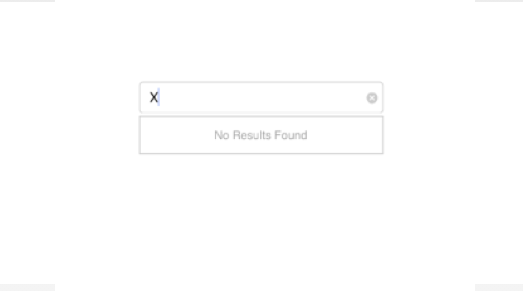

# No Results Found

When the entered item is not in the suggestion list, SfAutoComplete displays a text indicating there is no search results found. We can set the desire text to be displayed for indicating no results found with the `NoResultsFoundText` property.





countryAutoComplete.NoResultsFoundText= "No Results Found";
countryAutoComplete.SuggestionMode=SuggestionMode.StartsWith;





