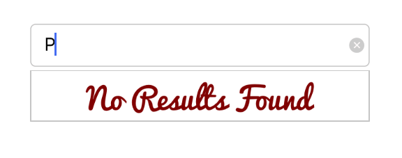

# No Results Found

When the entered item is not in the suggestion list, SfAutoComplete displays text indicating that no search results were found. You can set the desired text to be displayed for indicating no results found using the `NoResultsFoundText` property.





countryAutoComplete.NoResultsFoundText = "No Results Found";
countryAutoComplete.SuggestionMode = SuggestionMode.StartsWith;





## Customizing NoResultsFoundText

The `NoResultsFoundTextColor` and `NoResultsFoundFont` properties are used to customize the foreground color and font of the NoResultsFoundText.





countryAutoComplete.SuggestionMode = SuggestionMode.StartsWith;
countryAutoComplete.NoResultsFoundText = "No Results Found";
countryAutoComplete.NoResultsFoundTextColor = UIColor.FromRGB(128,0,0);
countryAutoComplete.NoResultsFoundFont = UIFont.FromName("Pacifico", 20);





