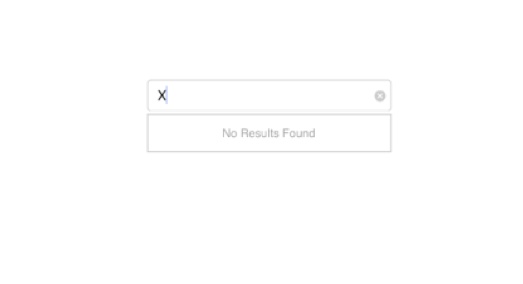

# No Results Found

When the entered item is not in the suggestion list, SfAutoComplete displays a text indicating there is no search results found. We can set the desire text to be displayed for indicating no results found with the `NoResultsFoundText` property.





countryAutoComplete.NoResultsFoundText= "No Results Found";
countryAutoComplete.SuggestionMode=SuggestionMode.StartsWith;





## Customizing NoResultsFoundText

The `NoResultsFoundTextColor` and `NoResultsFoundFont` are the properties used to customize the foreground color and font of the NoResultsFoundText.





countryAutoComplete.SuggestionMode=SuggestionMode.StartsWith;
countryAutoComplete.NoResultsFoundText = "No Results Found";
countryAutoComplete.NoResultsFoundTextColor = UIColor.FromRGB(128,0,0);
countryAutoComplete.NoResultsFoundFont= UIFont.FromName("Pacifico", 20);





