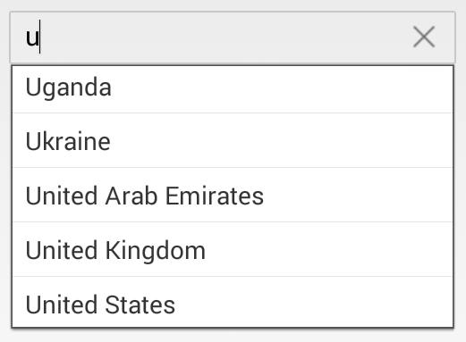

# Overview

The Essential Xamarin.iOS AutoComplete widget provides the suggestions while typing. The suggested text can be appended to the original text or it can be displayed in a drop-down list. Also provides a gesture friendly UI to perform operations like Suggest, Append and SuggestAppend.

Essential AutoComplete can be use in any search box.

## Key Features

* `Watermark` - The control shows the watermark text.

* `Autocomplete Mode` - The control provides you with suggestions based on a predefined collection while typing.

* `Suggestion Mode` - The suggestions list can be displayed with 8 types of search pattern.

* `AutoCompleteSource` - A list of strings can be loaded to the control for displaying suggestions.

* `Multiple Selection` - AutoComplete provides 2 different ways to select multiple items from the suggestion list. They are using Token representation and Delimiter.

* `Load More` - Restrict the number of suggestions displayed and have the remaining items loaded by selecting LoadMore.

* `Header and Footer` - Header and Footer content can be given in the top and bottom of the Suggestion list in SfAutoComplete.

* `Diacritic Sense` - AutoComplete provides populating the items from a language with letters containing diacritics, and search for them with English characters from an en-US keyboard.

* `Highlighting Text` - AutoComplete provides highlighting the matching text in the Suggestion list based on the input given in it.

* `Custom filter` - AutoComplete provides the user to filter the item in the Suggestion list based on their filtering condition.

