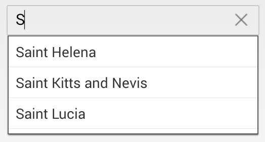
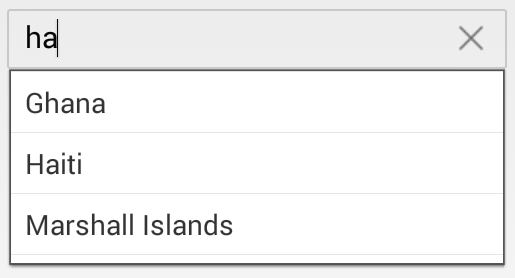
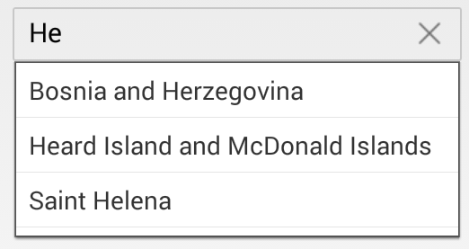
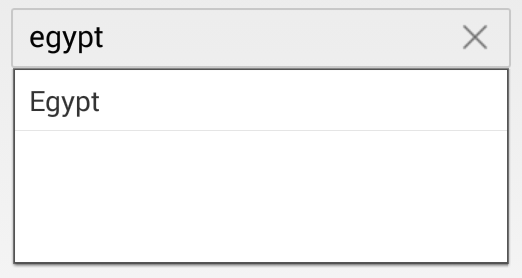
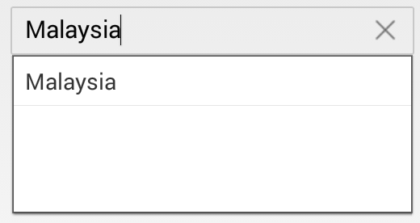
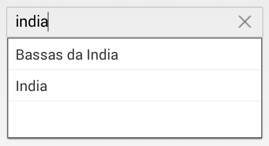

# Suggestion Mode

It is used to display which type of filtered list is show in the dropdown. They are,

* StartsWith - It begins to search with the starting letter.



	countryAutoComplete.SuggestionMode=SFAutoCompleteSuggestionMode.SFAutoCompleteSuggestionModeStartsWith;



* StartsWithCaseSensitive - This mode is used to display the suggestions based on the starting letter with case sensitive in autocomplete.



	countryAutoComplete.SuggestionMode=SFAutoCompleteSuggestionMode.SFAutoCompleteSuggestionModeStartsWithCaseSensitive;



* Contains - It displays Suggestion if AutoComplete contains that words.



	countryAutoComplete.SuggestionMode=SFAutoCompleteSuggestionMode.SFAutoCompleteSuggestionModeContains;



* ContainsWithCaseSensitive - It displays the Suggestion if AutoComplete contains that Words with Case sensitive.



	countryAutoComplete.SuggestionMode=SFAutoCompleteSuggestionMode.SFAutoCompleteSuggestionModeContainsWithCaseSensitive;



* Equals - It displays the word that matches.



	countryAutoComplete.SuggestionMode=SFAutoCompleteSuggestionMode.SFAutoCompleteSuggestionModeEquals;



* EqualsWithCaseSensitive - It displays the word that matches.



	countryAutoComplete.SuggestionMode=SFAutoCompleteSuggestionMode.SFAutoCompleteSuggestionModeEqualsWithCaseSensitive;



* EndsWith - It displays the suggestion based on ending word in AutoComplete control.



	countryAutoComplete.SuggestionMode=SFAutoCompleteSuggestionMode.SFAutoCompleteSuggestionModeEndsWith;



* EndsWithCaseSensitive - It displays the suggestion based on the ending words with case sensitive in AutoComplete Control.



	countryAutoComplete.SuggestionMode=SFAutoCompleteSuggestionMode.SFAutoCompleteSuggestionModeEndsWithCaseSensitive;



* Custom - It displays the suggestion based on the custom words in AutoCompleteComtrol.



	countryAutoComplete.SuggestionMode=SFAutoCompleteSuggestionMode.SFAutoCompleteSuggestionModeCustom;



