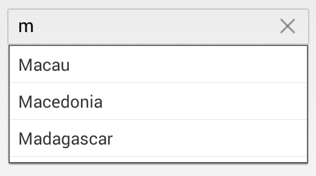
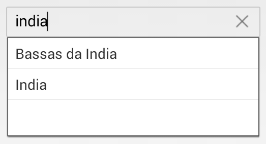
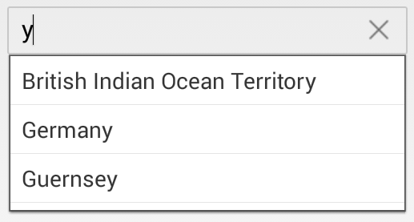

# Various Filter Options for Suggestion

By default, items that match the starting letter will be displayed as suggestions. This behavior can be changed using the `SuggestionMode` property, which provides various options to filter the data according to the text entered. There are eight types of suggestion modes described as follows:

## Words that Start with Input Text

Displays the list of suggestions based on the starting letter.





countryAutoComplete.SuggestionMode=SFAutoCompleteSuggestionMode.SFAutoCompleteSuggestionModeStartsWith;





### Filter with Character Casing

Displays the list of suggestions based on the starting letter with case sensitivity.





countryAutoComplete.SuggestionMode=SFAutoCompleteSuggestionMode.SFAutoCompleteSuggestionModeStartsWithCaseSensitive;





## Words that Contain the Input Text

Displays the list of suggestions if the AutoComplete list contains those words.
	




countryAutoComplete.SuggestionMode=SFAutoCompleteSuggestionMode.SFAutoCompleteSuggestionModeContains;





### Filter with Character Casing

Displays the list of suggestions if the AutoComplete list contains those words with case sensitivity.





	countryAutoComplete.SuggestionMode=SFAutoCompleteSuggestionMode.SFAutoCompleteSuggestionModeContainsWithCaseSensitive;





## Words that Equal the Input Text

Displays the word that matches exactly.
	




	countryAutoComplete.SuggestionMode=SFAutoCompleteSuggestionMode.SFAutoCompleteSuggestionModeEquals;





### Filter with Character Casing

Displays the word that matches exactly with case sensitivity.
	




	countryAutoComplete.SuggestionMode=SFAutoCompleteSuggestionMode.SFAutoCompleteSuggestionModeEqualsWithCaseSensitive;





## Words that End with Input Text

Displays the list of suggestions based on the ending characters.





	countryAutoComplete.SuggestionMode=SFAutoCompleteSuggestionMode.SFAutoCompleteSuggestionModeEndsWith;





### Filter with Character Casing

Displays the list of suggestions based on the ending characters with case sensitivity.
	




	countryAutoComplete.SuggestionMode=SFAutoCompleteSuggestionMode.SFAutoCompleteSuggestionModeEndsWithCaseSensitive;





## Custom Filtering

Displays suggestions based on custom filtering logic in the SfAutoComplete control.





	countryAutoComplete.SuggestionMode=SFAutoCompleteSuggestionMode.SFAutoCompleteSuggestionModeCustom;





