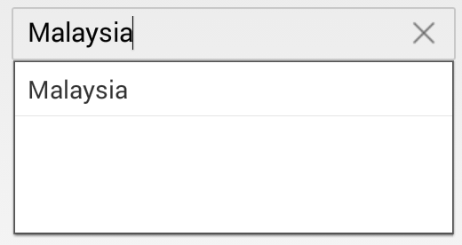

# Various Filter options for Suggestion

By default, the items that matches with the starting letter will be displayed as suggestion. This phenomenon can be changed using  `SuggestionMode` property, which provides various option to filter the data according to the text entered. There are eight types of suggestion modes and are described as follows.

## Words that Starts with Input Text

Displays the list of suggestions based on starting letter.





countryAutoComplete.SuggestionMode=SFAutoCompleteSuggestionMode.SFAutoCompleteSuggestionModeStartsWith;





### Filter with Character Casing

Displays the list of suggestions based on starting letter with case sensitive.





countryAutoComplete.SuggestionMode=SFAutoCompleteSuggestionMode.SFAutoCompleteSuggestionModeStartsWithCaseSensitive;





## Words that Contains the Input Text

Displays the list of suggestions, if autocomplete list contains that words.
	




countryAutoComplete.SuggestionMode=SFAutoCompleteSuggestionMode.SFAutoCompleteSuggestionModeContains;





### Filter with Character Casing

Displays the list of suggestions, if autocomplete list contains that words with case sensitive.





	countryAutoComplete.SuggestionMode=SFAutoCompleteSuggestionMode.SFAutoCompleteSuggestionModeContainsWithCaseSensitive;





## Words that Equals to the Input Text

Displays the word that matches.
	




	countryAutoComplete.SuggestionMode=SFAutoCompleteSuggestionMode.SFAutoCompleteSuggestionModeEquals;





### Filter with Character Casing

Displays the word that matches with case sensitive.
	




	countryAutoComplete.SuggestionMode=SFAutoCompleteSuggestionMode.SFAutoCompleteSuggestionModeEqualsWithCaseSensitive;





## Words that Ends with Input Text

Displays the list of suggestions based on ending word.





	countryAutoComplete.SuggestionMode=SFAutoCompleteSuggestionMode.SFAutoCompleteSuggestionModeEndsWith;





### Filter with Character Casing

Displays the list of suggestions based on the ending word with case sensitive.
	




	countryAutoComplete.SuggestionMode=SFAutoCompleteSuggestionMode.SFAutoCompleteSuggestionModeEndsWithCaseSensitive;





## Custom Filtering

Displays the suggestion based on the custom words in SfAutoComplete Control.





	countryAutoComplete.SuggestionMode=SFAutoCompleteSuggestionMode.SFAutoCompleteSuggestionModeCustom;





