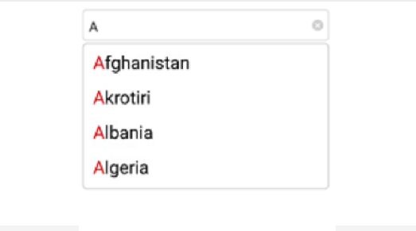
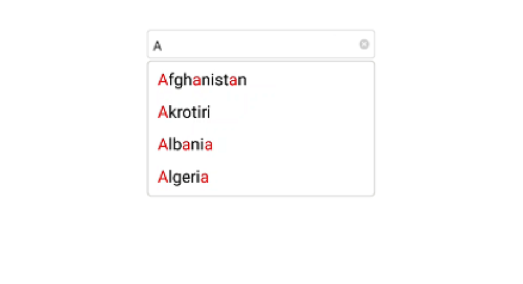

# Highlighting matched text

Highlight matching characters in a suggestion list to pick an item with more clarity. There are two ways to highlight the matching text:

* FirstOccurrence

* MultipleOccurrence

The text highlight can be indicated with various customizing styles by enabling the below properties. They are

* HighlightedTextColor -  sets the color of the highlighted text for differentiating the highlighted characters.

* HighlightTextFontAttributes - sets the FontAttributes of the highlighted text.

N> The default Color of HighlightedTextColor is Blue and default FontAttribute of HighlightTextFontAttributes is None.

## FirstOccurrence

It highlights the first position of the matching characters in the suggestion list.





	NSMutableArray countryList=new NSMutableArray();
	countryList.Add((NSString)"Afghanistan");
	countryList.Add((NSString)"Akrotiri");
	countryList.Add((NSString)"Albania"); 
	countryList.Add((NSString)"Algeria"); 
	countryAutoComplete.AutoCompleteSource=countryList;
	countryAutoComplete.TextHighlightMode=OccurrenceMode.FirstOccurrence;
	countryAutoComplete.SuggestionMode=SuggestionMode.StartsWith;
	countryAutoComplete.HighlightedTextColor = UIColor.Red;
	countryAutoComplete.AutoCompleteSource=countryList;





## MultipleOccurrence

It highlights the matching character that are present everywhere in the suggestion list for Contains case in SuggestionMode.





	NSMutableArray countryList=new NSMutableArray();
	countryList.Add((NSString)"Afghanistan");
	countryList.Add((NSString)"Akrotiri");
	countryList.Add((NSString)"Albania"); 
	countryList.Add((NSString)"Algeria"); 
	countryAutoComplete.AutoCompleteSource=countryList;
	countryAutoComplete.TextHighlightMode=OccurrenceMode.MultipleOccurrence;
    countryAutoComplete.HighlightedTextColor = UIColor.Red;
	countryAutoComplete.SuggestionMode=SuggestionMode.Contains;
    countryAutoComplete.AutoCompleteSource=countryList;




