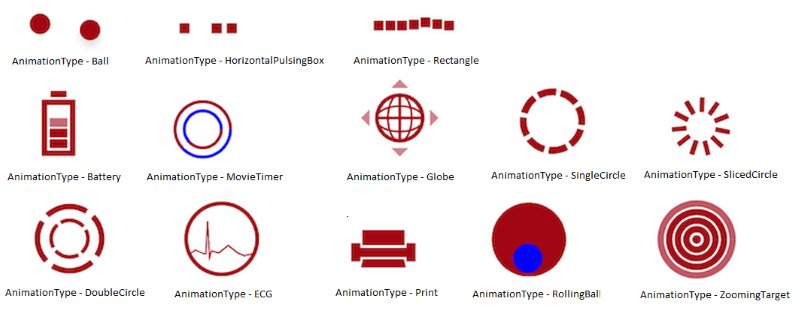

# AnimationType

The `AnimationType` property for the SfBusyIndicator allows you to set any one of the built-in animations available in the SfBusyIndicator.



	SFBusyIndicator busyindicator = new SFBusyIndicator();
	busyindicator.AnimationType=SFBusyIndicatorAnimationType.SFBusyIndicatorAnimationTypeBall;
	
 

                 

