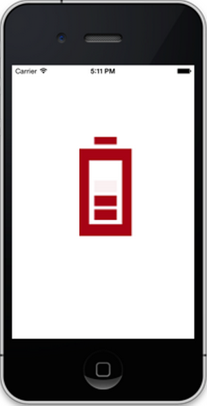

# Getting Started with BusyIndicator

This section explains you the steps to configure a SfBusyIndicator control in a real-time scenario and also provides a walk-through on some of the customization features available in SfBusyIndicator control.

## Referencing Essential Studio Components in Your Solution

After installing Essential Studio for Xamarin, you can find all the required assemblies in the installation folders, typically:

{Syncfusion Installed location}\Essential Studio {version number}\lib

And below assembly reference to the iOS unified project.

iOS-unified\Syncfusion.SfBusyIndicator.iOS.dll

## Add BusyIndicator

* Adding namespace for the added assemblies.





	using Syncfusion.SfBusyIndicator.iOS;





* Now add the SfBusyIndicator control with a required optimal name by using the included namespace.




	
	SfBusyIndicator busyindicator = new SfBusyIndicator();
	this.AddSubview(busyindicator);
	




## Set Animation Type

SfBusyIndicator provides 10 predefined animation types like Ball, Battery, Globe and so on. User can select any one of the animation types using `AnimationType`property.

Following example depicts the battery type animation for SfBusyIndicator. 





	 busyindicator.AnimationType = SFBusyIndicatorAnimationType.SFBusyIndicatorAnimationTypeBattery;




	
## Configure the Properties for SFBusyIndicator

Size and color can be customized in SfBusyIndicator as follows.


      

	 
	busyindicator.AnimationType = SFBusyIndicatorAnimationType.SFBusyIndicatorAnimationTypeBall;
	busyindicator.Foreground = UIColor.Red;
	busyindicator.ViewBoxHeight = 20;
	busyindicator.ViewBoxWidth = 20;
	busyindicator.IsBusy = True;
	




                 

BusyIndicator
{:.caption}