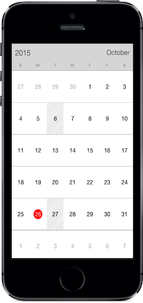

# Restricting Dates

## Min Max dates

Visible dates can be restricted between certain range of dates using [MinDate](https://help.syncfusion.com/cr/cref_files/xamarin-ios/sfcalendar/Syncfusion.SfCalendar.iOS~Syncfusion.SfCalendar.iOS.SFCalendar~MinDate.html) and [MaxDate](https://help.syncfusion.com/cr/cref_files/xamarin-ios/sfcalendar/Syncfusion.SfCalendar.iOS~Syncfusion.SfCalendar.iOS.SFCalendar~MaxDate.html) properties available in SfCalendar control. It is applicable in all the Calendar views.

The inline feature in month view will work only within the min max date range.

N> Beyond the min max date range, following restrictions will be applied.

* Date navigations features of move to date will be restricted.

* Cannot swipe the control using touch gesture.

* Selection does not work for month view. 

* The tapped delegates will not be triggered while tapped on the month cell.  



SFCalendar  calendar = new SFCalendar ();
NSCalendar date = NSCalendar.CurrentCalendar;
NSDate today = new NSDate();
NSDateComponents minDateComponents = date.Components(
					NSCalendarUnit.Year | NSCalendarUnit.Month | NSCalendarUnit.Day, today);
minDateComponents.Year = 2014;
minDateComponents.Month = 4;
minDateComponents.Day = 1;
			

NSDateComponents maxDateComponents = date.Components(
				NSCalendarUnit.Year | NSCalendarUnit.Month | NSCalendarUnit.Day, today);
maxDateComponents.Year = 2018;
maxDateComponents.Month = 4;
maxDateComponents.Day = 1;

NSDate minDate = date.DateFromComponents(minDateComponents);
NSDate maxDAte = date.DateFromComponents(maxDateComponents);

calendar.MinDate = minDate;
calendar.MaxDate = maxDAte;
	


## Blackout dates

In `SfCalendar`, BlackoutDates refers the disabled dates that restrict the user from selecting it. These dates will be marked with slanted Stripes. 

The BlackoutDays can be achieved in two ways. 

*	A date collection can be provided to set the [BlackoutDates](https://help.syncfusion.com/cr/cref_files/xamarin-ios/sfcalendar/Syncfusion.SfCalendar.iOS~Syncfusion.SfCalendar.iOS.SFCalendar~BlackoutDates.html). This is useful when one wants to block dates where holidays or any other events occur. 

*	By invoking the [AddDatesInPast](https://help.syncfusion.com/cr/cref_files/xamarin-ios/sfcalendar/Syncfusion.SfCalendar.iOS~Syncfusion.SfCalendar.iOS.SFCalendar~AddDatesInPast.html) method, all past dates will be blacked out till current date.



SFCalendar  calendar = new SFCalendar ();
NSCalendar date = NSCalendar.CurrentCalendar;
NSDate today = new NSDate();
NSDateComponents components = date.Components(
					NSCalendarUnit.Year | NSCalendarUnit.Month | NSCalendarUnit.Day, today);
calendar.BlackoutDates = new NSMutableArray ();
for (int i = 0; i < 5; i++) 
{
	NSDate startDate = date.DateFromComponents (components);
	components.Day += 1;
	calendar.BlackoutDates.Add (startDate);
}
	


                                        

N> This support is enabled only in month view and the dates that consists inline events will also be disabled, when they are blacked out.

### Customize the BlackoutDates Color
We can customize the BlackoutDates Color in month view mode by using[BlackOutColor](https://help.syncfusion.com/cr/cref_files/xamarin-ios/Syncfusion.SfCalendar.iOS~Syncfusion.SfCalendar.iOS.SFMonthViewSettings~BlackoutColor.html) property of [MonthViewSettings](https://help.syncfusion.com/cr/cref_files/xamarin-ios/Syncfusion.SfCalendar.iOS~Syncfusion.SfCalendar.iOS.SFMonthViewSettings.html).



SFCalendar calendar = new SFCalendar(); 
SFMonthViewSettings monthViewSettings = new SFMonthViewSettings();
monthViewSettings.BlackOutColor = UIColor.Red;
calendar.MonthViewSettings = monthViewSettings;
View.AddSubView(calendar);


