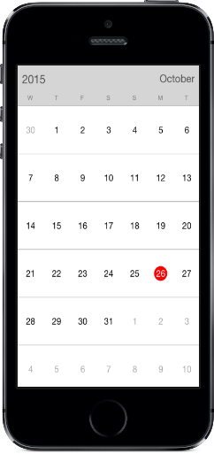

# FirstDayofWeek

By default, the starting day will be Sunday. This can be modified using [FirstDayofWeek](https://help.syncfusion.com/cr/xamarin-ios/Syncfusion.SfCalendar.iOS.SFCalendar.html#Syncfusion_SfCalendar_iOS_SFCalendar_FirstDayofWeek) property. Changing the first day of week will be applied to both month and year view.


	
	calendar.FirstDayofWeek= 4;
	


                                        

