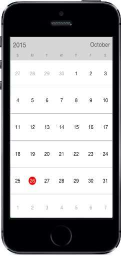

# Getting Started

This section explains you the steps required to render the `SfCalendar` control, to change selection mode, set min max dates and black out dates for the control. This section covers only the minimal features that you need to know to get started with the `SfCalendar`.

## Creating your first SfCalendar in Xamarin.iOS.

This section provides a quick overview to work with the `SfCalendar` in Objective-C. This example explains how to create an Calendar with different CalendarModes and SuggestionModes.

### Referencing Essential Studio Components in Your Solution

After installing Essential Studio for Xamarin, you can find all the required assemblies in the installation folders, typically:
{Syncfusion Installed location}\Essential Studio {version number}\lib

And below assembly reference to the iOS unified project.
iOS-unified\Syncfusion.SfCalendar.iOS.dll

### And and Configure the SfCalendar

The following steps explain on how to create an SfCalendar and configure its elements,

* Adding reference to SfCalendar.



	using Syncfusion.SfCalendar.iOS;



* Create an instance of SfCalendar
   

	
SFCalendar calendar = new SFCalendar();
this.Add(calendar);
	


### Enabling Multiple Selection 

To enable multiple selection, change the selection type using `SelectionMode` property. Check the [Selection Mode](http://help.syncfusion.com/android/sfcalendar/selectionmode)  section for more details.



SFCalendar calendar = new SFCalendar ();
calendar.SelectionMode = SFCalenderSelectionMode.SFCalenderSelectionModeMultiple;



### Setting blackout dates

Add the dates into `BlackOutDates` property, that needs to be disabled among visible dates. Check the [BlackOutDates](http://help.syncfusion.com/android/sfcalendar/blackoutdates) section for more details.

For instance add all the holiday dates to blackout dates property.



SFCalendar  calendar = new SFCalendar ();
NSCalendar date = NSCalendar.CurrentCalendar;
NSDate today = new NSDate();
NSDateComponents components = date.Components(
					NSCalendarUnit.Year | NSCalendarUnit.Month | NSCalendarUnit.Day, today);
calendar.BlackoutDates = new NSMutableArray ();
for (int i = 0; i < 5; i++) 
{
	NSDate startDate = date.DateFromComponents (components);
	components.Day += 1;
	calendar.BlackoutDates.Add (startDate);
}



### Restricting Dates

Set `MinDate` and `MaxDate` property to limit visible dates range. Check the [Min Max dates](http://help.syncfusion.com/android/sfcalendar/datenavigation-and-gesture#min-max-dates) section for more details.



SFCalendar  calendar = new SFCalendar ();

NSCalendar date = NSCalendar.CurrentCalendar;

NSDate today = new NSDate();

NSDateComponents minDateComponents = date.Components(
					NSCalendarUnit.Year | NSCalendarUnit.Month | NSCalendarUnit.Day, today);
minDateComponents.Year = 2014;
minDateComponents.Month = 4;
minDateComponents.Day = 1;
			

NSDateComponents maxDateComponents = date.Components(
				NSCalendarUnit.Year | NSCalendarUnit.Month | NSCalendarUnit.Day, today);
maxDateComponents.Year = 2018;
maxDateComponents.Month = 4;
maxDateComponents.Day = 1;

NSDate minDate = date.DateFromComponents(minDateComponents);
NSDate maxDAte = date.DateFromComponents(maxDateComponents);

calendar.MinDate = minDate;
calendar.MaxDate = maxDAte;

                                  

 
