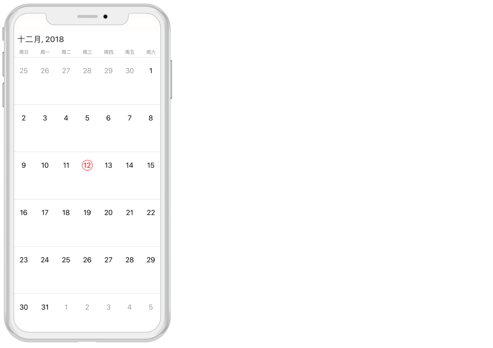
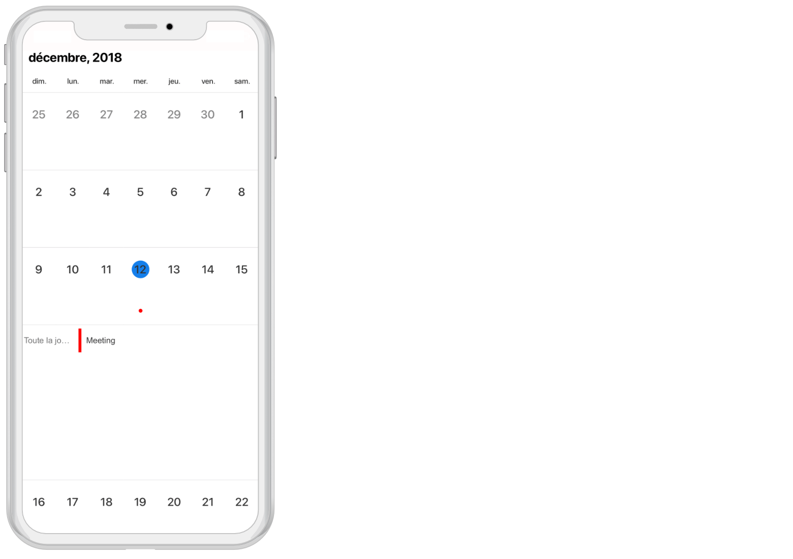

# Localization

SfCalendar control is available with complete localization support. Localization can be specified by setting the `Locale` property of the control using the format of Language code followed by Country code. 

## Change default control language

Based on the Locale specified, the strings in the control are localized accordingly.
 
N> By default, SfCalendar control is available with en-US locale.



	calendar.Locale =  new NSLocale("fr-FR");



    

## Change custom texts in the calendar control

You can localize custom text available in the control by adding equivalent localized string in the Localizable.strings file, refer [here](https://developer.xamarin.com/guides/ios/advanced_topics/localization_and_internationalization/).

  

If an application requires multiple languages you can follow the below steps:

*	Translate the Localizable.Strings file to each language. 
*	Create new `<Language>.lproj` folders under resource as `en.lproj`, `fr.lproj`, `de.lproj`.
* 	Place the `Localizable.Strings` file in the respective `<Language>.lproj` folders.

You can download the entire source code of this demo for Xamarin.iOS from
here [Localization](https://github.com/SyncfusionExamples/Localizing-the-custom-texts-in-Xamarin.iOS-Calendar).

    

>**NOTE**
The corresponding `<Language>.lproj` folder loads only depends on the device configuration and locale.                                    

