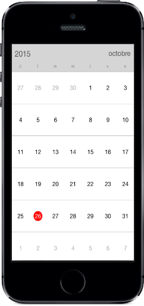

# Localization

Calendar control is available with complete localization support.
 
Localization can be specified by setting the `Locale` property of the control using the format of Language code followed by Country code. Based on the locale specified, the strings in the control are localized accordingly.
 
N> By default, calendar control is available with en-US locale.



	calendar.Locale= new System.Globalization.CultureInfo("zh-CN");



                                        

## Calendar Custom String Localization

Calendar has a built in support for localizing the Custom Strings in it by specifying the corresponding string’s key and value in the Localizable.strings in the application. For an example in calendar there is a string “No Events” in calendar Month View Inline. To localize the string, specify the key (“No Events”) and assign the corresponding localized string to it in Localizable.strings file. Please refer the following code for French language.

Calendar search for the key in corresponding language Localizable.strings file and displays the corresponding string in the calendar.