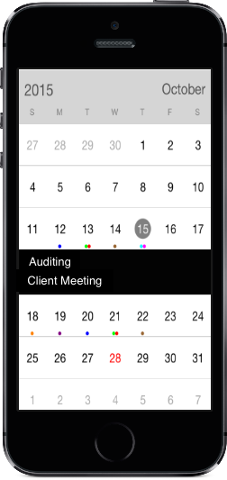
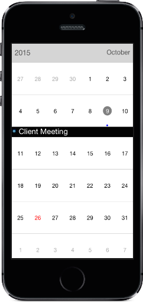

# Populating Events

SfCalendar control has built-in capability to display the events based on the Calendar events collection provided to `appointment` property. For events to be listed for a particular day, enable the inline feature in month view cell.

N> The default UI of the inline view with events will be like list of events with a dark background

                                        

Inline event support can be toggled on / off with `ShowInLineEvent` property.



	 calendar.EnableInLine = true;



N> The Inline function will be available only in month view with single selection mode.

## Adding events using Collection

Calendar events collection can be provided to SfCalendar using the following steps.

The Appointment class has some basic properties such as `StartTime`, `EndTime` and `Subject`.


		   
		   NSMutableArray appCollection = new NSMutableArray();
            NSCalendar date = NSCalendar.CurrentCalendar;

            NSDate today = new NSDate();

            // Get the year, month, day from the date
            NSDateComponents startDateComponents = date.Components(
            NSCalendarUnit.Year | NSCalendarUnit.Month | NSCalendarUnit.Day, today);

            // Set the year, day, hour, minute, second
            startDateComponents.Year = 2015;
            startDateComponents.Month = 10;
            startDateComponents.Day = 9;
            startDateComponents.Hour = 10;
            startDateComponents.Minute = 0;
            startDateComponents.Second = 0;

            // Get the year, month, day from the date
            NSDateComponents endDateComponents = date.Components(
            NSCalendarUnit.Year | NSCalendarUnit.Month | NSCalendarUnit.Day, today);

            // Set the year, day, hour, minute, second
            endDateComponents.Year = 2015;
            endDateComponents.Month = 10;
            endDateComponents.Day = 9;
            endDateComponents.Hour = 12;
            endDateComponents.Minute = 0;
            endDateComponents.Second = 0;

            //setting start time for the event
            NSDate startDate = date.DateFromComponents(startDateComponents);

            //setting end time for the event
            NSDate endDate = date.DateFromComponents(endDateComponents);

            //Adding calendar appointment in calendar appointment collection 
            appCollection.Add(new SFAppointment()
            {
                StartTime = startDate,
                EndTime = endDate,
                Subject = (NSString)"Client Meeting",
                AppointmentBackground = UIColor.Blue
            });

		   


* Create the collection of the Calendar events by setting required details using above mentioned properties for each events and assign the collection to appointment property.



	 calendar.Appointments = appCollection;
	


        

## Customize inline/agenda view appearance
You can customize the inline item view by [OnInlineItemLoaded](https://help.syncfusion.com/cr/cref_files/xamarin-iOS/Syncfusion.SfCalendar.iOS~Syncfusion.SfCalendar.iOS.SFCalendar~InlineItemLoaded_EV.html) event using in `SfCalendar` and you can get the details of appointment from the `Appointment` property, the custom view can be set to `View` property of [InlineItemLoadedEventArgs](https://help.syncfusion.com/cr/cref_files/xamarin-iOS/Syncfusion.SfCalendar.iOS~Syncfusion.SfCalendar.iOS.InlineItemLoadedEventArgs_members.html) argument.



    calendar.InlineItemLoaded += Calendar_InlineItemLoaded; 

    ...

    void Calendar_InlineItemLoaded(object sender, InlineItemLoadedEventArgs e)
    {
        UIButton button = new UIButton();
        button.SetTitle(e.Appointment.Subject, UIControlState.Normal);
        button.SetTitleColor(UIColor.White, UIControlState.Disabled);
        button.BackgroundColor = UIColor.Blue;
        button.Font = UIFont.ItalicSystemFontOfSize(20);
        e.View = button;
    } 


## Getting inline/agenda view appointment details

Using  `InlineEvent` argument in the `InlineItemTappedEventArgs` of `InlineItemTapped` event, you can get the month inline/agenda appointments details while tapping the specific appointment in inline/agenda view


calendar.InlineItemTapped+= Calendar_InlineItemTapped; 

private void Calendar_InlineItemTapped(object sender, InlineItemTappedEventArgs e)
{
    var appointment = e.InlineEvent;
    UIAlertView alert = new UIAlertView()
    {
        Title = appointment.Subject,
        Message = appointment.StartTime.ToString()
    };
    alert.AddButton("OK");
    alert.Show(); 
} 

                                

