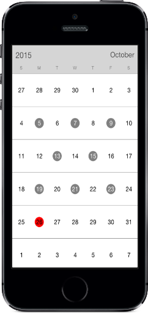

# Selection

Dates can be selected by making a touch on month view cells. The default [SelectionMode](https://help.syncfusion.com/cr/cref_files/xamarin-ios/sfcalendar/Syncfusion.SfCalendar.iOS~Syncfusion.SfCalendar.iOS.SFCalendar~SelectionMode.html) is Single which allows user to select one date at a time. SfCalendar provides support to select dates in three modes such as single, multiple and range selection.

* `SingleSelection` – A single date can be selected in a month view which can be equipped when user needs to select one date at a time / to view events.

* `MultiSelection` – More than one date can be selected in a random manner. Clicking again on selected dates can do deselection.

* `RangeSelection` – Range of dates can be selected by dragging on the date cells.

* `MultiRangeSelection` – More than one date range can be selected in a month view.

N> The selected dates can be retrieved through `CalendarTapped` Delegate which is raised on selecting.


	
	calendar.SelectionMode=SFCalendarSelectionMode.SFCalendarSelectionModeMultiple;
	


                                        

N> In range selection, navigation through swipe will be restricted and moving between months can be done by clicking on navigation button available at the top corner of `SfCalendar` control.
