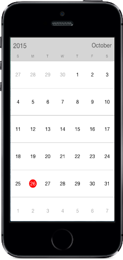
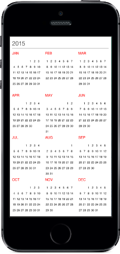

# Built-in Views

`SfCalendar` control provides two types of views to display dates such as month view and year view. It can be assigned to the `SfCalendar` control by using view mode property.

By default `SfCalendar` control is assigned with month view. Based on the user’s preference `SfCalendar` viewed in any of the available two type.

## Month View

This displays entire dates of a particular month, by default current month will be displayed on loading. The current date is provided with unique color different from the rest of the dates color in a month. The events availability will be denoted within the cell based on its duration.

The dates in month view can be selected by three ways such as single, multiple and range which can be modified using `SelectionMode`.



	calendar.ViewMode=SFCalendarViewMode.SFCalendarViewModeMonth;



                                        

### Month View Settings

* Current day text color can be modified using [TodayTextColor](https://help.syncfusion.com/cr/cref_files/xamarin-ios/sfcalendar/Syncfusion.SfCalendar.iOS~Syncfusion.SfCalendar.iOS.SFMonthViewSettings~TodayTextColor.html). 
* The month view label settings class has the APIs to change date text size, day text size and format options. 
* The background color of the inline view can be modified using [InlineBackgroundColor](https://help.syncfusion.com/cr/cref_files/xamarin-ios/sfcalendar/Syncfusion.SfCalendar.iOS~Syncfusion.SfCalendar.iOS.SFMonthViewSettings~InlineBackgroundColor.html) property.
* The blackout date color can be modified with [BlackoutColor](https://help.syncfusion.com/cr/cref_files/xamarin-ios/sfcalendar/Syncfusion.SfCalendar.iOS~Syncfusion.SfCalendar.iOS.SFMonthViewSettings~BlackoutColor.html) property.



SFMonthViewSettings monthViewSettings = new SFMonthViewSettings();
monthViewSettings.TodayTextColor = UIColor.FromRGB(27, 121, 214);
monthViewSettings.InlineBackgroundColor = UIColor.FromRGB(228, 232, 237);
monthViewSettings.CurrentMonthBackgroundColor = UIColor.FromRGB(128, 0, 128);
monthViewSettings.PreviousMonthBackgroundColor =UIColor.FromRGB(152, 149, 240);
monthViewSettings.PreviousMonthTextColor = UIColor.FromRGB(0, 0, 0);
monthViewSettings.DateSelectionColor = UIColor.FromRGB(255, 255, 255);
calendar.MonthViewSettings = monthViewSettings;
	


N> The view modes can be switched by clicking the Header Text in MonthView or by selecting a month in YearView

### Hide trailing and leading dates

The `SfCalendar` allows you hide the days of the next month and previous month in calendar to enhance the appearance. This can be achieved by enabling the `ShowLeadingAndTrailingDays` property. The following code demonstrates how to hide the leading and trailing dates in calendar.The `SfCalendar` allows you to hide the days of the next month and previous month in the calendar to enhance the appearance of the calendar. This can be achieved by enabling the `ShowLeadingAndTrailingDays` property. The following code illustrates how to hide the leading and trailing dates in the calendar,





SFCalendar calendar = new SFCalendar();
calendar.ViewMode = SFCalendarViewMode.SFCalendarViewModeMonth;;
calendar.ShowLeadingAndTrailingDays = true;
View.AddSubView(calendar);





>**NOTE** 
* The DrawMonthCell event is triggered for the current month dates only.
* The VisibleDates count in the MonthChanged event depends on the current month dates only.

## YearView

This displays entire dates/month of a particular year, by default current year will be displayed on loading. The years can be changed by swiping back and forth. The months can be navigated quickly by selecting on the particular month in year view.



	calendar.ViewMode=SFCalendarViewMode.SFCalendarViewModeYear;
	


                                        

### Year View Settings

* The month header color can be modified using [MonthHeaderTextColor](https://help.syncfusion.com/cr/cref_files/xamarin-ios/sfcalendar/Syncfusion.SfCalendar.iOS~Syncfusion.SfCalendar.iOS.SFYearViewSettings~MonthHeaderTextColor.html) property.
* The year header and date text color can be changed using `YearHeaderTextColor` and [DateTextColor](https://help.syncfusion.com/cr/cref_files/xamarin-ios/sfcalendar/Syncfusion.SfCalendar.iOS~Syncfusion.SfCalendar.iOS.SFYearCell~DatetextColor.html) properties respectively.
* The gravity of the month name can be modified using `HeaderLabelAlignment` property, to position it to left, right or center. 
* The complete layout’s background color can be modified using [YearLayoutBackground](https://help.syncfusion.com/cr/cref_files/xamarin-ios/sfcalendar/Syncfusion.SfCalendar.iOS~Syncfusion.SfCalendar.iOS.SFYearViewSettings~YearLayoutBackground.html) property.



SFYearViewSettings yearViewSettings = new SFYearViewSettings();
yearViewSettings.YearHeaderTextColor = UIColor.FromRGB(27, 121, 214);
yearViewSettings.YearLayoutBackground = UIColor.FromRGB(255, 228, 181);
yearViewSettings.MonthHeaderBackground = UIColor.FromRGB(139, 69, 19);
yearViewSettings.DateTextColor = UIColor.FromRGB(230, 230, 250);
yearViewSettings.HeaderLabelAlignment = NSTextAlignment.NSTextAlignmentCenter;
calendar.YearViewSettings = yearViewSettings;



