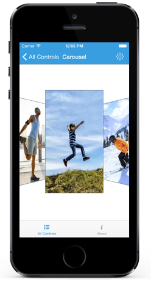

# Getting Started with Carousel

This section provides a quick overview for working with Essential Carousel for Xamarin.iOS. It guides you to the entire process of creating a SfCarousel in your Application.

## Referencing Essential Studio components in your solution

After installing Essential Studio for Xamarin, you can find all the required assemblies in the installation folders, typically:
{Syncfusion Installed location}\Essential Studio {version number}\lib

And below assembly reference to the iOS unified project.

iOS-unified\Syncfusion.SfCarousel.iOS.dll

## Add SfCarousel

* Adding namespace for the added assemblies. 



using Syncfusion.SfCarousel.iOS; 



* Now add the SfCarousel control with a required optimal name by using the included namespace.



SfCarousel carousel = new SfCarousel();
this.AddSubview(carousel);



## Add Carousel Items

SfCarousel items can be populated with a collection of image data. An example to populate image collection as carousel items as follows



NSMutableArray<SfCarouselItem> carouselItemCollection = new NSMutableArray<SfCarouselItem> ();
for(int i=1;i<18;i++)
{
    SfCarouselItem item = new SfCarouselItem();
    item.ImageName = "image"+i+".png";
    carouselItemCollection.Add(item);
}
carousel.DataSource = carouselItemCollection;



## Set Gap between Items

SfCarousel provides option to set the distance between the items in the panel. This can be done by using the `Offset` property in SfCarousel control. 



SfCarousel carousel = new SfCarousel();
carousel.SelectedIndex = 2;
carousel.Offset = 20;



## Setting the height and width of carousel's Item

`ItemHeight` and `ItemWidth` properties are used to change the height and width of carouselItem in carousel panel.



SfCarousel carousel = new SfCarousel();
carousel.ItemWidth = 150;
carousel.ItemHeight = 170;



## Tilt Non Selected Items

Items in the SfCarousel control can be rotated in user defined angle. `RotationAngle` property is used to decide the angle in which items should be rotated



SfCarousel carousel = new SfCarousel();
carousel.SelectedIndex = 2;
carousel.Offset = 20;
carousel.RotationAngle = 45;



You can find the complete getting started sample from this [link.](https://www.syncfusion.com/downloads/support/directtrac/general/ze/CarouselSample-473851751)
