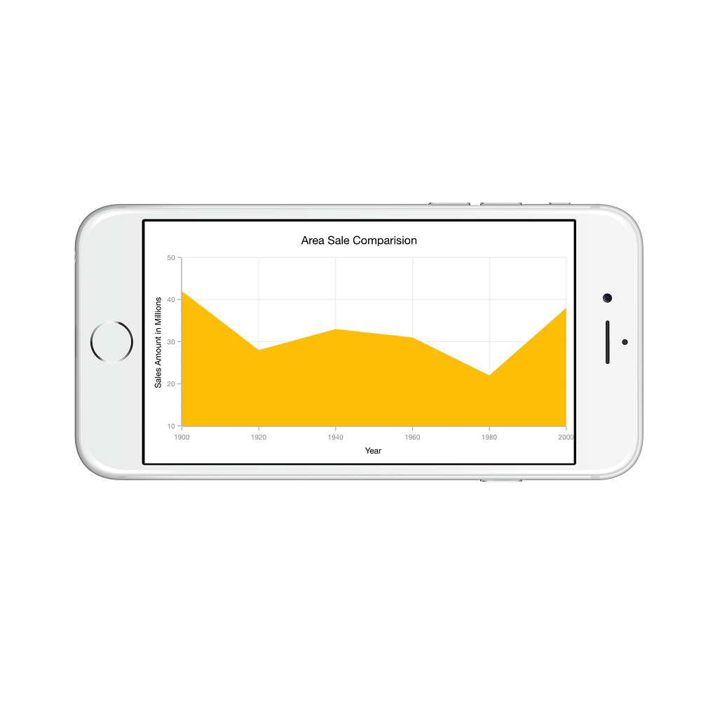
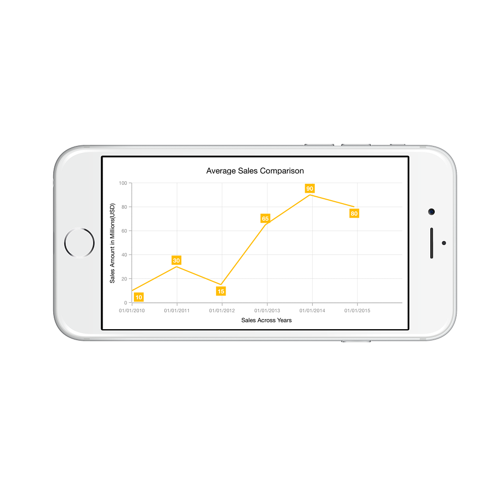
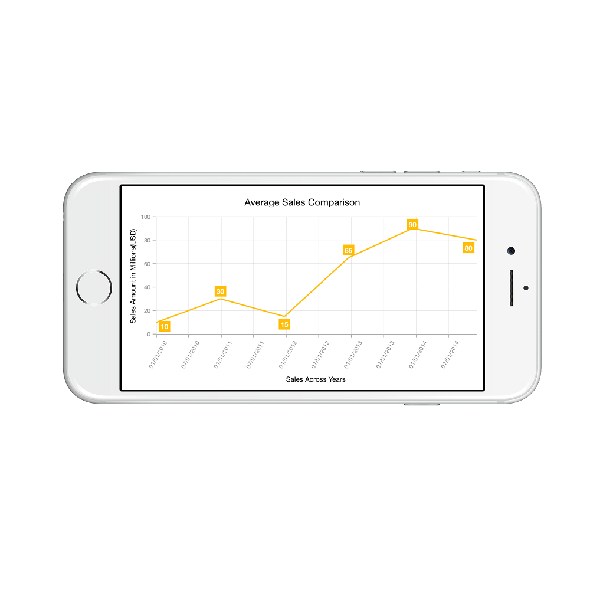
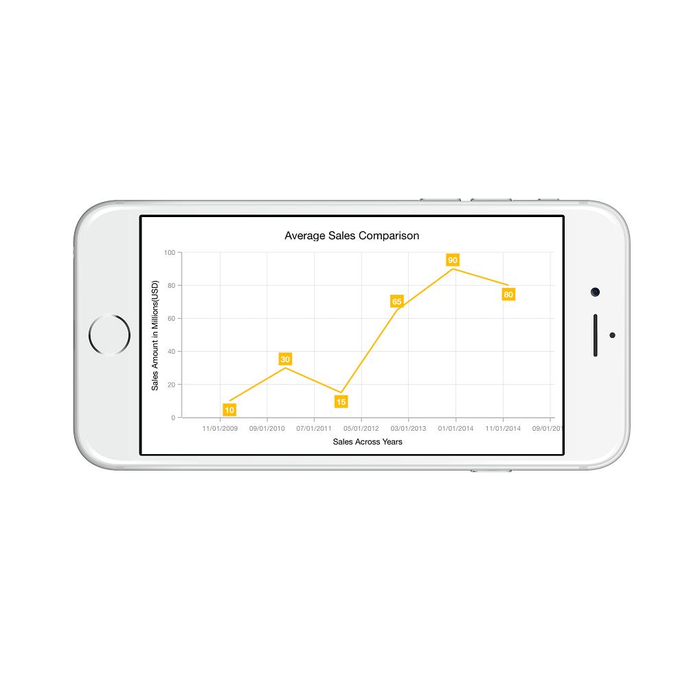
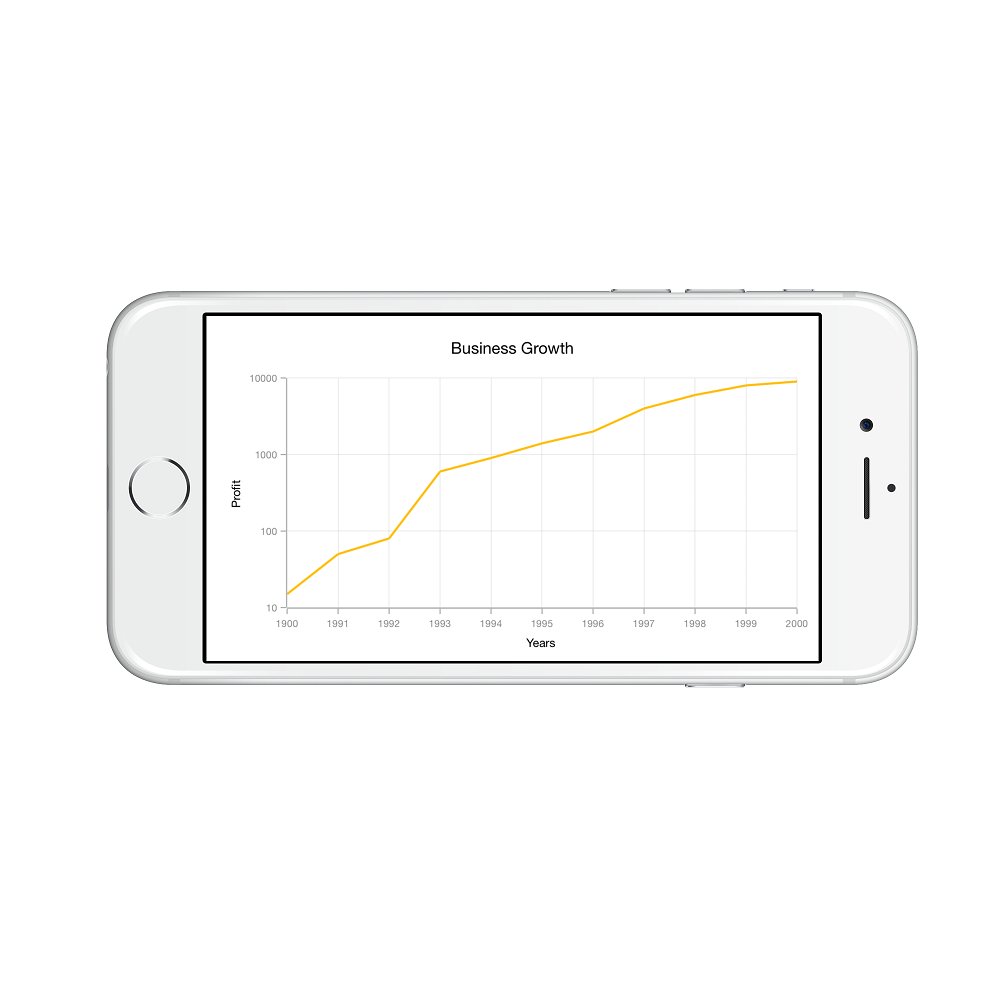
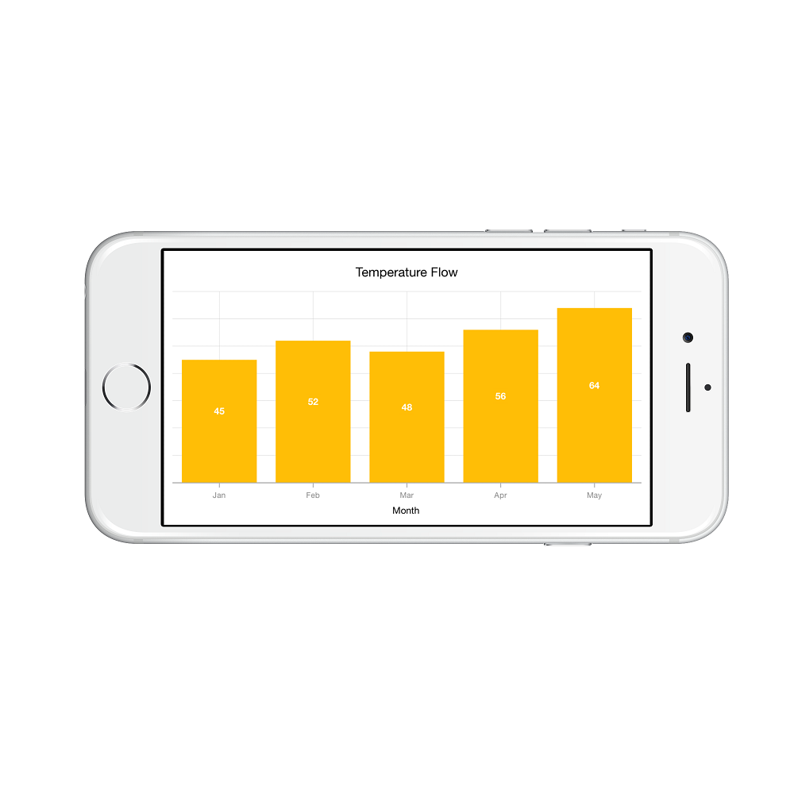
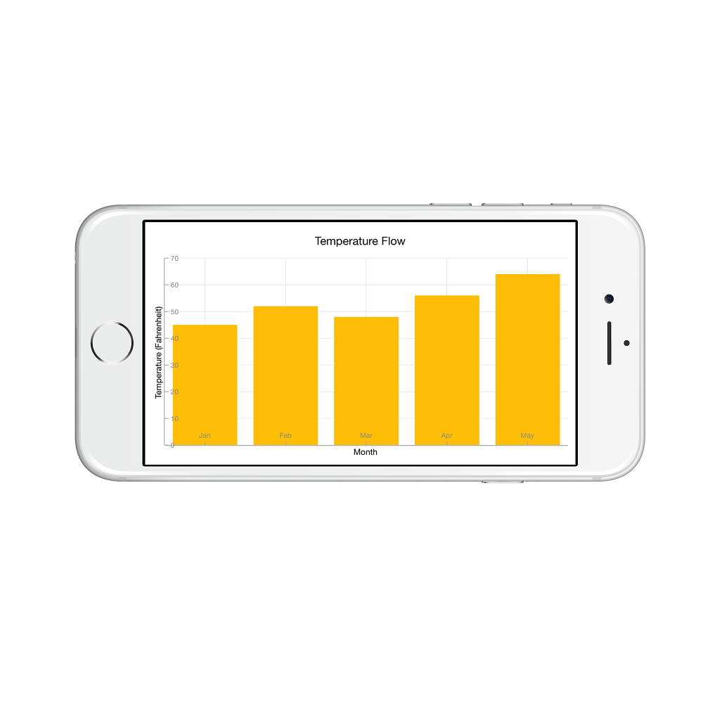

# Axis

Charts typically have two axes that are used to measure and categorize data: a vertical (Y) axis, and a horizontal (X) axis.

Vertical(Y) axis uses numeric or logarithmic scale. Horizontal(X) axis supports the following types of scale:

* Category
* Numeric
* Date time
* Logarithmic Axis

## Category Axis

Category axis displays text labels instead of numbers. 



SFCategoryAxis xAxis = new SFCategoryAxis ();

chart.PrimaryAxis 	 = xAxis;


### Placing labels between ticks

Labels in category axis can be placed between the ticks by setting `LabelPlacement` to `SFChartLabelPlacement.BetweenTicks`. Default value of `LabelPlacement` property is `SFChartLabelPlacement.OnTicks` i.e. labels will be placed on the ticks by default.



xAxis.LabelPlacement = SFChartLabelPlacement.BetweenTicks;


### Displaying labels after a fixed interval

To display labels after a fixed interval n, you can set `Interval` property of SFAxis as n. Default value of interval is 1 i.e. all the labels will be displayed by default.



xAxis.Interval = new NSNumber (2);


## Numeric Axis

Numeric axis uses numerical scale and displays numbers as labels. 



SFNumericalAxis xAxis = new SFNumericalAxis ();

chart.PrimaryAxis     = xAxis;


### Customizing numeric range

To customize the range of an axis, you can use the `Minimum` and `Maximum` properties of `SFNumericalAxis`. By default, range will be calculated automatically based on the provided data.



SFNumericalAxis yAxis 	= new SFNumericalAxis ();

chart.SecondaryAxis     = yAxis;

yAxis.Minimum           = new NSNumber (10);

yAxis.Maximum           = new NSNumber (50);



### Customizing numeric interval

Axis interval can be customized using the `Interval` property of SFAxis. By default, interval will be calculated based on the minimum and maximum value of the provided data.



yAxis.Interval = new NSNumber (10);


### Apply padding to the range

Padding can be applied to the minimum and maximum extremes of the axis range by using `RangePadding` property. Numeric axis supports the following types of padding.

* None
* Round
* Additional
* Normal

**None**

When the value of `RangePadding` property is `SFChartNumericalPadding.None`, padding will not be applied to the axis. This is also the default value of `RangePadding` for horizontal axis.



yAxis.RangePadding = SFChartNumericalPadding.None;



**Round**

When the value of `RangePadding` property is `SFChartNumericalPadding.Round`, axis range will be rounded to the nearest possible value divided by the interval.



yAxis.RangePadding = SFChartNumericalPadding.Round; 


**Additional**

When the value of `RangePadding` property is `SFChartNumericalPadding.Additional`, axis range will be rounded and an interval of the axis will be added as padding to the minimum and maximum values of the range.



yAxis.RangePadding = SFChartNumericalPadding.Additional; 


**Normal**

When the value of `RangePadding` property is `SFChartNumericalPadding.Normal`, range will be calculated for the axis based on the best readability of the data. This is also the default for vertical axis.



yAxis.RangePadding = SFChartNumericalPadding.Normal; 


## Date Time Axis

Date time axis uses date time scale and displays date time values as axis labels in specified format. 



SFDateTimeAxis xAxis = new SFDateTimeAxis ();

chart.PrimaryAxis    = xAxis; 


### Customizing date time range

To customize the range of an axis, you can use the `Minimum` and `Maximum` properties of `SFDateTimeAxis`. By default, range will be calculated automatically based on the provided data.



SFDateTimeAxis primaryAxis = new SFDateTimeAxis();
NSCalendar calendar = new NSCalendar(NSCalendarType.Gregorian);           
primaryAxis.Minimum = calendar.DateFromComponents(new NSDateComponents() {Year = 2010, Month = 1, Day = 1 });           
primaryAxis.Maximum = calendar.DateFromComponents(new NSDateComponents() {Year = 2015, Month = 12, Day = 31 });            



### Date time intervals

Date time intervals can be customized using `Interval` and `IntervalType` properties of the `SFDateTimeAxis`. For example, setting `Interval` as 2 and `IntervalType` as `SFChartDateTimeIntervalType.Years` will consider 2 years as interval.

Essential Chart supports the following types of interval for date time axis

* Years
* Months
* Days
* Hours
* Minutes
* Seconds
* Milliseconds



xAxis.IntervalType = SFChartDateTimeIntervalType.Months;

xAxis.Interval     = new NSNumber (6); 


### Apply padding to the range

Padding can be applied to the minimum and maximum extremes of the range by using `RangePadding` property. Date time axis supports the following types of padding:

* None
* Round
* Additional

**None**

When the value of `RangePadding` property is `SFChartDateTimePadding.None`, padding will not be applied to the axis. This is also the default value of `RangePadding`.



xAxis.RangePadding = SFChartDateTimePadding.None;


**Round**

When the value of `RangePadding` property is `SFChartDateTimePadding.Round`, axis range will be rounded to the nearest possible date time value.



xAxis.RangePadding = SFChartDateTimePadding.Round;


**Additional**

When the value of `RangePadding` property is `SFChartDateTimePadding.Additional`, range will be rounded and date time interval of the axis will be added as padding to the minimum and maximum extremes of the range.



xAxis.RangePadding = SFChartDateTimePadding.Additional; 


## Logarithmic Axis

Logarithmic axis uses logarithmic scale and displays numbers as axis labels.



SFLogarithmicAxis yAxis    = new SFLogarithmicAxis (); 
chart.SecondaryAxis        = yAxis; 
 


### Customizing the logarithmic range

To customize the range of log axis, you can use the `Minimum` and `Maximum` properties of LogarithmicAxis. By default, nice range will be calculated automatically based on the provided data.



SFLogarithmicAxis yAxis         = new SFLogarithmicAxis ();
yAxis.Minimum                   = new NSNumber(100);
yAxis.Maximum                   = new NSNumber(10000); 
chart.SecondaryAxis             = yAxis; 



### Customizing the logarithmic base 

To customize the log base value, you can use `LogarithmicBase` property.



SFLogarithmicAxis yAxis          = new SFLogarithmicAxis ();
yAxis.LogarithmicBase            =  2; 
chart.SecondaryAxis              = yAxis; 



## Common axis features

Customization of features such as axis title, labels, grid lines and tick lines are common to all the axes. Each of these features are explained in this section.

### Axis Visibility

Axis visibility can be controlled using the `Visible` property of axis. Default value of `Visible` property is `True`.



chart.SecondaryAxis.Visible = false; 



### Axis title

The `Title` property in axis provides options to customize the text and font of axis title. Axis does not display title by default. The title can be customized using following properties,

* `Text` – used to set the title for axis.
* `Color` – used to change the color of the label.
* `BackgroundColor` – used to change the label background color.
* `BorderColor` – used to change the border color.
* `BorderWidth` – used to change the width of the border.
* `Font` – used to change the text size, font family and font weight.
* `Margin` - used to change the margin size for labels.

Following code snippet illustrates how to enable and customize the axis title.



chart.PrimaryAxis.Title.Text   = new NSString ("Month");

chart.PrimaryAxis.Title.Color  = UIColor.Blue;

chart.PrimaryAxis.Title.Font   = UIFont.BoldSystemFontOfSize(20);


### Label customization

The `LabelStyle` property of axis provides options to customize the font-family, color, size and font-weight of axis labels. The axis labels can be customized using following properties:

* `Color` – used to change the color of the labels.
* `BackgroundColor` – used to change the label background color.
* `BorderColor` – used to change the border color.
* `BorderWidth` – used to change the thickness of the border.
* `Font` – used to change the text size, font family and font weight.
* `Margin` - used to change the margin size for labels.



chart.PrimaryAxis.LabelStyle.Font  = UIFont.BoldSystemFontOfSize (20);

chart.PrimaryAxis.LabelStyle.Color = UIColor.Red;



### Label and tick positioning

Axis labels and ticks can be positioned inside or outside the chart area by using `LabelsPosition` and `TickPosition` properties of SFAxis. By default labels and ticks will be positioned outside the chart area.



chart.PrimaryAxis.LabelStyle.LabelsPosition   = SFChartAxisElementPosition.Inside;

chart.PrimaryAxis.TickPosition                = SFChartAxisElementPosition.Inside;


### Edge labels placement

Labels with long text at the edges of an axis may appear partially outside the chart. The `EdgeLabelsDrawingMode` property can be used to avoid the partial appearance of labels at the corners.



chart.PrimaryAxis.EdgeLabelsDrawingMode = SFChartAxisEdgeLabelsDrawingMode.Shift; 


### Grid lines customization

The `ShowMajorGridLines` and `ShowMinorGridLines` properties are used to control the visibility of grid lines. `MajorGridLineStyle` and `MinorGridLineStyle` properties in axis are used to customize the major grid lines and minor grid lines of an axis respectively. They provide options to change the width, dashes, color of grid lines. By default minor grid lines will not be visible. 


yAxis.ShowMajorGridLines    = true;

yAxis.ShowMinorGridLines	= true;

yAxis.MinorTicksPerInterval	= 1;



### Tick lines customization

The `MajorTickStyle` and `MinorTickStyle` properties in axis are used to customize the major tick lines of an axis and minor tick lines of an axis respectively. They provide options to change the width, size, color and visibility of tick lines. By default minor tick lines will not be visible.



SFNumericalAxis yAxis           = new SFNumericalAxis ();

chart.SecondaryAxis             = yAxis;

yAxis.MajorTickStyle.LineSize   = new NSNumber (7);

yAxis.MajorTickStyle.LineWidth  = new NSNumber (3);

yAxis.MajorTickStyle.LineColor  = UIColor.Red;

yAxis.ShowMinorGridLines        = true;

yAxis.MinorTicksPerInterval     = 1;

yAxis.MinorTickStyle.LineSize   = new NSNumber (5);

yAxis.MinorTickStyle.LineWidth  = new NSNumber (2);

yAxis.MinorTickStyle.LineColor  = UIColor.Green;



### Inversing axis

Axis can be inversed using the `IsInversed` property of axis. Default value of `IsInversed` property is `False`.



chart.SecondaryAxis.IsInversed = true; 


### Placing axes at the opposite side

The `OpposedPosition` property of axis can be used to place the axis at the opposite side of its default position. Default value of `OpposedPosition` property is `False`. 



chart.SecondaryAxis.OpposedPosition = true;



### Maximum number of labels per 100 pixels

By default, a maximum of 3 labels are displayed for each 100 pixels in axis. The maximum number of labels that should be present within 100 pixels length can be customized using the `MaximumLabels` property of an axis. This property is applicable only for automatic range calculation and will not work if you set value for `Interval` property of an axis.



Chart.SecondaryAxis.MaximumLabels = 5;



### AutoScrollingMode

[`AutoScrollingMode`](https://help.syncfusion.com/cr/cref_files/xamarin-ios/sfchart/Syncfusion.SFChart.iOS~Syncfusion.SfChart.iOS.SFAxis~AutoScrollingMode.html) property can be used to determine whether the axis should be scrolled from start position or end position. The default value of [`AutoScrollingMode`](https://help.syncfusion.com/cr/cref_files/xamarin-ios/sfchart/Syncfusion.SFChart.iOS~Syncfusion.SfChart.iOS.SFAxis~AutoScrollingMode.html) is `End`.



SFCategoryAxis primaryAxis = new SFCategoryAxis();

primaryAxis.AutoScrollingDelta = 3;

primaryAxis.AutoScrollingMode = ChartAutoScrollingMode.Start;

chart.PrimaryAxis = primaryAxis;



## Smart Axis Labels

Axis labels may overlap with each other based on chart dimensions and label size. The `LabelsIntersectAction` property of axis is useful in avoiding the overlapping of axis labels with each other. Default value of `LabelsIntersectAction` is `SFChartAxisLabelsIntersectAction.None`. Other available values of `LabelsIntersectAction` are `SFChartAxisLabelsIntersectAction.MultipleRows` and `SFChartAxisLabelsIntersectAction.Hide`.



chart.PrimaryAxis.LabelsIntersectAction = SFChartAxisLabelsIntersectAction.MultipleRows;



## Events

**LabelClicked**

This event is triggered when the axis label is clicked. The argument contains the following information.

* [`Label`](https://help.syncfusion.com/cr/cref_files/xamarin-ios/sfchart/Syncfusion.SFChart.iOS~Syncfusion.SfChart.iOS.SFAxis+ChartAxisLabelClickedEventArgs~Label.html) - Used to get the ChartAxisLabel, which contains axis label position and text.
