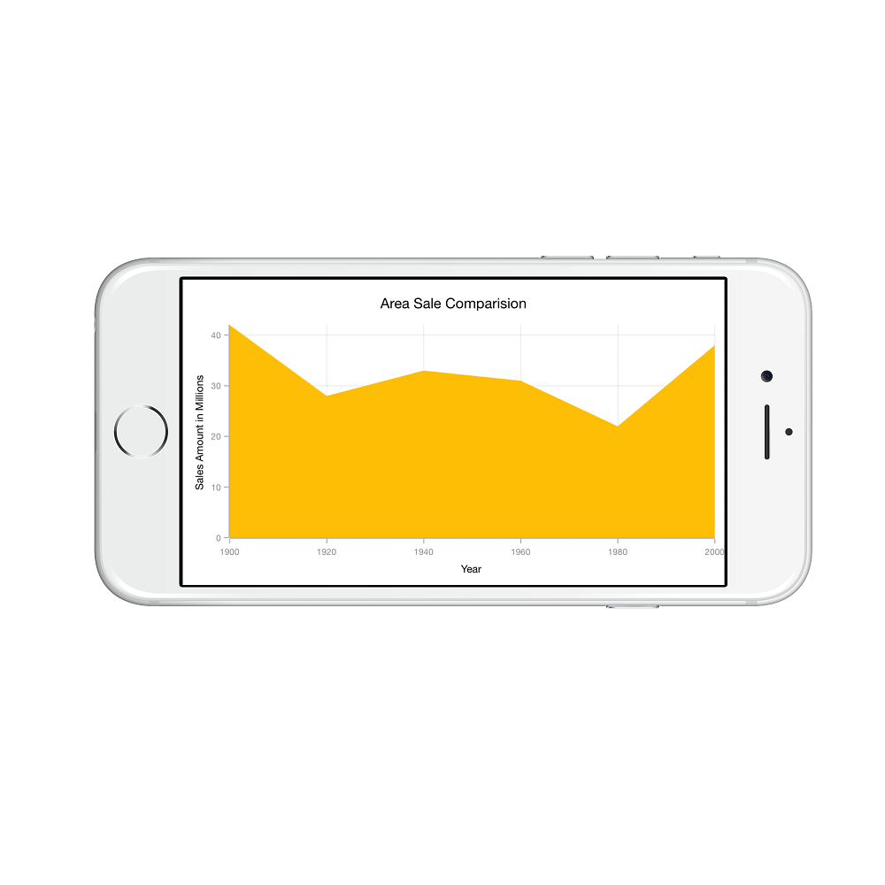
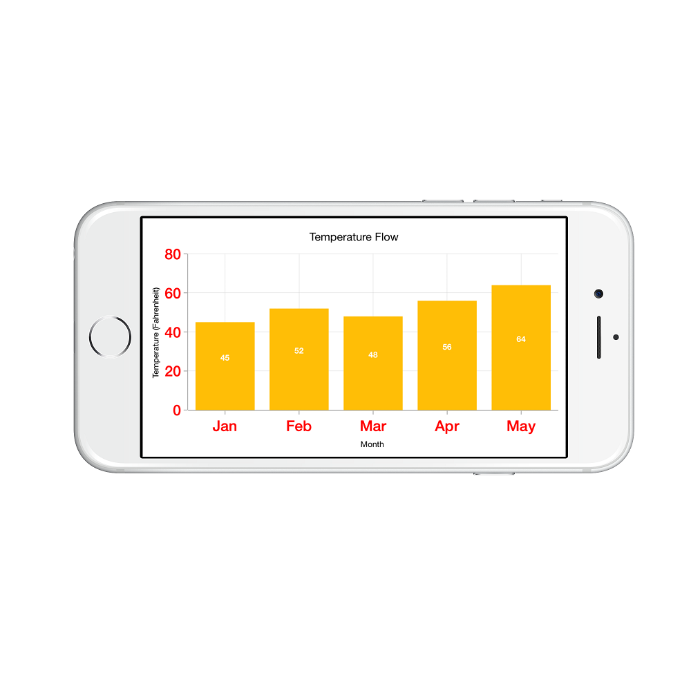
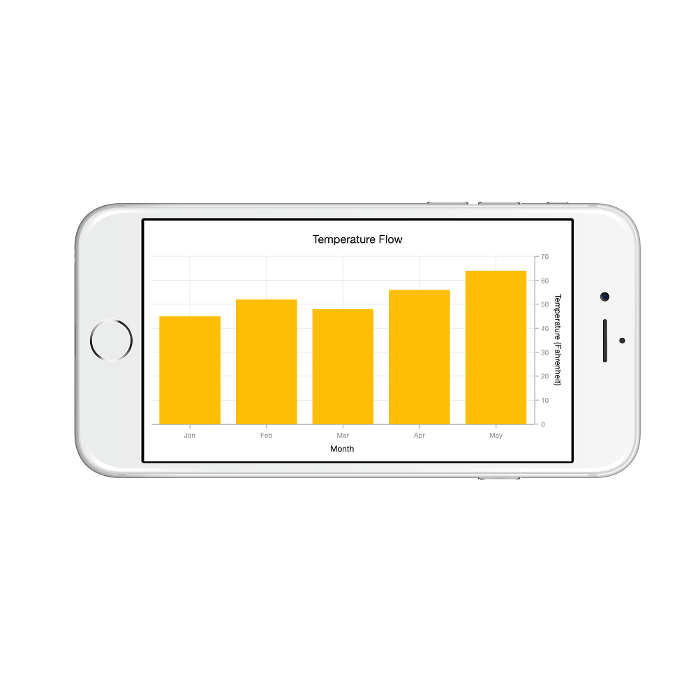

# Axis

Charts typically have two axes that are used to measure and categorize data: a vertical (Y) axis, and a horizontal (X) axis.

Vertical(Y) axis uses numeric or logarithmic scale. Horizontal(X) axis supports the following types of scale:

* Category
* Numeric
* Date time
* Logarithmic Axis

## Category Axis

Category axis displays text labels instead of numbers. 



SFCategoryAxis xAxis = new SFCategoryAxis ();

chart.PrimaryAxis 	 = xAxis;


### Placing labels between ticks

Labels in category axis can be placed between the ticks by setting [`LabelPlacement`](https://help.syncfusion.com/cr/cref_files/xamarin-ios/sfchart/Syncfusion.SFChart.iOS~Syncfusion.SfChart.iOS.SFCategoryAxis~LabelPlacement.html) to [`SFChartLabelPlacement.BetweenTicks`](https://help.syncfusion.com/cr/cref_files/xamarin-ios/sfchart/Syncfusion.SFChart.iOS~Syncfusion.SfChart.iOS.SFChartLabelPlacement.html). Default value of [`LabelPlacement`](https://help.syncfusion.com/cr/cref_files/xamarin-ios/sfchart/Syncfusion.SFChart.iOS~Syncfusion.SfChart.iOS.SFCategoryAxis~LabelPlacement.html) property is [`SFChartLabelPlacement.OnTicks`](https://help.syncfusion.com/cr/cref_files/xamarin-ios/sfchart/Syncfusion.SFChart.iOS~Syncfusion.SfChart.iOS.SFChartLabelPlacement.html) i.e. labels will be placed on the ticks by default.



xAxis.LabelPlacement = SFChartLabelPlacement.BetweenTicks;


### Displaying labels after a fixed interval

To display labels after a fixed interval n, you can set [`Interval`](https://help.syncfusion.com/cr/cref_files/xamarin-ios/sfchart/Syncfusion.SFChart.iOS~Syncfusion.SfChart.iOS.SFAxis~Interval.html) property of [`SFAxis`](https://help.syncfusion.com/cr/cref_files/xamarin-ios/sfchart/Syncfusion.SFChart.iOS~Syncfusion.SfChart.iOS.SFAxis.html) as n. Default value of interval is 1 i.e. all the labels will be displayed by default.



xAxis.Interval = new NSNumber (2);


## Numeric Axis

Numeric axis uses numerical scale and displays numbers as labels. 



SFNumericalAxis xAxis = new SFNumericalAxis ();

chart.PrimaryAxis     = xAxis;


### Customizing numeric range

To customize the range of an axis, you can use the [`Minimum`](https://help.syncfusion.com/cr/cref_files/xamarin-ios/sfchart/Syncfusion.SFChart.iOS~Syncfusion.SfChart.iOS.SFRangeAxisBase~Minimum.html) and [`Maximum`](https://help.syncfusion.com/cr/cref_files/xamarin-ios/sfchart/Syncfusion.SFChart.iOS~Syncfusion.SfChart.iOS.SFRangeAxisBase~Maximum.html) properties of [`SFNumericalAxis`](https://help.syncfusion.com/cr/cref_files/xamarin-ios/sfchart/Syncfusion.SFChart.iOS~Syncfusion.SfChart.iOS.SFNumericalAxis.html). By default, range will be calculated automatically based on the provided data.



SFNumericalAxis yAxis 	= new SFNumericalAxis ();

chart.SecondaryAxis     = yAxis;

yAxis.Minimum           = new NSNumber (10);

yAxis.Maximum           = new NSNumber (50);



### Customizing numeric interval

Axis interval can be customized using the [`Interval`](https://help.syncfusion.com/cr/cref_files/xamarin-ios/sfchart/Syncfusion.SFChart.iOS~Syncfusion.SfChart.iOS.SFAxis~Interval.html) property of [`SFAxis`](https://help.syncfusion.com/cr/cref_files/xamarin-ios/sfchart/Syncfusion.SFChart.iOS~Syncfusion.SfChart.iOS.SFAxis.html). By default, interval will be calculated based on the minimum and maximum value of the provided data.



yAxis.Interval = new NSNumber (10);


### Apply padding to the range

Padding can be applied to the minimum and maximum extremes of the axis range by using [`RangePadding`](https://help.syncfusion.com/cr/cref_files/xamarin-ios/sfchart/Syncfusion.SFChart.iOS~Syncfusion.SfChart.iOS.SFNumericalAxis~RangePadding.html) property. Numeric axis supports the following types of padding.

* None
* Round
* Additional
* Normal

**None**

When the value of [`RangePadding`](https://help.syncfusion.com/cr/cref_files/xamarin-ios/sfchart/Syncfusion.SFChart.iOS~Syncfusion.SfChart.iOS.SFNumericalAxis~RangePadding.html) property is [`SFChartNumericalPadding.None`](https://help.syncfusion.com/cr/cref_files/xamarin-ios/sfchart/Syncfusion.SFChart.iOS~Syncfusion.SfChart.iOS.SFChartNumericalPadding.html), padding will not be applied to the axis. This is also the default value of [`RangePadding`](https://help.syncfusion.com/cr/cref_files/xamarin-ios/sfchart/Syncfusion.SFChart.iOS~Syncfusion.SfChart.iOS.SFNumericalAxis~RangePadding.html) for horizontal axis.



yAxis.RangePadding = SFChartNumericalPadding.None;



**Round**

When the value of [`RangePadding`](https://help.syncfusion.com/cr/cref_files/xamarin-ios/sfchart/Syncfusion.SFChart.iOS~Syncfusion.SfChart.iOS.SFNumericalAxis~RangePadding.html) property is [`SFChartNumericalPadding.Round`](https://help.syncfusion.com/cr/cref_files/xamarin-ios/sfchart/Syncfusion.SFChart.iOS~Syncfusion.SfChart.iOS.SFChartNumericalPadding.html), axis range will be rounded to the nearest possible value divided by the interval.



yAxis.RangePadding = SFChartNumericalPadding.Round; 


**Additional**

When the value of [`RangePadding`](https://help.syncfusion.com/cr/cref_files/xamarin-ios/sfchart/Syncfusion.SFChart.iOS~Syncfusion.SfChart.iOS.SFNumericalAxis~RangePadding.html) property is [`SFChartNumericalPadding.Additional`](https://help.syncfusion.com/cr/cref_files/xamarin-ios/sfchart/Syncfusion.SFChart.iOS~Syncfusion.SfChart.iOS.SFChartNumericalPadding.html), axis range will be rounded and an interval of the axis will be added as padding to the minimum and maximum values of the range.



yAxis.RangePadding = SFChartNumericalPadding.Additional; 


**Normal**

When the value of [`RangePadding`](https://help.syncfusion.com/cr/cref_files/xamarin-ios/sfchart/Syncfusion.SFChart.iOS~Syncfusion.SfChart.iOS.SFNumericalAxis~RangePadding.html) property is [`SFChartNumericalPadding.Normal`](https://help.syncfusion.com/cr/cref_files/xamarin-ios/sfchart/Syncfusion.SFChart.iOS~Syncfusion.SfChart.iOS.SFChartNumericalPadding.html), range will be calculated for the axis based on the best readability of the data. This is also the default for vertical axis.



yAxis.RangePadding = SFChartNumericalPadding.Normal; 


## Date Time Axis

Date time axis uses date time scale and displays date time values as axis labels in specified format. 



SFDateTimeAxis xAxis = new SFDateTimeAxis ();

chart.PrimaryAxis    = xAxis; 


### Customizing date time range

To customize the range of an axis, you can use the [`Minimum`](https://help.syncfusion.com/cr/cref_files/xamarin-ios/sfchart/Syncfusion.SFChart.iOS~Syncfusion.SfChart.iOS.SFRangeAxisBase~Minimum.html) and [`Maximum`](https://help.syncfusion.com/cr/cref_files/xamarin-ios/sfchart/Syncfusion.SFChart.iOS~Syncfusion.SfChart.iOS.SFRangeAxisBase~Maximum.html) properties of [`SFDateTimeAxis`](https://help.syncfusion.com/cr/cref_files/xamarin-ios/sfchart/Syncfusion.SFChart.iOS~Syncfusion.SfChart.iOS.SFDateTimeAxis.html). By default, range will be calculated automatically based on the provided data.



SFDateTimeAxis primaryAxis = new SFDateTimeAxis();
NSCalendar calendar = new NSCalendar(NSCalendarType.Gregorian);           
primaryAxis.Minimum = calendar.DateFromComponents(new NSDateComponents() {Year = 2010, Month = 1, Day = 1 });           
primaryAxis.Maximum = calendar.DateFromComponents(new NSDateComponents() {Year = 2015, Month = 12, Day = 31 });            



### Date time intervals

Date time intervals can be customized using [`Interval`](https://help.syncfusion.com/cr/cref_files/xamarin-ios/sfchart/Syncfusion.SFChart.iOS~Syncfusion.SfChart.iOS.SFAxis~Interval.html) and [`IntervalType`](https://help.syncfusion.com/cr/cref_files/xamarin-ios/sfchart/Syncfusion.SFChart.iOS~Syncfusion.SfChart.iOS.SFDateTimeAxis~IntervalType.html) properties of the [`SFDateTimeAxis`](https://help.syncfusion.com/cr/cref_files/xamarin-ios/sfchart/Syncfusion.SFChart.iOS~Syncfusion.SfChart.iOS.SFDateTimeAxis.html). For example, setting [`Interval`](https://help.syncfusion.com/cr/cref_files/xamarin-ios/sfchart/Syncfusion.SFChart.iOS~Syncfusion.SfChart.iOS.SFAxis~Interval.html) as 2 and [`IntervalType`](https://help.syncfusion.com/cr/cref_files/xamarin-ios/sfchart/Syncfusion.SFChart.iOS~Syncfusion.SfChart.iOS.SFDateTimeAxis~IntervalType.html) as [`SFChartDateTimeIntervalType.Years`](https://help.syncfusion.com/cr/cref_files/xamarin-ios/sfchart/Syncfusion.SFChart.iOS~Syncfusion.SfChart.iOS.SFChartDateTimeIntervalType.html) will consider 2 years as interval.

Essential Chart supports the following types of interval for date time axis

* Years
* Months
* Days
* Hours
* Minutes
* Seconds
* Milliseconds



xAxis.IntervalType = SFChartDateTimeIntervalType.Months;

xAxis.Interval     = new NSNumber (6); 


### Apply padding to the range

Padding can be applied to the minimum and maximum extremes of the range by using [`RangePadding`](https://help.syncfusion.com/cr/cref_files/xamarin-ios/sfchart/Syncfusion.SFChart.iOS~Syncfusion.SfChart.iOS.SFDateTimeAxis~RangePadding.html) property. Date time axis supports the following types of padding:

* None
* Round
* Additional

**None**

When the value of [`RangePadding`](https://help.syncfusion.com/cr/cref_files/xamarin-ios/sfchart/Syncfusion.SFChart.iOS~Syncfusion.SfChart.iOS.SFDateTimeAxis~RangePadding.html) property is [`SFChartDateTimePadding.None`](https://help.syncfusion.com/cr/cref_files/xamarin-ios/sfchart/Syncfusion.SFChart.iOS~Syncfusion.SfChart.iOS.SFChartDateTimePadding.html), padding will not be applied to the axis. This is also the default value of [`RangePadding`](https://help.syncfusion.com/cr/cref_files/xamarin-ios/sfchart/Syncfusion.SFChart.iOS~Syncfusion.SfChart.iOS.SFDateTimeAxis~RangePadding.html).



xAxis.RangePadding = SFChartDateTimePadding.None;


**Round**

When the value of [`RangePadding`](https://help.syncfusion.com/cr/cref_files/xamarin-ios/sfchart/Syncfusion.SFChart.iOS~Syncfusion.SfChart.iOS.SFDateTimeAxis~RangePadding.html) property is [`SFChartDateTimePadding.Round`](https://help.syncfusion.com/cr/cref_files/xamarin-ios/sfchart/Syncfusion.SFChart.iOS~Syncfusion.SfChart.iOS.SFChartDateTimePadding.html), axis range will be rounded to the nearest possible date time value.



xAxis.RangePadding = SFChartDateTimePadding.Round;


**Additional**

When the value of [`RangePadding`](https://help.syncfusion.com/cr/cref_files/xamarin-ios/sfchart/Syncfusion.SFChart.iOS~Syncfusion.SfChart.iOS.SFDateTimeAxis~RangePadding.html) property is [`SFChartDateTimePadding.Additional`](https://help.syncfusion.com/cr/cref_files/xamarin-ios/sfchart/Syncfusion.SFChart.iOS~Syncfusion.SfChart.iOS.SFChartDateTimePadding.html), range will be rounded and date time interval of the axis will be added as padding to the minimum and maximum extremes of the range.



xAxis.RangePadding = SFChartDateTimePadding.Additional; 


## Date-time category axis

The [`DateTimeCategoryAxis`]() is a unique type of axis used mainly with financial series. Like CategoryAxis, all the data points are plotted with equal spaces by removing space for missing dates. Intervals and ranges for the axis are calculated similar to DateTimeAxis. There will be no visual gaps between points even when the difference between two points is more than a year. The following APIs are used to customize the interval of DateTimeCategoryAxis.

•	[`Interval`]() - Gets or sets the double value that represents the interval between the labels.
•	[`IntervalType`]() - Gets or sets the DateTimeIntervalType that represents the type of the interval to be displayed.



SFDateTimeCategoryAxis xAxis = new SFDateTimeCategoryAxis();
xAxis.Interval = new NSNumber(1);
xAxis.IntervalType = SFChartDateTimeIntervalType.Months;
chart.PrimaryAxis = xAxis;



## Logarithmic Axis

Logarithmic axis uses logarithmic scale and displays numbers as axis labels.



SFLogarithmicAxis yAxis    = new SFLogarithmicAxis (); 
chart.SecondaryAxis        = yAxis; 
 


### Customizing the logarithmic range

To customize the range of log axis, you can use the [`Minimum`](https://help.syncfusion.com/cr/cref_files/xamarin-ios/sfchart/Syncfusion.SFChart.iOS~Syncfusion.SfChart.iOS.SFRangeAxisBase~Minimum.html) and [`Maximum`](https://help.syncfusion.com/cr/cref_files/xamarin-ios/sfchart/Syncfusion.SFChart.iOS~Syncfusion.SfChart.iOS.SFRangeAxisBase~Maximum.html) properties of [`LogarithmicAxis`](https://help.syncfusion.com/cr/cref_files/xamarin-ios/sfchart/Syncfusion.SFChart.iOS~Syncfusion.SfChart.iOS.SFLogarithmicAxis.html). By default, nice range will be calculated automatically based on the provided data.



SFLogarithmicAxis yAxis         = new SFLogarithmicAxis ();
yAxis.Minimum                   = new NSNumber(100);
yAxis.Maximum                   = new NSNumber(10000); 
chart.SecondaryAxis             = yAxis; 



### Customizing the logarithmic base 

To customize the log base value, you can use [`LogarithmicBase`](https://help.syncfusion.com/cr/cref_files/xamarin-ios/sfchart/Syncfusion.SFChart.iOS~Syncfusion.SfChart.iOS.SFLogarithmicAxis~LogarithmicBase.html) property.



SFLogarithmicAxis yAxis          = new SFLogarithmicAxis ();
yAxis.LogarithmicBase            =  2; 
chart.SecondaryAxis              = yAxis; 



## Common axis features

Customization of features such as axis title, labels, grid lines and tick lines are common to all the axes. Each of these features are explained in this section.

### Axis Visibility

Axis visibility can be controlled using the [`Visible`](https://help.syncfusion.com/cr/cref_files/xamarin-ios/sfchart/Syncfusion.SFChart.iOS~Syncfusion.SfChart.iOS.SFAxis~Visible.html) property of axis. Default value of [`Visible`](https://help.syncfusion.com/cr/cref_files/xamarin-ios/sfchart/Syncfusion.SFChart.iOS~Syncfusion.SfChart.iOS.SFAxis~Visible.html) property is `True`.



chart.SecondaryAxis.Visible = false; 



### Axis title

The [`Title`](https://help.syncfusion.com/cr/cref_files/xamarin-ios/sfchart/Syncfusion.SFChart.iOS~Syncfusion.SfChart.iOS.SFAxis~Title.html) property in axis provides options to customize the text and font of axis title. Axis does not display title by default. The title can be customized using following properties,

* [`Text`](https://help.syncfusion.com/cr/cref_files/xamarin-ios/sfchart/Syncfusion.SFChart.iOS~Syncfusion.SfChart.iOS.SFAxisTitleStyle~Text.html) – used to set the title for axis.
* [`Color`](https://help.syncfusion.com/cr/cref_files/xamarin-ios/sfchart/Syncfusion.SFChart.iOS~Syncfusion.SfChart.iOS.SFLabelStyle~Color.html) – used to change the color of the label.
* [`BackgroundColor`](https://help.syncfusion.com/cr/cref_files/xamarin-ios/sfchart/Syncfusion.SFChart.iOS~Syncfusion.SfChart.iOS.SFLabelStyle~BackgroundColor.html) – used to change the label background color.
* [`BorderColor`](https://help.syncfusion.com/cr/cref_files/xamarin-ios/sfchart/Syncfusion.SFChart.iOS~Syncfusion.SfChart.iOS.SFLabelStyle~BorderColor.html) – used to change the border color.
* [`BorderWidth`](https://help.syncfusion.com/cr/cref_files/xamarin-ios/sfchart/Syncfusion.SFChart.iOS~Syncfusion.SfChart.iOS.SFLabelStyle~BorderWidth.html) – used to change the width of the border.
* [`Font`](https://help.syncfusion.com/cr/cref_files/xamarin-ios/sfchart/Syncfusion.SFChart.iOS~Syncfusion.SfChart.iOS.SFLabelStyle~Font.html) – used to change the text size, font family and font weight.
* [`Margin`](https://help.syncfusion.com/cr/cref_files/xamarin-ios/sfchart/Syncfusion.SFChart.iOS~Syncfusion.SfChart.iOS.SFLabelStyle~Margin.html) - used to change the margin size for labels.

Following code snippet illustrates how to enable and customize the axis title.



chart.PrimaryAxis.Title.Text   = new NSString ("Month");

chart.PrimaryAxis.Title.Color  = UIColor.Blue;

chart.PrimaryAxis.Title.Font   = UIFont.BoldSystemFontOfSize(20);


### Axis label rotation

The [`LabelRotationAngle`](https://help.syncfusion.com/cr/cref_files/xamarin-ios/sfchart/Syncfusion.SFChart.iOS~Syncfusion.SfChart.iOS.SFAxis~LabelRotationAngle.html) property of axis can be used to rotate the axis labels position. Default value of [`LabelRotationAngle`](https://help.syncfusion.com/cr/cref_files/xamarin-ios/sfchart/Syncfusion.SFChart.iOS~Syncfusion.SfChart.iOS.SFAxis~LabelRotationAngle.html) property is 0d.



SFCategoryAxis categoryAxis = new SFCategoryAxis(); 
  
categoryAxis.LabelRotationAngle = -45; 
  
chart.PrimaryAxis = categoryAxis;



### Axis line customization

[`SFChart`](https://help.syncfusion.com/cr/cref_files/xamarin-ios/sfchart/Syncfusion.SFChart.iOS~Syncfusion.SfChart.iOS.SFChart.html) provides support to customize the style of the axis line by using the [`AxisLineStyle`](https://help.syncfusion.com/cr/cref_files/xamarin-ios/sfchart/Syncfusion.SFChart.iOS~Syncfusion.SfChart.iOS.SFAxisLineStyle.html) property as shown in the below code snippet.

* [`LineColor`](https://help.syncfusion.com/cr/cref_files/xamarin-ios/sfchart/Syncfusion.SFChart.iOS~Syncfusion.SfChart.iOS.SFLineStyle~LineColor.html) - used to change the line color of axis line.
* [`LineWidth`](https://help.syncfusion.com/cr/cref_files/xamarin-ios/sfchart/Syncfusion.SFChart.iOS~Syncfusion.SfChart.iOS.SFLineStyle~LineWidth.html) - used to change the line width of axis line.
* [`Dashes`](https://help.syncfusion.com/cr/cref_files/xamarin-ios/sfchart/Syncfusion.SFChart.iOS~Syncfusion.SfChart.iOS.SFAxisLineStyle~Dashes.html) - used to render axis line series with dashes.



SFCategoryAxis primaryAxis = new SFCategoryAxis();

primaryAxis.AxisLineStyle.LineColor = UIColor.Red;

primaryAxis.AxisLineStyle.LineWidth = 10;

NSObject[] dashes = new NSObject[2];

dashes [0] = (NSNumber)2;

dashes [1] = (NSNumber)3;

primaryAxis.AxisLineStyle.Dashes = NSArray.FromObjects(dashes);

chart.PrimaryAxis = primaryAxis;



### Axis line offset

The [`AxisLineOffset`](https://help.syncfusion.com/cr/cref_files/xamarin-ios/sfchart/Syncfusion.SFChart.iOS~Syncfusion.SfChart.iOS.SFAxis~AxisLineOffset.html) property is used to offset the rendering of axis line.



SFCategoryAxis categoryAxis = new SFCategoryAxis(); 
  
categoryAxis.PlotOffset = 20;

categoryAxis.AxisLineOffset = 20;

categoryAxis.AxisLineStyle.StrokeWidth = 5;
  
chart.PrimaryAxis = categoryAxis;



### Label customization

The [`LabelStyle`](https://help.syncfusion.com/cr/cref_files/xamarin-ios/sfchart/Syncfusion.SFChart.iOS~Syncfusion.SfChart.iOS.SFAxis~LabelStyle.html) property of axis provides options to customize the font-family, color, size and font-weight of axis labels. The axis labels can be customized using following properties:

* [`Color`](https://help.syncfusion.com/cr/cref_files/xamarin-ios/sfchart/Syncfusion.SFChart.iOS~Syncfusion.SfChart.iOS.SFLabelStyle~Color.html) – used to change the color of the labels.
* [`BackgroundColor`](https://help.syncfusion.com/cr/cref_files/xamarin-ios/sfchart/Syncfusion.SFChart.iOS~Syncfusion.SfChart.iOS.SFLabelStyle~BackgroundColor.html) – used to change the label background color.
* [`BorderColor`](https://help.syncfusion.com/cr/cref_files/xamarin-ios/sfchart/Syncfusion.SFChart.iOS~Syncfusion.SfChart.iOS.SFLabelStyle~BorderColor.html) – used to change the border color.
* [`BorderWidth`](https://help.syncfusion.com/cr/cref_files/xamarin-ios/sfchart/Syncfusion.SFChart.iOS~Syncfusion.SfChart.iOS.SFLabelStyle~BorderWidth.html) – used to change the thickness of the border.
* [`Font`](https://help.syncfusion.com/cr/cref_files/xamarin-ios/sfchart/Syncfusion.SFChart.iOS~Syncfusion.SfChart.iOS.SFLabelStyle~Font.html) – used to change the text size, font family and font weight.
* [`Margin`](https://help.syncfusion.com/cr/cref_files/xamarin-ios/sfchart/Syncfusion.SFChart.iOS~Syncfusion.SfChart.iOS.SFLabelStyle~Margin.html) - used to change the margin size for labels.
* [`LabelAlignment`](https://help.syncfusion.com/cr/cref_files/xamarin-ios/sfchart/Syncfusion.SFChart.iOS~Syncfusion.SfChart.iOS.SFAxisLabelStyle~LabelAlignment.html) - Used to align the label at the start, center, or end.
* [`CornerRadius`](https://help.syncfusion.com/cr/cref_files/xamarin-ios/sfchart/Syncfusion.SFChart.iOS~Syncfusion.SfChart.iOS.SFAxisLabelStyle~CornerRadius.html) - Used to change the corner radius of the background of labels.



chart.PrimaryAxis.LabelStyle.Font  = UIFont.BoldSystemFontOfSize (20);

chart.PrimaryAxis.LabelStyle.Color = UIColor.Red;



### Label and tick positioning

Axis labels and ticks can be positioned inside or outside the chart area by using [`LabelsPosition`](https://help.syncfusion.com/cr/cref_files/xamarin-ios/sfchart/Syncfusion.SFChart.iOS~Syncfusion.SfChart.iOS.SFAxisLabelStyle~LabelsPosition.html) and [`TickPosition`](https://help.syncfusion.com/cr/cref_files/xamarin-ios/sfchart/Syncfusion.SFChart.iOS~Syncfusion.SfChart.iOS.SFAxis~TickPosition.html) properties of [`SFAxis`](https://help.syncfusion.com/cr/cref_files/xamarin-ios/sfchart/Syncfusion.SFChart.iOS~Syncfusion.SfChart.iOS.SFAxis.html). By default labels and ticks will be positioned outside the chart area.



chart.PrimaryAxis.LabelStyle.LabelsPosition   = SFChartAxisElementPosition.Inside;

chart.PrimaryAxis.TickPosition                = SFChartAxisElementPosition.Inside;


### Edge labels placement

Labels with long text at the edges of an axis may appear partially outside the chart. The [`EdgeLabelsDrawingMode`](https://help.syncfusion.com/cr/cref_files/xamarin-ios/sfchart/Syncfusion.SFChart.iOS~Syncfusion.SfChart.iOS.SFAxis~EdgeLabelsDrawingMode.html) property can be used to avoid the partial appearance of labels at the corners.



chart.PrimaryAxis.EdgeLabelsDrawingMode = SFChartAxisEdgeLabelsDrawingMode.Shift; 


### Edge labels visibility

The visibility of the edge labels in an axis can be controlled using [`EdgeLabelsVisibilityMode`](https://help.syncfusion.com/cr/cref_files/xamarin-ios/sfchart/Syncfusion.SFChart.iOS~Syncfusion.SfChart.iOS.SFRangeAxisBase~EdgeLabelsVisibilityMode.html) property.
The following options are available in [`EdgeLabelsVisibilityMode`]((https://help.syncfusion.com/cr/cref_files/xamarin-ios/sfchart/Syncfusion.SFChart.iOS~Syncfusion.SfChart.iOS.SFRangeAxisBase~EdgeLabelsVisibilityMode.html),

* `Default` - used to display the edge label based on auto interval calculations.
* `Visible` - used to display the edge labels (first and last label) irrespective of the auto interval calculation until zooming (i.e., in normal state).
* `AlwaysVisible` - used to always display the edge labels even while zooming the chart.

The following code example demonstrates the AlwaysVisible option.



chart.SecondaryAxis.EdgeLabelsVisibilityMode  = SFChartAxisEdgeLabelsVisibilityMode.AlwaysVisible; 



### Label extent 

The [`LabelExtent`](https://help.syncfusion.com/cr/cref_files/xamarin-ios/sfchart/Syncfusion.SFChart.iOS~Syncfusion.SfChart.iOS.SFAxis~LabelExtent.html) property allows to set the gap between axis labels and title. This is typically used to maintain the fixed gap between axis labels and title when the digits of the axis value changed in live update.



Chart.PrimaryAxis = new SFCategoryAxis();

Chart.PrimaryAxis.LabelExtent = 60;

Chart.PrimaryAxis.Title.Text = new NSString("Month");



### Grid lines customization

The [`ShowMajorGridLines`](https://help.syncfusion.com/cr/cref_files/xamarin-ios/sfchart/Syncfusion.SFChart.iOS~Syncfusion.SfChart.iOS.SFAxis~ShowMajorGridLines.html) and [`ShowMinorGridLines`](https://help.syncfusion.com/cr/cref_files/xamarin-ios/sfchart/Syncfusion.SFChart.iOS~Syncfusion.SfChart.iOS.SFRangeAxisBase~ShowMinorGridLines.html) properties are used to control the visibility of grid lines. [`MajorGridLineStyle`](https://help.syncfusion.com/cr/cref_files/xamarin-ios/sfchart/Syncfusion.SFChart.iOS~Syncfusion.SfChart.iOS.SFAxis~MajorGridLineStyle.html) and [`MinorGridLineStyle`](https://help.syncfusion.com/cr/cref_files/xamarin-ios/sfchart/Syncfusion.SFChart.iOS~Syncfusion.SfChart.iOS.SFRangeAxisBase~MinorGridLineStyle.html) properties in axis are used to customize the major grid lines and minor grid lines of an axis respectively. They provide options to change the width, dashes, color of grid lines. By default minor grid lines will not be visible. 


yAxis.ShowMajorGridLines    = true;

yAxis.ShowMinorGridLines	= true;

yAxis.MinorTicksPerInterval	= 1;



### Tick lines customization

The [`MajorTickStyle`](https://help.syncfusion.com/cr/cref_files/xamarin-ios/sfchart/Syncfusion.SFChart.iOS~Syncfusion.SfChart.iOS.SFAxis~MajorTickStyle.html) and [`MinorTickStyle`](https://help.syncfusion.com/cr/cref_files/xamarin-ios/sfchart/Syncfusion.SFChart.iOS~Syncfusion.SfChart.iOS.SFRangeAxisBase~MinorTickStyle.html) properties in axis are used to customize the major tick lines of an axis and minor tick lines of an axis respectively. They provide options to change the [`LineWidth`](https://help.syncfusion.com/cr/cref_files/xamarin-ios/sfchart/Syncfusion.SFChart.iOS~Syncfusion.SfChart.iOS.SFLineStyle~LineWidth.html), ['LineSize'](https://help.syncfusion.com/cr/cref_files/xamarin-ios/sfchart/Syncfusion.SFChart.iOS~Syncfusion.SfChart.iOS.SFAxisTickStyle~LineSize.html), ['LineColor'](https://help.syncfusion.com/cr/cref_files/xamarin-ios/sfchart/Syncfusion.SFChart.iOS~Syncfusion.SfChart.iOS.SFLineStyle~LineColor.html) and ['MinorTicksPerInterval'](https://help.syncfusion.com/cr/cref_files/xamarin-ios/sfchart/Syncfusion.SFChart.iOS~Syncfusion.SfChart.iOS.SFRangeAxisBase~MinorTicksPerInterval.html) of tick lines. By default minor tick lines will not be visible.



SFNumericalAxis yAxis           = new SFNumericalAxis ();

chart.SecondaryAxis             = yAxis;

yAxis.MajorTickStyle.LineSize   = new NSNumber (7);

yAxis.MajorTickStyle.LineWidth  = new NSNumber (3);

yAxis.MajorTickStyle.LineColor  = UIColor.Red;

yAxis.ShowMinorGridLines        = true;

yAxis.MinorTicksPerInterval     = 1;

yAxis.MinorTickStyle.LineSize   = new NSNumber (5);

yAxis.MinorTickStyle.LineWidth  = new NSNumber (2);

yAxis.MinorTickStyle.LineColor  = UIColor.Green;



### Inversing axis

Axis can be inversed using the [`IsInversed`](https://help.syncfusion.com/cr/cref_files/xamarin-ios/sfchart/Syncfusion.SFChart.iOS~Syncfusion.SfChart.iOS.SFAxis~IsInversed.html) property of axis. Default value of [`IsInversed`](https://help.syncfusion.com/cr/cref_files/xamarin-ios/sfchart/Syncfusion.SFChart.iOS~Syncfusion.SfChart.iOS.SFAxis~IsInversed.html) property is `False`.



chart.SecondaryAxis.IsInversed = true; 


### Placing axes at the opposite side

The [`OpposedPosition`](https://help.syncfusion.com/cr/cref_files/xamarin-ios/sfchart/Syncfusion.SFChart.iOS~Syncfusion.SfChart.iOS.SFAxis~OpposedPosition.html) property of axis can be used to place the axis at the opposite side of its default position. Default value of [`OpposedPosition`](https://help.syncfusion.com/cr/cref_files/xamarin-ios/sfchart/Syncfusion.SFChart.iOS~Syncfusion.SfChart.iOS.SFAxis~OpposedPosition.html) property is `False`. 



chart.SecondaryAxis.OpposedPosition = true;



### Offset the rendering

The [`PlotOffset`](https://help.syncfusion.com/cr/cref_files/xamarin-ios/sfchart/Syncfusion.SFChart.iOS~Syncfusion.SfChart.iOS.SFAxis~PlotOffset.html) property is used to offset the rendering of the axis at start and end position. The following code snippet demonstrates to apply the plot offset to both x and y axes.



Chart.PrimaryAxis = new SFCategoryAxis() { PlotOffset = 30 };

Chart.SecondaryAxis = new SFNumericalAxis() { PlotOffset = 30 };



### Maximum number of labels per 100 pixels

By default, a maximum of 3 labels are displayed for each 100 pixels in axis. The maximum number of labels that should be present within 100 pixels length can be customized using the [`MaximumLabels`](https://help.syncfusion.com/cr/cref_files/xamarin-ios/sfchart/Syncfusion.SFChart.iOS~Syncfusion.SfChart.iOS.SFAxis~MaximumLabels.html) property of an axis. This property is applicable only for automatic range calculation and will not work if you set value for [`Interval`](https://help.syncfusion.com/cr/cref_files/xamarin-ios/sfchart/Syncfusion.SFChart.iOS~Syncfusion.SfChart.iOS.SFAxis~Interval.html) property of an axis.



Chart.SecondaryAxis.MaximumLabels = 5;



### Auto scrolling

[`AutoScrollingDelta`](https://help.syncfusion.com/cr/cref_files/xamarin-ios/sfchart/Syncfusion.SFChart.iOS~Syncfusion.SfChart.iOS.SFAxis~AutoScrollingDelta.html) property is used to ensure that the specified range of data is always visible in the chart. It always shows the recently added data points at the end and scrolling will be reset to the end of the range whenever a new point is added.

By adding [`SFChartZoomPanBehavior`](https://help.syncfusion.com/cr/cref_files/xamarin-ios/sfchart/Syncfusion.SFChart.iOS~Syncfusion.SfChart.iOS.SFChartZoomPanBehavior.html) to the chart, you can scroll to see the previous datapoints.

### Auto scrolling delta type

In [`SFDateTimeAxis`](https://help.syncfusion.com/cr/cref_files/xamarin-ios/sfchart/Syncfusion.SFChart.iOS~Syncfusion.SfChart.iOS.SFDateTimeAxis.html), you can apply auto scrolling delta value in years, months, days, hours, minutes, seconds and milliseconds by setting [`AutoScrollingDeltaType`](https://help.syncfusion.com/cr/cref_files/xamarin-ios/sfchart/Syncfusion.SFChart.iOS~Syncfusion.SfChart.iOS.SFAxis~AutoScrollingDelta.html) property.

### Auto scrolling mode

[`AutoScrollingMode`](https://help.syncfusion.com/cr/cref_files/xamarin-ios/sfchart/Syncfusion.SFChart.iOS~Syncfusion.SfChart.iOS.SFAxis~AutoScrollingMode.html) property can be used to determine whether the axis should be scrolled from start position or end position. The default value of [`AutoScrollingMode`](https://help.syncfusion.com/cr/cref_files/xamarin-ios/sfchart/Syncfusion.SFChart.iOS~Syncfusion.SfChart.iOS.SFAxis~AutoScrollingMode.html) is `End`.



SFCategoryAxis primaryAxis = new SFCategoryAxis();

primaryAxis.AutoScrollingDelta = 3;

primaryAxis.AutoScrollingMode = ChartAutoScrollingMode.Start;

chart.PrimaryAxis = primaryAxis;



## Axis Crossing

Axis can be positioned anywhere in the chart area by using [`CrossesAt`](https://help.syncfusion.com/cr/cref_files/xamarin-ios/sfchart/Syncfusion.SFChart.iOS~Syncfusion.SfChart.iOS.SFAxis~CrossesAt.html) property. This property specifies where the horizontal axis should intersect or cross the vertical axis or vice-versa. Default value of [`CrossesAt`](https://help.syncfusion.com/cr/cref_files/xamarin-ios/sfchart/Syncfusion.SFChart.iOS~Syncfusion.SfChart.iOS.SFAxis~CrossesAt.html) property is null.



chart.PrimaryAxis  = new SFCategoryAxis () 
{ 
    CrossesAt = 0 
};

chart.SecondaryAxis = new SFNumericalAxis() 
{ 
    CrossesAt = 8 
};



### Crossing at specific axis

[`CrossingAxisName`](https://help.syncfusion.com/cr/cref_files/xamarin-ios/sfchart/Syncfusion.SFChart.iOS~Syncfusion.SfChart.iOS.SFAxis~CrossingAxisName.html) property takes axis name as input and determines the axis that used for crossing. By default, all the horizontal axes cross in primary Y axis, and all the vertical axes cross in primary X axis.



chart.PrimaryAxis  = new SFCategoryAxis() 
{
    CrossesAt = 0,
     
    Name = “PrimaryAxis”,

    CrossingAxisName = “SecondaryAxis”  
};

chart.SecondaryAxis =  new SFNumericalAxis() 
{ 
    CrossesAt = 2, 

    Name = “YAxis”,

    CrossingAxisName = “PrimaryAxis”
};

SFBubbleSeries series = new SFBubbleSeries();

series.YAxis = new SFNumericalAxis()
{
    CrossesAt = 8,

    Name = (NSString)"SecondaryAxis",

    CrossingAxisName = (NSString)"PrimaryAxis"
};

chart.Series.Add(series);



### Crossing in date time axis

For crossing in date time horizontal axis, date object should be provided as value for [`CrossesAt`](https://help.syncfusion.com/cr/cref_files/xamarin-ios/sfchart/Syncfusion.SFChart.iOS~Syncfusion.SfChart.iOS.SFAxis~CrossesAt.html) property of vertical axis.



chart.PrimaryAxis  = new SFDateTimeAxis() 
{ 
    CrossesAt = 0 
};

chart.SecondaryAxis =  new SFNumericalAxis() 
{
    CrossesAt = new DateTime(2003, 1, 1) 
};



### Positioning the axis elements while crossing

The [`RenderNextToCrossingValue`](https://help.syncfusion.com/cr/cref_files/xamarin-ios/sfchart/Syncfusion.SFChart.iOS~Syncfusion.SfChart.iOS.SFAxis~RenderNextToCrossingValue.html) property is used to determine whether the crossing axis should be placed at crossing position or not. The default value of [`RenderNextToCrossingValue`](https://help.syncfusion.com/cr/cref_files/xamarin-ios/sfchart/Syncfusion.SFChart.iOS~Syncfusion.SfChart.iOS.SFAxis~RenderNextToCrossingValue.html) property is true.



chart.PrimaryAxis = new SFCategoryAxis()
{
    CrossesAt = 0,

    RenderNextToCrossingValue = false

};

chart.SecondaryAxis = new SFNumericalAxis()
{
    CrossesAt = 5,
};



## Smart Axis Labels

Axis labels may overlap with each other based on chart dimensions and label size. The [`LabelsIntersectAction`](https://help.syncfusion.com/cr/cref_files/xamarin-ios/sfchart/Syncfusion.SFChart.iOS~Syncfusion.SfChart.iOS.SFAxis~LabelsIntersectAction.html) property of axis is useful in avoiding the overlapping of axis labels with each other. Default value of [`LabelsIntersectAction`](https://help.syncfusion.com/cr/cref_files/xamarin-ios/sfchart/Syncfusion.SFChart.iOS~Syncfusion.SfChart.iOS.SFAxis~LabelsIntersectAction.html) is [`SFChartAxisLabelsIntersectAction.None`](https://help.syncfusion.com/cr/cref_files/xamarin-ios/sfchart/Syncfusion.SFChart.iOS~Syncfusion.SfChart.iOS.SFChartAxisLabelsIntersectAction.html). Other available values of [`LabelsIntersectAction`](https://help.syncfusion.com/cr/cref_files/xamarin-ios/sfchart/Syncfusion.SFChart.iOS~Syncfusion.SfChart.iOS.SFAxis~LabelsIntersectAction.html) are [`SFChartAxisLabelsIntersectAction.MultipleRows`](https://help.syncfusion.com/cr/cref_files/xamarin-ios/sfchart/Syncfusion.SFChart.iOS~Syncfusion.SfChart.iOS.SFChartAxisLabelsIntersectAction.html) and [`SFChartAxisLabelsIntersectAction.Hide`](https://help.syncfusion.com/cr/cref_files/xamarin-ios/sfchart/Syncfusion.SFChart.iOS~Syncfusion.SfChart.iOS.SFChartAxisLabelsIntersectAction.html).



chart.PrimaryAxis.LabelsIntersectAction = SFChartAxisLabelsIntersectAction.MultipleRows;



## Events

**LabelClicked**

The [`LabelClicked`](https://help.syncfusion.com/cr/cref_files/xamarin-ios/sfchart/Syncfusion.SFChart.iOS~Syncfusion.SfChart.iOS.SFAxis~LabelClicked_EV.html) event is triggered when the axis label is clicked. The argument contains the following information.

* [`Label`](https://help.syncfusion.com/cr/cref_files/xamarin-ios/sfchart/Syncfusion.SFChart.iOS~Syncfusion.SfChart.iOS.SFAxis+ChartAxisLabelClickedEventArgs~Label.html) - Used to get the ChartAxisLabel, which contains axis label position and text.

**LabelCreated**

The [`LabelCreated`](https://help.syncfusion.com/cr/cref_files/xamarin-ios/sfchart/Syncfusion.SFChart.iOS~Syncfusion.SfChart.iOS.SFAxis+LabelCreatedEventArgs.html) event is triggered when the axis label is created. The argument contains [`AxisLabel`](https://help.syncfusion.com/cr/cref_files/xamarin-ios/sfchart/Syncfusion.SFChart.iOS~Syncfusion.SfChart.iOS.SFAxis+LabelCreatedEventArgs~AxisLabel.html) of [`ChartAxisLabel`](https://help.syncfusion.com/cr/cref_files/xamarin-ios/sfchart/Syncfusion.SFChart.iOS~Syncfusion.SfChart.iOS.SFAxis+ChartAxisLabel.html) which contains following properties.

* [`LabelContent`](https://help.syncfusion.com/cr/cref_files/xamarin-ios/sfchart/Syncfusion.SFChart.iOS~Syncfusion.SfChart.iOS.SFAxis+ChartAxisLabel~LabelContent.html) - used to get or set the content of label
* [`Position`](https://help.syncfusion.com/cr/cref_files/xamarin-ios/sfchart/Syncfusion.SFChart.iOS~Syncfusion.SfChart.iOS.SFAxis+ChartAxisLabel~Position.html) - used to get or set the position of the label
* [`LabelStyle`](https://help.syncfusion.com/cr/cref_files/xamarin-ios/sfchart/Syncfusion.SFChart.iOS~Syncfusion.SfChart.iOS.SFAxis+ChartAxisLabel~LabelStyle.html) - Used to customize the appearance of axis labels based on condition. The properties listed in [`Label customization`](https://help.syncfusion.com/xamarin-ios/sfchart/axis#label-customization) can be customized using LabelStyle property.