# Annotation in Xamarin.iOS Chart

[`SfChart`](https://help.syncfusion.com/cr/cref_files/xamarin-ios/Syncfusion.SFChart.iOS~Syncfusion.SfChart.iOS.SFChart.html) supports annotations which allows you to mark the specific area of interest in the chart area. You can add text, images, and custom views.

The following annotations are supported in [`SfChart`](https://help.syncfusion.com/cr/cref_files/xamarin-ios/Syncfusion.SFChart.iOS~Syncfusion.SfChart.iOS.SFChart.html)

*   Text annotation
*   Shape annotation
*   View annotation

## Adding Annotations

You can create an instance for any type of annotations and it can be added to [`Annotations`](https://help.syncfusion.com/cr/cref_files/xamarin-ios/Syncfusion.SFChart.iOS~Syncfusion.SfChart.iOS.ChartBase~Annotations.html) collection. Here for an instance, the [`EllipseAnnotation`](https://help.syncfusion.com/cr/cref_files/xamarin-ios/Syncfusion.SFChart.iOS~Syncfusion.SfChart.iOS.EllipseAnnotation.html) is added.



SFChart chart = new SFChart();
...

EllipseAnnotation annotation = new EllipseAnnotation()
{
    X1 = new NSNumber(2),

    Y1 = 35,

    X2 = new NSNumber(6),

    Y2 = 40,

    Text = "Ellipse"
};

chart.Annotations.Add(annotation);



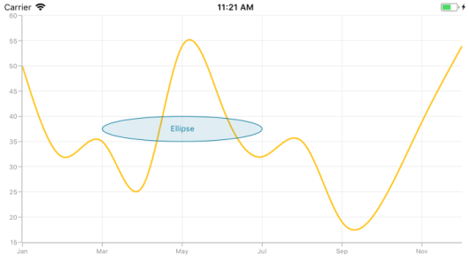

## Positioning the annotation

Annotations can be positioned in plot area based on [`X1`](https://help.syncfusion.com/cr/cref_files/xamarin-ios/Syncfusion.SFChart.iOS~Syncfusion.SfChart.iOS.ChartAnnotation~X1.html) and [`Y1`](https://help.syncfusion.com/cr/cref_files/xamarin-ios/Syncfusion.SFChart.iOS~Syncfusion.SfChart.iOS.ChartAnnotation~Y1.html) properties. For shape annotations, specify [`X2`](https://help.syncfusion.com/cr/cref_files/xamarin-ios/Syncfusion.SFChart.iOS~Syncfusion.SfChart.iOS.ShapeAnnotation~X2.html) and [`Y2`](https://help.syncfusion.com/cr/cref_files/xamarin-ios/Syncfusion.SFChart.iOS~Syncfusion.SfChart.iOS.ShapeAnnotation~Y2.html) properties, if needed. The X and Y values can be specified with axis units or pixel units, and these can be identified by using the [`CoordinateUnit`](https://help.syncfusion.com/cr/cref_files/xamarin-ios/Syncfusion.SFChart.iOS~Syncfusion.SfChart.iOS.ChartAnnotation~CoordinateUnit.html) property.

### Positioning based on CoordinateUnit as axis

To position the annotation based on axis, set the [`X1`](https://help.syncfusion.com/cr/cref_files/xamarin-ios/Syncfusion.SFChart.iOS~Syncfusion.SfChart.iOS.ChartAnnotation~X1.html) and [`Y1`](https://help.syncfusion.com/cr/cref_files/xamarin-ios/Syncfusion.SFChart.iOS~Syncfusion.SfChart.iOS.ChartAnnotation~Y1.html), [`X2`](https://help.syncfusion.com/cr/cref_files/xamarin-ios/Syncfusion.SFChart.iOS~Syncfusion.SfChart.iOS.ShapeAnnotation~X2.html) and [`Y2`](https://help.syncfusion.com/cr/cref_files/xamarin-ios/Syncfusion.SFChart.iOS~Syncfusion.SfChart.iOS.ShapeAnnotation~Y2.html) properties based on axis range values, if needed, set the [`CoordinateUnit`](https://help.syncfusion.com/cr/cref_files/xamarin-ios/Syncfusion.SFChart.iOS~Syncfusion.SfChart.iOS.ChartAnnotation~CoordinateUnit.html) value as [`Axis`](https://help.syncfusion.com/cr/cref_files/xamarin-ios/Syncfusion.SFChart.iOS~Syncfusion.SfChart.iOS.ChartCoordinateUnit.html).



SFChart chart = new SFChart();
...

RectangleAnnotation annotation = new RectangleAnnotation()
{
    X1 = new NSNumber(4),

    Y1 = 40,

    X2 = new NSNumber(8),

    Y2 = 45,

    Text = "Axis Value",

    CoordinateUnit = ChartCoordinateUnit.Axis
};

chart.Annotations.Add(annotation);



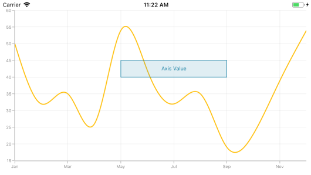

### Positioning based on CoordinateUnit as pixels

To position the annotation based on the pixel values, set the [`CoordinateUnit`](https://help.syncfusion.com/cr/cref_files/xamarin-ios/Syncfusion.SFChart.iOS~Syncfusion.SfChart.iOS.ChartAnnotation~CoordinateUnit.html) as `Pixels`, and the pixel values in [`X1`](https://help.syncfusion.com/cr/cref_files/xamarin-ios/Syncfusion.SFChart.iOS~Syncfusion.SfChart.iOS.ChartAnnotation~X1.html) and [`Y1`](https://help.syncfusion.com/cr/cref_files/xamarin-ios/Syncfusion.SFChart.iOS~Syncfusion.SfChart.iOS.ChartAnnotation~Y1.html), [`X2`](https://help.syncfusion.com/cr/cref_files/xamarin-ios/Syncfusion.SFChart.iOS~Syncfusion.SfChart.iOS.ShapeAnnotation~X2.html) and [`Y2`](https://help.syncfusion.com/cr/cref_files/xamarin-ios/Syncfusion.SFChart.iOS~Syncfusion.SfChart.iOS.ShapeAnnotation~Y2.html) properties of annotation are shown in the below code snippet,



SFChart chart = new SFChart();
...

RectangleAnnotation annotation = new RectangleAnnotation()
{
    X1 = new NSNumber(1),

    Y1 = 1,

    X2 = new NSNumber(150),

    Y2 = 150,

    Text = "Pixels",

    CoordinateUnit = ChartCoordinateUnit.Pixels
};

chart.Annotations.Add(annotation);



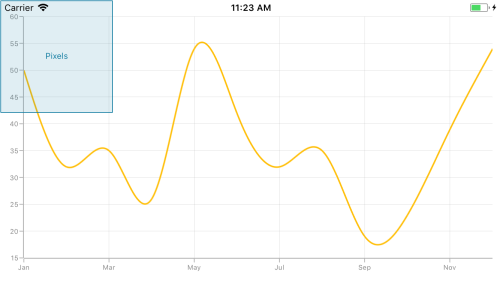

## Adding annotation for multiple axes

When there are multiple axes, annotation also can be added for a particular axis by using the [`XAxisName`](https://help.syncfusion.com/cr/cref_files/xamarin-ios/Syncfusion.SFChart.iOS~Syncfusion.SfChart.iOS.ChartAnnotation~XAxisName.html) and [`YAxisName`](https://help.syncfusion.com/cr/cref_files/xamarin-ios/Syncfusion.SFChart.iOS~Syncfusion.SfChart.iOS.ChartAnnotation~YAxisName.html) properties and it is shown in the below code snippet,



SFChart chart = new SFChart();
...

EllipseAnnotation annotation = new EllipseAnnotation()
{
    X1 = new NSNumber(4),

    Y1 = 30,

    X2 = new NSNumber(8),

    Y2 = 35,

    YAxisName = "YAxis"
};

chart.Annotations.Add(annotation);

SFSplineSeries series = new SFSplineSeries();

series.ItemsSource = new ViewModel().Data;

series.XBindingPath = "Name";

series.YBindingPath = "Value";

series.YAxis = new SFNumericalAxis()
{ 
    Name = new NSString("YAxis"),

    OpposedPosition = true,
};

chart.Series.Add(series); 



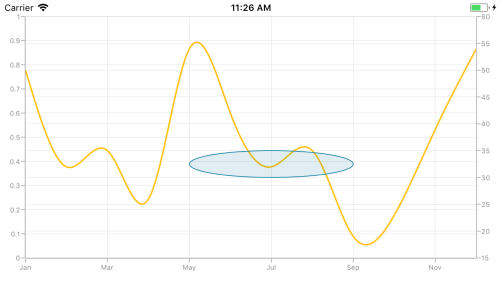

## Text annotation

The [`TextAnnotation`](https://help.syncfusion.com/cr/cref_files/xamarin-ios/Syncfusion.SFChart.iOS~Syncfusion.SfChart.iOS.TextAnnotation.html) is used to add simple text with the help of ['Text`](https://help.syncfusion.com/cr/cref_files/xamarin-ios/Syncfusion.SFChart.iOS~Syncfusion.SfChart.iOS.TextAnnotation~Text.html) property in specific points over the chart area.


SFChart chart = new SFChart();
...

TextAnnotation annotation = new TextAnnotation()
{
    X1 = 7,

    Y1 = 35,

    Text = "August"
};

chart.Annotations.Add(annotation); 



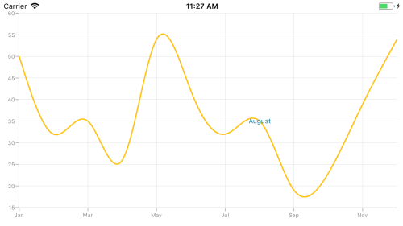

### Customizing text annotation

The [`TextAnnotation`](https://help.syncfusion.com/cr/cref_files/xamarin-ios/Syncfusion.SFChart.iOS~Syncfusion.SfChart.iOS.TextAnnotation.html) can be customized by using the [`LabelStyle`](https://help.syncfusion.com/cr/cref_files/xamarin-ios/Syncfusion.SFChart.iOS~Syncfusion.SfChart.iOS.TextAnnotation~LabelStyle.html) property. The following properties are used to customize the text:

* [`Color`](https://help.syncfusion.com/cr/cref_files/xamarin-ios/Syncfusion.SFChart.iOS~Syncfusion.SfChart.iOS.SFLabelStyle~Color.html) – Used to change the color of the text.
* [`BackgroundColor`](https://help.syncfusion.com/cr/cref_files/xamarin-ios/Syncfusion.SFChart.iOS~Syncfusion.SfChart.iOS.SFLabelStyle~BackgroundColor.html) – Used to change the background color of the text.
* [`BorderColor`](https://help.syncfusion.com/cr/cref_files/xamarin-ios/Syncfusion.SFChart.iOS~Syncfusion.SfChart.iOS.SFLabelStyle~BorderColor.html) – Used to change the border color.
* [`BorderWidth`](https://help.syncfusion.com/cr/cref_files/xamarin-ios/Syncfusion.SFChart.iOS~Syncfusion.SfChart.iOS.SFLabelStyle~BorderWidth.html) – Used to change the width of the border.
* [`Font`](https://help.syncfusion.com/cr/cref_files/xamarin-ios/Syncfusion.SFChart.iOS~Syncfusion.SfChart.iOS.SFLabelStyle~Font.html) – Used to change the text size, family, and weight.
* [`Margin`](https://help.syncfusion.com/cr/cref_files/xamarin-ios/Syncfusion.SFChart.iOS~Syncfusion.SfChart.iOS.SFLabelStyle~Margin.html) - Used to change the margin of the text.
* [`HorizontalLabelAlignment`](https://help.syncfusion.com/cr/cref_files/xamarin-ios/Syncfusion.SFChart.iOS~Syncfusion.SfChart.iOS.ChartAnnotationLabelStyle~HorizontalLabelAlignment.html) – Used to align the text horizontally([`Center`](https://help.syncfusion.com/cr/cref_files/xamarin-ios/Syncfusion.SFChart.iOS~Syncfusion.SfChart.iOS.ChartAnnotationAlignment.html),[`Start`](https://help.syncfusion.com/cr/cref_files/xamarin-ios/Syncfusion.SFChart.iOS~Syncfusion.SfChart.iOS.ChartAnnotationAlignment.html),[`End`](https://help.syncfusion.com/cr/cref_files/xamarin-ios/Syncfusion.SFChart.iOS~Syncfusion.SfChart.iOS.ChartAnnotationAlignment.html)).
* [`VerticalLabelAlignment`](https://help.syncfusion.com/cr/cref_files/xamarin-ios/Syncfusion.SFChart.iOS~Syncfusion.SfChart.iOS.ChartAnnotationLabelStyle~VerticalLabelAlignment.html) – Used to align the text vertically([`Center`](https://help.syncfusion.com/cr/cref_files/xamarin-ios/Syncfusion.SFChart.iOS~Syncfusion.SfChart.iOS.ChartAnnotationAlignment.html),[`Start`](https://help.syncfusion.com/cr/cref_files/xamarin-ios/Syncfusion.SFChart.iOS~Syncfusion.SfChart.iOS.ChartAnnotationAlignment.html),[`End`](https://help.syncfusion.com/cr/cref_files/xamarin-ios/Syncfusion.SFChart.iOS~Syncfusion.SfChart.iOS.ChartAnnotationAlignment.html)).



SFChart chart = new SFChart();
...

TextAnnotation annotation = new TextAnnotation()
{
    X1 = 7,

    Y1 = 35,

    Text = "August"
};

annotation.LabelStyle.Margin = new UIEdgeInsets(5, 5, 5, 5);

annotation.LabelStyle.Font = UIFont.ItalicSystemFontOfSize(16);

annotation.LabelStyle.BorderColor = UIColor.Red;

annotation.LabelStyle.BorderWidth = 2;

annotation.LabelStyle.BackgroundColor = UIColor.FromRGB(00,80,80);

annotation.LabelStyle.Color = UIColor.White;

annotation.LabelStyle.VerticalLabelAlignment = ChartAnnotationAlignment.Start;

chart.Annotations.Add(annotation);



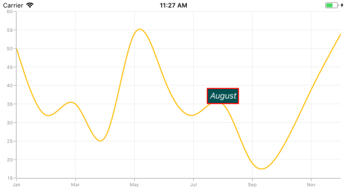

## Shape annotation

The [`ShapeAnnotation`](https://help.syncfusion.com/cr/cref_files/xamarin-ios/Syncfusion.SFChart.iOS~Syncfusion.SfChart.iOS.ShapeAnnotation.html) allows you to add annotations in the form of shapes such as rectangle, ellipse, horizontal line, vertical line, etc., at the specific area of interest in the chart area.

* [`RectangleAnnotation`](https://help.syncfusion.com/cr/cref_files/xamarin-ios/Syncfusion.SFChart.iOS~Syncfusion.SfChart.iOS.RectangleAnnotation.html) – Used to draw a rectangle over the chart area.
* [`EllipseAnnotation`](https://help.syncfusion.com/cr/cref_files/xamarin-ios/Syncfusion.SFChart.iOS~Syncfusion.SfChart.iOS.EllipseAnnotation.html) – Used to draw a circle or an ellipse over the chart area.
* [`LineAnnotation`](https://help.syncfusion.com/cr/cref_files/xamarin-ios/Syncfusion.SFChart.iOS~Syncfusion.SfChart.iOS.LineAnnotation.html) – Used to draw a line over the chart area.
* [`VerticalLineAnnotation`](https://help.syncfusion.com/cr/cref_files/xamarin-ios/Syncfusion.SFChart.iOS~Syncfusion.SfChart.iOS.VerticalLineAnnotation.html) – Used to draw a vertical line across the chart area.
* [`HorizontalLineAnnotation`](https://help.syncfusion.com/cr/cref_files/xamarin-ios/Syncfusion.SFChart.iOS~Syncfusion.SfChart.iOS.HorizontalLineAnnotation.html) – Used to draw a horizontal line across the chart area.

The following APIs are commonly used in all [`ShapeAnnotation`](https://help.syncfusion.com/cr/cref_files/xamarin-ios/Syncfusion.SFChart.iOS~Syncfusion.SfChart.iOS.ShapeAnnotation.html):

* [`X2`](https://help.syncfusion.com/cr/cref_files/xamarin-ios/Syncfusion.SFChart.iOS~Syncfusion.SfChart.iOS.ShapeAnnotation~X2.html) – Represents the X2 coordinate of the shape annotation.
* [`Y2`](https://help.syncfusion.com/cr/cref_files/xamarin-ios/Syncfusion.SFChart.iOS~Syncfusion.SfChart.iOS.ShapeAnnotation~Y2.html) – Represents the Y2 coordinate of the shape annotation.
* [`FillColor`](https://help.syncfusion.com/cr/cref_files/xamarin-ios/Syncfusion.SFChart.iOS~Syncfusion.SfChart.iOS.ShapeAnnotation~FillColor.html) – Represents the inside background color of the shape annotation.
* [`StrokeColor`](https://help.syncfusion.com/cr/cref_files/xamarin-ios/Syncfusion.SFChart.iOS~Syncfusion.SfChart.iOS.ShapeAnnotation~StrokeColor.html) – Represents the stroke color of the shape annotation.
* [`StrokeWidth`](https://help.syncfusion.com/cr/cref_files/xamarin-ios/Syncfusion.SFChart.iOS~Syncfusion.SfChart.iOS.ShapeAnnotation~StrokeWidth.html) – Represents the stroke width of the shape annotation.
* [`StrokeDashArray`](https://help.syncfusion.com/cr/cref_files/xamarin-ios/Syncfusion.SFChart.iOS~Syncfusion.SfChart.iOS.ShapeAnnotation~StrokeDashArray.html) – Represents the stroke dashes of the shape annotation.
* [`Text`](https://help.syncfusion.com/cr/cref_files/xamarin-ios/Syncfusion.SFChart.iOS~Syncfusion.SfChart.iOS.ShapeAnnotation~Text.html) – Represents the annotation text of the shape annotation.
* [`LabelStyle`](https://help.syncfusion.com/cr/cref_files/xamarin-ios/Syncfusion.SFChart.iOS~Syncfusion.SfChart.iOS.ShapeAnnotation~LabelStyle.html) – Represents the style for customizing the annotation text of shape annotation.

### Rectangle annotation

The [`RectangleAnnotation`](https://help.syncfusion.com/cr/cref_files/xamarin-ios/Syncfusion.SFChart.iOS~Syncfusion.SfChart.iOS.RectangleAnnotation.html) is used to draw a rectangle or a square in specific points over the chart area. You can customize the rounded corners of the rectangle using [`CornerRadius`](https://help.syncfusion.com/cr/cref_files/xamarin-ios/Syncfusion.SFChart.iOS~Syncfusion.SfChart.iOS.RectangleAnnotation~CornerRadius.html) property.



SFChart chart = new SFChart();
...

RectangleAnnotation annotation = new RectangleAnnotation()
{
    X1 = new NSNumber(4),

    Y1 = 20,

    X2 = new NSNumber(6),

    Y2 = 55,
};

chart.Annotations.Add(annotation);



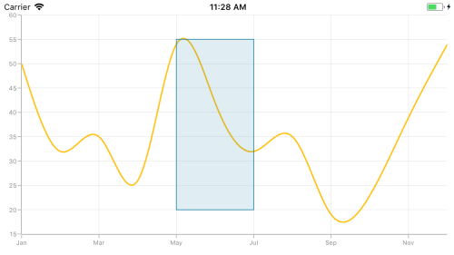

### Ellipse annotation

The [`EllipseAnnotation`](https://help.syncfusion.com/cr/cref_files/xamarin-ios/Syncfusion.SFChart.iOS~Syncfusion.SfChart.iOS.EllipseAnnotation.html) is used to draw an oval or a circle in specific points over the chart area. You can also specify the height and width of [`EllipseAnnotation`](https://help.syncfusion.com/cr/cref_files/xamarin-ios/Syncfusion.SFChart.iOS~Syncfusion.SfChart.iOS.EllipseAnnotation.html) by using the [`Height`](https://help.syncfusion.com/cr/cref_files/xamarin-ios/Syncfusion.SFChart.iOS~Syncfusion.SfChart.iOS.EllipseAnnotation~Height.html) and [`Width`](https://help.syncfusion.com/cr/cref_files/xamarin-ios/Syncfusion.SFChart.iOS~Syncfusion.SfChart.iOS.EllipseAnnotation~Width.html) properties.



SFChart chart = new SFChart();
...

EllipseAnnotation annotation = new EllipseAnnotation()
{
    X1 = new NSNumber(6),

    Y1 = 32,

    Height = 30,

    Width = 30
};

chart.Annotations.Add(annotation);



N> When [`X2`](https://help.syncfusion.com/cr/cref_files/xamarin-ios/Syncfusion.SFChart.iOS~Syncfusion.SfChart.iOS.ShapeAnnotation~X2.html) and [`Y2`](https://help.syncfusion.com/cr/cref_files/xamarin-ios/Syncfusion.SFChart.iOS~Syncfusion.SfChart.iOS.ShapeAnnotation~Y2.html) properties of [`EllipseAnnotation`](https://help.syncfusion.com/cr/cref_files/xamarin-ios/Syncfusion.SFChart.iOS~Syncfusion.SfChart.iOS.EllipseAnnotation.html) are set,  [`Height`](https://help.syncfusion.com/cr/cref_files/xamarin-ios/Syncfusion.SFChart.iOS~Syncfusion.SfChart.iOS.EllipseAnnotation~Height.html) and [`Width`](https://help.syncfusion.com/cr/cref_files/xamarin-ios/Syncfusion.SFChart.iOS~Syncfusion.SfChart.iOS.EllipseAnnotation~Width.html) properties do not work.

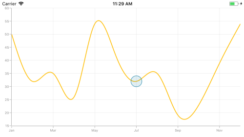

### Line annotation

The [`LineAnnotation`](https://help.syncfusion.com/cr/cref_files/xamarin-ios/Syncfusion.SFChart.iOS~Syncfusion.SfChart.iOS.LineAnnotation.html) is used to draw a line in specific points over the chart area. 



SFChart chart = new SFChart();
...

LineAnnotation annotation = new LineAnnotation()
{
    X1 = new NSNumber(2),

    Y1 = 35,

    X2 = new NSNumber(8),

    Y2 = 45,

    Text = "Line"
};

chart.Annotations.Add(annotation);



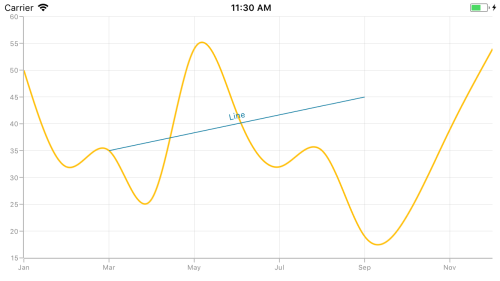

**Adding arrow to line annotation**

To display single headed arrow, set the [`LineCap`](https://help.syncfusion.com/cr/cref_files/xamarin-ios/Syncfusion.SFChart.iOS~Syncfusion.SfChart.iOS.LineAnnotation~LineCap.html) property to [`Arrow`](https://help.syncfusion.com/cr/cref_files/xamarin-ios/Syncfusion.SFChart.iOS~Syncfusion.SfChart.iOS.ChartLineCap.html). The default value of the [`LineCap`](https://help.syncfusion.com/cr/cref_files/xamarin-ios/Syncfusion.SFChart.iOS~Syncfusion.SfChart.iOS.LineAnnotation~LineCap.html) property is [`None`](https://help.syncfusion.com/cr/cref_files/xamarin-ios/Syncfusion.SFChart.iOS~Syncfusion.SfChart.iOS.ChartLineCap.html).



SFChart chart = new SFChart();
...

LineAnnotation annotation = new LineAnnotation()
{
    X1 = new NSNumber(2),

    Y1 = 40,

    X2 = new NSNumber(10),

    Y2 = 40,

    LineCap = ChartLineCap.Arrow
};

chart.Annotations.Add(annotation);



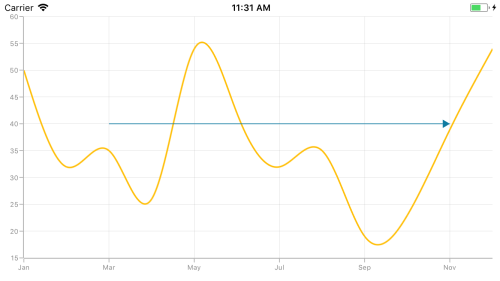

### Vertical and Horizontal line annotations

The [`VerticalLineAnnotation`](https://help.syncfusion.com/cr/cref_files/xamarin-ios/Syncfusion.SFChart.iOS~Syncfusion.SfChart.iOS.VerticalLineAnnotation.html) and [`HorizontalLineAnnotation`](https://help.syncfusion.com/cr/cref_files/xamarin-ios/Syncfusion.SFChart.iOS~Syncfusion.SfChart.iOS.HorizontalLineAnnotation.html) are used to draw vertical and horizontal lines in specific points over the chart area.



SFChart chart = new SFChart();
...

VerticalLineAnnotation vertical = new VerticalLineAnnotation()
{
    X1 = new NSNumber(6),
};

chart.Annotations.Add(vertical);

HorizontalLineAnnotation horizontal = new HorizontalLineAnnotation()
{
    Y1 = 35
};

chart.Annotations.Add(horizontal);



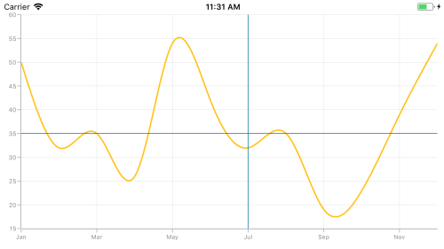

**Displaying axis label for vertical and horizontal line annotations**

The [`VerticalLineAnnotation`](https://help.syncfusion.com/cr/cref_files/xamarin-ios/Syncfusion.SFChart.iOS~Syncfusion.SfChart.iOS.VerticalLineAnnotation.html) and [`HorizontalLineAnnotation`](https://help.syncfusion.com/cr/cref_files/xamarin-ios/Syncfusion.SFChart.iOS~Syncfusion.SfChart.iOS.HorizontalLineAnnotation.html) display the axis labels in which the line is placed. This feature can be enabled by setting the [`ShowAxisLabel`](https://help.syncfusion.com/cr/cref_files/xamarin-ios/Syncfusion.SFChart.iOS~Syncfusion.SfChart.iOS.VerticalLineAnnotation~ShowAxisLabel.html) property to `true` as shown in the below code snippet,



SFChart chart = new SFChart();
...

VerticalLineAnnotation vertical = new VerticalLineAnnotation()
{
    X1 = new NSNumber(6),

    ShowAxisLabel = true
};

chart.Annotations.Add(vertical);

HorizontalLineAnnotation horizontal = new HorizontalLineAnnotation()
{
    Y1 = 35,

    ShowAxisLabel = true,
};

chart.Annotations.Add(horizontal);



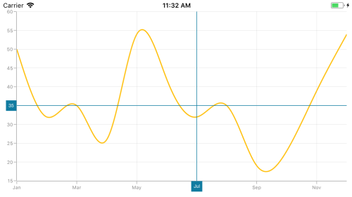

**Customizing axis label**

The default appearance of the axis label also can be customized by using the [`AxisLabelStyle`](https://help.syncfusion.com/cr/cref_files/xamarin-ios/Syncfusion.SFChart.iOS~Syncfusion.SfChart.iOS.VerticalLineAnnotation~AxisLabelStyle.html) property. The following properties are used to customize the axis label:

* [`Color`](https://help.syncfusion.com/cr/cref_files/xamarin-ios/Syncfusion.SFChart.iOS~Syncfusion.SfChart.iOS.SFLabelStyle~Color.html) – Used to change the color of the text.
* [`BackgroundColor`](https://help.syncfusion.com/cr/cref_files/xamarin-ios/Syncfusion.SFChart.iOS~Syncfusion.SfChart.iOS.SFLabelStyle~BackgroundColor.html) – Used to change the background color of the text.
* [`BorderColor`](https://help.syncfusion.com/cr/cref_files/xamarin-ios/Syncfusion.SFChart.iOS~Syncfusion.SfChart.iOS.SFLabelStyle~BorderColor.html) – Used to change the border color.
* [`BorderWidth`](https://help.syncfusion.com/cr/cref_files/xamarin-ios/Syncfusion.SFChart.iOS~Syncfusion.SfChart.iOS.SFLabelStyle~BorderWidth.html) – Used to change the width of the border.
* [`Font`](https://help.syncfusion.com/cr/cref_files/xamarin-ios/Syncfusion.SFChart.iOS~Syncfusion.SfChart.iOS.SFLabelStyle~Font.html) – Used to change text font size, family, and weight.
* [`Margin`](https://help.syncfusion.com/cr/cref_files/xamarin-ios/Syncfusion.SFChart.iOS~Syncfusion.SfChart.iOS.SFLabelStyle~Margin.html) - Used to set the margin for text.



SFChart chart = new SFChart();
...

VerticalLineAnnotation vertical = new VerticalLineAnnotation()
{
    X1 = new NSNumber(6),

    ShowAxisLabel = true,
};

vertical.AxisLabelStyle.Margin = new UIEdgeInsets(5, 5, 5, 5);

vertical.AxisLabelStyle.Font = UIFont.ItalicSystemFontOfSize(12);

vertical.AxisLabelStyle.BorderColor = UIColor.Blue;

vertical.AxisLabelStyle.BorderWidth = 2;

vertical.AxisLabelStyle.BackgroundColor = UIColor.Red;

vertical.AxisLabelStyle.Color = UIColor.White;

chart.Annotations.Add(vertical);

HorizontalLineAnnotation horizontal = new HorizontalLineAnnotation()
{
    Y1 = 35,

    ShowAxisLabel = true
};

horizontal.AxisLabelStyle.Margin = new UIEdgeInsets(5, 5, 5, 5);

horizontal.AxisLabelStyle.Font = UIFont.ItalicSystemFontOfSize(12);

horizontal.AxisLabelStyle.BorderColor = UIColor.Blue;

horizontal.AxisLabelStyle.BorderWidth = 2;

horizontal.AxisLabelStyle.BackgroundColor = UIColor.Red;

horizontal.AxisLabelStyle.Color = UIColor.White;

chart.Annotations.Add(horizontal);



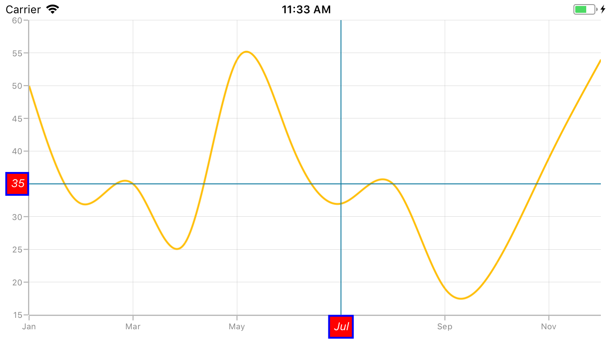

**Adding arrow to vertical and horizontal line annotations**

To display single headed arrow, set the [`LineCap`](https://help.syncfusion.com/cr/cref_files/xamarin-ios/Syncfusion.SFChart.iOS~Syncfusion.SfChart.iOS.LineAnnotation~LineCap.html) property to `Arrow`. The default value of the [`LineCap`](https://help.syncfusion.com/cr/cref_files/xamarin-ios/Syncfusion.SFChart.iOS~Syncfusion.SfChart.iOS.LineAnnotation~LineCap.html) property is `None`.



SFChart chart = new SFChart();
...

VerticalLineAnnotation vertical = new VerticalLineAnnotation()
{
    X1 = new NSNumber(6),

    LineCap = ChartLineCap.Arrow
};

chart.Annotations.Add(vertical);

HorizontalLineAnnotation horizontal = new HorizontalLineAnnotation()
{
    Y1 = 35,

    LineCap = ChartLineCap.Arrow
};

chart.Annotations.Add(horizontal);



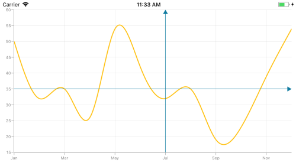

## Adding text in shape annotation 

For all the shape annotations, the text can be displayed by using the [`Text`](https://help.syncfusion.com/cr/cref_files/xamarin-ios/Syncfusion.SFChart.iOS~Syncfusion.SfChart.iOS.ShapeAnnotation~Text.html) property.

### Customizing text in shape annotation

The text in shape annotation also can be customized by using the [`LabelStyle`](https://help.syncfusion.com/cr/cref_files/xamarin-ios/Syncfusion.SFChart.iOS~Syncfusion.SfChart.iOS.ShapeAnnotation~LabelStyle.html) property. The following properties are used to customize the text:

* [`Color`](https://help.syncfusion.com/cr/cref_files/xamarin-ios/Syncfusion.SFChart.iOS~Syncfusion.SfChart.iOS.SFLabelStyle~Color.html) – Used to change the color of the text.
* [`BackgroundColor`](https://help.syncfusion.com/cr/cref_files/xamarin-ios/Syncfusion.SFChart.iOS~Syncfusion.SfChart.iOS.SFLabelStyle~BackgroundColor.html) – Used to change the background color of the text.
* [`BorderColor`](https://help.syncfusion.com/cr/cref_files/xamarin-ios/Syncfusion.SFChart.iOS~Syncfusion.SfChart.iOS.SFLabelStyle~BorderColor.html) – Used to change the border color.
* [`BorderWidth`](https://help.syncfusion.com/cr/cref_files/xamarin-ios/Syncfusion.SFChart.iOS~Syncfusion.SfChart.iOS.SFLabelStyle~BorderWidth.html) – Used to change the width of the border.
* [`Font`](https://help.syncfusion.com/cr/cref_files/xamarin-ios/Syncfusion.SFChart.iOS~Syncfusion.SfChart.iOS.SFLabelStyle~Font.html) – Used to change the text size, family, and weight.
* [`Margin`](https://help.syncfusion.com/cr/cref_files/xamarin-ios/Syncfusion.SFChart.iOS~Syncfusion.SfChart.iOS.SFLabelStyle~Margin.html) - Used to change the margin of the text.
* [`HorizontalLabelAlignment`](https://help.syncfusion.com/cr/cref_files/xamarin-ios/Syncfusion.SFChart.iOS~Syncfusion.SfChart.iOS.ChartAnnotationLabelStyle~HorizontalLabelAlignment.html) – Used to align the text horizontally.
* [`VerticalLabelAlignment`](https://help.syncfusion.com/cr/cref_files/xamarin-ios/Syncfusion.SFChart.iOS~Syncfusion.SfChart.iOS.ChartAnnotationLabelStyle~VerticalLabelAlignment.html) – Used to align the text vertically.



SFChart chart = new SFChart();
...

EllipseAnnotation annotation = new EllipseAnnotation()
{
    X1 = 2,

    Y1 = 30,

    X2 = 6,

    Y2 = 35,

    Text = "Ellipse"
};

annotation.LabelStyle.Margin = new UIEdgeInsets(5, 5, 5, 5);

annotation.LabelStyle.Font = UIFont.ItalicSystemFontOfSize(16);

annotation.LabelStyle.BorderColor = UIColor.Red;

annotation.LabelStyle.BorderWidth = 2;

annotation.LabelStyle.BackgroundColor = UIColor.Blue;

annotation.LabelStyle.Color = UIColor.White;

chart.Annotations.Add(annotation);



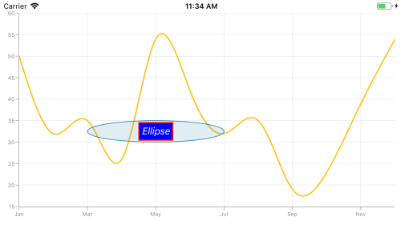

## View annotation

The [`ViewAnnotation`](https://help.syncfusion.com/cr/cref_files/xamarin-ios/Syncfusion.SFChart.iOS~Syncfusion.SfChart.iOS.ViewAnnotation.html) allows you to add annotations in the form of own custom view with the help of [`View`](https://help.syncfusion.com/cr/cref_files/xamarin-ios/Syncfusion.SFChart.iOS~Syncfusion.SfChart.iOS.ViewAnnotation~View.html) property at the specific area of interest in the chart area. The [`ViewAnnotation`](https://help.syncfusion.com/cr/cref_files/xamarin-ios/Syncfusion.SFChart.iOS~Syncfusion.SfChart.iOS.ViewAnnotation.html) also can be aligned by using the [`VerticalAlignment`](https://help.syncfusion.com/cr/cref_files/xamarin-ios/Syncfusion.SFChart.iOS~Syncfusion.SfChart.iOS.ViewAnnotation~VerticalAlignment.html) and [`HorizontalAlignment`](https://help.syncfusion.com/cr/cref_files/xamarin-ios/Syncfusion.SFChart.iOS~Syncfusion.SfChart.iOS.ViewAnnotation~HorizontalAlignment.html) properties.



SFChart chart = new SFChart();
...

ViewAnnotation annotation = new ViewAnnotation()
{
    X1 = 3,

    Y1 = 12,

    VerticalAlignment = ChartAnnotationAlignment.Start
};

UIImageView imageView = new UIImageView();

imageView.Frame = new CoreGraphics.CGRect(0,0,70,70);

imageView.Image = UIImage.FromFile("Graduate.png");

annotation.View = imageView;

chart.Annotations.Add(annotation);



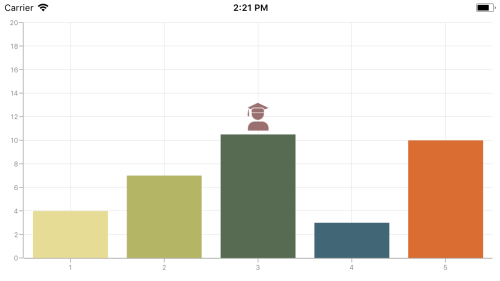

## Annotation Visibility

The [`Visible`]() property of [`ChartAnnotation`](https://help.syncfusion.com/cr/cref_files/xamarin-ios/Syncfusion.SFChart.iOS~Syncfusion.SfChart.iOS.ChartAnnotation.html) is used to control the visibility of particular annotation. Default value of Visibility property is true.

 

VerticalLineAnnotation verticalLineAnnotation = new VerticalLineAnnotation()
{
    Visible = false
};

chart.ChartAnnotations.Add(verticalLineAnnotation);



## Event

**AnnotationClicked**

The [`AnnotationClicked`](https://help.syncfusion.com/cr/cref_files/xamarin-ios/Syncfusion.SFChart.iOS~Syncfusion.SfChart.iOS.ChartBase~AnnotationClicked_EV.html) event is triggered when the user has clicked the annotation. The argument contains the following information.

* [`Annotation`](https://help.syncfusion.com/cr/cref_files/xamarin-ios/Syncfusion.SFChart.iOS~Syncfusion.SfChart.iOS.ChartAnnotationClickedEventArgs~Annotation.html) – used to get the instance of annotation which is clicked.
* [`X`](https://help.syncfusion.com/cr/cref_files/xamarin-ios/Syncfusion.SFChart.iOS~Syncfusion.SfChart.iOS.ChartAnnotationClickedEventArgs~X.html) – used to get the x position of touch point on annotation.
* [`Y`](https://help.syncfusion.com/cr/cref_files/xamarin-ios/Syncfusion.SFChart.iOS~Syncfusion.SfChart.iOS.ChartAnnotationClickedEventArgs~Y.html) – used to get the y position of touch point on annotation..

## Get the touch position in annotation

Following are the override methods that are available in annotation to send the information about touch interactions.

* [`TouchBegan`]() – occurs when touch down inside the annotation.
* [`TouchMove`]() – occurs while moving the finger inside the annotation.
* [`TouchCancelled`]() – called when touch cancelled on the annotation area.
* [`TouchEnded`]() – occurs when touch up inside the annotation. 



public class TextAnnotationExt : TextAnnotation
{
   protected override void TouchBegan(NSSet touches, UIEvent uiEvent)
   {
      base.TouchBegan(touches, uiEvent);
   }

   protected override void TouchMove(NSSet touches, UIEvent uiEvent)
   {
      base.TouchMove(touches, uiEvent);
   }

   protected override void TouchCancelled(NSSet touches, UIEvent uiEvent)
   {
      base.TouchCancelled(touches, uiEvent);
   }

   protected override void TouchEnded(NSSet touches, UIEvent uiEvent)
   {
      base.TouchEnded(touches, uiEvent);
   }
}



## Methods

### Adding separate view for annotation 

The [`ChartAnnotationView`](https://help.syncfusion.com/cr/cref_files/xamarin-ios/Syncfusion.SFChart.iOS~Syncfusion.SfChart.iOS.ChartAnnotationView.html) is used to render [`Annotation`](https://help.syncfusion.com/cr/cref_files/xamarin-ios/Syncfusion.SFChart.iOS~Syncfusion.SfChart.iOS.ChartAnnotationView~Annotation.html) using the GetView method. The following code sample demonstrates how to add a separate view for annotation. 

 
[C#]

 public class CustomEllipseAnnotation : EllipseAnnotation
        {
		    ChartAnnotationView view = new ChartAnnotationView();
            protected override ChartAnnotationView GetView()
            {
                return view;

            }
        }

