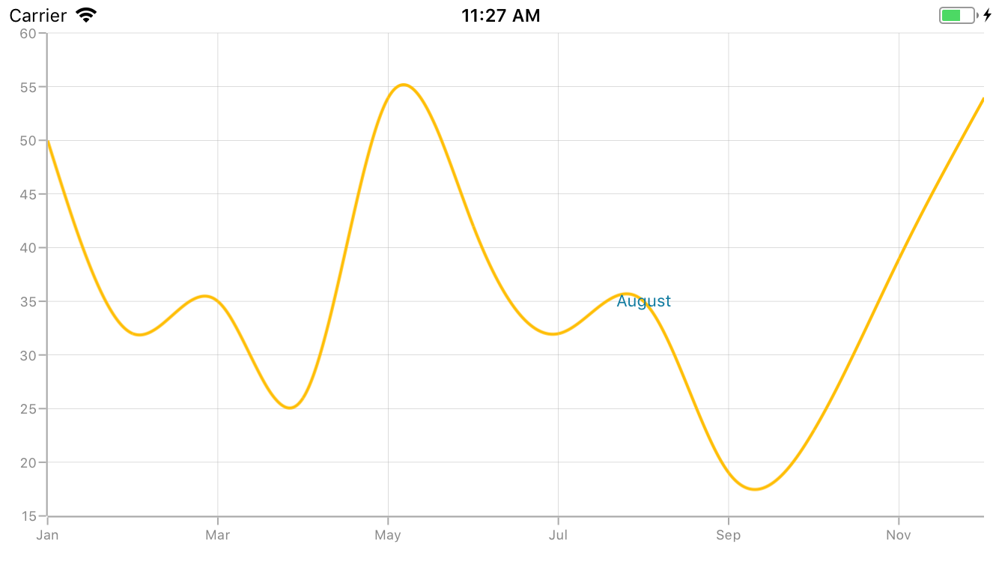
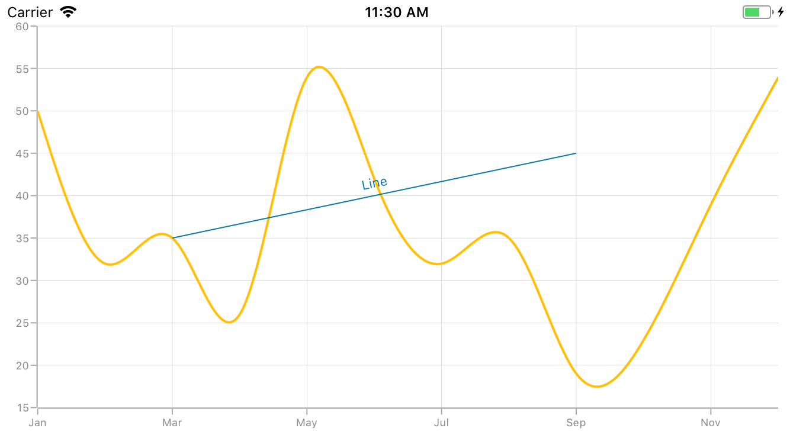
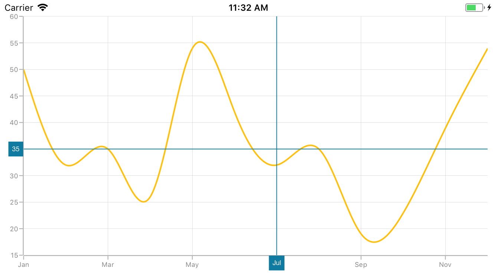
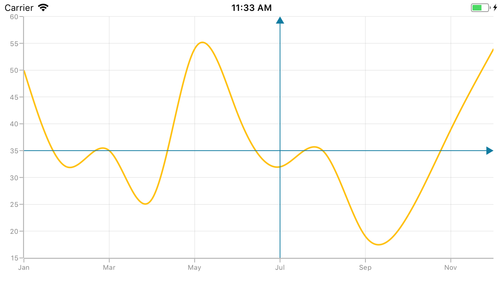

# Chart Annotation

[`SfChart`](https://help.syncfusion.com/cr/cref_files/xamarin-ios/sfchart/Syncfusion.SFChart.iOS~Syncfusion.SfChart.iOS.SFChart.html) supports Annotations which allows you to mark the specific area of interest in the chart area. You can add text, images, and custom views; drawing custom shapes also can be done by using Annotations.

The following annotations are supported in [`SfChart`](https://help.syncfusion.com/cr/cref_files/xamarin-ios/sfchart/Syncfusion.SFChart.iOS~Syncfusion.SfChart.iOS.SFChart.html)

* Text Annotation
* Shape Annotation
* View Annotation

## Adding Annotation

You can create an instance for any type of Annotation; it can be added to [`Annotations`](https://help.syncfusion.com/cr/cref_files/xamarin-ios/sfchart/Syncfusion.SFChart.iOS~Syncfusion.SfChart.iOS.ChartBase~Annotations.html) collection. Here for instance, the [`EllipseAnnotation`](https://help.syncfusion.com/cr/cref_files/xamarin-ios/sfchart/Syncfusion.SFChart.iOS~Syncfusion.SfChart.iOS.EllipseAnnotation.html) is added.



SFChart chart = new SFChart();
...

EllipseAnnotation annotation = new EllipseAnnotation()
{
    X1 = new NSNumber(2),

    Y1 = 35,

    X2 = new NSNumber(6),

    Y2 = 40,

    Text = "Ellipse"
};

chart.Annotations.Add(annotation);



## Positioning the Annotation

Annotations can be positioned in plot area based on `X1` and `Y1` properties. For shape annotations, specify `X2` and `Y2` properties, if needed. These X and Y values can be specified with axis units or pixel units, and this can be identified by using [`CoordinateUnit`](https://help.syncfusion.com/cr/cref_files/xamarin-ios/sfchart/Syncfusion.SFChart.iOS~Syncfusion.SfChart.iOS.ChartAnnotation~CoordinateUnit.html) property.

### Positioning based on CoordinateUnit as Axis

To position based on axis, set the `X1` and `Y1`, `X2` and `Y2` properties based on axis range values, if needed; set [`CoordinateUnit`](https://help.syncfusion.com/cr/cref_files/xamarin-ios/sfchart/Syncfusion.SFChart.iOS~Syncfusion.SfChart.iOS.ChartAnnotation~CoordinateUnit.html) value as `Axis`.



SFChart chart = new SFChart();
...

RectangleAnnotation annotation = new RectangleAnnotation()
{
    X1 = new NSNumber(4),

    Y1 = 40,

    X2 = new NSNumber(8),

    Y2 = 45,

    Text = "Axis Value",

    CoordinateUnit = ChartCoordinateUnit.Axis
};

chart.Annotations.Add(annotation);



### Positioning based on CoordinateUnit as Pixels

To position based on the pixel values, set the [`CoordinateUnit`](https://help.syncfusion.com/cr/cref_files/xamarin-ios/sfchart/Syncfusion.SFChart.iOS~Syncfusion.SfChart.iOS.ChartAnnotation~CoordinateUnit.html) as `Pixels`, and the pixel values in `X1` and `Y1`, `X2` and `Y2` properties of Annotation are shown in the below code snippet,



SFChart chart = new SFChart();
...

RectangleAnnotation annotation = new RectangleAnnotation()
{
    X1 = new NSNumber(1),

    Y1 = 1,

    X2 = new NSNumber(150),

    Y2 = 150,

    Text = "Pixels",

    CoordinateUnit = ChartCoordinateUnit.Pixels
};

chart.Annotations.Add(annotation);



## Adding Annotation for Multiple Axes

When there are multiple axes, annotation also can be added for a particular axis by using [`XAxisName`](https://help.syncfusion.com/cr/cref_files/xamarin-ios/sfchart/Syncfusion.SFChart.iOS~Syncfusion.SfChart.iOS.ChartAnnotation~XAxisName.html) and [`YAxisName`](https://help.syncfusion.com/cr/cref_files/xamarin-ios/sfchart/Syncfusion.SFChart.iOS~Syncfusion.SfChart.iOS.ChartAnnotation~XAxisName.html) properties; it is shown in the below code snippet,



SFChart chart = new SFChart();
...

EllipseAnnotation annotation = new EllipseAnnotation()
{
    X1 = new NSNumber(4),

    Y1 = 30,

    X2 = new NSNumber(8),

    Y2 = 35,

    YAxisName = "YAxis"
};

chart.Annotations.Add(annotation);

SFSplineSeries series = new SFSplineSeries();

series.ItemsSource = new ViewModel().Data;

series.XBindingPath = "Name";

series.YBindingPath = "Value";

series.YAxis = new SFNumericalAxis()
{ 
    Name = new NSString("YAxis"),

    OpposedPosition = true,
};

chart.Series.Add(series); 



## Text Annotation

[`TextAnnotation`](https://help.syncfusion.com/cr/cref_files/xamarin-ios/sfchart/Syncfusion.SFChart.iOS~Syncfusion.SfChart.iOS.TextAnnotation.html) is used to add simple text in specific points over the chart area.



SFChart chart = new SFChart();
...

TextAnnotation annotation = new TextAnnotation()
{
    X1 = 7,

    Y1 = 35,

    Text = "August"
};

chart.Annotations.Add(annotation); 



### Customizing Text Annotation

The [`TextAnnotation`](https://help.syncfusion.com/cr/cref_files/xamarin-ios/sfchart/Syncfusion.SFChart.iOS~Syncfusion.SfChart.iOS.TextAnnotation.html) can be customized by using [`LabelStyle`](https://help.syncfusion.com/cr/cref_files/xamarin-ios/sfchart/Syncfusion.SFChart.iOS~Syncfusion.SfChart.iOS.TextAnnotation~LabelStyle.html) property. Following properties are used to customize the text:

* [`Color`](https://help.syncfusion.com/cr/cref_files/xamarin-ios/sfchart/Syncfusion.SFChart.iOS~Syncfusion.SfChart.iOS.SFLabelStyle~Color.html) – Used to change the color of the text.
* [`BackgroundColor`](https://help.syncfusion.com/cr/cref_files/xamarin-ios/sfchart/Syncfusion.SFChart.iOS~Syncfusion.SfChart.iOS.SFLabelStyle~BackgroundColor.html) – Used to change the text background color.
* [`BorderColor`](https://help.syncfusion.com/cr/cref_files/xamarin-ios/sfchart/Syncfusion.SFChart.iOS~Syncfusion.SfChart.iOS.SFLabelStyle~BorderColor.html) – Used to change the border color.
* [`BorderWidth`](https://help.syncfusion.com/cr/cref_files/xamarin-ios/sfchart/Syncfusion.SFChart.iOS~Syncfusion.SfChart.iOS.SFLabelStyle~BorderWidth.html) – Used to change the width of the border.
* [`Font`](https://help.syncfusion.com/cr/cref_files/xamarin-ios/sfchart/Syncfusion.SFChart.iOS~Syncfusion.SfChart.iOS.SFLabelStyle~Font.html) – Used to change the text size, family, and weight.
* [`Margin`](https://help.syncfusion.com/cr/cref_files/xamarin-ios/sfchart/Syncfusion.SFChart.iOS~Syncfusion.SfChart.iOS.SFLabelStyle~Margin.html) - Used to change the margin of the text.
* [`HorizontalLabelAlignment`](https://help.syncfusion.com/cr/cref_files/xamarin-ios/sfchart/Syncfusion.SFChart.iOS~Syncfusion.SfChart.iOS.ChartAnnotationLabelStyle~HorizontalLabelAlignment.html) – Used to align the text horizontally.
* [`VerticalLabelAlignment`](https://help.syncfusion.com/cr/cref_files/xamarin-ios/sfchart/Syncfusion.SFChart.iOS~Syncfusion.SfChart.iOS.ChartAnnotationLabelStyle~VerticalLabelAlignment.html) – Used to align the text vertically.



SFChart chart = new SFChart();
...

TextAnnotation annotation = new TextAnnotation()
{
    X1 = 7,

    Y1 = 35,

    Text = "August"
};

annotation.LabelStyle.Margin = new UIEdgeInsets(5, 5, 5, 5);

annotation.LabelStyle.Font = UIFont.ItalicSystemFontOfSize(16);

annotation.LabelStyle.BorderColor = UIColor.Red;

annotation.LabelStyle.BorderWidth = 2;

annotation.LabelStyle.BackgroundColor = UIColor.FromRGB(00,80,80);

annotation.LabelStyle.Color = UIColor.White;

annotation.LabelStyle.VerticalLabelAlignment = ChartAnnotationAlignment.Start;

chart.Annotations.Add(annotation);



## Shape Annotation

[`ShapeAnnotation`](https://help.syncfusion.com/cr/cref_files/xamarin-ios/sfchart/Syncfusion.SFChart.iOS~Syncfusion.SfChart.iOS.ShapeAnnotation.html) allows you to add annotations in the form of shapes such as rectangle, ellipse, horizontal line, vertical line, etc., at the specific area of interest in the chart area.

* [`RectangleAnnotation`](https://help.syncfusion.com/cr/cref_files/xamarin-ios/sfchart/Syncfusion.SFChart.iOS~Syncfusion.SfChart.iOS.RectangleAnnotation.html) – Used to draw a rectangle over the chart area.
* [`EllipseAnnotation`](https://help.syncfusion.com/cr/cref_files/xamarin-ios/sfchart/Syncfusion.SFChart.iOS~Syncfusion.SfChart.iOS.EllipseAnnotation.html) – Used to draw a circle or an ellipse over the chart area.
* [`LineAnnotation`](https://help.syncfusion.com/cr/cref_files/xamarin-ios/sfchart/Syncfusion.SFChart.iOS~Syncfusion.SfChart.iOS.LineAnnotation.html) – Used to draw a line over the chart area.
* [`VerticalLineAnnotation`](https://help.syncfusion.com/cr/cref_files/xamarin-ios/sfchart/Syncfusion.SFChart.iOS~Syncfusion.SfChart.iOS.VerticalLineAnnotation.html) – Used to draw a vertical line across the chart area.
* [`HorizontalLineAnnotation`](https://help.syncfusion.com/cr/cref_files/xamarin-ios/sfchart/Syncfusion.SFChart.iOS~Syncfusion.SfChart.iOS.HorizontalLineAnnotation.html) – Used to draw a horizontal line across the chart area.

The following API’s are commonly used in all [`ShapeAnnotation`](https://help.syncfusion.com/cr/cref_files/xamarin-ios/sfchart/Syncfusion.SFChart.iOS~Syncfusion.SfChart.iOS.ShapeAnnotation.html):

* [`X2`](https://help.syncfusion.com/cr/cref_files/xamarin-ios/sfchart/Syncfusion.SFChart.iOS~Syncfusion.SfChart.iOS.ShapeAnnotation~X2.html) – Represents the X2 coordinate of the Shape Annotation.
* [`Y2`](https://help.syncfusion.com/cr/cref_files/xamarin-ios/sfchart/Syncfusion.SFChart.iOS~Syncfusion.SfChart.iOS.ShapeAnnotation~Y2.html) – Represents the Y2 coordinate of the Shape Annotation.
* [`FillColor`](https://help.syncfusion.com/cr/cref_files/xamarin-ios/sfchart/Syncfusion.SFChart.iOS~Syncfusion.SfChart.iOS.ShapeAnnotation~FillColor.html) – Represents the background color inside of the Shape Annotation.
* [`StrokeColor`](https://help.syncfusion.com/cr/cref_files/xamarin-ios/sfchart/Syncfusion.SFChart.iOS~Syncfusion.SfChart.iOS.ShapeAnnotation~StrokeColor.html) – Represents the stroke color of the Shape Annotation.
* [`StrokeWidth`](https://help.syncfusion.com/cr/cref_files/xamarin-ios/sfchart/Syncfusion.SFChart.iOS~Syncfusion.SfChart.iOS.ShapeAnnotation~StrokeWidth.html) – Represents the stroke width of the Shape Annotation.
* [`StrokeDashArray`](https://help.syncfusion.com/cr/cref_files/xamarin-ios/sfchart/Syncfusion.SFChart.iOS~Syncfusion.SfChart.iOS.ShapeAnnotation~StrokeDashArray.html) – Represents the stroke dashes of the Shape Annotation.
* [`Text`](https://help.syncfusion.com/cr/cref_files/xamarin-ios/sfchart/Syncfusion.SFChart.iOS~Syncfusion.SfChart.iOS.ShapeAnnotation~Text.html) – Represents the annotation text of the Shape Annotation.
* [`LabelStyle`](https://help.syncfusion.com/cr/cref_files/xamarin-ios/sfchart/Syncfusion.SFChart.iOS~Syncfusion.SfChart.iOS.ShapeAnnotation~LabelStyle.html) – Represents the style for customizing the annotation text of Shape Annotation.

### Rectangle Annotation

[`RectangleAnnotation`](https://help.syncfusion.com/cr/cref_files/xamarin-ios/sfchart/Syncfusion.SFChart.iOS~Syncfusion.SfChart.iOS.RectangleAnnotation.html) is used to draw a rectangle or a square in specific points over the chart area.



SFChart chart = new SFChart();
...

RectangleAnnotation annotation = new RectangleAnnotation()
{
    X1 = new NSNumber(4),

    Y1 = 20,

    X2 = new NSNumber(6),

    Y2 = 55,
};

chart.Annotations.Add(annotation);



### Ellipse Annotation

[`EllipseAnnotation`](https://help.syncfusion.com/cr/cref_files/xamarin-ios/sfchart/Syncfusion.SFChart.iOS~Syncfusion.SfChart.iOS.EllipseAnnotation.html) is used to draw an oval or a circle in specific points over the chart area. You can also specify the height and width of [`EllipseAnnotation`](https://help.syncfusion.com/cr/cref_files/xamarin-ios/sfchart/Syncfusion.SFChart.iOS~Syncfusion.SfChart.iOS.EllipseAnnotation.html) by using [`Height`](https://help.syncfusion.com/cr/cref_files/xamarin-ios/sfchart/Syncfusion.SFChart.iOS~Syncfusion.SfChart.iOS.EllipseAnnotation~Height.html) and [`Width`](https://help.syncfusion.com/cr/cref_files/xamarin-ios/sfchart/Syncfusion.SFChart.iOS~Syncfusion.SfChart.iOS.EllipseAnnotation~Width.html) properties,



SFChart chart = new SFChart();
...

EllipseAnnotation annotation = new EllipseAnnotation()
{
    X1 = new NSNumber(6),

    Y1 = 32,

    Height = 30,

    Width = 30
};

chart.Annotations.Add(annotation);



N> When `X2` and `Y2` properties of `EllipseAnnotation` are set,  `Height` and `Width` properties do not work.

### Line Annotation

[`LineAnnotation`](https://help.syncfusion.com/cr/cref_files/xamarin-ios/sfchart/Syncfusion.SFChart.iOS~Syncfusion.SfChart.iOS.LineAnnotation.html) is used to draw a line in specific points over the chart area. 



SFChart chart = new SFChart();
...

LineAnnotation annotation = new LineAnnotation()
{
    X1 = new NSNumber(2),

    Y1 = 35,

    X2 = new NSNumber(8),

    Y2 = 45,

    Text = "Line"
};

chart.Annotations.Add(annotation);



**Adding Arrow to Line Annotation**

To display single headed arrow, set the [`LineCap`](https://help.syncfusion.com/cr/cref_files/xamarin-ios/sfchart/Syncfusion.SFChart.iOS~Syncfusion.SfChart.iOS.LineAnnotation~LineCap.html) property to `Arrow`. By default, the [`LineCap`](https://help.syncfusion.com/cr/cref_files/xamarin-ios/sfchart/Syncfusion.SFChart.iOS~Syncfusion.SfChart.iOS.LineAnnotation~LineCap.html) property value is `None`.



SFChart chart = new SFChart();
...

LineAnnotation annotation = new LineAnnotation()
{
    X1 = new NSNumber(2),

    Y1 = 40,

    X2 = new NSNumber(10),

    Y2 = 40,

    LineCap = ChartLineCap.Arrow
};

chart.Annotations.Add(annotation);



### Vertical and Horizontal Line Annotations

[`VerticalLineAnnotation`](https://help.syncfusion.com/cr/cref_files/xamarin-ios/sfchart/Syncfusion.SFChart.iOS~Syncfusion.SfChart.iOS.VerticalLineAnnotation.html) and [`HorizontalLineAnnotation`](https://help.syncfusion.com/cr/cref_files/xamarin-ios/sfchart/Syncfusion.SFChart.iOS~Syncfusion.SfChart.iOS.HorizontalLineAnnotation.html) are used to draw vertical and horizontal lines in specific points over the chart area.



SFChart chart = new SFChart();
...

VerticalLineAnnotation vertical = new VerticalLineAnnotation()
{
    X1 = new NSNumber(6),
};

chart.Annotations.Add(vertical);

HorizontalLineAnnotation horizontal = new HorizontalLineAnnotation()
{
    Y1 = 35
};

chart.Annotations.Add(horizontal);



**Displaying Axis Label for Vertical and Horizontal Line Annotations**

[`VerticalLineAnnotation`](https://help.syncfusion.com/cr/cref_files/xamarin-ios/sfchart/Syncfusion.SFChart.iOS~Syncfusion.SfChart.iOS.VerticalLineAnnotation.html) and [`HorizontalLineAnnotation`](https://help.syncfusion.com/cr/cref_files/xamarin-ios/sfchart/Syncfusion.SFChart.iOS~Syncfusion.SfChart.iOS.HorizontalLineAnnotation.html) display the axis labels in which the line is placed. This feature can be enabled by setting [`ShowAxisLabel`](https://help.syncfusion.com/cr/cref_files/xamarin-ios/sfchart/Syncfusion.SFChart.iOS~Syncfusion.SfChart.iOS.VerticalLineAnnotation~ShowAxisLabel.html) property to true as shown in the below code snippet,



SFChart chart = new SFChart();
...

VerticalLineAnnotation vertical = new VerticalLineAnnotation()
{
    X1 = new NSNumber(6),

    ShowAxisLabel = true
};

chart.Annotations.Add(vertical);

HorizontalLineAnnotation horizontal = new HorizontalLineAnnotation()
{
    Y1 = 35,

    ShowAxisLabel = true,
};

chart.Annotations.Add(horizontal);



**Customizing Axis Label**

The default appearance of the axis label also can be customized by using [`AxisLabelStyle`](https://help.syncfusion.com/cr/cref_files/xamarin-ios/sfchart/Syncfusion.SFChart.iOS~Syncfusion.SfChart.iOS.VerticalLineAnnotation~AxisLabelStyle.html) property. Following properties are used to customize the axis label

* [`Color`](https://help.syncfusion.com/cr/cref_files/xamarin-ios/sfchart/Syncfusion.SFChart.iOS~Syncfusion.SfChart.iOS.SFLabelStyle~Color.html) – Used to change the color of the text.
* [`BackgroundColor`](https://help.syncfusion.com/cr/cref_files/xamarin-ios/sfchart/Syncfusion.SFChart.iOS~Syncfusion.SfChart.iOS.SFLabelStyle~BackgroundColor.html) – Used to change the text background color.
* [`BorderColor`](https://help.syncfusion.com/cr/cref_files/xamarin-ios/sfchart/Syncfusion.SFChart.iOS~Syncfusion.SfChart.iOS.SFLabelStyle~BorderColor.html) – Used to change the border color.
* [`BorderWidth`](https://help.syncfusion.com/cr/cref_files/xamarin-ios/sfchart/Syncfusion.SFChart.iOS~Syncfusion.SfChart.iOS.SFLabelStyle~BorderWidth.html) – Used to change the width of the border.
* [`Font`](https://help.syncfusion.com/cr/cref_files/xamarin-ios/sfchart/Syncfusion.SFChart.iOS~Syncfusion.SfChart.iOS.SFLabelStyle~Font.html) – Used to change text font size, family, and weight.
* [`Margin`](https://help.syncfusion.com/cr/cref_files/xamarin-ios/sfchart/Syncfusion.SFChart.iOS~Syncfusion.SfChart.iOS.SFLabelStyle~Margin.html) - Used to set the margin for text.



SFChart chart = new SFChart();
...

VerticalLineAnnotation vertical = new VerticalLineAnnotation()
{
    X1 = new NSNumber(6),

    ShowAxisLabel = true,
};

vertical.AxisLabelStyle.Margin = new UIEdgeInsets(5, 5, 5, 5);

vertical.AxisLabelStyle.Font = UIFont.ItalicSystemFontOfSize(12);

vertical.AxisLabelStyle.BorderColor = UIColor.Blue;

vertical.AxisLabelStyle.BorderWidth = 2;

vertical.AxisLabelStyle.BackgroundColor = UIColor.Red;

vertical.AxisLabelStyle.Color = UIColor.White;

chart.Annotations.Add(vertical);

HorizontalLineAnnotation horizontal = new HorizontalLineAnnotation()
{
    Y1 = 35,

    ShowAxisLabel = true
};

horizontal.AxisLabelStyle.Margin = new UIEdgeInsets(5, 5, 5, 5);

horizontal.AxisLabelStyle.Font = UIFont.ItalicSystemFontOfSize(12);

horizontal.AxisLabelStyle.BorderColor = UIColor.Blue;

horizontal.AxisLabelStyle.BorderWidth = 2;

horizontal.AxisLabelStyle.BackgroundColor = UIColor.Red;

horizontal.AxisLabelStyle.Color = UIColor.White;

chart.Annotations.Add(horizontal);



**Adding Arrow to Vertical and Horizontal Line Annotations**

To display single headed arrow, set the [`LineCap`](https://help.syncfusion.com/cr/cref_files/xamarin-ios/sfchart/Syncfusion.SFChart.iOS~Syncfusion.SfChart.iOS.LineAnnotation~LineCap.html) property to `Arrow`. By default, the [`LineCap`](https://help.syncfusion.com/cr/cref_files/xamarin-ios/sfchart/Syncfusion.SFChart.iOS~Syncfusion.SfChart.iOS.LineAnnotation~LineCap.html) property value is `None`.



SFChart chart = new SFChart();
...

VerticalLineAnnotation vertical = new VerticalLineAnnotation()
{
    X1 = new NSNumber(6),

    LineCap = ChartLineCap.Arrow
};

chart.Annotations.Add(vertical);

HorizontalLineAnnotation horizontal = new HorizontalLineAnnotation()
{
    Y1 = 35,

    LineCap = ChartLineCap.Arrow
};

chart.Annotations.Add(horizontal);



## Adding Text in Shape Annotation 

For all the shape annotations, the text can be displayed by using [`Text`](https://help.syncfusion.com/cr/cref_files/xamarin-ios/sfchart/Syncfusion.SFChart.iOS~Syncfusion.SfChart.iOS.ShapeAnnotation~Text.html) property.

### Customizing Text in Shape Annotation

The text in Shape Annotation also can be customized by using [`LabelStyle`](https://help.syncfusion.com/cr/cref_files/xamarin-ios/sfchart/Syncfusion.SFChart.iOS~Syncfusion.SfChart.iOS.ShapeAnnotation~LabelStyle.html) property. Following properties are used to customize the text:

* [`Color`](https://help.syncfusion.com/cr/cref_files/xamarin-ios/sfchart/Syncfusion.SFChart.iOS~Syncfusion.SfChart.iOS.SFLabelStyle~Color.html) – Used to change the color of the text.
* [`BackgroundColor`](https://help.syncfusion.com/cr/cref_files/xamarin-ios/sfchart/Syncfusion.SFChart.iOS~Syncfusion.SfChart.iOS.SFLabelStyle~BackgroundColor.html) – Used to change the text background color.
* [`BorderColor`](https://help.syncfusion.com/cr/cref_files/xamarin-ios/sfchart/Syncfusion.SFChart.iOS~Syncfusion.SfChart.iOS.SFLabelStyle~BorderColor.html) – Used to change the border color.
* [`BorderWidth`](https://help.syncfusion.com/cr/cref_files/xamarin-ios/sfchart/Syncfusion.SFChart.iOS~Syncfusion.SfChart.iOS.SFLabelStyle~BorderWidth.html) – Used to change the width of the border.
* [`Font`](https://help.syncfusion.com/cr/cref_files/xamarin-ios/sfchart/Syncfusion.SFChart.iOS~Syncfusion.SfChart.iOS.SFLabelStyle~Font.html) – Used to change the text size, family, and weight.
* [`Margin`](https://help.syncfusion.com/cr/cref_files/xamarin-ios/sfchart/Syncfusion.SFChart.iOS~Syncfusion.SfChart.iOS.SFLabelStyle~Margin.html) - Used to change the margin of the text.
* [`HorizontalLabelAlignment`](https://help.syncfusion.com/cr/cref_files/xamarin-ios/sfchart/Syncfusion.SFChart.iOS~Syncfusion.SfChart.iOS.ChartAnnotationLabelStyle~HorizontalLabelAlignment.html) – Used to align the text horizontally.
* [`VerticalLabelAlignment`](https://help.syncfusion.com/cr/cref_files/xamarin-ios/sfchart/Syncfusion.SFChart.iOS~Syncfusion.SfChart.iOS.ChartAnnotationLabelStyle~VerticalLabelAlignment.html) – Used to align the text vertically.



SFChart chart = new SFChart();
...

EllipseAnnotation annotation = new EllipseAnnotation()
{
    X1 = 2,

    Y1 = 30,

    X2 = 6,

    Y2 = 35,

    Text = "Ellipse"
};

annotation.LabelStyle.Margin = new UIEdgeInsets(5, 5, 5, 5);

annotation.LabelStyle.Font = UIFont.ItalicSystemFontOfSize(16);

annotation.LabelStyle.BorderColor = UIColor.Red;

annotation.LabelStyle.BorderWidth = 2;

annotation.LabelStyle.BackgroundColor = UIColor.Blue;

annotation.LabelStyle.Color = UIColor.White;

chart.Annotations.Add(annotation);



## View Annotation

[`ViewAnnotation`](https://help.syncfusion.com/cr/cref_files/xamarin-ios/sfchart/Syncfusion.SFChart.iOS~Syncfusion.SfChart.iOS.ViewAnnotation.html) allows you to add annotations in the form of own custom view at the specific area of interest in the chart area. The [`ViewAnnotation`](https://help.syncfusion.com/cr/cref_files/xamarin-ios/sfchart/Syncfusion.SFChart.iOS~Syncfusion.SfChart.iOS.ViewAnnotation.html) also can be aligned by using [`VerticalAlignment`](https://help.syncfusion.com/cr/cref_files/xamarin-ios/sfchart/Syncfusion.SFChart.iOS~Syncfusion.SfChart.iOS.ViewAnnotation~VerticalAlignment.html) and [`HorizontalAlignment`](https://help.syncfusion.com/cr/cref_files/xamarin-ios/sfchart/Syncfusion.SFChart.iOS~Syncfusion.SfChart.iOS.ViewAnnotation~HorizontalAlignment.html) properties.



SFChart chart = new SFChart();
...

ViewAnnotation annotation = new ViewAnnotation()
{
    X1 = 3,

    Y1 = 12,

    VerticalAlignment = ChartAnnotationAlignment.Start
};

UIImageView imageView = new UIImageView();

imageView.Frame = new CoreGraphics.CGRect(0,0,70,70);

imageView.Image = UIImage.FromFile("Graduate.png");

annotation.View = imageView;

chart.Annotations.Add(annotation);



