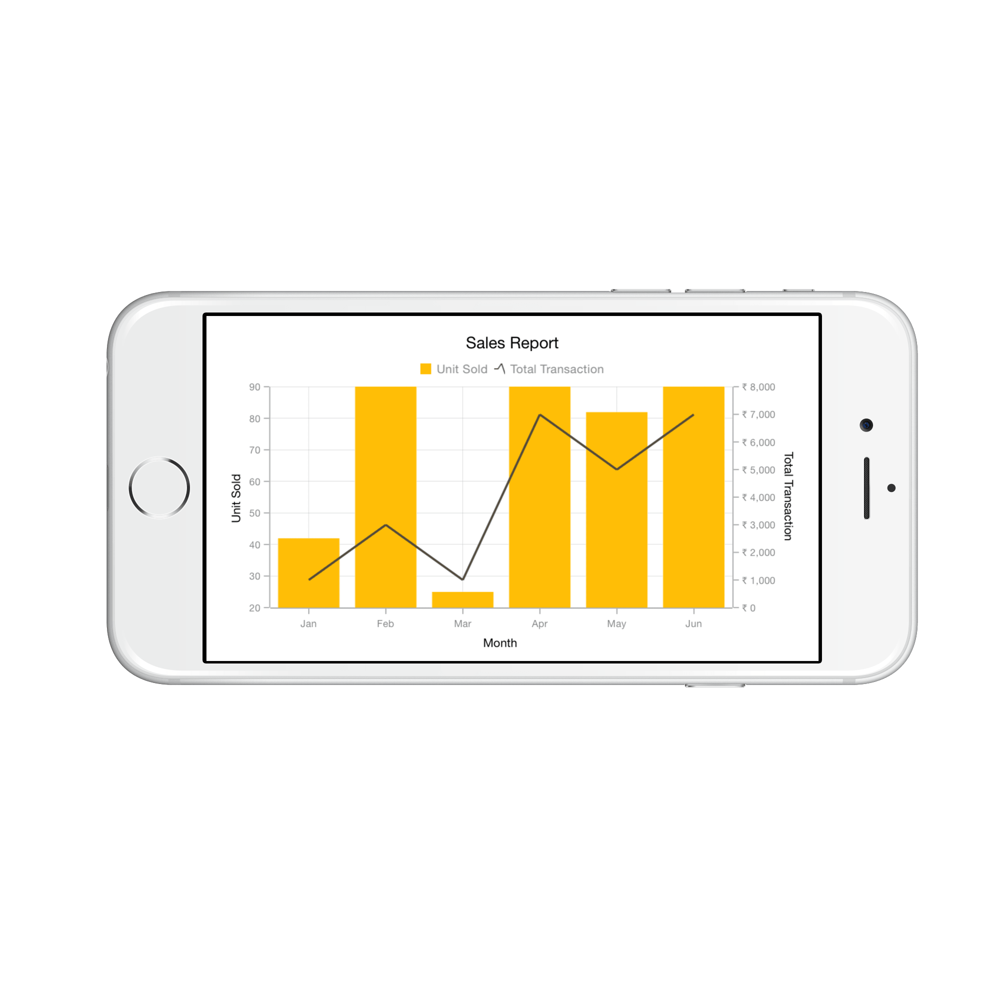
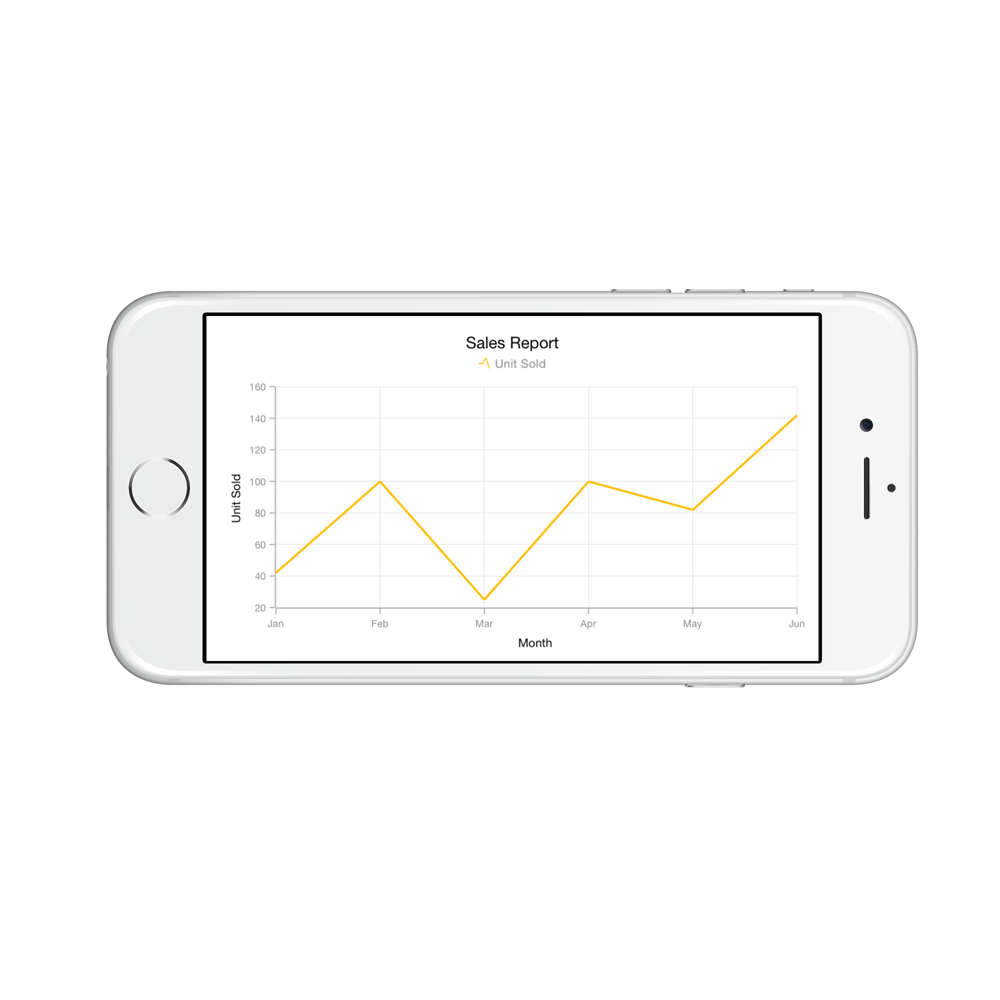

# Chart Series

[`SFSeries`](https://help.syncfusion.com/cr/cref_files/xamarin-ios/Syncfusion.SFChart.iOS~Syncfusion.SfChart.iOS.SFSeries.html) is the visual representation of the data. [`SFChart`](https://help.syncfusion.com/cr/cref_files/xamarin-ios/Syncfusion.SFChart.iOS~Syncfusion.SfChart.iOS.SFChart.html) offers many types of series ranging from line series to financial series like HiLo and Candle. Based on your requirements and specifications, any type of Series can be added for data visualization.

The following APIs are common for the most of the series types:

* [`Visible`](https://help.syncfusion.com/cr/cref_files/xamarin-ios/Syncfusion.SFChart.iOS~Syncfusion.SfChart.iOS.SFSeries~Visible.html) - controls the visibility of the series.
* [`ItemsSource`](https://help.syncfusion.com/cr/cref_files/xamarin-ios/Syncfusion.SFChart.iOS~Syncfusion.SfChart.iOS.SFSeries~ItemsSource.html) - used to set the data source for the series. Refer the [`Populating Data`](https://help.syncfusion.com/xamarin-ios/sfchart/working-with-data) page to configure the items source and set the binding paths.
* [`Color`](https://help.syncfusion.com/cr/cref_files/xamarin-ios/Syncfusion.SFChart.iOS~Syncfusion.SfChart.iOS.SFSeries~Color.html) - used to change the color of the series.
* [`LegendIcon`](https://help.syncfusion.com/cr/cref_files/xamarin-ios/Syncfusion.SFChart.iOS~Syncfusion.SfChart.iOS.SFSeries~LegendIcon.html) - used to change the icon type in corresponding legend item.
* [`Label`](https://help.syncfusion.com/cr/cref_files/xamarin-ios/Syncfusion.SFChart.iOS~Syncfusion.SfChart.iOS.SFSeries~Label.html) - used to set the label that displays in corresponding legend item.
* [`IsVisibleOnLegend`](https://help.syncfusion.com/cr/cref_files/xamarin-ios/Syncfusion.SFChart.iOS~Syncfusion.SfChart.iOS.SFSeries~VisibleOnLegend.html) - used to control the visibility of the series in legend.
* [`Alpha`](https://help.syncfusion.com/cr/cref_files/xamarin-ios/Syncfusion.SFChart.iOS~Syncfusion.SfChart.iOS.SFSeries~Alpha.html) - used to control the transparency of the series.

## Multiple Series

You can add multiple series to [`Series`](https://help.syncfusion.com/cr/cref_files/xamarin-ios/Syncfusion.SFChart.iOS~Syncfusion.SfChart.iOS.ChartBase~Series.html) property of [`SFChart`](https://help.syncfusion.com/cr/cref_files/xamarin-ios/Syncfusion.SFChart.iOS~Syncfusion.SfChart.iOS.SFChart.html) class. By default, all the series rendered based on the [`PrimaryAxis`](https://help.syncfusion.com/cr/cref_files/xamarin-ios/Syncfusion.SFChart.iOS~Syncfusion.SfChart.iOS.ChartBase~PrimaryAxis.html) and [`SecondaryAxis`](https://help.syncfusion.com/cr/cref_files/xamarin-ios/Syncfusion.SFChart.iOS~Syncfusion.SfChart.iOS.ChartBase~SecondaryAxis.html) of [`SFChart`](https://help.syncfusion.com/cr/cref_files/xamarin-ios/Syncfusion.SFChart.iOS~Syncfusion.SfChart.iOS.SFChart.html). But if you want to plot different unit or value that is specific to particular series, you can specify the separate axis for that series using [`XAxis`](https://help.syncfusion.com/cr/cref_files/xamarin-ios/Syncfusion.SFChart.iOS~Syncfusion.SfChart.iOS.SFCartesianSeries~XAxis.html) and [`YAxis`](https://help.syncfusion.com/cr/cref_files/xamarin-ios/Syncfusion.SFChart.iOS~Syncfusion.SfChart.iOS.SFCartesianSeries~YAxis.html) properties of [`SFSeries`](https://help.syncfusion.com/cr/cref_files/xamarin-ios/Syncfusion.SFChart.iOS~Syncfusion.SfChart.iOS.SFSeries.html).



SFChart chart = new SFChart();
...

SFColumnSeries columnSeries = new SFColumnSeries() { 
    
    ItemsSource = Data, 
    XBindingPath = "Country", 
    YBindingPath = "Value" 

};

SFColumnSeries columnSeries1 = new SFColumnSeries() { 

    ItemsSource = Data1, 
    XBindingPath = "Country", 
    YBindingPath = "Value" 
    
};

SFColumnSeries columnSeries2 = new SFColumnSeries() { 

    ItemsSource = Data2, 
    XBindingPath = "Country", 
    YBindingPath = "Value" 
    
};

chart.Series.Add(columnSeries);

chart.Series.Add(columnSeries1);

chart.Series.Add(columnSeries2);


## Combination Series

[`SFChart`](https://help.syncfusion.com/cr/cref_files/xamarin-ios/Syncfusion.SFChart.iOS~Syncfusion.SfChart.iOS.SFChart.html) allows you to render the combination of different types of series.



SFChart chart = new SFChart();

...

SFColumnSeries columnSeries = new SFColumnSeries() { 
    
    ItemsSource = Data, 
    XBindingPath = "Month",
    YBindingPath = "Value" 
    
};

SFLineSeries lineSeries = new SFLineSeries() { 
    
    ItemsSource = Data1, 
    XBindingPath = "Month", 
    YBindingPath = "Value" 
    
}; 

chart.Series.Add(columnSeries);

chart.Series.Add(lineSeries);


**Limitation of combination chart**

* Bar, StackingBar, and StackingBar100 cannot be combined with the other Cartesian type series
* Cartesian type series cannot be combined with accumulation series (pie, doughnut, funnel, and pyramid) and radar & polar series

When the combination of [`SFCartesianSeries`](https://help.syncfusion.com/cr/cref_files/xamarin-ios/Syncfusion.SFChart.iOS~Syncfusion.SfChart.iOS.SFCartesianSeries.html) and [`SFAccumulationSeries`](https://help.syncfusion.com/cr/cref_files/xamarin-ios/Syncfusion.SFChart.iOS~Syncfusion.SfChart.iOS.SFAccumulationSeries.html)  types are added to the [`Series`](https://help.syncfusion.com/cr/cref_files/xamarin-ios/Syncfusion.SFChart.iOS~Syncfusion.SfChart.iOS.ChartBase~Series.html) property, the series which are similar to the first series will be rendered and other series will be ignored. Following code snippet illustrates this.



SFChart chart = new SFChart();
...

SFLineSeries lineSeries = new SFLineSeries() { 

    ItemsSource = Data, 
    XBindingPath = "Month", 
    YBindingPath = "Value" 
    
};

SFPieSeries pieSeries = new SFPieSeries() { 

    ItemsSource = Data1, 
    XBindingPath = "Month", 
    YBindingPath = "Value" 
    
};

chart.Series.Add(lineSeries);

chart.Series.Add(pieSeries);


## Grouping stacked series

You can group and stack the similar stacked series types using [`GroupingLabel`](https://help.syncfusion.com/cr/cref_files/xamarin-ios/Syncfusion.SFChart.iOS~Syncfusion.SfChart.iOS.SFStackingSeries~GroupingLabel.html) property of stacked series. The stacked series which contains the same [`GroupingLabel`](https://help.syncfusion.com/cr/cref_files/xamarin-ios/Syncfusion.SFChart.iOS~Syncfusion.SfChart.iOS.SFStackingSeries~GroupingLabel.html) will be stacked in a single group.



SFChart chart = new SFChart();
...

SFStackingColumnSeries stackingColumnSeries1 = new SFStackingColumnSeries() 
{ 
	ItemsSource = Data1, 
	GroupingLabel = "GroupOne",
	Label = "Google",
	XBindingPath = "Month", 
	YBindingPath = "Value" 
};

SFStackingColumnSeries stackingColumnSeries2 = new SFStackingColumnSeries() 
{ 
	ItemsSource = Data2, 
	GroupingLabel = "GroupTwo",
	Label = "Bing",
	XBindingPath = "Month", 
	YBindingPath = "Value" 
};

SFStackingColumnSeries stackingColumnSeries3 = new SFStackingColumnSeries() 
{ 
	ItemsSource = Data3,
	GroupingLabel = "GroupOne",
	Label = "Yahoo",
	XBindingPath = "Month", 
	YBindingPath = "Value" 
};

SFStackingColumnSeries stackingColumnSeries4 = new SFStackingColumnSeries() 
{ 
	ItemsSource = Data4,
	GroupingLabel = "GroupTwo",
	Label = "Ask",
	XBindingPath = "Month", 
	YBindingPath = "Value" 
};

chart.Series.Add(stackingColumnSeries1);
chart.Series.Add(stackingColumnSeries2);
chart.Series.Add(stackingColumnSeries3);
chart.Series.Add(stackingColumnSeries4);



## Animation

[`SFChart`](https://help.syncfusion.com/cr/cref_files/xamarin-ios/Syncfusion.SFChart.iOS~Syncfusion.SfChart.iOS.SFChart.html) provides animation support for series. Series will be animated on loading data points and whenever the items source changes. Animation can be enabled by setting the [`EnableAnimation`](https://help.syncfusion.com/cr/cref_files/xamarin-ios/Syncfusion.SFChart.iOS~Syncfusion.SfChart.iOS.SFSeries~EnableAnimation.html) property as true and the animation duration can be handled by the [`AnimationDuration`](https://help.syncfusion.com/cr/cref_files/xamarin-ios/Syncfusion.SFChart.iOS~Syncfusion.SfChart.iOS.SFSeries~AnimationDuration.html) property, which are available in [`SFSeries`](https://help.syncfusion.com/cr/cref_files/xamarin-ios/Syncfusion.SFChart.iOS~Syncfusion.SfChart.iOS.SFSeries.html).



SFColumnSeries series       = new SFColumnSeries ();
series.EnableAnimation      = true;
series.AnimationDuration    = 0.8;



## Transpose the Series (Vertical Chart)

The [`IsTransposed`](https://help.syncfusion.com/cr/cref_files/xamarin-ios/Syncfusion.SFChart.iOS~Syncfusion.SfChart.iOS.SFCartesianSeries~IsTransposed.html) property of [`SFCartesianSeries`](https://help.syncfusion.com/cr/cref_files/xamarin-ios/Syncfusion.SFChart.iOS~Syncfusion.SfChart.iOS.SFCartesianSeries.html) is used to plot the chart vertically and view the data in a different perspective.



SFLineSeries series   = new SFLineSeries ();

series.IsTransposed   = true;



