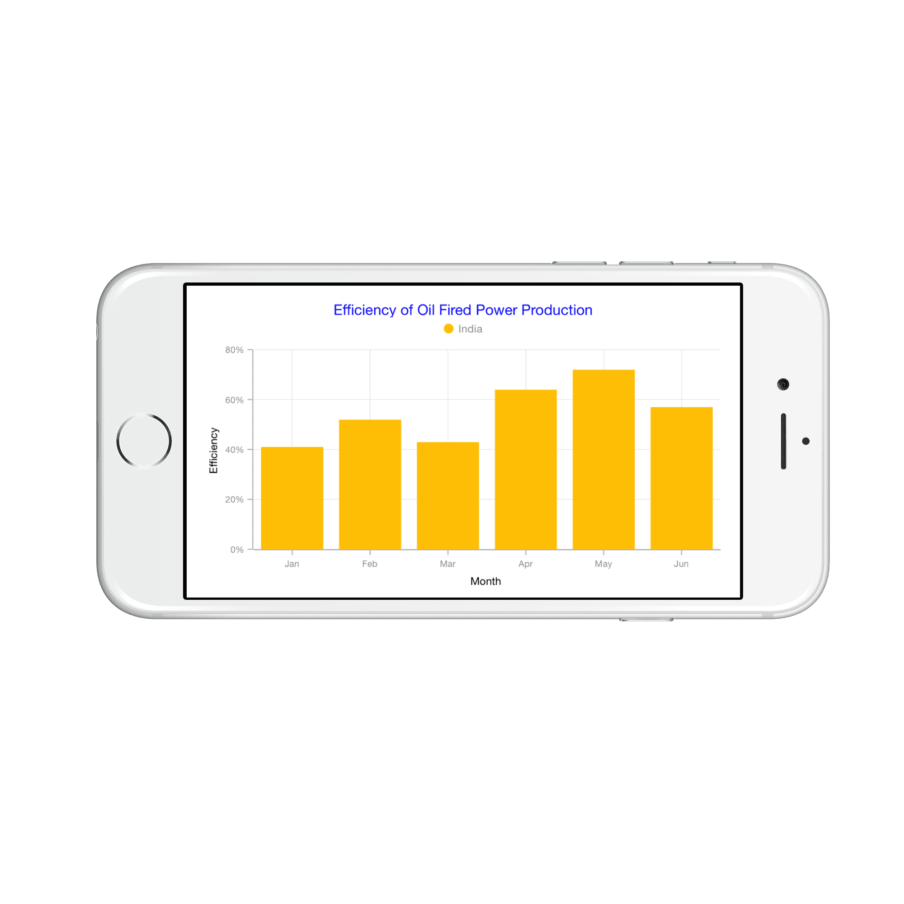
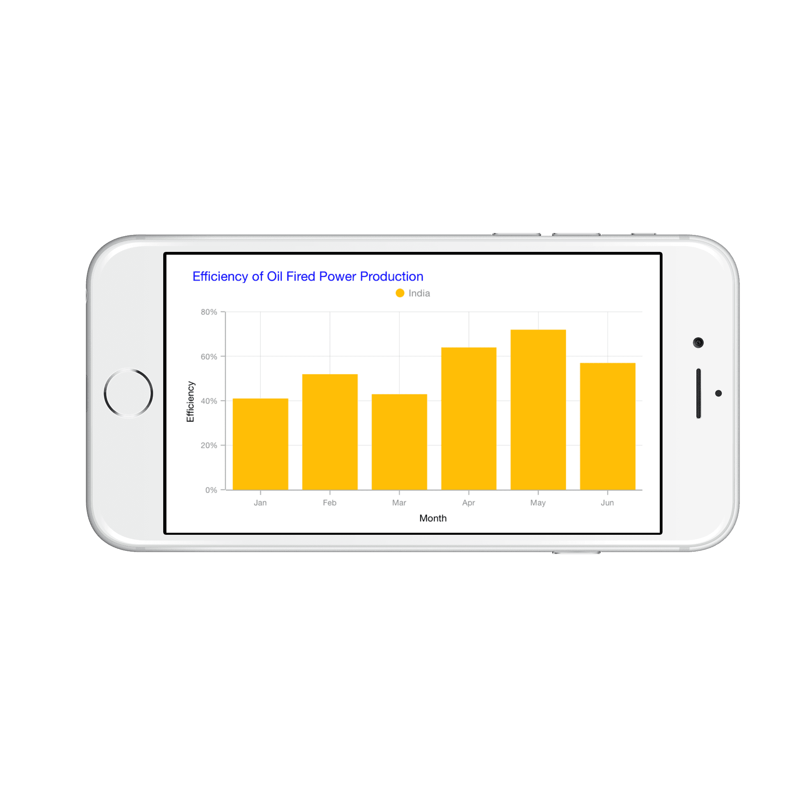

# Chart Title

You can define and customize the Chart title using [`Title`](https://help.syncfusion.com/cr/cref_files/xamarin-ios/sfchart/Syncfusion.SFChart.iOS~Syncfusion.SfChart.iOS.ChartBase~Title.html) property of [`SFChart`](https://help.syncfusion.com/cr/cref_files/xamarin-ios/sfchart/Syncfusion.SFChart.iOS~Syncfusion.SfChart.iOS.SFChart.html). The [`Text`](https://help.syncfusion.com/cr/cref_files/xamarin-ios/sfchart/Syncfusion.SFChart.iOS~Syncfusion.SfChart.iOS.SFChartTitle~Text.html) property of [`SFChartTitle`](https://help.syncfusion.com/cr/cref_files/xamarin-ios/sfchart/Syncfusion.SFChart.iOS~Syncfusion.SfChart.iOS.SFChartTitle.html) is used to set the text for the title. 

Following properties are used to customize its appearance.

* [`TextColor`](https://help.syncfusion.com/cr/cref_files/xamarin-ios/sfchart/Syncfusion.SFChart.iOS~Syncfusion.SfChart.iOS.SFChartTitle~TextColor.html) – used to change the color of the text
* [`BackgroundColor`](https://help.syncfusion.com/cr/cref_files/xamarin-ios/sfchart/Syncfusion.SFChart.iOS~Syncfusion.SfChart.iOS.SFChartTitle~BackgroundColor.html) – used to change the background color
* [`BorderColor`](https://help.syncfusion.com/cr/cref_files/xamarin-ios/sfchart/Syncfusion.SFChart.iOS~Syncfusion.SfChart.iOS.SFChartTitle~BorderColor.html) – used to change the border color
* [`BorderWidth`](https://help.syncfusion.com/cr/cref_files/xamarin-ios/sfchart/Syncfusion.SFChart.iOS~Syncfusion.SfChart.iOS.SFChartTitle~BorderWidth.html) – used to change the border width
* [`Font`](https://help.syncfusion.com/cr/cref_files/xamarin-ios/sfchart/Syncfusion.SFChart.iOS~Syncfusion.SfChart.iOS.SFChartTitle~Font.html) – used to change the text size, font family and font weight
* [`EdgeInsets`](https://help.syncfusion.com/cr/cref_files/xamarin-ios/sfchart/Syncfusion.SFChart.iOS~Syncfusion.SfChart.iOS.SFChartTitle~EdgeInsets.html) - used to change the margin for title



chart.Title.Text        = "Efficiency of Oil Fired Power Production";

chart.Title.TextColor   = UIColor.Blue; 



## Text Alignment

You can align the title text content to the Start, Center or End of the title using the [`TextAlignment`](https://help.syncfusion.com/cr/cref_files/xamarin-ios/sfchart/Syncfusion.SFChart.iOS~Syncfusion.SfChart.iOS.SFChartTitle~TextAlignment.html) property of the [`SFChartTitle`](https://help.syncfusion.com/cr/cref_files/xamarin-ios/sfchart/Syncfusion.SFChart.iOS~Syncfusion.SfChart.iOS.SFChartTitle.html).



chart.Title.Text            = "Efficiency of Oil Fired Power Production";

chart.Title.TextAlignment   = UITextAlignment.Left; 

chart.Title.TextColor       = UIColor.Blue; 



