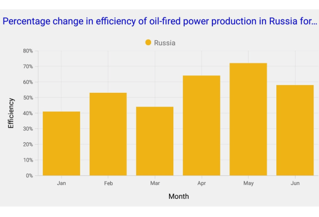

# Title in Xamarin.iOS Chart(SfChart)

You can define and customize the Chart title using [`Title`](https://help.syncfusion.com/cr/xamarin-ios/Syncfusion.SfChart.iOS.ChartBase.html#Syncfusion_SfChart_iOS_ChartBase_Title) property of [`SFChart`](https://help.syncfusion.com/cr/xamarin-ios/Syncfusion.SfChart.iOS.SFChart.html). The [`Text`](https://help.syncfusion.com/cr/xamarin-ios/Syncfusion.SfChart.iOS.SFChartTitle.html#Syncfusion_SfChart_iOS_SFChartTitle_Text) property of [`SFChartTitle`](https://help.syncfusion.com/cr/xamarin-ios/Syncfusion.SfChart.iOS.SFChartTitle.html) is used to set the text for the title. 

Following properties are used to customize its appearance.

* [`TextColor`](https://help.syncfusion.com/cr/xamarin-ios/Syncfusion.SfChart.iOS.SFChartTitle.html#Syncfusion_SfChart_iOS_SFChartTitle_TextColor) – used to change the color of the text.
* [`BackgroundColor`](https://help.syncfusion.com/cr/xamarin-ios/Syncfusion.SfChart.iOS.SFChartTitle.html#Syncfusion_SfChart_iOS_SFChartTitle_BackgroundColor) – used to change the background color.
* [`BorderColor`](https://help.syncfusion.com/cr/xamarin-ios/Syncfusion.SfChart.iOS.SFChartTitle.html#Syncfusion_SfChart_iOS_SFChartTitle_BorderColor) – used to change the border color.
* [`Opacity`](https://help.syncfusion.com/cr/xamarin-ios/Syncfusion.SfChart.iOS.SFChartTitle.html#Syncfusion_SfChart_iOS_SFChartTitle_Opacity) - used to control the transparency of the title.
* [`BorderWidth`](https://help.syncfusion.com/cr/xamarin-ios/Syncfusion.SfChart.iOS.SFChartTitle.html#Syncfusion_SfChart_iOS_SFChartTitle_BorderWidth) – used to change the border width.
* [`Font`](https://help.syncfusion.com/cr/xamarin-ios/Syncfusion.SfChart.iOS.SFChartTitle.html#Syncfusion_SfChart_iOS_SFChartTitle_Font) – used to change the text size, font family and font weight.
* [`EdgeInsets`](https://help.syncfusion.com/cr/xamarin-ios/Syncfusion.SfChart.iOS.SFChartTitle.html#Syncfusion_SfChart_iOS_SFChartTitle_EdgeInsets) - used to change the margin for title.



chart.Title.Text        = "Efficiency of Oil Fired Power Production";

chart.Title.TextColor   = UIColor.Blue; 



## Text Alignment

You can align the title text content to the Start, Center or End of the title using the [`TextAlignment`](https://help.syncfusion.com/cr/xamarin-ios/Syncfusion.SfChart.iOS.SFChartTitle.html#Syncfusion_SfChart_iOS_SFChartTitle_TextAlignment) property of the [`SFChartTitle`](https://help.syncfusion.com/cr/xamarin-ios/Syncfusion.SfChart.iOS.SFChartTitle.html).



chart.Title.Text            = "Efficiency of Oil Fired Power Production";

chart.Title.TextAlignment   = UITextAlignment.Left; 

chart.Title.TextColor       = UIColor.Blue; 



## Text Wrap

You can wrap chart title text content using the `LineBreakMode` property. The default value of this property is `NoWrap`.



chart.Title.Text            = "Percentage change in efficiency of oil-fired power production in Russia for six months;

chart.Title.TextColor       = UIColor.Blue; 

chart.Title.LineBreakMode   = UILineBreakMode.TailTruncation;



