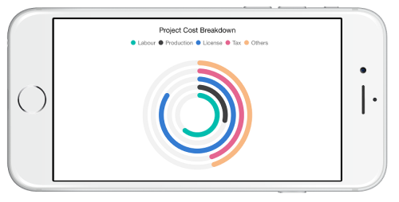

# Chart Types in Xamarin.iOS

## Line Chart

To render a line chart, create an instance of [`SFLineSeries`](https://help.syncfusion.com/cr/cref_files/xamarin-ios/Syncfusion.SFChart.iOS~Syncfusion.SfChart.iOS.SFLineSeries.html) and add to the Series collection property of [`SFChart`](https://help.syncfusion.com/cr/cref_files/xamarin-ios/Syncfusion.SFChart.iOS~Syncfusion.SfChart.iOS.SFChart.html). You can use the following properties to customize the appearance.

* [`Color`](https://help.syncfusion.com/cr/cref_files/xamarin-ios/Syncfusion.SFChart.iOS~Syncfusion.SfChart.iOS.SFSeries~Color.html) – used to change the color of the line.
* [`Alpha`](https://help.syncfusion.com/cr/cref_files/xamarin-ios/Syncfusion.SFChart.iOS~Syncfusion.SfChart.iOS.SFSeries~Alpha.html) - used to control the transparency of the chart series.
* [`LineWidth`](https://help.syncfusion.com/cr/cref_files/xamarin-ios/Syncfusion.SFChart.iOS~Syncfusion.SfChart.iOS.SFLineSeries~LineWidth.html) – used to change the width of the line.



SFChart chart = new SFChart();
...

SFLineSeries lineSeries = new SFLineSeries()
{
    ItemsSource = Data,
    XBindingPath = "Year",
    YBindingPath = "Value"
};
chart.Series.Add(lineSeries);



### Dashed Lines

[`Dashes`](https://help.syncfusion.com/cr/cref_files/xamarin-ios/Syncfusion.SFChart.iOS~Syncfusion.SfChart.iOS.SFLineSeries~Dashes.html) property of the [`SFLineSeries`](https://help.syncfusion.com/cr/cref_files/xamarin-ios/Syncfusion.SFChart.iOS~Syncfusion.SfChart.iOS.SFLineSeries.html) is used to render line series with dashes.


SFLineSeries series = new SFLineSeries ();
series.ItemsSource = Data; 
series.XBindingPath = "XValue";
series.YBindingPath = "YValue";
  
NSObject[] dashes       = new NSObject[2];
dashes [0]              = (NSNumber)2;
dashes [1]              = (NSNumber)3;
series.Dashes           = NSArray.FromObjects (dashes);
chart.Series.Add(series);


## Stacked Line Chart

To render a stacked line chart, create an instance of `SFStackingLineSeries` and add to the Series collection property of [`SFChart`](https://help.syncfusion.com/cr/cref_files/xamarin-ios/Syncfusion.SFChart.iOS~Syncfusion.SfChart.iOS.SFChart.html). You can use the following properties to customize the stacked line appearance.

* `Color` – used to change the color of the line.
* `Alpha` - used to control the transparency of the chart series.
* `LineWidth` – used to change the width of the line.



SFChart chart = new SFChart();
...

SFStackingLineSeries stackingLineSeries1 = new SFStackingLineSeries() 
{ 
    ItemsSource = Data1, 
    XBindingPath = "XValue", 
    YBindingPath = "YValue" 
};

SFStackingLineSeries stackingLineSeries2 = new SFStackingLineSeries() 
{ 
    ItemsSource = Data2, 
    XBindingPath = "XValue", 
    YBindingPath = "YValue" 
};

SFStackingLineSeries stackingLineSeries3 = new SFStackingLineSeries() 
{ 
    ItemsSource = Data3, 
    XBindingPath = "XValue", 
    YBindingPath = "YValue" 
};

SFStackingLineSeries stackingLineSeries4 = new SFStackingLineSeries() 
{ 
    ItemsSource = Data4, 
    XBindingPath = "XValue", 
    YBindingPath = "YValue" 
};

chart.Series.Add(stackingLineSeries1);
chart.Series.Add(stackingLineSeries2);
chart.Series.Add(stackingLineSeries3);
chart.Series.Add(stackingLineSeries4);



### Dashed Lines

`Dashes` property of the `SFStackingLineSeries` is used to render stacking line series with dashes.


SFStackingLineSeries series1 = new SFStackingLineSeries ();
series1.ItemsSource = Data1; 
series1.XBindingPath = "XValue";
series1.YBindingPath = "YValue";
  
NSObject[] dashes       = new NSObject[2];
dashes [0]              = (NSNumber)13;
dashes [1]              = (NSNumber)4;
series1.Dashes           = NSArray.FromObjects (dashes);
chart.Series.Add(series1);

SFStackingLineSeries series2 = new SFStackingLineSeries ();
series2.ItemsSource = Data2; 
series2.XBindingPath = "XValue";
series2.YBindingPath = "YValue";
  
NSObject[] dashes       = new NSObject[2];
dashes [0]              = (NSNumber)13;
dashes [1]              = (NSNumber)4;
series2.Dashes           = NSArray.FromObjects (dashes);
chart.Series.Add(series2);

SFStackingLineSeries series3 = new SFStackingLineSeries ();
series3.ItemsSource = Data3; 
series3.XBindingPath = "XValue";
series3.YBindingPath = "YValue";
  
NSObject[] dashes       = new NSObject[2];
dashes [0]              = (NSNumber)13;
dashes [1]              = (NSNumber)4;
series3.Dashes           = NSArray.FromObjects (dashes);
chart.Series.Add(series3);

SFStackingLineSeries series4 = new SFStackingLineSeries ();
series4.ItemsSource = Data4; 
series4.XBindingPath = "XValue";
series4.YBindingPath = "YValue";
  
NSObject[] dashes       = new NSObject[2];
dashes [0]              = (NSNumber)13;
dashes [1]              = (NSNumber)4;
series4.Dashes           = NSArray.FromObjects (dashes);
chart.Series.Add(series4);


## 100% Stacked Line Chart

To render a 100% stacked line chart, create an instance of `SFStackingLine100Series` and add to the Series collection property of [`SFChart`](https://help.syncfusion.com/cr/cref_files/xamarin-ios/Syncfusion.SFChart.iOS~Syncfusion.SfChart.iOS.SFChart.html). You can use the following properties to customize the 100% stacked line appearance.

* `Color` – used to change the color of the line.
* `Alpha` - used to control the transparency of the chart series.
* `LineWidth` – used to change the width of the line.
* `Dashes` - used to render the dashes of the stacking line series.



SFChart chart = new SFChart();
...

SFStackingLine100Series stackingLine100Series1 = new SFStackingLine100Series() 
{ 
    ItemsSource = Data1, 
    XBindingPath = "XValue", 
    YBindingPath = "YValue" 
};

SFStackingLine100Series stackingLine100Series2 = new SFStackingLine100Series() 
{ 
    ItemsSource = Data2, 
    XBindingPath = "XValue", 
    YBindingPath = "YValue" 
};

SFStackingLine100Series stackingLine100Series3 = new SFStackingLine100Series() 
{ 
    ItemsSource = Data3, 
    XBindingPath = "XValue", 
    YBindingPath = "YValue" 
};

SFStackingLine100Series stackingLine100Series4 = new SFStackingLine100Series() 
{ 
    ItemsSource = Data4, 
    XBindingPath = "XValue", 
    YBindingPath = "YValue" 
};

chart.Series.Add(stackingLine100Series1);
chart.Series.Add(stackingLine100Series2);
chart.Series.Add(stackingLine100Series3);
chart.Series.Add(stackingLine100Series4);


## Area Chart

To render an area chart, create an instance of [`SFAreaSeries`](https://help.syncfusion.com/cr/cref_files/xamarin-ios/Syncfusion.SFChart.iOS~Syncfusion.SfChart.iOS.SFAreaSeries.html) and add to the Series collection property of [`SFChart`](https://help.syncfusion.com/cr/cref_files/xamarin-ios/Syncfusion.SFChart.iOS~Syncfusion.SfChart.iOS.SFChart.html). You can use the following properties to customize the appearance.

* [`Color`](https://help.syncfusion.com/cr/cref_files/xamarin-ios/Syncfusion.SFChart.iOS~Syncfusion.SfChart.iOS.SFSeries~Color.html) – used to change the color of the series.
* [`Alpha`](https://help.syncfusion.com/cr/cref_files/xamarin-ios/Syncfusion.SFChart.iOS~Syncfusion.SfChart.iOS.SFSeries~Alpha.html) - used to control the transparency of the chart series.
* [`BorderWidth`](https://help.syncfusion.com/cr/cref_files/xamarin-ios/Syncfusion.SFChart.iOS~Syncfusion.SfChart.iOS.SFAreaSeries~BorderWidth.html) – used to change the border width of the series.
* [`BorderColor`](https://help.syncfusion.com/cr/cref_files/xamarin-ios/Syncfusion.SFChart.iOS~Syncfusion.SfChart.iOS.SFAreaSeries~BorderColor.html) – used to change the border color of the series.



SFChart chart = new SFChart();
...

SFAreaSeries areaSeries = new SFAreaSeries()
{
    ItemsSource = Data,
    XBindingPath = "Year",
    YBindingPath = "Value"
};
chart.Series.Add(areaSeries);


## Spline Area Chart

To render a spline area chart, create an instance of [`SFSplineAreaSeries`](https://help.syncfusion.com/cr/cref_files/xamarin-ios/Syncfusion.SFChart.iOS~Syncfusion.SfChart.iOS.SFSplineAreaSeries.html) and add to the Series collection property of [`SFChart`](https://help.syncfusion.com/cr/cref_files/xamarin-ios/Syncfusion.SFChart.iOS~Syncfusion.SfChart.iOS.SFChart.html). You can use the following properties to customize the spline area appearance.

* [`Color`](https://help.syncfusion.com/cr/cref_files/xamarin-ios/Syncfusion.SFChart.iOS~Syncfusion.SfChart.iOS.SFSeries~Color.html) – used to change the color of the series.
* [`Alpha`](https://help.syncfusion.com/cr/cref_files/xamarin-ios/Syncfusion.SFChart.iOS~Syncfusion.SfChart.iOS.SFSeries~Alpha.html) - used to control the transparency of the chart series.
* [`BorderWidth`](https://help.syncfusion.com/cr/cref_files/xamarin-ios/Syncfusion.SFChart.iOS~Syncfusion.SfChart.iOS.SFAreaSeries~BorderWidth.html) – used to change the border width of the series.
* [`BorderColor`](https://help.syncfusion.com/cr/cref_files/xamarin-ios/Syncfusion.SFChart.iOS~Syncfusion.SfChart.iOS.SFAreaSeries~BorderColor.html) – used to change the border color of the series.



SFChart chart = new SFChart();
...

SFSplineAreaSeries splineAreaSeries = new SFSplineAreaSeries()
{
    ItemsSource = Data,
    XBindingPath = "Year",
    YBindingPath = "Value"
};
chart.Series.Add(splineAreaSeries);



### Spline area series types

[`SplineType`](https://help.syncfusion.com/cr/cref_files/xamarin-ios/Syncfusion.SFChart.iOS~Syncfusion.SfChart.iOS.SFSplineAreaSeries~SplineType.html) allows you to change the spline area curve in series. 

The following types are used in [`SFSplineAreaSeries`](https://help.syncfusion.com/cr/cref_files/xamarin-ios/Syncfusion.SFChart.iOS~Syncfusion.SfChart.iOS.SFSplineAreaSeries.html) as

* [`Natural`](https://help.syncfusion.com/cr/cref_files/xamarin-ios/Syncfusion.SFChart.iOS~Syncfusion.SfChart.iOS.SplineType.html)
* [`Monotonic`](https://help.syncfusion.com/cr/cref_files/xamarin-ios/Syncfusion.SFChart.iOS~Syncfusion.SfChart.iOS.SplineType.html)
* [`Cardinal`](https://help.syncfusion.com/cr/cref_files/xamarin-ios/Syncfusion.SFChart.iOS~Syncfusion.SfChart.iOS.SplineType.html)
* [`Clamped`](https://help.syncfusion.com/cr/cref_files/xamarin-ios/Syncfusion.SFChart.iOS~Syncfusion.SfChart.iOS.SplineType.html)

By default SplineType value is Natural.

The following code shows how to set the [`SplineType`](https://help.syncfusion.com/cr/cref_files/xamarin-ios/Syncfusion.SFChart.iOS~Syncfusion.SfChart.iOS.SFSplineAreaSeries~SplineType.html) value as [`Cardinal`](https://help.syncfusion.com/cr/cref_files/xamarin-ios/Syncfusion.SFChart.iOS~Syncfusion.SfChart.iOS.SplineType.html)



SFChart chart = new SFChart();
...

SFSplineAreaSeries splineAreaSeries = new SFSplineAreaSeries()
{
    ItemsSource = Data,
    XBindingPath = "Year",
    YBindingPath = "Value",
    SplineType = SplineType.Cardinal
};
chart.Series.Add(splineAreaSeries);



## Step Area Chart

To render a step area chart, create an instance of [`SFStepAreaSeries`](https://help.syncfusion.com/cr/cref_files/xamarin-ios/Syncfusion.SFChart.iOS~Syncfusion.SfChart.iOS.SFStepAreaSeries.html) and add to the Series collection property of [`SFChart`](https://help.syncfusion.com/cr/cref_files/xamarin-ios/Syncfusion.SFChart.iOS~Syncfusion.SfChart.iOS.SFChart.html). You can use the following properties to customize the step area appearance.

* [`Color`](https://help.syncfusion.com/cr/cref_files/xamarin-ios/Syncfusion.SFChart.iOS~Syncfusion.SfChart.iOS.SFSeries~Color.html) – used to change the color of the series.
* [`Alpha`](https://help.syncfusion.com/cr/cref_files/xamarin-ios/Syncfusion.SFChart.iOS~Syncfusion.SfChart.iOS.SFSeries~Alpha.html) - used to control the transparency of the chart series.
* [`BorderWidth`](https://help.syncfusion.com/cr/cref_files/xamarin-ios/Syncfusion.SFChart.iOS~Syncfusion.SfChart.iOS.SFAreaSeries~BorderWidth.html) – used to change the border width of the series.
* [`BorderColor`](https://help.syncfusion.com/cr/cref_files/xamarin-ios/Syncfusion.SFChart.iOS~Syncfusion.SfChart.iOS.SFAreaSeries~BorderColor.html) – used to change the border color of the series.



SFChart chart = new SFChart();
...

SFStepAreaSeries stepAreaSeries = new SFStepAreaSeries()
{
    ItemsSource = Data,
    XBindingPath = "Year",
    YBindingPath = "Value"
};
chart.Series.Add(stepAreaSeries);



## Range Area Chart

To render a range area chart, create an instance of [`SFRangeAreaSeries`](https://help.syncfusion.com/cr/cref_files/xamarin-ios/Syncfusion.SFChart.iOS~Syncfusion.SfChart.iOS.SFRangeAreaSeries.html) and add to the Series collection property of [`SFChart`](https://help.syncfusion.com/cr/cref_files/xamarin-ios/Syncfusion.SFChart.iOS~Syncfusion.SfChart.iOS.SFChart.html).

Since the [`SFRangeAreaSeries`](https://help.syncfusion.com/cr/cref_files/xamarin-ios/Syncfusion.SFChart.iOS~Syncfusion.SfChart.iOS.SFRangeAreaSeries.html) requires two Y values for a point, your data should contain [`HighValues`](https://help.syncfusion.com/cr/cref_files/xamarin-ios/Syncfusion.SFChart.iOS~Syncfusion.SfChart.iOS.SFRangeAreaSegment~HighValues.html) and [`LowValues`](https://help.syncfusion.com/cr/cref_files/xamarin-ios/Syncfusion.SFChart.iOS~Syncfusion.SfChart.iOS.SFRangeAreaSegment~LowValues.html). [`High`](https://help.syncfusion.com/cr/cref_files/xamarin-ios/Syncfusion.SFChart.iOS~Syncfusion.SfChart.iOS.SFRangeSeries~High.html) and [`Low`](https://help.syncfusion.com/cr/cref_files/xamarin-ios/Syncfusion.SFChart.iOS~Syncfusion.SfChart.iOS.SFRangeSeries~Low.html) value specifies the maximum and minimum range of the point. 



SFChart chart = new SFChart();
...
   
SFRangeAreaSeries rangeAreaSeries = new SFRangeAreaSeries() 
{ 
    ItemsSource = Data,
    XBindingPath = "Month", 
    High = "Value1",
    Low = "Value2" 
};
chart.Series.Add(rangeAreaSeries);



Following properties are used to customize the range area segment appearance,

* [`Color`](https://help.syncfusion.com/cr/cref_files/xamarin-ios/Syncfusion.SFChart.iOS~Syncfusion.SfChart.iOS.SFSeries~Color.html) – used to change the color of the series.
* [`Alpha`](https://help.syncfusion.com/cr/cref_files/xamarin-ios/Syncfusion.SFChart.iOS~Syncfusion.SfChart.iOS.SFSeries~Alpha.html) - used to control the transparency of the chart series.
* [`BorderWidth`](https://help.syncfusion.com/cr/cref_files/xamarin-ios/Syncfusion.SFChart.iOS~Syncfusion.SfChart.iOS.SFRangeAreaSeries~BorderWidth.html) – used to change the border width of the series.
* [`BorderColor`](https://help.syncfusion.com/cr/cref_files/xamarin-ios/Syncfusion.SFChart.iOS~Syncfusion.SfChart.iOS.SFRangeAreaSeries~BorderColor.html) – used to change the border color of the series.

## Stacked Area Chart

To render a stacked area chart, create an instance of [`SFStackingAreaSeries`](https://help.syncfusion.com/cr/cref_files/xamarin-ios/Syncfusion.SFChart.iOS~Syncfusion.SfChart.iOS.SFStackingAreaSeries.html) and add to the Series collection property of [`SFChart`](https://help.syncfusion.com/cr/cref_files/xamarin-ios/Syncfusion.SFChart.iOS~Syncfusion.SfChart.iOS.SFChart.html). You can use the following properties to customize the stacked area appearance.

* [`Color`](https://help.syncfusion.com/cr/cref_files/xamarin-ios/Syncfusion.SFChart.iOS~Syncfusion.SfChart.iOS.SFSeries~Color.html) – used to change the color of the series.
* [`Alpha`](https://help.syncfusion.com/cr/cref_files/xamarin-ios/Syncfusion.SFChart.iOS~Syncfusion.SfChart.iOS.SFSeries~Alpha.html) - used to control the transparency of the chart series.
* [`BorderWidth`](https://help.syncfusion.com/cr/cref_files/xamarin-ios/Syncfusion.SFChart.iOS~Syncfusion.SfChart.iOS.SFStackingSeries~BorderWidth.html) – used to change the border width of the series.
* [`BorderColor`](https://help.syncfusion.com/cr/cref_files/xamarin-ios/Syncfusion.SFChart.iOS~Syncfusion.SfChart.iOS.SFStackingSeries~BorderColor.html) – used to change the border color of the series.



SFChart chart = new SFChart();
...

SFStackingAreaSeries stackingAreaSeries1 = new SFStackingAreaSeries() 
{ 
    ItemsSource = Data1, 
    XBindingPath = "Year", 
    YBindingPath = "Value" 
};

SFStackingAreaSeries stackingAreaSeries2 = new SFStackingAreaSeries() 
{ 
    ItemsSource = Data2, 
    XBindingPath = "Year", 
    YBindingPath = "Value" 
};

SFStackingAreaSeries stackingAreaSeries3 = new SFStackingAreaSeries() 
{ 
    ItemsSource = Data3, 
    XBindingPath = "Year", 
    YBindingPath = "Value" 
};

chart.Series.Add(stackingAreaSeries1);
chart.Series.Add(stackingAreaSeries2);
chart.Series.Add(stackingAreaSeries3);



## 100% Stacked Area Chart

To render a 100% stacked area chart, create an instance of [`SFStackingArea100Series`](https://help.syncfusion.com/cr/cref_files/xamarin-ios/Syncfusion.SFChart.iOS~Syncfusion.SfChart.iOS.SFStackingArea100Series.html) and add to the Series collection property of [`SFChart`](https://help.syncfusion.com/cr/cref_files/xamarin-ios/Syncfusion.SFChart.iOS~Syncfusion.SfChart.iOS.SFChart.html). You can use the following properties to customize the 100% stacked area appearance.

* [`Color`](https://help.syncfusion.com/cr/cref_files/xamarin-ios/Syncfusion.SFChart.iOS~Syncfusion.SfChart.iOS.SFSeries~Color.html) – used to change the color of the series.
* [`Alpha`](https://help.syncfusion.com/cr/cref_files/xamarin-ios/Syncfusion.SFChart.iOS~Syncfusion.SfChart.iOS.SFSeries~Alpha.html) - used to control the transparency of the chart series.
* [`BorderWidth`](https://help.syncfusion.com/cr/cref_files/xamarin-ios/Syncfusion.SFChart.iOS~Syncfusion.SfChart.iOS.SFStackingSeries~BorderWidth.html) – used to change the border width of the series.
* [`BorderColor`](https://help.syncfusion.com/cr/cref_files/xamarin-ios/Syncfusion.SFChart.iOS~Syncfusion.SfChart.iOS.SFStackingSeries~BorderColor.html) – used to change the border color of the series.



SFChart chart = new SFChart();
...

SFStackingArea100Series stackingAreaSeries1 = new SFStackingArea100Series() 
{ 
    ItemsSource = Data1, 
    XBindingPath = "Year", 
    YBindingPath = "Value" 
};

SFStackingArea100Series stackingAreaSeries2 = new SFStackingArea100Series() 
{ 
    ItemsSource = Data2, 
    XBindingPath = "Year", 
    YBindingPath = "Value" 
};

SFStackingArea100Series stackingAreaSeries3 = new SFStackingArea100Series() 
{ 
    ItemsSource = Data3, 
    XBindingPath = "Year", 
    YBindingPath = "Value" 
};

chart.Series.Add(stackingAreaSeries1);
chart.Series.Add(stackingAreaSeries2);
chart.Series.Add(stackingAreaSeries3);


## Spline Range Area Chart

To render a Spline range Area chart, create an instance of [`SplineRangeAreaSeries`](https://help.syncfusion.com/cr/cref_files/xamarin-ios/Syncfusion.SFChart.iOS~Syncfusion.SfChart.iOS.SFSplineRangeAreaSeries.html) and add to the series collection of SfChart.

Since the [`SplineRangeAreaSeries`](https://help.syncfusion.com/cr/cref_files/xamarin-ios/Syncfusion.SFChart.iOS~Syncfusion.SfChart.iOS.SFSplineRangeAreaSeries.html) requires two Y values for a point, your data should contain [`high`](https://help.syncfusion.com/cr/cref_files/xamarin-ios/Syncfusion.SFChart.iOS~Syncfusion.SfChart.iOS.SFRangeSeries~High.html) and [`low`](https://help.syncfusion.com/cr/cref_files/xamarin-ios/Syncfusion.SFChart.iOS~Syncfusion.SfChart.iOS.SFRangeSeries~Low.html) values. High and low value specifies the maximum and minimum range of the point.

Following properties are used to customize the spline range area segment appearance,

* [`Color`](https://help.syncfusion.com/cr/cref_files/xamarin-ios/Syncfusion.SFChart.iOS~Syncfusion.SfChart.iOS.SFSeries~Color.html) – used to change the color of the series.
* [`Alpha`](https://help.syncfusion.com/cr/cref_files/xamarin-ios/Syncfusion.SFChart.iOS~Syncfusion.SfChart.iOS.SFSeries~Alpha.html) - used to control the transparency of the chart series.
* [`StrokeWidth`](https://help.syncfusion.com/cr/cref_files/xamarin-ios/Syncfusion.SFChart.iOS~Syncfusion.SfChart.iOS.SFColumnSeries~BorderWidth.html) – used to change the stroke width of the series.
* [`StrokeColor`](https://help.syncfusion.com/cr/cref_files/xamarin-ios/Syncfusion.SFChart.iOS~Syncfusion.SfChart.iOS.SFColumnSeries~BorderColor.html) – used to change the stroke color of the series.

 
[C#]

SfChart chart = new SfChart();
...

SFSplineRangeAreaSeries splineRangeAreaSeries = new SFSplineRangeAreaSeries() 
{ 
	ItemsSource = Data,
	XBindingPath = "XValue", 
	High = "High", 
	Low = "Low" 
};
chart.Series.Add(splineRangeAreaSeries);



## Column Chart

To render a column chart, create an instance of [`SFColumnSeries`](https://help.syncfusion.com/cr/cref_files/xamarin-ios/Syncfusion.SFChart.iOS~Syncfusion.SfChart.iOS.SFColumnSeries.html) and add to the Series collection property of [`SFChart`](https://help.syncfusion.com/cr/cref_files/xamarin-ios/Syncfusion.SFChart.iOS~Syncfusion.SfChart.iOS.SFChart.html). You can use the following properties to customize the appearance.

* [`Color`](https://help.syncfusion.com/cr/cref_files/xamarin-ios/Syncfusion.SFChart.iOS~Syncfusion.SfChart.iOS.SFSeries~Color.html) – used to change the color of the series.
* [`Alpha`](https://help.syncfusion.com/cr/cref_files/xamarin-ios/Syncfusion.SFChart.iOS~Syncfusion.SfChart.iOS.SFSeries~Alpha.html) - used to control the transparency of the chart series.
* [`BorderWidth`](https://help.syncfusion.com/cr/cref_files/xamarin-ios/Syncfusion.SFChart.iOS~Syncfusion.SfChart.iOS.SFColumnSeries~BorderWidth.html) – used to change the border width of the series.
* [`BorderColor`](https://help.syncfusion.com/cr/cref_files/xamarin-ios/Syncfusion.SFChart.iOS~Syncfusion.SfChart.iOS.SFColumnSeries~BorderColor.html) – used to change the border color of the series.
* [`CornerRadius`](https://help.syncfusion.com/cr/cref_files/xamarin-ios/Syncfusion.SFChart.iOS~Syncfusion.SfChart.iOS.SFColumnSeries~CornerRadius.html) - used to add the rounded corners to the rectangle. The [`TopLeft`](https://help.syncfusion.com/cr/cref_files/xamarin-ios/Syncfusion.SFChart.iOS~Syncfusion.SfChart.iOS.ChartCornerRadius~TopLeft.html), [`TopRight`](https://help.syncfusion.com/cr/cref_files/xamarin-ios/Syncfusion.SFChart.iOS~Syncfusion.SfChart.iOS.ChartCornerRadius~TopRight.html), [`BottomLeft`](https://help.syncfusion.com/cr/cref_files/xamarin-ios/Syncfusion.SFChart.iOS~Syncfusion.SfChart.iOS.ChartCornerRadius~BottomLeft.html) and [`BottomRight`](https://help.syncfusion.com/cr/cref_files/xamarin-ios/Syncfusion.SFChart.iOS~Syncfusion.SfChart.iOS.ChartCornerRadius~BottomRight.html) of [`ChartCornerRadius`](https://help.syncfusion.com/cr/cref_files/xamarin-ios/Syncfusion.SFChart.iOS~Syncfusion.SfChart.iOS.ChartCornerRadius.html) properties are used to set the radius value for each corner.
* [`DataMarkerPosition`](https://help.syncfusion.com/cr/cref_files/xamarin-ios/Syncfusion.SFChart.iOS~Syncfusion.SfChart.iOS.SFColumnSeries~DataMarkerPosition.html) -  used to position the data marker at [`Bottom`](https://help.syncfusion.com/cr/cref_files/xamarin-ios/Syncfusion.SFChart.iOS~Syncfusion.SfChart.iOS.SFChartDataMarkerPosition.html), Top and Center of the rectangle.
* [`Spacing`](https://help.syncfusion.com/cr/cref_files/xamarin-ios/Syncfusion.SFChart.iOS~Syncfusion.SfChart.iOS.SFColumnSeries~Spacing.html) - used to change the spacing between two segments. The default value of spacing is 0, and the value ranges from 0 to 1. Here, 1 and 0 correspond to 100% and 0% of the available space, respectively.
* [`Width`](https://help.syncfusion.com/cr/cref_files/xamarin-ios/Syncfusion.SFChart.iOS~Syncfusion.SfChart.iOS.SFColumnSeries~Width.html) - used to change the width of the rectangle. The default value of the width is 0.8, and the value ranges from 0 to 1. Here, 1 and 0 correspond to 100% and 0% of the available width, respectively. 



SFChart chart = new SFChart();
...

SFColumnSeries columnSeries = new SFColumnSeries() 
{ 
    ItemsSource = Data, 
    XBindingPath = "Country", 
    YBindingPath = "Value" 
};
chart.Series.Add(columnSeries);


## Overlapped placement

By default, all the column series which has the same x and y axes are placed side by side in a chart. If you want place the series one over the other (overlapped), set the [`SideBySideSeriesPlacement`](https://help.syncfusion.com/cr/cref_files/xamarin-ios/Syncfusion.SFChart.iOS~Syncfusion.SfChart.iOS.ChartBase~SideBySideSeriesPlacement.html) property of [`SFChart`](https://help.syncfusion.com/cr/cref_files/xamarin-ios/Syncfusion.SFChart.iOS~Syncfusion.SfChart.iOS.SFChart.html) to false and configure the [`Width`](https://help.syncfusion.com/cr/cref_files/xamarin-ios/Syncfusion.SFChart.iOS~Syncfusion.SfChart.iOS.SFColumnSeries~Width.html) property to differentiate the series. The following code snippet and screenshot illustrate the overlapped placement of column series.



SFChart chart = new SFChart()
{
    SideBySideSeriesPlacement = false
};

SFColumnSeries series1 = new SFColumnSeries()
 {
    ItemsSource = view.Data1,
    XBindingPath = "Year",
    YBindingPath = "Medals"
 };
 SFColumnSeries series2 = new SFColumnSeries()
 {
    ItemsSource = view.Data2,
    XBindingPath = "Year",
    YBindingPath = "Medals",
    Width="0.5"
 };

chart.Series.Add(series1);
chart.Series.Add(series2);



## Histogram Chart

To render a histogram chart, create an instance of [`SFHistogramSeries`](https://help.syncfusion.com/cr/cref_files/xamarin-ios/Syncfusion.SFChart.iOS~Syncfusion.SfChart.iOS.SFHistogramSeries.html), and add it to the Series collection property of [`SFChart`](https://help.syncfusion.com/cr/cref_files/xamarin-ios/Syncfusion.SFChart.iOS~Syncfusion.SfChart.iOS.SFChart.html).

Histogram chart provides a visual display of large amount of data that are difficult to understand in a tabular or data grid form.

You can customize intervals using the [`Interval`](https://help.syncfusion.com/cr/cref_files/xamarin-ios/Syncfusion.SFChart.iOS~Syncfusion.SfChart.iOS.SFHistogramSeries~Interval.html) property and collapse the normal distribution curve using the [`ShowNormalDistributionCurve`](https://help.syncfusion.com/cr/cref_files/xamarin-ios/Syncfusion.SFChart.iOS~Syncfusion.SfChart.iOS.SFHistogramSeries~ShowNormalDistributionCurve.html) property.  You can use the following properties to customize the appearance.

* [`Color`](https://help.syncfusion.com/cr/cref_files/xamarin-ios/Syncfusion.SFChart.iOS~Syncfusion.SfChart.iOS.SFSeries~Color.html) – used to change the color of the series.
* [`StrokeWidth`](https://help.syncfusion.com/cr/cref_files/xamarin-ios/Syncfusion.SFChart.iOS~Syncfusion.SfChart.iOS.SFHistogramSeries~StrokeWidth.html) – used to change the stroke width of the series.
* [`StrokeColor`](https://help.syncfusion.com/cr/cref_files/xamarin-ios/Syncfusion.SFChart.iOS~Syncfusion.SfChart.iOS.SFHistogramSeries~StrokeColor.html) – used to change the stroke color of the series.
* [`CurveColor`](https://help.syncfusion.com/cr/cref_files/xamarin-ios/Syncfusion.SFChart.iOS~Syncfusion.SfChart.iOS.SFHistogramSeries~CurveColor.html) – used to change the color of the normal distribution curve.



SFChart chart = new SFChart();
...

SFHistogramSeries histogramSeries = new SFHistogramSeries() 
{ 
    ItemsSource = Data, 
    XBindingPath = "XValue", 
    YBindingPath = "YValue",
    Interval = 20 
};
chart.Series.Add(histogramSeries);


## Range Column Chart

To render a range column chart, create an instance of [`SFRangeColumnSeries`](https://help.syncfusion.com/cr/cref_files/xamarin-ios/Syncfusion.SFChart.iOS~Syncfusion.SfChart.iOS.SFRangeColumnSeries.html) and add to the Series collection property of [`SFChart`](https://help.syncfusion.com/cr/cref_files/xamarin-ios/Syncfusion.SFChart.iOS~Syncfusion.SfChart.iOS.SFChart.html). 

Since the [`SFRangeColumnSeries`](https://help.syncfusion.com/cr/cref_files/xamarin-ios/Syncfusion.SFChart.iOS~Syncfusion.SfChart.iOS.SFRangeColumnSeries.html) requires two Y values for a point, your data should contain high and low values. High and low value specifies the maximum and minimum range of the point. 



SFChart chart = new SFChart();
...
   
SFRangeColumnSeries rangeColumnSeries = new SFRangeColumnSeries() 
{ 
    ItemsSource = Data,
    XBindingPath = "Month", 
    High = "Value1",
    Low = "Value2" 
};
chart.Series.Add(rangeColumnSeries);


Following properties are used to customize the range column segment appearance,

* [`Color`](https://help.syncfusion.com/cr/cref_files/xamarin-ios/Syncfusion.SFChart.iOS~Syncfusion.SfChart.iOS.SFSeries~Color.html) – used to change the color of the series.
* [`Alpha`](https://help.syncfusion.com/cr/cref_files/xamarin-ios/Syncfusion.SFChart.iOS~Syncfusion.SfChart.iOS.SFSeries~Alpha.html) - used to control the transparency of the chart series.
* [`BorderWidth`](https://help.syncfusion.com/cr/cref_files/xamarin-ios/Syncfusion.SFChart.iOS~Syncfusion.SfChart.iOS.SFRangeColumnSeries~BorderWidth.html) – used to change the border width of the series.
* [`BorderColor`](https://help.syncfusion.com/cr/cref_files/xamarin-ios/Syncfusion.SFChart.iOS~Syncfusion.SfChart.iOS.SFRangeColumnSeries~BorderColor.html) – used to change the border color of the series.
* [`CornerRadius`](https://help.syncfusion.com/cr/cref_files/xamarin-ios/Syncfusion.SFChart.iOS~Syncfusion.SfChart.iOS.SFRangeColumnSeries~CornerRadius.html) - used to add the rounded corners to the rectangle. The [`TopLeft`](https://help.syncfusion.com/cr/cref_files/xamarin-ios/Syncfusion.SFChart.iOS~Syncfusion.SfChart.iOS.ChartCornerRadius~TopLeft.html), [`TopRight`](https://help.syncfusion.com/cr/cref_files/xamarin-ios/Syncfusion.SFChart.iOS~Syncfusion.SfChart.iOS.ChartCornerRadius~TopRight.html), [`BottomLeft`](https://help.syncfusion.com/cr/cref_files/xamarin-ios/Syncfusion.SFChart.iOS~Syncfusion.SfChart.iOS.ChartCornerRadius~BottomLeft.html) and [`BottomRight`](https://help.syncfusion.com/cr/cref_files/xamarin-ios/Syncfusion.SFChart.iOS~Syncfusion.SfChart.iOS.ChartCornerRadius~BottomRight.html) of [`ChartCornerRadius`](https://help.syncfusion.com/cr/cref_files/xamarin-ios/Syncfusion.SFChart.iOS~Syncfusion.SfChart.iOS.ChartCornerRadius.html) properties are used to set the radius value for each corner.
* [`Spacing`](https://help.syncfusion.com/cr/cref_files/xamarin-ios/Syncfusion.SFChart.iOS~Syncfusion.SfChart.iOS.SFRangeColumnSeries~Spacing.html) - used to change the spacing between two segments. The default value of spacing is 0, and the value ranges from 0 to 1. Here, 1 and 0 correspond to 100% and 0% of the available space, respectively.
* [`Width`](https://help.syncfusion.com/cr/cref_files/xamarin-ios/Syncfusion.SFChart.iOS~Syncfusion.SfChart.iOS.SFRangeColumnSeries~Width.html) - used to change the width of the rectangle. The default value of the width is 0.8, and the value ranges from 0 to 1. Here, 1 and 0 correspond to 100% and 0% of the available width, respectively. 

## Stacked Column Chart

To render a stacked column chart, create an instance of [`SFStackingColumnSeries`](https://help.syncfusion.com/cr/cref_files/xamarin-ios/Syncfusion.SFChart.iOS~Syncfusion.SfChart.iOS.SFStackingColumnSeries.html) and add to the Series collection property of [`SFChart`](https://help.syncfusion.com/cr/cref_files/xamarin-ios/Syncfusion.SFChart.iOS~Syncfusion.SfChart.iOS.SFChart.html). You can use the following properties to customize the stacked column segment appearance.

* [`Color`](https://help.syncfusion.com/cr/cref_files/xamarin-ios/Syncfusion.SFChart.iOS~Syncfusion.SfChart.iOS.SFSeries~Color.html) – used to change the color of the series.
* [`Alpha`](https://help.syncfusion.com/cr/cref_files/xamarin-ios/Syncfusion.SFChart.iOS~Syncfusion.SfChart.iOS.SFSeries~Alpha.html) - used to control the transparency of the chart series.
* [`BorderWidth`](https://help.syncfusion.com/cr/cref_files/xamarin-ios/Syncfusion.SFChart.iOS~Syncfusion.SfChart.iOS.SFStackingSeries~BorderWidth.html) – used to change the border width of the series.
* [`BorderColor`](https://help.syncfusion.com/cr/cref_files/xamarin-ios/Syncfusion.SFChart.iOS~Syncfusion.SfChart.iOS.SFStackingSeries~BorderColor.html) – used to change the border color of the series.
* [`CornerRadius`](https://help.syncfusion.com/cr/cref_files/xamarin-ios/Syncfusion.SFChart.iOS~Syncfusion.SfChart.iOS.SFStackingColumnSeries~CornerRadius.html) - used to add the rounded corners to the rectangle. The [`TopLeft`](https://help.syncfusion.com/cr/cref_files/xamarin-ios/Syncfusion.SFChart.iOS~Syncfusion.SfChart.iOS.ChartCornerRadius~TopLeft.html), [`TopRight`](https://help.syncfusion.com/cr/cref_files/xamarin-ios/Syncfusion.SFChart.iOS~Syncfusion.SfChart.iOS.ChartCornerRadius~TopRight.html), [`BottomLeft`](https://help.syncfusion.com/cr/cref_files/xamarin-ios/Syncfusion.SFChart.iOS~Syncfusion.SfChart.iOS.ChartCornerRadius~BottomLeft.html) and [`BottomRight`](https://help.syncfusion.com/cr/cref_files/xamarin-ios/Syncfusion.SFChart.iOS~Syncfusion.SfChart.iOS.ChartCornerRadius~BottomRight.html) of [`ChartCornerRadius`](https://help.syncfusion.com/cr/cref_files/xamarin-ios/Syncfusion.SFChart.iOS~Syncfusion.SfChart.iOS.ChartCornerRadius.html) properties are used to set the radius value for each corner.
* [`DataMarkerPosition`](https://help.syncfusion.com/cr/cref_files/xamarin-ios/Syncfusion.SFChart.iOS~Syncfusion.SfChart.iOS.SFStackingColumnSeries~DataMarkerPosition.html) -  used to position the data marker at bottom, top and center of the rectangle.
* [`Spacing`](https://help.syncfusion.com/cr/cref_files/xamarin-ios/Syncfusion.SFChart.iOS~Syncfusion.SfChart.iOS.SFStackingColumnSeries~Spacing.html) - used to change the spacing between two segments. The default value of spacing is 0, and the value ranges from 0 to 1. Here, 1 and 0 correspond to 100% and 0% of the available space, respectively.
* [`Width`](https://help.syncfusion.com/cr/cref_files/xamarin-ios/Syncfusion.SFChart.iOS~Syncfusion.SfChart.iOS.SFStackingColumnSeries~Width.html) - used to change the width of the rectangle. The default value of the width is 0.8, and the value ranges from 0 to 1. Here, 1 and 0 correspond to 100% and 0% of the available width, respectively. 



SFChart chart = new SFChart();
...

SFStackingColumnSeries stackingColumnSeries1 = new SFStackingColumnSeries() 
{ 
    ItemsSource = Data1, 
    XBindingPath = "Month", 
    YBindingPath = "Value" 
};

SFStackingColumnSeries stackingColumnSeries2 = new SFStackingColumnSeries() 
{ 
    ItemsSource = Data2, 
    XBindingPath = "Month", 
    YBindingPath = "Value" 
};

SFStackingColumnSeries stackingColumnSeries3 = new SFStackingColumnSeries() 
{ 
    ItemsSource = Data3, 
    XBindingPath = "Month", 
    YBindingPath = "Value" 
};

chart.Series.Add(stackingColumnSeries1);
chart.Series.Add(stackingColumnSeries2);
chart.Series.Add(stackingColumnSeries3);


## 100% Stacked Column Chart

To render a 100% stacked column chart, create an instance of [`SFStackingColumn100Series`](https://help.syncfusion.com/cr/cref_files/xamarin-ios/Syncfusion.SFChart.iOS~Syncfusion.SfChart.iOS.SFStackingColumn100Series.html) and add to the Series collection property of [`SFChart`](https://help.syncfusion.com/cr/cref_files/xamarin-ios/Syncfusion.SFChart.iOS~Syncfusion.SfChart.iOS.SFChart.html). You can use the following properties to customize the series appearance.

* [`Color`](https://help.syncfusion.com/cr/cref_files/xamarin-ios/Syncfusion.SFChart.iOS~Syncfusion.SfChart.iOS.SFSeries~Color.html) – used to change the color of the series.
* [`Alpha`](https://help.syncfusion.com/cr/cref_files/xamarin-ios/Syncfusion.SFChart.iOS~Syncfusion.SfChart.iOS.SFSeries~Alpha.html) - used to control the transparency of the chart series.
* [`BorderWidth`](https://help.syncfusion.com/cr/cref_files/xamarin-ios/Syncfusion.SFChart.iOS~Syncfusion.SfChart.iOS.SFStackingSeries~BorderWidth.html) – used to change the border width of the series.
* [`BorderColor`](https://help.syncfusion.com/cr/cref_files/xamarin-ios/Syncfusion.SFChart.iOS~Syncfusion.SfChart.iOS.SFStackingSeries~BorderColor.html) – used to change the border color of the series.
* [`CornerRadius`](https://help.syncfusion.com/cr/cref_files/xamarin-ios/Syncfusion.SFChart.iOS~Syncfusion.SfChart.iOS.SFStackingColumnSeries~CornerRadius.html) - used to add the rounded corners to the rectangle. The [`TopLeft`](https://help.syncfusion.com/cr/cref_files/xamarin-ios/Syncfusion.SFChart.iOS~Syncfusion.SfChart.iOS.ChartCornerRadius~TopLeft.html), [`TopRight`](https://help.syncfusion.com/cr/cref_files/xamarin-ios/Syncfusion.SFChart.iOS~Syncfusion.SfChart.iOS.ChartCornerRadius~TopRight.html), [`BottomLeft`](https://help.syncfusion.com/cr/cref_files/xamarin-ios/Syncfusion.SFChart.iOS~Syncfusion.SfChart.iOS.ChartCornerRadius~BottomLeft.html) and [`BottomRight`](https://help.syncfusion.com/cr/cref_files/xamarin-ios/Syncfusion.SFChart.iOS~Syncfusion.SfChart.iOS.ChartCornerRadius~BottomRight.html) of [`ChartCornerRadius`](https://help.syncfusion.com/cr/cref_files/xamarin-ios/Syncfusion.SFChart.iOS~Syncfusion.SfChart.iOS.ChartCornerRadius.html) properties are used to set the radius value for each corner.
* [`DataMarkerPosition`](https://help.syncfusion.com/cr/cref_files/xamarin-ios/Syncfusion.SFChart.iOS~Syncfusion.SfChart.iOS.SFStackingColumnSeries~DataMarkerPosition.html) -  used to position the data marker at bottom, top and center of the rectangle.
* [`Spacing`](https://help.syncfusion.com/cr/cref_files/xamarin-ios/Syncfusion.SFChart.iOS~Syncfusion.SfChart.iOS.SFStackingColumnSeries~Spacing.html) - used to change the spacing between two segments. The default value of spacing is 0, and the value ranges from 0 to 1. Here, 1 and 0 correspond to 100% and 0% of the available space, respectively.
* [`Width`](https://help.syncfusion.com/cr/cref_files/xamarin-ios/Syncfusion.SFChart.iOS~Syncfusion.SfChart.iOS.SFStackingColumnSeries~Width.html) - used to change the width of the rectangle. The default value of the width is 0.8, and the value ranges from 0 to 1. Here, 1 and 0 correspond to 100% and 0% of the available width, respectively. 



SFChart chart = new SFChart();
...

SFStackingColumn100Series stackingColumn100Series1 = new SFStackingColumn100Series() 
{ 
    ItemsSource = Data1, 
    XBindingPath = "Month", 
    YBindingPath = "Value" 
};

SFStackingColumn100Series stackingColumn100Series2 = new SFStackingColumn100Series() 
{ 
    ItemsSource = Data2, 
    XBindingPath = "Month", 
    YBindingPath = "Value" 
};

SFStackingColumn100Series stackingColumn100Series3 = new SFStackingColumn100Series() 
{ 
    ItemsSource = Data3, 
    XBindingPath = "Month", 
    YBindingPath = "Value" 
};

chart.Series.Add(stackingColumn100Series1);
chart.Series.Add(stackingColumn100Series2);
chart.Series.Add(stackingColumn100Series3);



## Bar Chart

To render a bar chart, create an instance of [`SFBarSeries`](https://help.syncfusion.com/cr/cref_files/xamarin-ios/Syncfusion.SFChart.iOS~Syncfusion.SfChart.iOS.SFBarSeries.html) and add to the Series collection property of [`SFChart`](https://help.syncfusion.com/cr/cref_files/xamarin-ios/Syncfusion.SFChart.iOS~Syncfusion.SfChart.iOS.SFChart.html). You can use the following properties to customize the bar segment appearance.

* [`Color`](https://help.syncfusion.com/cr/cref_files/xamarin-ios/Syncfusion.SFChart.iOS~Syncfusion.SfChart.iOS.SFSeries~Color.html) – used to change the color of the series.
* [`Alpha`](https://help.syncfusion.com/cr/cref_files/xamarin-ios/Syncfusion.SFChart.iOS~Syncfusion.SfChart.iOS.SFSeries~Alpha.html) - used to control the transparency of the chart series.
* [`BorderWidth`](https://help.syncfusion.com/cr/cref_files/xamarin-ios/Syncfusion.SFChart.iOS~Syncfusion.SfChart.iOS.SFBarSeries~BorderWidth.html) – used to change the border width of series.
* [`BorderColor`](https://help.syncfusion.com/cr/cref_files/xamarin-ios/Syncfusion.SFChart.iOS~Syncfusion.SfChart.iOS.SFBarSeries~BorderColor.html) – used to change the border color of the series.
* [`CornerRadius`](https://help.syncfusion.com/cr/cref_files/xamarin-ios/Syncfusion.SFChart.iOS~Syncfusion.SfChart.iOS.SFBarSeries~CornerRadius.html) - used to add the rounded corners to the rectangle. The [`TopLeft`](https://help.syncfusion.com/cr/cref_files/xamarin-ios/Syncfusion.SFChart.iOS~Syncfusion.SfChart.iOS.ChartCornerRadius~TopLeft.html), [`TopRight`](https://help.syncfusion.com/cr/cref_files/xamarin-ios/Syncfusion.SFChart.iOS~Syncfusion.SfChart.iOS.ChartCornerRadius~TopRight.html), [`BottomLeft`](https://help.syncfusion.com/cr/cref_files/xamarin-ios/Syncfusion.SFChart.iOS~Syncfusion.SfChart.iOS.ChartCornerRadius~BottomLeft.html) and [`BottomRight`](https://help.syncfusion.com/cr/cref_files/xamarin-ios/Syncfusion.SFChart.iOS~Syncfusion.SfChart.iOS.ChartCornerRadius~BottomRight.html) of [`ChartCornerRadius`](https://help.syncfusion.com/cr/cref_files/xamarin-ios/Syncfusion.SFChart.iOS~Syncfusion.SfChart.iOS.ChartCornerRadius.html) properties are used to set the radius value for each corner.
* [`DataMarkerPosition`](https://help.syncfusion.com/cr/cref_files/xamarin-ios/Syncfusion.SFChart.iOS~Syncfusion.SfChart.iOS.SFBarSeries~DataMarkerPosition.html) -  used to position the data marker at bottom, top and center of the rectangle.
* [`Spacing`](https://help.syncfusion.com/cr/cref_files/xamarin-ios/Syncfusion.SFChart.iOS~Syncfusion.SfChart.iOS.SFBarSeries~Spacing.html) - used to change the spacing between two segments. The default value of spacing is 0, and the value ranges from 0 to 1. Here, 1 and 0 correspond to 100% and 0% of the available space, respectively.
* [`Width`](https://help.syncfusion.com/cr/cref_files/xamarin-ios/Syncfusion.SFChart.iOS~Syncfusion.SfChart.iOS.SFBarSeries~Width.html) - used to change the width of the rectangle. The default value of the width is 0.8, and the value ranges from 0 to 1. Here, 1 and 0 correspond to 100% and 0% of the available width, respectively. 



SFChart chart = new SFChart();
...

SFBarSeries barSeries = new SFBarSeries () 
{ 
    ItemsSource = Data, 
    XBindingPath = "Year", 
    YBindingPath = "Value" 
};
chart.Series.Add(barSeries);


## Stacked Bar Chart

To render a stacked bar chart, create an instance of [`SFStackingBarSeries`](https://help.syncfusion.com/cr/cref_files/xamarin-ios/Syncfusion.SFChart.iOS~Syncfusion.SfChart.iOS.SFStackingBarSeries.html) and add to the Series collection property of [`SFChart`](https://help.syncfusion.com/cr/cref_files/xamarin-ios/Syncfusion.SFChart.iOS~Syncfusion.SfChart.iOS.SFChart.html). You can use the following properties to customize the stacked bar segment appearance.

* [`Color`](https://help.syncfusion.com/cr/cref_files/xamarin-ios/Syncfusion.SFChart.iOS~Syncfusion.SfChart.iOS.SFSeries~Color.html) – used to change the color of the series.
* [`Alpha`](https://help.syncfusion.com/cr/cref_files/xamarin-ios/Syncfusion.SFChart.iOS~Syncfusion.SfChart.iOS.SFSeries~Alpha.html) - used to control the transparency of the chart series.
* [`BorderWidth`](https://help.syncfusion.com/cr/cref_files/xamarin-ios/Syncfusion.SFChart.iOS~Syncfusion.SfChart.iOS.SFStackingSeries~BorderWidth.html) – used to change the border width of the series.
* [`BorderColor`](https://help.syncfusion.com/cr/cref_files/xamarin-ios/Syncfusion.SFChart.iOS~Syncfusion.SfChart.iOS.SFStackingSeries~BorderColor.html) – used to change the border color of the series.
* [`CornerRadius`](https://help.syncfusion.com/cr/cref_files/xamarin-ios/Syncfusion.SFChart.iOS~Syncfusion.SfChart.iOS.SFStackingBarSeries~CornerRadius.html) - used to add the rounded corners to the rectangle. The [`TopLeft`](https://help.syncfusion.com/cr/cref_files/xamarin-ios/Syncfusion.SFChart.iOS~Syncfusion.SfChart.iOS.ChartCornerRadius~TopLeft.html), [`TopRight`](https://help.syncfusion.com/cr/cref_files/xamarin-ios/Syncfusion.SFChart.iOS~Syncfusion.SfChart.iOS.ChartCornerRadius~TopRight.html), [`BottomLeft`](https://help.syncfusion.com/cr/cref_files/xamarin-ios/Syncfusion.SFChart.iOS~Syncfusion.SfChart.iOS.ChartCornerRadius~BottomLeft.html) and [`BottomRight`](https://help.syncfusion.com/cr/cref_files/xamarin-ios/Syncfusion.SFChart.iOS~Syncfusion.SfChart.iOS.ChartCornerRadius~BottomRight.html) of [`ChartCornerRadius`](https://help.syncfusion.com/cr/cref_files/xamarin-ios/Syncfusion.SFChart.iOS~Syncfusion.SfChart.iOS.ChartCornerRadius.html) properties are used to set the radius value for each corner.
* [`DataMarkerPosition`](https://help.syncfusion.com/cr/cref_files/xamarin-ios/Syncfusion.SFChart.iOS~Syncfusion.SfChart.iOS.SFStackingBarSeries~DataMarkerPosition.html) -  used to position the data marker at bottom, top and center of the rectangle.
* [`Spacing`](https://help.syncfusion.com/cr/cref_files/xamarin-ios/Syncfusion.SFChart.iOS~Syncfusion.SfChart.iOS.SFStackingBarSeries~Spacing.html) - used to change the spacing between two segments. The default value of spacing is 0, and the value ranges from 0 to 1. Here, 1 and 0 correspond to 100% and 0% of the available space, respectively.
* [`Width`](https://help.syncfusion.com/cr/cref_files/xamarin-ios/Syncfusion.SFChart.iOS~Syncfusion.SfChart.iOS.SFStackingBarSeries~Width.html) - used to change the width of the rectangle. The default value of the width is 0.8, and the value ranges from 0 to 1. Here, 1 and 0 correspond to 100% and 0% of the available width, respectively. 



SFChart chart = new SFChart();
...

SFStackingBarSeries stackingBarSeries1 = new SFStackingBarSeries() 
{ 
    ItemsSource = Data1, 
    XBindingPath = "Month", 
    YBindingPath = "Value" 
};

SFStackingBarSeries stackingBarSeries2 = new SFStackingBarSeries() 
{ 
    ItemsSource = Data2, 
    XBindingPath = "Month", 
    YBindingPath = "Value" 
};

SFStackingBarSeries stackingBarSeries3 = new SFStackingBarSeries() 
{ 
    ItemsSource = Data3, 
    XBindingPath = "Month", 
    YBindingPath = "Value" 
};

chart.Series.Add(stackingBarSeries1);
chart.Series.Add(stackingBarSeries2);
chart.Series.Add(stackingBarSeries3);



## 100% Stacked Bar Chart

To render a 100% stacked bar chart, create an instance of [`SFStackingBar100Series`](https://help.syncfusion.com/cr/cref_files/xamarin-ios/Syncfusion.SFChart.iOS~Syncfusion.SfChart.iOS.SFStackingBar100Series.html) and add to the Series collection property of [`SFChart`](https://help.syncfusion.com/cr/cref_files/xamarin-ios/Syncfusion.SFChart.iOS~Syncfusion.SfChart.iOS.SFChart.html). You can use the following properties to customize the series appearance.

* [`Color`](https://help.syncfusion.com/cr/cref_files/xamarin-ios/Syncfusion.SFChart.iOS~Syncfusion.SfChart.iOS.SFSeries~Color.html) – used to change the color of the series.
* [`Alpha`](https://help.syncfusion.com/cr/cref_files/xamarin-ios/Syncfusion.SFChart.iOS~Syncfusion.SfChart.iOS.SFSeries~Alpha.html) - used to control the transparency of the chart series.
* [`BorderWidth`](https://help.syncfusion.com/cr/cref_files/xamarin-ios/Syncfusion.SFChart.iOS~Syncfusion.SfChart.iOS.SFStackingSeries~BorderWidth.html) – used to change the border width of the series.
* [`BorderColor`](https://help.syncfusion.com/cr/cref_files/xamarin-ios/Syncfusion.SFChart.iOS~Syncfusion.SfChart.iOS.SFStackingSeries~BorderColor.html) – used to change the border color of the series.
* [`CornerRadius`](https://help.syncfusion.com/cr/cref_files/xamarin-ios/Syncfusion.SFChart.iOS~Syncfusion.SfChart.iOS.SFStackingBarSeries~CornerRadius.html) - used to add the rounded corners to the rectangle. The [`TopLeft`](https://help.syncfusion.com/cr/cref_files/xamarin-ios/Syncfusion.SFChart.iOS~Syncfusion.SfChart.iOS.ChartCornerRadius~TopLeft.html), [`TopRight`](https://help.syncfusion.com/cr/cref_files/xamarin-ios/Syncfusion.SFChart.iOS~Syncfusion.SfChart.iOS.ChartCornerRadius~TopRight.html), [`BottomLeft`](https://help.syncfusion.com/cr/cref_files/xamarin-ios/Syncfusion.SFChart.iOS~Syncfusion.SfChart.iOS.ChartCornerRadius~BottomLeft.html) and [`BottomRight`](https://help.syncfusion.com/cr/cref_files/xamarin-ios/Syncfusion.SFChart.iOS~Syncfusion.SfChart.iOS.ChartCornerRadius~BottomRight.html) of [`ChartCornerRadius`](https://help.syncfusion.com/cr/cref_files/xamarin-ios/Syncfusion.SFChart.iOS~Syncfusion.SfChart.iOS.ChartCornerRadius.html) properties are used to set the radius value for each corner.
* [`DataMarkerPosition`](https://help.syncfusion.com/cr/cref_files/xamarin-ios/Syncfusion.SFChart.iOS~Syncfusion.SfChart.iOS.SFStackingBarSeries~DataMarkerPosition.html) -  used to position the data marker at bottom, top and center of the rectangle.
* [`Spacing`](https://help.syncfusion.com/cr/cref_files/xamarin-ios/Syncfusion.SFChart.iOS~Syncfusion.SfChart.iOS.SFStackingBarSeries~Spacing.html) - used to change the spacing between two segments. The default value of spacing is 0, and the value ranges from 0 to 1. Here, 1 and 0 correspond to 100% and 0% of the available space, respectively.
* [`Width`](https://help.syncfusion.com/cr/cref_files/xamarin-ios/Syncfusion.SFChart.iOS~Syncfusion.SfChart.iOS.SFStackingBarSeries~Width.html) - used to change the width of the rectangle. The default value of the width is 0.8, and the value ranges from 0 to 1. Here, 1 and 0 correspond to 100% and 0% of the available width, respectively. 



SFChart chart = new SFChart();
...

SFStackingBar100Series stackingBar100Series1 = new SFStackingBar100Series() 
{ 
    ItemsSource = Data1, 
    XBindingPath = "Year", 
    YBindingPath = "Value" 
};

SFStackingBar100Series stackingBar100Series2 = new SFStackingBar100Series() 
{ 
    ItemsSource = Data2, 
    XBindingPath = "Year", 
    YBindingPath = "Value" 
};

SFStackingBar100Series stackingBar100Series3 = new SFStackingBar100Series() 
{ 
    ItemsSource = Data3, 
    XBindingPath = "Year", 
    YBindingPath = "Value"  
};

chart.Series.Add(stackingBar100Series1);
chart.Series.Add(stackingBar100Series2);
chart.Series.Add(stackingBar100Series3);


## Spline Chart

To render a spline chart, create an instance of [`SFSplineSeries`](https://help.syncfusion.com/cr/cref_files/xamarin-ios/Syncfusion.SFChart.iOS~Syncfusion.SfChart.iOS.SFSplineSeries.html) and add to the Series collection property of [`SFChart`](https://help.syncfusion.com/cr/cref_files/xamarin-ios/Syncfusion.SFChart.iOS~Syncfusion.SfChart.iOS.SFChart.html). You can use the following properties to customize the spline segment appearance.

* [`Color`](https://help.syncfusion.com/cr/cref_files/xamarin-ios/Syncfusion.SFChart.iOS~Syncfusion.SfChart.iOS.SFSeries~Color.html) – used to change the color of the series.
* [`Alpha`](https://help.syncfusion.com/cr/cref_files/xamarin-ios/Syncfusion.SFChart.iOS~Syncfusion.SfChart.iOS.SFSeries~Alpha.html) - used to control the transparency of the chart series.
* [`LineWidth`](https://help.syncfusion.com/cr/cref_files/xamarin-ios/Syncfusion.SFChart.iOS~Syncfusion.SfChart.iOS.SFSplineSeries~LineWidth.html) – used to change the line width of the series.



SFChart chart = new SFChart();
...

SFSplineSeries splineSeries = new SFSplineSeries() 
{ 
    ItemsSource = Data, 
    XBindingPath = "Month", 
    YBindingPath = "Value"  
};
chart.Series.Add(splineSeries);


### Dashed Lines

[`Dashes`](https://help.syncfusion.com/cr/cref_files/xamarin-ios/Syncfusion.SFChart.iOS~Syncfusion.SfChart.iOS.SFSplineSeries~Dashes.html) property of the [`SFSplineSeries`](https://help.syncfusion.com/cr/cref_files/xamarin-ios/Syncfusion.SFChart.iOS~Syncfusion.SfChart.iOS.SFSplineSeries.html) is used to render spline series with dashes.

 
[C#]

SFSplineSeries splineSeries = new SFSplineSeries() 
{ 
    ItemsSource = Data, 
    XBindingPath = "Month", 
    YBindingPath = "Value"  
};

NSObject[] dashes = new NSObject[2];
dashes[0] = (NSNumber)5;
dashes[1] = (NSNumber)6;
splineSeries.Dashes = NSArray.FromObjects(dashes);
chart.Series.Add(splineSeries);
  


### Spline series types

[`SplineType`](https://help.syncfusion.com/cr/cref_files/xamarin-ios/Syncfusion.SFChart.iOS~Syncfusion.SfChart.iOS.SFSplineSeries~SplineType.html) allows you to change the spline curve in series. 

The following types are used in [`SFSplineSeries`](https://help.syncfusion.com/cr/cref_files/xamarin-ios/Syncfusion.SFChart.iOS~Syncfusion.SfChart.iOS.SFSplineSeries.html) as

* [`Natural`](https://help.syncfusion.com/cr/cref_files/xamarin-ios/Syncfusion.SFChart.iOS~Syncfusion.SfChart.iOS.SplineType.html)
* [`Monotonic`](https://help.syncfusion.com/cr/cref_files/xamarin-ios/Syncfusion.SFChart.iOS~Syncfusion.SfChart.iOS.SplineType.html)
* [`Cardinal`](https://help.syncfusion.com/cr/cref_files/xamarin-ios/Syncfusion.SFChart.iOS~Syncfusion.SfChart.iOS.SplineType.html)
* [`Clamped`](https://help.syncfusion.com/cr/cref_files/xamarin-ios/Syncfusion.SFChart.iOS~Syncfusion.SfChart.iOS.SplineType.html)

By default SplineType value is Natural.

The following code shows how to set the [`SplineType`](https://help.syncfusion.com/cr/cref_files/xamarin-ios/Syncfusion.SFChart.iOS~Syncfusion.SfChart.iOS.SFSplineSeries~SplineType.html) value as [`Cardinal`](https://help.syncfusion.com/cr/cref_files/xamarin-ios/Syncfusion.SFChart.iOS~Syncfusion.SfChart.iOS.SplineType.html)



SFChart chart = new SFChart();
...

SFSplineSeries splineSeries = new SFSplineSeries()
{
    ItemsSource = Data,
    XBindingPath = "Year",
    YBindingPath = "Value",
    SplineType = SplineType.Cardinal
};
chart.Series.Add(splineAreaSeries);



## StepLine Chart

To render a step line chart, create an instance of [`SFStepLineSeries`](https://help.syncfusion.com/cr/cref_files/xamarin-ios/Syncfusion.SFChart.iOS~Syncfusion.SfChart.iOS.SFStepLineSeries.html) and add to the Series collection property of [`SFChart`](https://help.syncfusion.com/cr/cref_files/xamarin-ios/Syncfusion.SFChart.iOS~Syncfusion.SfChart.iOS.SFChart.html). You can use the following properties to customize the appearance.

* [`Color`](https://help.syncfusion.com/cr/cref_files/xamarin-ios/Syncfusion.SFChart.iOS~Syncfusion.SfChart.iOS.SFSeries~Color.html) – used to change the color of the line.
* [`Alpha`](https://help.syncfusion.com/cr/cref_files/xamarin-ios/Syncfusion.SFChart.iOS~Syncfusion.SfChart.iOS.SFSeries~Alpha.html) - used to control the transparency of the chart series.
* [`LineWidth`](https://help.syncfusion.com/cr/cref_files/xamarin-ios/Syncfusion.SFChart.iOS~Syncfusion.SfChart.iOS.SFLineSeries~LineWidth.html) – used to change the line width of the series.



SFChart chart = new SFChart();
...

SFStepLineSeries stepLine = new SFStepLineSeries() 
{ 
    ItemsSource = Data, 
    XBindingPath = "Month", 
    YBindingPath = "Value"
};
chart.Series.Add(stepLine);


## Fast Line Chart

[`SFFastLineSeries`](https://help.syncfusion.com/cr/cref_files/xamarin-ios/Syncfusion.SFChart.iOS~Syncfusion.SfChart.iOS.SFFastLineSeries.html) is a line chart, but it loads faster than [`SFLineSeries`](https://help.syncfusion.com/cr/cref_files/xamarin-ios/Syncfusion.SFChart.iOS~Syncfusion.SfChart.iOS.SFLineSeries.html). You can use this when there are large number of points to be loaded in chart. To render a fast line chart, create an instance of [`SFFastLineSeries`](https://help.syncfusion.com/cr/cref_files/xamarin-ios/Syncfusion.SFChart.iOS~Syncfusion.SfChart.iOS.SFFastLineSeries.html) and add to the Series collection property of [`SFChart`](https://help.syncfusion.com/cr/cref_files/xamarin-ios/Syncfusion.SFChart.iOS~Syncfusion.SfChart.iOS.SFChart.html). You can use the following properties to customize the fast line segment appearance.

* [`Color`](https://help.syncfusion.com/cr/cref_files/xamarin-ios/Syncfusion.SFChart.iOS~Syncfusion.SfChart.iOS.SFSeries~Color.html) – used to change the color of the series.
* [`Alpha`](https://help.syncfusion.com/cr/cref_files/xamarin-ios/Syncfusion.SFChart.iOS~Syncfusion.SfChart.iOS.SFSeries~Alpha.html) - used to control the transparency of the chart series.
* [`LineWidth`](https://help.syncfusion.com/cr/cref_files/xamarin-ios/Syncfusion.SFChart.iOS~Syncfusion.SfChart.iOS.SFFastLineSeries~LineWidth.html) – used to change the line width of the series.
* [`EnableAntiAliasing`](https://help.syncfusion.com/cr/cref_files/xamarin-ios/Syncfusion.SFChart.iOS~Syncfusion.SfChart.iOS.SFFastLineSeries~EnableAntiAliasing.html) - Since [`FastLineSeries`](https://help.syncfusion.com/cr/cref_files/xamarin-ios/Syncfusion.SFChart.iOS~Syncfusion.SfChart.iOS.SFFastLineSeries.html) can be loaded with a large number of points, the rendering of series should be smooth. This requirement can be achieved by setting [`EnableAntiAliasing`](https://help.syncfusion.com/cr/cref_files/xamarin-ios/Syncfusion.SFChart.iOS~Syncfusion.SfChart.iOS.SFFastLineSeries~EnableAntiAliasing.html) property of [`FastLineSeries`](https://help.syncfusion.com/cr/cref_files/xamarin-ios/Syncfusion.SFChart.iOS~Syncfusion.SfChart.iOS.SFFastLineSeries.html) as false.



SFChart chart = new SFChart();
...

SFFastLineSeries fastLineSeries = new SFFastLineSeries() 
{ 
    ItemsSource = Data, 
    XBindingPath = "XValue", 
    YBindingPath = "YValue"  
};
chart.Series.Add(fastLineSeries);


### Dashed Lines

[`Dashes`](https://help.syncfusion.com/cr/cref_files/xamarin-ios/Syncfusion.SFChart.iOS~Syncfusion.SfChart.iOS.SFFastLineSeries~Dashes.html) property of the [`SFFastLineSeries`](https://help.syncfusion.com/cr/cref_files/xamarin-ios/Syncfusion.SFChart.iOS~Syncfusion.SfChart.iOS.SFFastLineSeries.html) is used to render fast line series with dashes.


SFFastLineSeries series = new SFFastLineSeries ();
series.ItemsSource = Data; 
series.XBindingPath = "XValue";
series.YBindingPath = "YValue";
  
NSObject[] dashes       = new NSObject[2];
dashes [0]              = (NSNumber)2;
dashes [1]              = (NSNumber)3;
series.Dashes           = NSArray.FromObjects (dashes);
chart.Series.Add(series);


## Bubble Chart

To render a bubble chart, create an instance of [`SFBubbleSeries`](https://help.syncfusion.com/cr/cref_files/xamarin-ios/Syncfusion.SFChart.iOS~Syncfusion.SfChart.iOS.SFBubbleSeries.html) and add to the Series collection property of [`SFChart`](https://help.syncfusion.com/cr/cref_files/xamarin-ios/Syncfusion.SFChart.iOS~Syncfusion.SfChart.iOS.SFChart.html). 

Bubble chart requires 3 fields (X, Y and Size) to plot a point. Here [`Size`](https://help.syncfusion.com/cr/cref_files/xamarin-ios/Syncfusion.SFChart.iOS~Syncfusion.SfChart.iOS.SFBubbleSeries~Size.html) is used to specify the size of each bubble segment. 



SFChart chart = new SFChart();
...

SFBubbleSeries bubbleSeries = new SFBubbleSeries() 
{ 
    ItemsSource = Data, 
    XBindingPath = "XValue", 
    YBindingPath = "YValue", 
    Size = "Size” 
};
chart.Series.Add(bubbleSeries);


Following properties are used to customize the bubble segment appearance.

* [`Color`](https://help.syncfusion.com/cr/cref_files/xamarin-ios/Syncfusion.SFChart.iOS~Syncfusion.SfChart.iOS.SFSeries~Color.html) – used to change the color of the series.
* [`Alpha`](https://help.syncfusion.com/cr/cref_files/xamarin-ios/Syncfusion.SFChart.iOS~Syncfusion.SfChart.iOS.SFSeries~Alpha.html) - used to control the transparency of the chart series.
* [`BorderWidth`](https://help.syncfusion.com/cr/cref_files/xamarin-ios/Syncfusion.SFChart.iOS~Syncfusion.SfChart.iOS.SFBubbleSeries~BorderWidth.html) – used to change the border width of the series.
* [`BorderColor`](https://help.syncfusion.com/cr/cref_files/xamarin-ios/Syncfusion.SFChart.iOS~Syncfusion.SfChart.iOS.SFBubbleSeries~BorderColor.html) – used to change the border color of the series.
* [`MinimumRadius`](https://help.syncfusion.com/cr/cref_files/xamarin-ios/Syncfusion.SFChart.iOS~Syncfusion.SfChart.iOS.SFBubbleSeries~MinimumRadius.html) – used to change the minimum size of the series.
* [`MaximumRadius`](https://help.syncfusion.com/cr/cref_files/xamarin-ios/Syncfusion.SFChart.iOS~Syncfusion.SfChart.iOS.SFBubbleSeries~MaximumRadius.html) – used to change the maximum size of the series.

## Scatter Chart	

To render a scatter chart, create an instance of [`SFScatterSeries`](https://help.syncfusion.com/cr/cref_files/xamarin-ios/Syncfusion.SFChart.iOS~Syncfusion.SfChart.iOS.SFScatterSeries.html) and add to the Series collection property of [`SFChart`](https://help.syncfusion.com/cr/cref_files/xamarin-ios/Syncfusion.SFChart.iOS~Syncfusion.SfChart.iOS.SFChart.html). You can use the following properties to customize the scatter segment appearance.

* [`Color`](https://help.syncfusion.com/cr/cref_files/xamarin-ios/Syncfusion.SFChart.iOS~Syncfusion.SfChart.iOS.SFSeries~Color.html) – used to change the color of the series.
* [`Alpha`](https://help.syncfusion.com/cr/cref_files/xamarin-ios/Syncfusion.SFChart.iOS~Syncfusion.SfChart.iOS.SFSeries~Alpha.html) - used to control the transparency of the chart series.
* [`BorderWidth`](https://help.syncfusion.com/cr/cref_files/xamarin-ios/Syncfusion.SFChart.iOS~Syncfusion.SfChart.iOS.SFScatterSeries~BorderWidth.html) – used to change the border width of the series.
* [`BorderColor`](https://help.syncfusion.com/cr/cref_files/xamarin-ios/Syncfusion.SFChart.iOS~Syncfusion.SfChart.iOS.SFScatterSeries~BorderColor.html) – used to change the border color of the series.
* [`ScatterWidth`](https://help.syncfusion.com/cr/cref_files/xamarin-ios/Syncfusion.SFChart.iOS~Syncfusion.SfChart.iOS.SFScatterSeries~ScatterWidth.html) – used to change the width of the series.
* [`ScatterHeight`](https://help.syncfusion.com/cr/cref_files/xamarin-ios/Syncfusion.SFChart.iOS~Syncfusion.SfChart.iOS.SFScatterSeries~ScatterHeight.html) – used to change the height of the series.
* [`ShapeType`](https://help.syncfusion.com/cr/cref_files/xamarin-ios/Syncfusion.SFChart.iOS~Syncfusion.SfChart.iOS.SFScatterSeries~ShapeType.html) - used to change the rendering shape of scatter series. The available shapes are [`Cross`](https://help.syncfusion.com/cr/cref_files/xamarin-ios/Syncfusion.SFChart.iOS~Syncfusion.SfChart.iOS.ChartScatterShapeType.html), [`Diamond`](https://help.syncfusion.com/cr/cref_files/xamarin-ios/Syncfusion.SFChart.iOS~Syncfusion.SfChart.iOS.ChartScatterShapeType.html), [`Ellipse`](https://help.syncfusion.com/cr/cref_files/xamarin-ios/Syncfusion.SFChart.iOS~Syncfusion.SfChart.iOS.ChartScatterShapeType.html), [`Hexagon`](https://help.syncfusion.com/cr/cref_files/xamarin-ios/Syncfusion.SFChart.iOS~Syncfusion.SfChart.iOS.ChartScatterShapeType.html), [`InvertedTriangle`](https://help.syncfusion.com/cr/cref_files/xamarin-ios/Syncfusion.SFChart.iOS~Syncfusion.SfChart.iOS.ChartScatterShapeType.html), [`Pentagon`](https://help.syncfusion.com/cr/cref_files/xamarin-ios/Syncfusion.SFChart.iOS~Syncfusion.SfChart.iOS.ChartScatterShapeType.html), [`Plus`](https://help.syncfusion.com/cr/cref_files/xamarin-ios/Syncfusion.SFChart.iOS~Syncfusion.SfChart.iOS.ChartScatterShapeType.html), [`Rectangle`](https://help.syncfusion.com/cr/cref_files/xamarin-ios/Syncfusion.SFChart.iOS~Syncfusion.SfChart.iOS.ChartScatterShapeType.html) and [`Triangle`](https://help.syncfusion.com/cr/cref_files/xamarin-ios/Syncfusion.SFChart.iOS~Syncfusion.SfChart.iOS.ChartScatterShapeType.html).



SFChart chart = new SFChart();
...

SFScatterSeries scatterSeries = new SFScatterSeries() 
{ 
    ShapeType = ChartScatterShapeType.Ellipse,
    ItemsSource = Data, 
    XBindingPath = "XValue", 
    YBindingPath = "YValue"
};
chart.Series.Add(scatterSeries);


## Fast Scatter Chart

The [`FastScatterSeries`]() is a special kind of scatter series that renders a collection with a huge number of data points. You can use the following properties to customize the appearance of a fast scatter point.

* [`Color`](https://help.syncfusion.com/cr/cref_files/xamarin-ios/Syncfusion.SFChart.iOS~Syncfusion.SfChart.iOS.SFSeries~Color.html) – used to change the color of series.
* [`Alpha`](https://help.syncfusion.com/cr/cref_files/xamarin-ios/Syncfusion.SFChart.iOS~Syncfusion.SfChart.iOS.SFSeries~Alpha.html) - used to control  the transparency of chart series.
* [`BorderWidth`]() – used to change the border width of series.
* [`BorderColor`]() – used to change the border color of series.
* [`ScatterWidth`]() – used to change the width of series.
* [`ScatterHeight`]() – used to change the height of series.
* [`ShapeType`]() - used to change the rendering shape of fast scatter series. The available shapes are [`Cross`](https://help.syncfusion.com/cr/cref_files/xamarin-ios/Syncfusion.SFChart.iOS~Syncfusion.SfChart.iOS.ChartScatterShapeType.html), [`Diamond`](https://help.syncfusion.com/cr/cref_files/xamarin-ios/Syncfusion.SFChart.iOS~Syncfusion.SfChart.iOS.ChartScatterShapeType.html), [`Ellipse`](https://help.syncfusion.com/cr/cref_files/xamarin-ios/Syncfusion.SFChart.iOS~Syncfusion.SfChart.iOS.ChartScatterShapeType.html), [`Hexagon`](https://help.syncfusion.com/cr/cref_files/xamarin-ios/Syncfusion.SFChart.iOS~Syncfusion.SfChart.iOS.ChartScatterShapeType.html), [`InvertedTriangle`](https://help.syncfusion.com/cr/cref_files/xamarin-ios/Syncfusion.SFChart.iOS~Syncfusion.SfChart.iOS.ChartScatterShapeType.html), [`Pentagon`](https://help.syncfusion.com/cr/cref_files/xamarin-ios/Syncfusion.SFChart.iOS~Syncfusion.SfChart.iOS.ChartScatterShapeType.html), [`Plus`](https://help.syncfusion.com/cr/cref_files/xamarin-ios/Syncfusion.SFChart.iOS~Syncfusion.SfChart.iOS.ChartScatterShapeType.html), [`Rectangle`](https://help.syncfusion.com/cr/cref_files/xamarin-ios/Syncfusion.SFChart.iOS~Syncfusion.SfChart.iOS.ChartScatterShapeType.html) and [`Triangle`](https://help.syncfusion.com/cr/cref_files/xamarin-ios/Syncfusion.SFChart.iOS~Syncfusion.SfChart.iOS.ChartScatterShapeType.html).
* [`EnableAntiAliasing`]() – Enables or disables the smoothness of series. Default value of [`EnableAntiAliasing`]() property is true.



SFChart chart = new SFChart();
...

SFFastScatterSeries fastScatterSeries = new SFFastScatterSeries() 
{ 
    ScatterHeight = 8,
    ScatterWidth = 8,
    ShapeType = ChartScatterShapeType.Ellipse,
    ItemsSource = Data, 
    XBindingPath = "XValue", 
    YBindingPath = "YValue"
};
chart.Series.Add(fastScatterSeries);


## OHLC Chart

To render an OHLC chart, create an instance of [`SFOHLCSeries`](https://help.syncfusion.com/cr/cref_files/xamarin-ios/Syncfusion.SFChart.iOS~Syncfusion.SfChart.iOS.SFOHLCSeries.html) and add to the Series collection property of [`SFChart`](https://help.syncfusion.com/cr/cref_files/xamarin-ios/Syncfusion.SFChart.iOS~Syncfusion.SfChart.iOS.SFChart.html).

OHLC chart requires five values [`XValue`](https://help.syncfusion.com/cr/cref_files/xamarin-ios/Syncfusion.SFChart.iOS~Syncfusion.SfChart.iOS.SFChartDataPoint~XValue.html), [`Open`](https://help.syncfusion.com/cr/cref_files/xamarin-ios/Syncfusion.SFChart.iOS~Syncfusion.SfChart.iOS.SFFinancialSeries~Open.html), [`High`](https://help.syncfusion.com/cr/cref_files/xamarin-ios/Syncfusion.SFChart.iOS~Syncfusion.SfChart.iOS.SFFinancialSeries~High.html), [`Low`](https://help.syncfusion.com/cr/cref_files/xamarin-ios/Syncfusion.SFChart.iOS~Syncfusion.SfChart.iOS.SFFinancialSeries~Low.html) and [`Close`](https://help.syncfusion.com/cr/cref_files/xamarin-ios/Syncfusion.SFChart.iOS~Syncfusion.SfChart.iOS.SFFinancialSeries~Close.html) to plot a point. 



SFChart chart = new SFChart();
...

SFOHLCSeries hiLoOpenCloseSeries = new SFOHLCSeries() 
{ 
    ItemsSource = Data, 
    XBindingPath = "Year", 
    Open = "Value1", 
    High = "Value2", 
    Low = "Value3", 
    Close = "Value4" 
};
chart.Series.Add(hiLoOpenCloseSeries);



You can use the following properties to customize the HiLoOpenCloseSeries segment appearance.

* [`Color`](https://help.syncfusion.com/cr/cref_files/xamarin-ios/Syncfusion.SFChart.iOS~Syncfusion.SfChart.iOS.SFSeries~Color.html) – used to change the color of the series.
* [`Alpha`](https://help.syncfusion.com/cr/cref_files/xamarin-ios/Syncfusion.SFChart.iOS~Syncfusion.SfChart.iOS.SFSeries~Alpha.html) - used to control the transparency of the chart series.
* [`LineWidth`](https://help.syncfusion.com/cr/cref_files/xamarin-ios/Syncfusion.SFChart.iOS~Syncfusion.SfChart.iOS.SFOHLCSeries~LineWidth.html) – used to change the border width of the series.
* [`Spacing`](https://help.syncfusion.com/cr/cref_files/xamarin-ios/Syncfusion.SFChart.iOS~Syncfusion.SfChart.iOS.SFFinancialSeries~Spacing.html) - used to change the spacing between two segments. The default value of spacing is 0, and the value ranges from 0 to 1. Here, 1 and 0 correspond to 100% and 0% of the available space, respectively.

### Bull and Bear Color	

In OHLC chart, [`BullFillColor`](https://help.syncfusion.com/cr/cref_files/xamarin-ios/Syncfusion.SFChart.iOS~Syncfusion.SfChart.iOS.SFFinancialSeries~BullFillColor.html) property is used to specify a fill color for the segments that indicates an increase in stock price in the measured time interval and [`BearFillColor`](https://help.syncfusion.com/cr/cref_files/xamarin-ios/Syncfusion.SFChart.iOS~Syncfusion.SfChart.iOS.SFFinancialSeries~BearFillColor.html) property is used to specify a fill color for the segments that indicates a decrease in stock price in the measured time interval.



SFChart chart = new SFChart();
...

SFOHLCSeries hiLoOpenCloseSeries = new SFOHLCSeries() 
{ 
    ItemsSource = Data, 
    XBindingPath = "Year", 
    Open = "Value1", 
    High = "Value2", 
    Low = "Value3", 
    Close = "Value4"
    BearFillColor = UIColor.Blue,
    BullFillColor = UIColor.Purple 
};
chart.Series.Add(hiLoOpenCloseSeries);



## Candle Chart

To render a candle chart, create an instance of [`SFCandleSeries`](https://help.syncfusion.com/cr/cref_files/xamarin-ios/Syncfusion.SFChart.iOS~Syncfusion.SfChart.iOS.SFCandleSeries.html) and add to the Series collection property of [`SFChart`](https://help.syncfusion.com/cr/cref_files/xamarin-ios/Syncfusion.SFChart.iOS~Syncfusion.SfChart.iOS.SFChart.html).

Candle chart requires five values [`XValue`](https://help.syncfusion.com/cr/cref_files/xamarin-ios/Syncfusion.SFChart.iOS~Syncfusion.SfChart.iOS.SFChartDataPoint~XValue.html), [`Open`](https://help.syncfusion.com/cr/cref_files/xamarin-ios/Syncfusion.SFChart.iOS~Syncfusion.SfChart.iOS.SFChartDataPoint~Open.html), [`High`](https://help.syncfusion.com/cr/cref_files/xamarin-ios/Syncfusion.SFChart.iOS~Syncfusion.SfChart.iOS.SFChartDataPoint~High.html), [`Low`](https://help.syncfusion.com/cr/cref_files/xamarin-ios/Syncfusion.SFChart.iOS~Syncfusion.SfChart.iOS.SFChartDataPoint~Low.html) and [`Close`](https://help.syncfusion.com/cr/cref_files/xamarin-ios/Syncfusion.SFChart.iOS~Syncfusion.SfChart.iOS.SFChartDataPoint~Close.html) to plot a point. 



SFChart chart = new SFChart();
...

SFCandleSeries candleSeries = new SFCandleSeries() 
{ 
    ItemsSource = Data, 
    XBindingPath = "Year", 
    Open = "Value1", 
    High = "Value2", 
    Low = "Value3", 
    Close = "Value4" 
};
chart.Series.Add(candleSeries);



You can use the following properties to customize the candle segment appearance.

* [`Color`](https://help.syncfusion.com/cr/cref_files/xamarin-ios/Syncfusion.SFChart.iOS~Syncfusion.SfChart.iOS.SFSeries~Color.html)       – used to change the color of the series.
* [`Alpha`](https://help.syncfusion.com/cr/cref_files/xamarin-ios/Syncfusion.SFChart.iOS~Syncfusion.SfChart.iOS.SFSeries~Alpha.html) - used to control the transparency of the chart series.
* [`BorderWidth`](https://help.syncfusion.com/cr/cref_files/xamarin-ios/Syncfusion.SFChart.iOS~Syncfusion.SfChart.iOS.SFCandleSeries~BorderWidth.html) – used to change the border width of the series.
* [`BorderColor`](https://help.syncfusion.com/cr/cref_files/xamarin-ios/Syncfusion.SFChart.iOS~Syncfusion.SfChart.iOS.SFCandleSeries~BorderColor.html) – used to change the border color of the series.
* [`Spacing`](https://help.syncfusion.com/cr/cref_files/xamarin-ios/Syncfusion.SFChart.iOS~Syncfusion.SfChart.iOS.SFFinancialSeries~Spacing.html) - used to change the spacing between two segments. The default value of spacing is 0, and the value ranges from 0 to 1. Here, 1 and 0 correspond to 100% and 0% of the available space, respectively.

### Bull and Bear Color

In Candle chart, [`BullFillColor`](https://help.syncfusion.com/cr/cref_files/xamarin-ios/Syncfusion.SFChart.iOS~Syncfusion.SfChart.iOS.SFFinancialSeries~BullFillColor.html) property is used to specify a fill color for the segments that indicates an
increase in stock price in the measured time interval and [`BearFillColor`](https://help.syncfusion.com/cr/cref_files/xamarin-ios/Syncfusion.SFChart.iOS~Syncfusion.SfChart.iOS.SFFinancialSeries~BearFillColor.html) property is used to specify a fill color
for the segments that indicates a decrease in stock price in the measured time interval.



SFCandleSeries candleSeries = new SFCandleSeries() 
{ 
    ItemsSource = Data, 
    XBindingPath = "Year", 
    Open = "Value1", 
    High = "Value2", 
    Low = "Value3", 
    Close = "Value4"
    BearFillColor = UIColor.Blue,
    BullFillColor = UIColor.Purple 
};
chart.Series.Add(candleSeries);


### Enable solid candles

In Candle Series, [`EnableSolidCandles`](https://help.syncfusion.com/cr/cref_files/xamarin-ios/Syncfusion.SFChart.iOS~Syncfusion.SfChart.iOS.SFCandleSeries~EnableSolidCandles.html) property is used to specify whether the candle segment should be filled or hollow. The default value of this property is `false`.



SFCandleSeries candleSeries = new SFCandleSeries() 
{ 
    ItemsSource = Data, 
    XBindingPath = "Year", 
    Open = "Value1", 
    High = "Value2", 
    Low = "Value3", 
    Close = "Value4",
    EnableSolidCandles = true
};
chart.Series.Add(candleSeries);


## Radar Chart

To render a radar chart, create an instance of [`SFRadarSeries`](https://help.syncfusion.com/cr/cref_files/xamarin-ios/Syncfusion.SFChart.iOS~Syncfusion.SfChart.iOS.SFRadarSeries.html) and add to the [`Series`](https://help.syncfusion.com/cr/cref_files/xamarin-ios/Syncfusion.SFChart.iOS~Syncfusion.SfChart.iOS.ChartBase~Series.html) collection property of [`SFChart`](https://help.syncfusion.com/cr/cref_files/xamarin-ios/Syncfusion.SFChart.iOS~Syncfusion.SfChart.iOS.SFChart.html).

### Draw type

[`DrawType`](https://help.syncfusion.com/cr/cref_files/xamarin-ios/Syncfusion.SFChart.iOS~Syncfusion.SfChart.iOS.SFPolarRadarSeriesBase~DrawType.html) property is used to specify the radar series rendering type. Following are the two options you can set to this property,

* [`Line`](https://help.syncfusion.com/cr/cref_files/xamarin-ios/Syncfusion.SFChart.iOS~Syncfusion.SfChart.iOS.SFChartPolarRadarSeriesDrawType.html) – data points are visualized as line.
* [`Area`](https://help.syncfusion.com/cr/cref_files/xamarin-ios/Syncfusion.SFChart.iOS~Syncfusion.SfChart.iOS.SFChartPolarRadarSeriesDrawType.html) – data points are visualized as area.


SFRadarSeries radar = new SFRadarSeries ();
radar.ItemsSource = viewModel.RadarData;
radar.XBindingPath = "Name";
radar.YBindingPath = "Value";
radar.DrawType = SFChartPolarRadarSeriesDrawType.Line;


### Customize the appearance

You can use the following properties to customize the appearance.

* [`Color`](https://help.syncfusion.com/cr/cref_files/xamarin-ios/Syncfusion.SFChart.iOS~Syncfusion.SfChart.iOS.SFSeries~Color.html) – used to change the color of the series.
* [`Alpha`](https://help.syncfusion.com/cr/cref_files/xamarin-ios/Syncfusion.SFChart.iOS~Syncfusion.SfChart.iOS.SFSeries~Alpha.html) - used to control the transparency of the chart series.
* [`BorderWidth`](https://help.syncfusion.com/cr/cref_files/xamarin-ios/Syncfusion.SFChart.iOS~Syncfusion.SfChart.iOS.SFPolarRadarSeriesBase~BorderWidth.html) – used to change the border width of the series.
* [`BorderColor`](https://help.syncfusion.com/cr/cref_files/xamarin-ios/Syncfusion.SFChart.iOS~Syncfusion.SfChart.iOS.SFPolarRadarSeriesBase~BorderColor.html) – used to change the border color of the series when draw types is set to area.
* [`Dashes`](https://help.syncfusion.com/cr/cref_files/xamarin-ios/Syncfusion.SFChart.iOS~Syncfusion.SfChart.iOS.SFPolarRadarSeriesBase~Dashes.html) – used to render lines with dashes when the draw type is set to 'Line'.


SFRadarSeries radarSeries   = new SFRadarSeries();
radarSeries.Color           = UIColor.Cyan;
radarSeries.BorderWidth     = 3;
radarSeries.BorderColor     = UIColor.Blue; 



### Closed

[`Closed`](https://help.syncfusion.com/cr/cref_files/xamarin-ios/Syncfusion.SFChart.iOS~Syncfusion.SfChart.iOS.SFPolarRadarSeriesBase~Closed.html) property is used to determine, whether to connect the first and last data point of the series. By default, the property is set to `true`.


SFRadarSeries radarSeries   = new SFRadarSeries();
radarSeries.Closed          = false;



### Radar Start Angle for primary axis

The start position of the radar series can be set by using [`PolarAngle`](http://help.syncfusion.com/cr/cref_files/xamarin-iOS/Syncfusion.SFChart.iOS~Syncfusion.SfChart.iOS.SFAxis~PolarAngle.html) property of axis. Default value of [`PolarAngle`](http://help.syncfusion.com/cr/cref_files/xamarin-iOS/Syncfusion.SFChart.iOS~Syncfusion.SfChart.iOS.SFAxis~PolarAngle.html) property is [`Rotate270`](https://help.syncfusion.com/cr/cref_files/xamarin-ios/Syncfusion.SFChart.iOS~Syncfusion.SfChart.iOS.ChartPolarAngle.html). [`PolarAngle`](http://help.syncfusion.com/cr/cref_files/xamarin-iOS/Syncfusion.SFChart.iOS~Syncfusion.SfChart.iOS.SFAxis~PolarAngle.html) property can be set for primary axis, secondary axis, or both axes.



chart.PrimaryAxis = new SFCategoryAxis()
{
    PolarAngle = ChartPolarAngle.Rotate0
};

chart.SecondaryAxis = new SFNumericalAxis();



### Radar Start Angle for secondary axis



chart.PrimaryAxis = new SFCategoryAxis();

chart.SecondaryAxis = new SFNumericalAxis()
{
    PolarAngle = ChartPolarAngle.Rotate0
};



### Radar Start Angle for both axis



chart.PrimaryAxis  = new SFCategoryAxis()
{ 
    PolarAngle = ChartPolarAngle.Rotate0 
};

chart.SecondaryAxis =  new SFNumericalAxis() 
{ 
    PolarAngle = ChartPolarAngle.Rotate0 
}; 



## Polar Chart

To render a polar chart, create an instance of [`SFPolarSeries`](https://help.syncfusion.com/cr/cref_files/xamarin-ios/Syncfusion.SFChart.iOS~Syncfusion.SfChart.iOS.SFPolarSeries.html) and add to the Series collection property of [`SFChart`](https://help.syncfusion.com/cr/cref_files/xamarin-ios/Syncfusion.SFChart.iOS~Syncfusion.SfChart.iOS.SFChart.html). 

N> You need to set [`XBindingPath`](https://help.syncfusion.com/cr/cref_files/xamarin-ios/Syncfusion.SFChart.iOS~Syncfusion.SfChart.iOS.SFSeries~XBindingPath.html) and [`YBindingPath`](https://help.syncfusion.com/cr/cref_files/xamarin-ios/Syncfusion.SFChart.iOS~Syncfusion.SfChart.iOS.SFPolarRadarSeriesBase~YBindingPath.html) properties, so that [`SFChart`](https://help.syncfusion.com/cr/cref_files/xamarin-ios/Syncfusion.SFChart.iOS~Syncfusion.SfChart.iOS.SFChart.html) would fetch values from the respective properties in the data model to plot the series.

### Draw type

[`DrawType`](https://help.syncfusion.com/cr/cref_files/xamarin-ios/Syncfusion.SFChart.iOS~Syncfusion.SfChart.iOS.SFPolarRadarSeriesBase~DrawType.html) property is used to specify the polar series rendering type. Following are the two options you can set to this property,

* [`Line`](https://help.syncfusion.com/cr/cref_files/xamarin-ios/Syncfusion.SFChart.iOS~Syncfusion.SfChart.iOS.SFChartPolarRadarSeriesDrawType.html) – data points are visualized as line.
* [`Area`](https://help.syncfusion.com/cr/cref_files/xamarin-ios/Syncfusion.SFChart.iOS~Syncfusion.SfChart.iOS.SFChartPolarRadarSeriesDrawType.html) – data points are visualized as area.


SFPolarSeries polarSeries        = new SFPolarSeries();
polarSeries.DrawType             = SFChartPolarRadarSeriesDrawType.Line;



### Customize the appearance

You can use the following properties to customize the appearance.

* [`Color`](https://help.syncfusion.com/cr/cref_files/xamarin-ios/Syncfusion.SFChart.iOS~Syncfusion.SfChart.iOS.SFSeries~Color.html) – used to change the color of the series.
* [`Alpha`](https://help.syncfusion.com/cr/cref_files/xamarin-ios/Syncfusion.SFChart.iOS~Syncfusion.SfChart.iOS.SFSeries~Alpha.html) - used to control the transparency of the chart series.
* [`BorderWidth`](https://help.syncfusion.com/cr/cref_files/xamarin-ios/Syncfusion.SFChart.iOS~Syncfusion.SfChart.iOS.SFPolarRadarSeriesBase~BorderWidth.html) – used to change the border width of the series.
* [`BorderColor`](https://help.syncfusion.com/cr/cref_files/xamarin-ios/Syncfusion.SFChart.iOS~Syncfusion.SfChart.iOS.SFPolarRadarSeriesBase~BorderColor.html) – used to change the border color of the series when draw types is set to area.
* [`Dashes`](https://help.syncfusion.com/cr/cref_files/xamarin-ios/Syncfusion.SFChart.iOS~Syncfusion.SfChart.iOS.SFPolarRadarSeriesBase~Dashes.html) – used to render lines with dashes when the draw type is set to 'Line'.


SFPolarSeries polarSeries        = new SFPolarSeries();
polarSeries.Color                = UIColor.Cyan;
polarSeries.BorderWidth          = 3;
polarSeries.BorderColor          = UIColor.Blue; 



### Closed

[`Closed`](https://help.syncfusion.com/cr/cref_files/xamarin-ios/Syncfusion.SFChart.iOS~Syncfusion.SfChart.iOS.SFPolarRadarSeriesBase~Closed.html) property is used to determine, whether to connect the first and last data point of the series. By default, the property is set to `true`.


SFPolarSeries polarSeries      = new SFPolarSeries();
polarSeries.Closed             = false;



### Polar start angle for primary axis

The start position of the polar series can be set by using [`PolarAngle`](http://help.syncfusion.com/cr/cref_files/xamarin-iOS/Syncfusion.SFChart.iOS~Syncfusion.SfChart.iOS.SFAxis~PolarAngle.html) property of axis. Default value of [`PolarAngle`](http://help.syncfusion.com/cr/cref_files/xamarin-iOS/Syncfusion.SFChart.iOS~Syncfusion.SfChart.iOS.SFAxis~PolarAngle.html) property is [`Rotate270`](https://help.syncfusion.com/cr/cref_files/xamarin-ios/Syncfusion.SFChart.iOS~Syncfusion.SfChart.iOS.ChartPolarAngle.html). PolarAngle property can be set for primary axis, secondary axis, or both axes.



chart.PrimaryAxis = new SFCategoryAxis()
{
    PolarAngle = ChartPolarAngle.Rotate0
};

chart.SecondaryAxis = new SFNumericalAxis();



### Polar start angle for secondary axis



chart.PrimaryAxis = new SFCategoryAxis();

chart.SecondaryAxis = new SFNumericalAxis()
{
    PolarAngle = ChartPolarAngle.Rotate0
};



### Polar start angle for both axis



chart.PrimaryAxis  = new SFCategoryAxis()
{ 
    PolarAngle = ChartPolarAngle.Rotate0 
};

chart.SecondaryAxis =  new SFNumericalAxis() 
{ 
    PolarAngle = ChartPolarAngle.Rotate0 
}; 



## Pie Chart

To render a pie chart, create an instance of [`SFPieSeries`](https://help.syncfusion.com/cr/cref_files/xamarin-ios/Syncfusion.SFChart.iOS~Syncfusion.SfChart.iOS.SFPieSeries.html) and add to the Series collection property of [`SFChart`](https://help.syncfusion.com/cr/cref_files/xamarin-ios/Syncfusion.SFChart.iOS~Syncfusion.SfChart.iOS.SFChart.html). You can use the following properties to customize the pie segment appearance.

* [`Color`](https://help.syncfusion.com/cr/cref_files/xamarin-ios/Syncfusion.SFChart.iOS~Syncfusion.SfChart.iOS.SFSeries~Color.html)       – used to change the color of the series.
* [`Alpha`](https://help.syncfusion.com/cr/cref_files/xamarin-ios/Syncfusion.SFChart.iOS~Syncfusion.SfChart.iOS.SFSeries~Alpha.html) - used to control the transparency of the chart series.
* [`BorderWidth`](https://help.syncfusion.com/cr/cref_files/xamarin-ios/Syncfusion.SFChart.iOS~Syncfusion.SfChart.iOS.SFCircularSeries~BorderWidth.html) – used to change the border width of the series.
* [`BorderColor`](https://help.syncfusion.com/cr/cref_files/xamarin-ios/Syncfusion.SFChart.iOS~Syncfusion.SfChart.iOS.SFCircularSeries~BorderColor.html) – used to change the border color of the series.
* [DataMarkerPosition](https://help.syncfusion.com/cr/cref_files/xamarin-ios/Syncfusion.SFChart.iOS~Syncfusion.SfChart.iOS.SFCircularSeries~DataMarkerPosition.html) - used to change the position of data marker at [`Inside`](https://help.syncfusion.com/cr/cref_files/xamarin-ios/Syncfusion.SFChart.iOS~Syncfusion.SfChart.iOS.SFChartCircularSeriesLabelPosition.html), [`Outside`](https://help.syncfusion.com/cr/cref_files/xamarin-ios/Syncfusion.SFChart.iOS~Syncfusion.SfChart.iOS.SFChartCircularSeriesLabelPosition.html) or [`OutsideExtend`](https://help.syncfusion.com/cr/cref_files/xamarin-ios/Syncfusion.SFChart.iOS~Syncfusion.SfChart.iOS.SFChartCircularSeriesLabelPosition.html).

N> You need to set [`XBindingPath`](https://help.syncfusion.com/cr/cref_files/xamarin-ios/Syncfusion.SFChart.iOS~Syncfusion.SfChart.iOS.SFSeries~XBindingPath.html) and [`YBindingPath`](https://help.syncfusion.com/cr/cref_files/xamarin-ios/Syncfusion.SFChart.iOS~Syncfusion.SfChart.iOS.SFAccumulationSeries~YBindingPath.html) properties, so that [`SFChart`](https://help.syncfusion.com/cr/cref_files/xamarin-ios/Syncfusion.SFChart.iOS~Syncfusion.SfChart.iOS.SFChart.html) would fetch values from the respective properties in the data model to plot the series.


SFChart chart = new SFChart();
...

SFPieSeries pieSeries = new SFPieSeries() 
{ 
    ItemsSource = Data, 
    XBindingPath = "Expense", 
    YBindingPath = "Value",
    CircularCoefficient = 0.5 
};
chart.Series.Add(pieSeries);


### Exploding a pie segment

You can explode a pie segment using [`ExplodeIndex`](https://help.syncfusion.com/cr/cref_files/xamarin-ios/Syncfusion.SFChart.iOS~Syncfusion.SfChart.iOS.SFAccumulationSeries~ExplodeIndex.html) property and specify the explode radius using [`ExplodeRadius`](https://help.syncfusion.com/cr/cref_files/xamarin-ios/Syncfusion.SFChart.iOS~Syncfusion.SfChart.iOS.SFCircularSeries~ExplodeRadius.html) property of [`SFPieSeries`](https://help.syncfusion.com/cr/cref_files/xamarin-ios/Syncfusion.SFChart.iOS~Syncfusion.SfChart.iOS.SFPieSeries.html).



SFPieSeries series  = new SFPieSeries ();
series.ExplodeIndex = 1;  


Also, the segments can be exploded by touch using [`ExplodeOnTouch`](https://help.syncfusion.com/cr/cref_files/xamarin-ios/Syncfusion.SFChart.iOS~Syncfusion.SfChart.iOS.SFAccumulationSeries~ExplodeOnTouch.html) property of [`SFPieSeries`](https://help.syncfusion.com/cr/cref_files/xamarin-ios/Syncfusion.SFChart.iOS~Syncfusion.SfChart.iOS.SFPieSeries.html). Default value of this property is false.

### Exploding all the segments

Using [`ExplodeAll`](https://help.syncfusion.com/cr/cref_files/xamarin-ios/Syncfusion.SFChart.iOS~Syncfusion.SfChart.iOS.SFAccumulationSeries~ExplodeAll.html) property of [`SFPieSeries`](https://help.syncfusion.com/cr/cref_files/xamarin-ios/Syncfusion.SFChart.iOS~Syncfusion.SfChart.iOS.SFPieSeries.html), you can explode all the pie segments.



SFPieSeries series = new SFPieSeries ();
series.ExplodeAll  = true;      


### Sector of Pie

[`SFChart`](https://help.syncfusion.com/cr/cref_files/xamarin-ios/Syncfusion.SFChart.iOS~Syncfusion.SfChart.iOS.SFChart.html) allows you to render all the data points/segments in semi-pie, quarter-pie or in any sector using [`StartAngle`](https://help.syncfusion.com/cr/cref_files/xamarin-ios/Syncfusion.SFChart.iOS~Syncfusion.SfChart.iOS.SFCircularSeries~StartAngle.html) and [`EndAngle`](https://help.syncfusion.com/cr/cref_files/xamarin-ios/Syncfusion.SFChart.iOS~Syncfusion.SfChart.iOS.SFCircularSeries~EndAngle.html) properties.


SFPieSeries series = new SFPieSeries ();
series.StartAngle  = 180;
series.EndAngle    = 360;            



### Group small data points into “others”

The small segments in the pie chart can be grouped into “others” category using the [`GroupTo`](https://help.syncfusion.com/cr/cref_files/xamarin-ios/Syncfusion.SFChart.iOS~Syncfusion.SfChart.iOS.SFCircularSeries~GroupTo.html) and [`GroupMode`](https://help.syncfusion.com/cr/cref_files/xamarin-ios/Syncfusion.SFChart.iOS~Syncfusion.SfChart.iOS.SFCircularSeries~GroupMode.html) properties of PieSeries. The [`GroupMode`](https://help.syncfusion.com/cr/cref_files/xamarin-ios/Syncfusion.SFChart.iOS~Syncfusion.SfChart.iOS.SFCircularSeries~GroupMode.html) property is used to specify the grouping type based on slice [`Angle`](https://help.syncfusion.com/cr/cref_files/xamarin-ios/Syncfusion.SFChart.iOS~Syncfusion.SfChart.iOS.PieGroupMode.html), actual data point value, or [`Percentage`](https://help.syncfusion.com/cr/cref_files/xamarin-ios/Syncfusion.SFChart.iOS~Syncfusion.SfChart.iOS.PieGroupMode.html), and the [`GroupTo`](https://help.syncfusion.com/cr/cref_files/xamarin-ios/Syncfusion.SFChart.iOS~Syncfusion.SfChart.iOS.SFCircularSeries~GroupTo.html) property is used to set the limit to group data points into a single slice. The grouped segment is labeled as “Others” in legend and toggled as any other segment. The default value of the [`GroupTo`](https://help.syncfusion.com/cr/cref_files/xamarin-ios/Syncfusion.SFChart.iOS~Syncfusion.SfChart.iOS.SFCircularSeries~GroupTo.html) property is [`double.NAN`](), and [`GroupMode`](https://help.syncfusion.com/cr/cref_files/xamarin-ios/Syncfusion.SFChart.iOS~Syncfusion.SfChart.iOS.SFCircularSeries~GroupMode.html) property is Value.

## Doughnut Chart

To render a doughnut chart, create an instance of [`SFDoughnutSeries`](https://help.syncfusion.com/cr/cref_files/xamarin-ios/Syncfusion.SFChart.iOS~Syncfusion.SfChart.iOS.SFDoughnutSeries.html) and add to the Series collection property of [`SFChart`](https://help.syncfusion.com/cr/cref_files/xamarin-ios/Syncfusion.SFChart.iOS~Syncfusion.SfChart.iOS.SFChart.html). You can use the following properties to customize the doughnut segment appearance.

* [`Color`](https://help.syncfusion.com/cr/cref_files/xamarin-ios/Syncfusion.SFChart.iOS~Syncfusion.SfChart.iOS.SFSeries~Color.html) – used to change the color of the series.
* [`Alpha`](https://help.syncfusion.com/cr/cref_files/xamarin-ios/Syncfusion.SFChart.iOS~Syncfusion.SfChart.iOS.SFSeries~Alpha.html) - used to control the transparency of the chart series.
* [`BorderWidth`](https://help.syncfusion.com/cr/cref_files/xamarin-ios/Syncfusion.SFChart.iOS~Syncfusion.SfChart.iOS.SFCircularSeries~BorderWidth.html) – used to change the border width of the series.
* [`BorderColor`](https://help.syncfusion.com/cr/cref_files/xamarin-ios/Syncfusion.SFChart.iOS~Syncfusion.SfChart.iOS.SFCircularSeries~BorderColor.html) – used to change the border color of the series.
* [`InnerRadius`](https://help.syncfusion.com/cr/cref_files/xamarin-ios/Syncfusion.SFChart.iOS~Syncfusion.SfChart.iOS.SFDoughnutSeries~InnerRadius.html) – used to get the inner radius of doughnut series.


SFChart chart = new SFChart();
...

SFDoughnutSeries doughnutSeries = new SFDoughnutSeries() 
{ 
    ItemsSource = Data, 
    XBindingPath = "Expense", 
    YBindingPath = "Value" 
};
chart.Series.Add(doughnutSeries);



### Stacked doughnut

Doughnut segments can be separated as individual circles using the [`IsStackedDoughnut`](https://help.syncfusion.com/cr/cref_files/xamarin-ios/Syncfusion.SFChart.iOS~Syncfusion.SfChart.iOS.SFDoughnutSeries~IsStackedDoughnut.html) property. The following properties are used to customize the stacked doughnut chart:

* [`CapStyle`](https://help.syncfusion.com/cr/cref_files/xamarin-ios/Syncfusion.SFChart.iOS~Syncfusion.SfChart.iOS.SFDoughnutSeries~CapStyle.html) - Specifies the shape of the start and end points of the circular segment. The supported values are `BothFlat`, `BothCurve`, `StartCurve`, and `EndCurve`. The default value of the this property is [`BothFlat`](https://help.syncfusion.com/cr/cref_files/xamarin-ios/Syncfusion.SFChart.iOS~Syncfusion.SfChart.iOS.DoughnutCapStyle.html).
* [`Spacing`](https://help.syncfusion.com/cr/cref_files/xamarin-ios/Syncfusion.SFChart.iOS~Syncfusion.SfChart.iOS.SFDoughnutSeries~Spacing.html) - Changes the spacing between two individual segments. The default value of spacing is 0, and the value ranges from 0 to 1. Here, 1 and 0 correspond to 100% and 0% of the available space, respectively.
* [`MaximumValue`](https://help.syncfusion.com/cr/cref_files/xamarin-ios/Syncfusion.SFChart.iOS~Syncfusion.SfChart.iOS.SFDoughnutSeries~MaximumValue.html) - Represents the entire span of an individual circle. The default value of the this property is `double.NaN`.
* [`TrackColor`](https://help.syncfusion.com/cr/cref_files/xamarin-ios/Syncfusion.SFChart.iOS~Syncfusion.SfChart.iOS.SFDoughnutSeries~TrackColor.html) - Changes the color of the track area.
* [`TrackBorderColor`](https://help.syncfusion.com/cr/cref_files/xamarin-ios/Syncfusion.SFChart.iOS~Syncfusion.SfChart.iOS.SFDoughnutSeries~TrackBorderColor.html) - Changes the color of the track border.
* [`TrackBorderWidth`](https://help.syncfusion.com/cr/cref_files/xamarin-ios/Syncfusion.SFChart.iOS~Syncfusion.SfChart.iOS.SFDoughnutSeries~TrackBorderWidth.html) - Changes the width of the track border.

 
[C#]

SFChart chart = new SFChart();
...

SFDoughnutSeries doughnutSeries = new SFDoughnutSeries()
{
    ItemsSource = Data,
    XBindingPath = "XValue",
    YBindingPath = "YValue",
    IsStackedDoughnut = true,
    CapStyle = DoughnutCapStyle.BothCurve,
    Spacing = 0.4,
    MaximumValue = 100
};
chart.Series.Add(doughnutSeries);



### Changing doughnut inner radius

You can change the doughnut chart inner radius using [`DoughnutCoefficient`](https://help.syncfusion.com/cr/cref_files/xamarin-ios/Syncfusion.SFChart.iOS~Syncfusion.SfChart.iOS.SFDoughnutSeries~DoughnutCoefficient.html) with respect to the plot area. It ranges from 0 to 1 and the default value is `0.4`.


    
SFDoughnutSeries series     = new SFDoughnutSeries ();
series.DoughnutCoefficient = 0.6f;   


### Changing the doughnut size

You can use the [`CircularCoefficient`](https://help.syncfusion.com/cr/cref_files/xamarin-ios/Syncfusion.SFChart.iOS~Syncfusion.SfChart.iOS.SFCircularSeries~CircularCoefficient.html) property to change the diameter of the doughnut chart with respect to the plot area. It ranges from 0 to 1 and the default value is 0.8.



SFDoughnutSeries series     = new SFDoughnutSeries ();
series.CircularCoefficient  = 0.5f;  


### Exploding a doughnut segment

Exploding a specific doughnut segment, you have to set the index to be exploded using [`ExplodeIndex`](https://help.syncfusion.com/cr/cref_files/xamarin-ios/Syncfusion.SFChart.iOS~Syncfusion.SfChart.iOS.SFAccumulationSeries~ExplodeIndex.html) property of the series.



SFDoughnutSeries series = new SFDoughnutSeries ();
series.ExplodeIndex     = 1;        


### Exploding all the segments

To explode all the segments, you have to enable [`ExplodeAll`](https://help.syncfusion.com/cr/cref_files/xamarin-ios/Syncfusion.SFChart.iOS~Syncfusion.SfChart.iOS.SFAccumulationSeries~ExplodeAll.html) property of the series.



SFDoughnutSeries series = new SFDoughnutSeries ();
series.ExplodeAll       = true;  


### Sector of doughnut

[`SfChart`](https://help.syncfusion.com/cr/cref_files/xamarin-ios/Syncfusion.SFChart.iOS~Syncfusion.SfChart.iOS.SFChart.html) allows you to render all the data points/segments in semi-doughnut, quarter- doughnut or in any sector using [`StartAngle`](https://help.syncfusion.com/cr/cref_files/xamarin-ios/Syncfusion.SFChart.iOS~Syncfusion.SfChart.iOS.SFCircularSeries~StartAngle.html) and [`EndAngle`](https://help.syncfusion.com/cr/cref_files/xamarin-ios/Syncfusion.SFChart.iOS~Syncfusion.SfChart.iOS.SFCircularSeries~EndAngle.html) properties.



SFDoughnutSeries series = new SFDoughnutSeries ();
series.StartAngle       = 180;
series.EndAngle         = 360;        


### Group small data points into “others”

The small segments in the doughnut chart can be grouped into “others” category using the [`GroupTo`](https://help.syncfusion.com/cr/cref_files/xamarin-ios/Syncfusion.SFChart.iOS~Syncfusion.SfChart.iOS.SFCircularSeries~GroupTo.html) and [`GroupMode`](https://help.syncfusion.com/cr/cref_files/xamarin-ios/Syncfusion.SFChart.iOS~Syncfusion.SfChart.iOS.SFCircularSeries~GroupMode.html) properties of DoughnutSeries. The [`GroupMode`](https://help.syncfusion.com/cr/cref_files/xamarin-ios/Syncfusion.SFChart.iOS~Syncfusion.SfChart.iOS.SFCircularSeries~GroupMode.html) property is used to specify the grouping type based on slice angle, actual data point value, or percentage, and the [`GroupTo`](https://help.syncfusion.com/cr/cref_files/xamarin-ios/Syncfusion.SFChart.iOS~Syncfusion.SfChart.iOS.SFCircularSeries~GroupTo.html) property is used to set the limit to group data points into a single slice. The grouped segment is labeled as “Others” in legend and toggled as any other segment. The default value of the [`GroupTo`](https://help.syncfusion.com/cr/cref_files/xamarin-ios/Syncfusion.SFChart.iOS~Syncfusion.SfChart.iOS.SFCircularSeries~GroupTo.html) property is [`double.NAN`](), and [`GroupMode`](https://help.syncfusion.com/cr/cref_files/xamarin-ios/Syncfusion.SFChart.iOS~Syncfusion.SfChart.iOS.SFCircularSeries~GroupMode.html) property is Value.

### Add view to the center of doughnut chart

Any view can be added to the center of doughnut chart using the [`CenterView`](https://help.syncfusion.com/cr/cref_files/xamarin-ios/Syncfusion.SFChart.iOS~Syncfusion.SfChart.iOS.SFDoughnutSeries~CenterView.html) property of [`SFDoughnutSeries`](https://help.syncfusion.com/cr/cref_files/xamarin-ios/Syncfusion.SFChart.iOS~Syncfusion.SfChart.iOS.SFDoughnutSeries.html).



UILabel label = new UILabel();
label.Text = "CenterView";
label.Frame = new CGRect(0, 0, 100, 40);
SFDoughnutSeries doughnutSeries = new SFDoughnutSeries();
doughnutSeries.CenterView = label;



## Pyramid Chart

To render a pyramid chart, create an instance of [`SFPyramidSeries`](https://help.syncfusion.com/cr/cref_files/xamarin-ios/Syncfusion.SFChart.iOS~Syncfusion.SfChart.iOS.SFPyramidSeries.html) and add to the Series collection property of [`SFChart`](https://help.syncfusion.com/cr/cref_files/xamarin-ios/Syncfusion.SFChart.iOS~Syncfusion.SfChart.iOS.SFChart.html). You can use the following properties to customize the pyramid segment appearance.

* [`Color`](https://help.syncfusion.com/cr/cref_files/xamarin-ios/Syncfusion.SFChart.iOS~Syncfusion.SfChart.iOS.SFSeries~Color.html)       – used to change the color of the series.
* [`Alpha`](https://help.syncfusion.com/cr/cref_files/xamarin-ios/Syncfusion.SFChart.iOS~Syncfusion.SfChart.iOS.SFSeries~Alpha.html) - used to control the transparency of the chart series.
* [`BorderWidth`](https://help.syncfusion.com/cr/cref_files/xamarin-ios/Syncfusion.SFChart.iOS~Syncfusion.SfChart.iOS.SFTriangularSeries~BorderWidth.html) – used to change the border width of the series.
* [`BorderColor`](https://help.syncfusion.com/cr/cref_files/xamarin-ios/Syncfusion.SFChart.iOS~Syncfusion.SfChart.iOS.SFTriangularSeries~BorderColor.html) – used to change the border color of the series.



SFChart chart = new SFChart();
...

SFPyramidSeries pyramidSeries = new SFPyramidSeries() 
{ 
    ItemsSource = Data, 
    XBindingPath = "Country", 
    YBindingPath = "Value" 
};
chart.Series.Add(pyramidSeries);



### Pyramid Mode

You can render the pyramid series as linear or surface mode. In linear mode, height of the pyramid segment is based on the Y value and in surface mode, area of the pyramid segment is based on the Y values. The default value of [`PyramidMode`](https://help.syncfusion.com/cr/cref_files/xamarin-ios/Syncfusion.SFChart.iOS~Syncfusion.SfChart.iOS.SFPyramidSeries~PyramidMode.html) property is [`SFChartPyramidMode.Linear`](https://help.syncfusion.com/cr/cref_files/xamarin-ios/Syncfusion.SFChart.iOS~Syncfusion.SfChart.iOS.SFChartPyramidMode.html).



SFPyramidSeries series = new SFPyramidSeries ();
series.PyramidMode     = SFChartPyramidMode.Surface;   


### Gap between the segments

You can control the gap between the two segments using [`GapRatio`](https://help.syncfusion.com/cr/cref_files/xamarin-ios/Syncfusion.SFChart.iOS~Syncfusion.SfChart.iOS.SFTriangularSeries~GapRatio.html) property. Its ranges from 0 to 1.



SFPyramidSeries series = new SFPyramidSeries ();
series.GapRatio        = 0.1;  


### Exploding a pyramid segment

You can explode a pyramid segment using [`ExplodeIndex`](https://help.syncfusion.com/cr/cref_files/xamarin-ios/Syncfusion.SFChart.iOS~Syncfusion.SfChart.iOS.SFAccumulationSeries~ExplodeIndex.html) property, and [`ExplodeOffset`](https://help.syncfusion.com/cr/cref_files/xamarin-ios/Syncfusion.SFChart.iOS~Syncfusion.SfChart.iOS.SFTriangularSeries~ExplodeOffset.html) property is used to specify the exploded segment’s distance.



SFPyramidSeries series = new SFPyramidSeries ();
series.ExplodeIndex    = 2;   


## Funnel Chart

To render a funnel chart, create an instance of [`SFFunnelSeries`](https://help.syncfusion.com/cr/cref_files/xamarin-ios/Syncfusion.SFChart.iOS~Syncfusion.SfChart.iOS.SFFunnelSeries.html) and add to the Series collection property of [`SFChart`](https://help.syncfusion.com/cr/cref_files/xamarin-ios/Syncfusion.SFChart.iOS~Syncfusion.SfChart.iOS.SFChart.html). You can use the following properties to customize the funnel segment appearance.

* [`Color`](https://help.syncfusion.com/cr/cref_files/xamarin-ios/Syncfusion.SFChart.iOS~Syncfusion.SfChart.iOS.SFSeries~Color.html)       – used to change the color of the series.
* [`Alpha`](https://help.syncfusion.com/cr/cref_files/xamarin-ios/Syncfusion.SFChart.iOS~Syncfusion.SfChart.iOS.SFSeries~Alpha.html) - used to control the transparency of the chart series.
* [`BorderWidth`](https://help.syncfusion.com/cr/cref_files/xamarin-ios/Syncfusion.SFChart.iOS~Syncfusion.SfChart.iOS.SFTriangularSeries~BorderWidth.html) – used to change the border width of the series.
* [`BorderColor`](https://help.syncfusion.com/cr/cref_files/xamarin-ios/Syncfusion.SFChart.iOS~Syncfusion.SfChart.iOS.SFTriangularSeries~BorderColor.html) – used to change the border color of the series.



SFChart chart = new SFChart();
...

SFFunnelSeries funnelSeries = new SFFunnelSeries() 
{ 
    ItemsSource = Data, 
    XBindingPath = "Status", 
    YBindingPath = "Value" 
};
chart.Series.Add(funnelSeries);


### Gap between the segments

You can control the gap between the two segments using [`GapRatio`](https://help.syncfusion.com/cr/cref_files/xamarin-ios/Syncfusion.SFChart.iOS~Syncfusion.SfChart.iOS.SFTriangularSeries~GapRatio.html) property. Its ranges from 0 to 1.



SFFunnelSeries series = new SFFunnelSeries ();
series.GapRatio       = 0.1;
   


### Exploding a funnel segment

You can explode a funnel segment using [`ExplodeIndex`](https://help.syncfusion.com/cr/cref_files/xamarin-ios/Syncfusion.SFChart.iOS~Syncfusion.SfChart.iOS.SFAccumulationSeries~ExplodeIndex.html) property and [`ExplodeOffset`](https://help.syncfusion.com/cr/cref_files/xamarin-ios/Syncfusion.SFChart.iOS~Syncfusion.SfChart.iOS.SFTriangularSeries~ExplodeOffset.html) property is used to specify the exploded segment’s distance.


SFFunnelSeries series = new SFFunnelSeries ();
series.ExplodeIndex   = 2;



### Changing the minimum width of the funnel

You can change the minimum width of the funnel neck using [`MinimumWidth`](https://help.syncfusion.com/cr/cref_files/xamarin-ios/Syncfusion.SFChart.iOS~Syncfusion.SfChart.iOS.SFFunnelSeries~MinimumWidth.html) property of [`SFFunnelSeries`](https://help.syncfusion.com/cr/cref_files/xamarin-ios/Syncfusion.SFChart.iOS~Syncfusion.SfChart.iOS.SFFunnelSeries.html). Default value of [`MinimumWidth`](https://help.syncfusion.com/cr/cref_files/xamarin-ios/Syncfusion.SFChart.iOS~Syncfusion.SfChart.iOS.SFFunnelSeries~MinimumWidth.html) is `20`.



SFFunnelSeries series = new SFFunnelSeries ();
series.MinimumWidth   = 20;



## Waterfall Chart

[`WaterfallSeries`](https://help.syncfusion.com/cr/cref_files/xamarin-ios/Syncfusion.SFChart.iOS~Syncfusion.SfChart.iOS.WaterfallSeries.html) clarifies the cumulative effect of a set of provided positive and negative values. The series is represented by a rectangle and a connector between the rectangles. 

* [`SummaryBindingPath`](https://help.syncfusion.com/cr/cref_files/xamarin-ios/Syncfusion.SFChart.iOS~Syncfusion.SfChart.iOS.WaterfallSeries~SummaryBindingPath.html) – Gets or sets the string value that indicates the sum of previous segments in series.
* [`SummarySegmentColor`](https://help.syncfusion.com/cr/cref_files/xamarin-ios/Syncfusion.SFChart.iOS~Syncfusion.SfChart.iOS.WaterfallSeries~SummarySegmentColor.html) – Changes the color of summary segment in series.
* [`NegativeSegmentColor`](https://help.syncfusion.com/cr/cref_files/xamarin-ios/Syncfusion.SFChart.iOS~Syncfusion.SfChart.iOS.WaterfallSeries~NegativeSegmentColor.html) – Changes the color of negative segment in series.
* [`AllowAutoSum`](https://help.syncfusion.com/cr/cref_files/xamarin-ios/Syncfusion.SFChart.iOS~Syncfusion.SfChart.iOS.WaterfallSeries~AllowAutoSum.html) – Enables or disables the segment that has been drawn based on the sum value of previous segments. By default, the value of this property is true. When disabling this property, it renders the segment by using the y-value of provided ItemsSource collection.
* [`ShowConnectorLine`](https://help.syncfusion.com/cr/cref_files/xamarin-ios/Syncfusion.SFChart.iOS~Syncfusion.SfChart.iOS.WaterfallSeries~ShowConnectorLine.html) – Enables or disables the connector line of series. By default, value of this property is true.
* [`ConnectorLineStyle`](https://help.syncfusion.com/cr/cref_files/xamarin-ios/Syncfusion.SFChart.iOS~Syncfusion.SfChart.iOS.WaterfallSeries~ConnectorLineStyle.html) – Customizes the appearance of connector line style.



WaterfallSeries waterfallSeries = new WaterfallSeries()
{
	ItemsSource = RevenueDetails,
	XBindingPath = "Category",
	YBindingPath = "Value",
	AllowAutoSum = true,
	SummaryBindingPath = "IsSummary",
	NegativeSegmentColor = UIColor.Pink,
	SummarySegmentColor = UIColor.Gray,
	ShowConnectorLine = true
};

chart.Series.Add(waterfallSeries);



## ErrorBar Chart

[`ErrorBarSeries`] are graphical representations of the variability of data and used on graphs to indicate the error or uncertainty in a reported measurement. To render a error bar chart, create an instance of [`ErrorBarSeries`] and add to the [`Series`](https://help.syncfusion.com/cr/cref_files/xamarin/Syncfusion.SfChart.XForms~Syncfusion.SfChart.XForms.SfChart~Series.html) collection property of [`SfChart`](https://help.syncfusion.com/cr/cref_files/xamarin/Syncfusion.SfChart.XForms~Syncfusion.SfChart.XForms.SfChart.html). You can use the following properties to customize the ErrorBarSeries appearance.

* [`StrokeColor`] - used to change the color of the series.
* [`StrokeWidth`] - used to change the stroke width of the series.
* [`StrokeCap`] - Specifies the shape of the stroke cap as [`Butt`], [`Round`], [`Square`]. The default  cap value is [`Flat`].
* [`StrokeDashArray`] - used to change the dashes of this series.
* [`CapLineSize`] - used to set height for the stroke cap. 
* [`Visibility`] - used to set visibility for the stroke cap.The default value is [`Visible`]. 

## Type

 This type property is used to define the ErrorBar type value in [`Fixed`], [`Custom`],
[`Percentage`], [`StandardDeviation`] and [`StandErrors`]. The default value of this property is [`Fixed`]. If it is Custom, you have to set value for [`HorizontalErrorPath`] and [`VerticalErrorPath`] or else you have to set value for [`HorizontalErrorValue`] and [`VerticalErrorValue`] for other types.

 [`Fixed`]



ErrorBarSeries errorBarSeries = new ErrorBarSeries()
{
	ItemsSource = CarDistributionDetails,
	XBindingPath = "Country",
	YBindingPath = "Value",
    Type = ErrorBarType.Fixed,
	Mode = ErrorBarMode.Both,
	HorizontalErrorValue = 1,
	VerticalErrorValue = 3
};

chart.Series.Add(errorBarSeries);



 [`Percentage`]



ErrorBarSeries errorBarSeries = new ErrorBarSeries()
{
	ItemsSource = CarDistributionDetails,
	XBindingPath = "Country",
	YBindingPath = "Value",
    Type = ErrorBarType.Percentage,
	Mode = ErrorBarMode.Both,
	HorizontalErrorValue = 1,
	VerticalErrorValue = 3
};

chart.Series.Add(errorBarSeries);



 [`Standard Deviation`]



ErrorBarSeries errorBarSeries = new ErrorBarSeries()
{
	ItemsSource = CarDistributionDetails,
	XBindingPath = "Country",
	YBindingPath = "Value",
    Type = ErrorBarType.StandardDeviation,
	Mode = ErrorBarMode.Both,
	HorizontalErrorValue = 1,
	VerticalErrorValue = 3
};

chart.Series.Add(errorBarSeries);



[`Standard Errors`]



ErrorBarSeries errorBarSeries = new ErrorBarSeries()
{
	ItemsSource = CarDistributionDetails,
	XBindingPath = "Country",
	YBindingPath = "Value",
    Type = ErrorBarType.StandardErrors,
	Mode = ErrorBarMode.Both,
	HorizontalErrorValue = 1,
	VerticalErrorValue = 3
};

chart.Series.Add(errorBarSeries);



[`Custom`]

If the Type is Custom, you have to bind HorizontalErrorPath and VerticalErrorPath as shown in the below code snippet.



ErrorBarSeries errorBarSeries = new ErrorBarSeries()
{
	ItemsSource = CarDistributionDetails,
	XBindingPath = "Country",
	YBindingPath = "Value",
    Type = ErrorBarType.Custom,
	Mode = ErrorBarMode.Both,
	HorizontalErrorPath = "HorizontalErrorValues",
	VerticalErrorValue = "VerticalErrorValues"
};

chart.Series.Add(errorBarSeries);



## Mode

This mode property is used to set  [`Both`], [`Horizontal`] and [`Vertical`]  error value in a particular direction.
The default value of this property is [`Both`]. 

[`Both`]

To display horizontal and vertical error value, you can set the `Mode` as Both as shown in the below code example.



ErrorBarSeries errorBarSeries = new ErrorBarSeries()
{
	ItemsSource = CarDistributionDetails,
	XBindingPath = "Country",
	YBindingPath = "Value",
    Type = ErrorBarType.Fixed,
	Mode = ErrorBarMode.Horizontal,
	HorizontalErrorValue = 1,
	VerticalErrorValue = 3
};

chart.Series.Add(errorBarSeries);



[`Horizontal`]

To display horizontal error value, you can set the `Mode` as Horizontal as shown in the below code example.



ErrorBarSeries errorBarSeries = new ErrorBarSeries()
{
	ItemsSource = CarDistributionDetails,
	XBindingPath = "Country",
	YBindingPath = "Value",
    Type = ErrorBarType.Fixed,
	Mode = ErrorBarMode.Horizontal,
	HorizontalErrorValue = 1,
	VerticalErrorValue = 3
};

chart.Series.Add(errorBarSeries);



[`Vertical`]

To display vertical error value, you can set the `Mode` as Vertical as shown in the below code example.



ErrorBarSeries errorBarSeries = new ErrorBarSeries()
{
	ItemsSource = CarDistributionDetails,
	XBindingPath = "Country",
	YBindingPath = "Value",
    Type = ErrorBarType.Fixed,
	Mode = ErrorBarMode.Vertical,
	HorizontalErrorValue = 1,
	VerticalErrorValue = 3
};

chart.Series.Add(errorBarSeries);



## Direction

This [`HorizontalDirection`] and [`VerticalDirection`] property is used to set horizontal and vertical error value in the following type of directions. The default value is [`Both`]

* [`Both`] - used to set error value in positive and negative direction.

* [`Minus`] - used to set error value in negative direction.

*  [`Plus`] - used to set error value in positive direction.	



ErrorBarSeries errorBarSeries = new ErrorBarSeries()
{
	ItemsSource = CarDistributionDetails,
	XBindingPath = "Country",
	YBindingPath = "Value",
    Type = ErrorBarType.Fixed,
	Mode = ErrorBarMode.Both,
	HorizontalDirection = ErrorBarDirection.Both,
    VerticalDirection = ErrorBarDirection.Both,
	HorizontalErrorValue = 1,
	VerticalErrorValue = 3
};

chart.Series.Add(errorBarSeries);



## Customization

ErrorBarSeries can use customization properties for the error bar lines as show below in the code example.

* [`HorizontalLineStyle`] – Customizes the appearance of horizontal line style.

* [`VerticalLineStyle`] – Customizes the appearance of vertical line style.



 errorBarSeries.HorizontalLineStyle = new ErrorBarLineStyle();
 errorBarSeries.HorizontalLineStyle.StrokeColor = UIColor.Blue;
 errorBarSeries.HorizontalLineStyle.StrokeWidth = 
 4;
 errorBarSeries.VerticalLineStyle = new ErrorBarLineStyle();
 errorBarSeries.VerticalLineStyle.StrokeColor = UIColor.Blue;
 errorBarSeries.VerticalLineStyle.StrokeWidth = 
 4;



* [`HorizontalCapLineStyle`] – Customizes the appearance of horizontal cap line style.

* [`VerticalCapLineStyle`] – Customizes the appearance of vertical cap line style.



 errorBarSeries.HorizontalCapLineStyle = new ErrorBarCapLineStyle();
 errorBarSeries.HorizontalCapLineStyle.StrokeColor = UIColor.Blue;
 errorBarSeries.HorizontalCapLineStyle.StrokeWidth =
 4;
 errorBarSeries.HorizontalCapLineStyle.IsVisible = true;
 errorBarSeries.VerticalCapLineStyle = new ErrorBarCapLineStyle();
 errorBarSeries.VerticalCapLineStyle.StrokeColor = UIColor.Blue;
 errorBarSeries.VerticalCapLineStyle.StrokeWidth = 
 4;
 errorBarSeries.VerticalCapLineStyle.IsVisible = 
 true;



