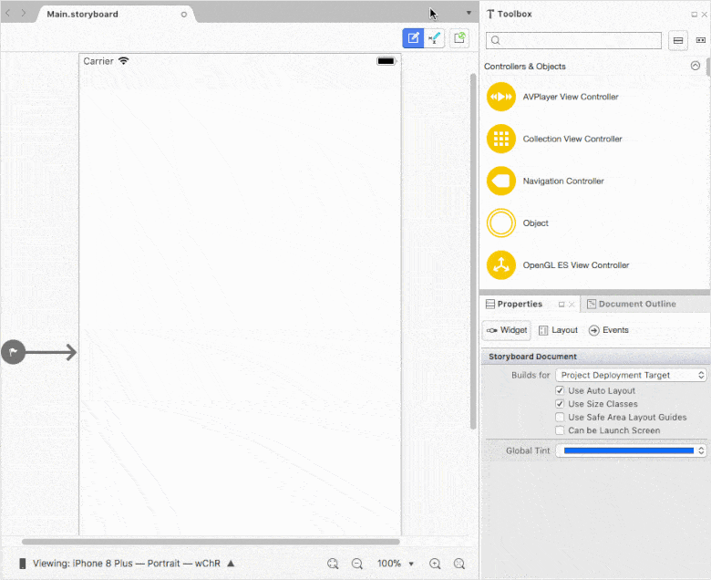

# Getting Started with Xamarin.iOS Charts (SfChart)

This section explains you the steps required to populate the Chart with data, title, add data labels and tooltips to the Chart. This section covers only the minimal features that you need to know to get started with the Chart.

## Adding Chart Reference

After installing Essential Studio for Xamarin, you can find all the required assemblies in the installation folders,

{Syncfusion Essential Studio Installed location}\Essential Studio\{{ site.releaseversion }}\Xamarin\lib

Eg: C:\Program Files (x86)\Syncfusion\Essential Studio\{{ site.releaseversion }}\Xamarin\lib

N> Assemblies can be found in unzipped package location in Mac

## NuGet configuration

To install the required NuGet for the SfChart control in the application, configure the NuGet packages of the Syncfusion components.

Refer to the following KB to configure the NuGet packages of the Syncfusion components:

[How to upgrade the newer versions of NuGet package](https://www.syncfusion.com/kb/6939/upgrading-to-newer-versions-of-nuget-package)

The following NuGet package should be installed to use the SfChart control in the application.

<table>
<tr>
<th> Project </th>
<th> Required package </th>
</tr>
<tr>
<td> Xamarin.iOS </td>
<td> Syncfusion.Xamarin.SfChart.IOS</td>
</tr>
</table>

### Adding SfChart reference

Syncfusion Xamarin components are available in [nuget.org](https://www.nuget.org/). To add SfChart to your project, open the NuGet package manager in Visual Studio, and search for [Syncfusion.Xamarin.SfChart.IOS](https://www.nuget.org/packages/Syncfusion.Xamarin.SfChart.ios/#), and then install it.

To know more about obtaining our components, refer to this [link](https://help.syncfusion.com/xamarin-ios/introduction/download-and-installation). Also, you have to add the following assembly reference to the Xamarin.iOS unified project mentioned in the table below.

<table>
<tr>
<th>Project</th>
<th>Required assemblies</th>
</tr>
<tr>
<td>Xamarin.iOS</td>
<td>Syncfusion.SFChart.iOS.dll</td>
</tr>
</table>

I> Starting with v16.2.0.x, if you reference Syncfusion assemblies from trial setup or from the NuGet feed, you also have to include a license key in your projects. Please refer to this [`link`](https://help.syncfusion.com/common/essential-studio/licensing/license-key) to know about registering Syncfusion license key in your Xamarin application to use our components.

## Initialize Chart

You can add [`SFChart`](https://help.syncfusion.com/cr/xamarin-ios/Syncfusion.SfChart.iOS.SFChart.html) to storyboard from toolbox and preview the output in designer. The other elements of the chart such as axis, series, and legend can be customized using C# code.

Import the [`SFChart`](https://help.syncfusion.com/cr/xamarin-ios/Syncfusion.SfChart.iOS.SFChart.html) namespace as shown below in your respective Page,


using Syncfusion.SfChart.iOS;


Then initialize an empty chart with [`PrimaryAxis`](https://help.syncfusion.com/cr/xamarin-ios/Syncfusion.SfChart.iOS.ChartBase.html#Syncfusion_SfChart_iOS_ChartBase_PrimaryAxis) and [`SecondaryAxis`](https://help.syncfusion.com/cr/xamarin-ios/Syncfusion.SfChart.iOS.ChartBase.html#Syncfusion_SfChart_iOS_ChartBase_SecondaryAxis) as shown below,

 
public override void ViewDidLoad ()
{
    base.ViewDidLoad ();

    //Initialize the Chart with required frame. This frame can be any rectangle, which bounds inside the view.
    SFChart chart = new SFChart ();
    chart.Frame   = this.View.Frame;

    //Adding Primary Axis for the Chart.
    SFCategoryAxis primaryAxis = new SFCategoryAxis ();
    chart.PrimaryAxis          = primaryAxis;

    //Adding Secondary Axis for the Chart.
    SFNumericalAxis secondaryAxis = new SFNumericalAxis ();
    chart.SecondaryAxis           = secondaryAxis; 

    this.View.AddSubview (chart);
}


Run the project and check if you get following output to make sure you have configured your project properly to add [`SFChart`](https://help.syncfusion.com/cr/xamarin-ios/Syncfusion.SfChart.iOS.SFChart.html).

## Populate Chart with data

To visualize the comparison of person heights in chart data, create an instance of [`SFColumnSeries`](https://help.syncfusion.com/cr/xamarin-ios/Syncfusion.SfChart.iOS.SFColumnSeries.html), add it to the [`Series`](https://help.syncfusion.com/cr/xamarin-ios/Syncfusion.SfChart.iOS.ChartBase.html#Syncfusion_SfChart_iOS_ChartBase_Series) collection property of [`SFChart`](https://help.syncfusion.com/cr/xamarin-ios/Syncfusion.SfChart.iOS.SFChart.html), and then set actual `Data` collection to the [`ItemsSource`](https://help.syncfusion.com/cr/xamarin-ios/Syncfusion.SfChart.iOS.SFSeries.html#Syncfusion_SfChart_iOS_SFSeries_ItemsSource) property of [`SFSeries`](https://help.syncfusion.com/cr/xamarin-ios/Syncfusion.SfChart.iOS.SFSeries.html) as demonstrated in the following code snippet..

N> You need to get the `Name` and `Height` values in `Data` collection to [`SFColumnSeries`](https://help.syncfusion.com/cr/xamarin-ios/Syncfusion.SfChart.iOS.SFColumnSeries.html) by setting [`XBindingPath`](https://help.syncfusion.com/cr/xamarin-ios/Syncfusion.SfChart.iOS.SFSeries.html#Syncfusion_SfChart_iOS_SFSeries_XBindingPath) and [`YBindingPath`](https://help.syncfusion.com/cr/xamarin-ios/Syncfusion.SfChart.iOS.SFXyDataSeries.html#Syncfusion_SfChart_iOS_SFXyDataSeries_YBindingPath) with respective field names to plot the series.


//Initializing primary axis
SFCategoryAxis primaryAxis = new SFCategoryAxis();

primaryAxis.Title.Text = new NSString("Name");

chart.PrimaryAxis = primaryAxis;

//Initializing secondary Axis
SFNumericalAxis secondaryAxis = new SFNumericalAxis();

secondaryAxis.Title.Text = new NSString("Height (in cm)");

chart.SecondaryAxis = secondaryAxis;

ObservableCollection<ChartData> Data = new ObservableCollection<ChartData>()
{
    new ChartData { Name = "David", Height = 180 },
    new ChartData { Name = "Michael", Height = 170 },
    new ChartData { Name = "Steve", Height = 160 },
    new ChartData { Name = "Joel", Height = 182 }
};
            

//Initializing column series
SFColumnSeries series = new SFColumnSeries();

series.ItemsSource = Data;

series.XBindingPath = "Name";

series.YBindingPath = "Height";

chart.Series.Add(series);




public class ChartData   
{   
    public string Name { get; set; }

    public double Height { get; set; }
}
 

## Add Title

You can add title to chart to provide quick information to the user about the data being plotted in the chart. You can set title using [`SFChart.Title`](https://help.syncfusion.com/cr/xamarin-ios/Syncfusion.SfChart.iOS.ChartBase.html#Syncfusion_SfChart_iOS_ChartBase_Title) property as shown below.

 
chart.Title.Text = "Chart";


Refer this [link](https://help.syncfusion.com/xamarin-ios/sfchart/chart-title) to learn more about the options available in [`SfChart`](https://help.syncfusion.com/cr/xamarin-ios/Syncfusion.SfChart.iOS.SFChart.html) to customize chart title.

## Enable data labels

You can add data labels to improve the readability of the chart. This can be achieved using [`SFSeries.DataMarker`](https://help.syncfusion.com/cr/xamarin-ios/Syncfusion.SfChart.iOS.SFSeries.html#Syncfusion_SfChart_iOS_SFSeries_DataMarker) property as shown below.

 
series.DataMarker.ShowLabel = true;


Refer this [link](https://help.syncfusion.com/xamarin-ios/sfchart/data-marker) to learn more about the options available in [`SfChart`](https://help.syncfusion.com/cr/xamarin-ios/Syncfusion.SfChart.iOS.SFChart.html) to customize data markers.

## Enable legend

You can enable legend using [`SFChart.Legend`](https://help.syncfusion.com/cr/xamarin-ios/Syncfusion.SfChart.iOS.SFChart.html#Syncfusion_SfChart_iOS_SFChart_Legend) property as shown below,

 
chart.Legend.Visible = true;


Additionally, you need to set label for each series using [`SFSeries.Label`](https://help.syncfusion.com/cr/xamarin-ios/Syncfusion.SfChart.iOS.SFSeries.html#Syncfusion_SfChart_iOS_SFSeries_Label) property, which will be displayed in corresponding legend.

 
series.Label = "Heights";


Refer this [link](https://help.syncfusion.com/xamarin-ios/sfchart/legend) to learn more about the options available in [`SfChart`](https://help.syncfusion.com/cr/xamarin-ios/Syncfusion.SfChart.iOS.SFChart.html) to customize legend.

## Enable tooltip

Tooltips are used to show information about the segment, when you tap on the segment. You can enable tooltip by setting [`SFSeries.EnableTooltip`](https://help.syncfusion.com/cr/xamarin-ios/Syncfusion.SfChart.iOS.SFSeries.html#Syncfusion_SfChart_iOS_SFSeries_EnableTooltip) property to true.

 
series.EnableTooltip = true;


Refer this [link](https://help.syncfusion.com/xamarin-ios/sfchart/tooltip) to learn more about the options available in [`SfChart`](https://help.syncfusion.com/cr/xamarin-ios/Syncfusion.SfChart.iOS.SFChart.html) to customize tooltip.

The following code example gives you the complete code of above configurations.

 
using Syncfusion.SfChart.iOS;

namespace Chart_GettingStarted
{
	public partial class ViewController : UIViewController
	{
		public override void ViewDidLoad()
		{
			base.ViewDidLoad();

			//Initialize the Chart with required frame. This frame can be any rectangle, which bounds inside the view.
			SFChart chart = new SFChart();
			chart.Title.Text = "Chart";
			chart.Frame = this.View.Frame;
            
			//Adding Primary Axis for the Chart.
			SFCategoryAxis primaryAxis = new SFCategoryAxis();
			primaryAxis.Title.Text = new NSString("Name");
			chart.PrimaryAxis = primaryAxis;

			//Adding Secondary Axis for the Chart.
			SFNumericalAxis secondaryAxis = new SFNumericalAxis();
			secondaryAxis.Title.Text = new NSString("Height (in cm)");
			chart.SecondaryAxis = secondaryAxis;
            
            ObservableCollection<ChartData> Data = new ObservableCollection<ChartData>()
            {
                new ChartData { Name = "David", Height = 180 },
                new ChartData { Name = "Michael", Height = 170 },
                new ChartData { Name = "Steve", Height = 160 },
                new ChartData { Name = "Joel", Height = 182 }
            };

			//Initializing column series
			SFColumnSeries series = new SFColumnSeries();
			series.ItemsSource = Data;
			series.XBindingPath = "Name";
			series.YBindingPath = "Height";
			
			series.DataMarker.ShowLabel = true;
			series.Label = "Heights";
			series.EnableTooltip = true;
			
			chart.Series.Add(series);
			chart.Legend.Visible = true;
			this.View.AddSubview(chart);
		}
}

			
The following output is displayed as a result of the above code example.

You can find the complete getting started sample from this [here.](http://files2.syncfusion.com/Xamarin.iOS/Samples/Chart_GettingStarted.zip )

