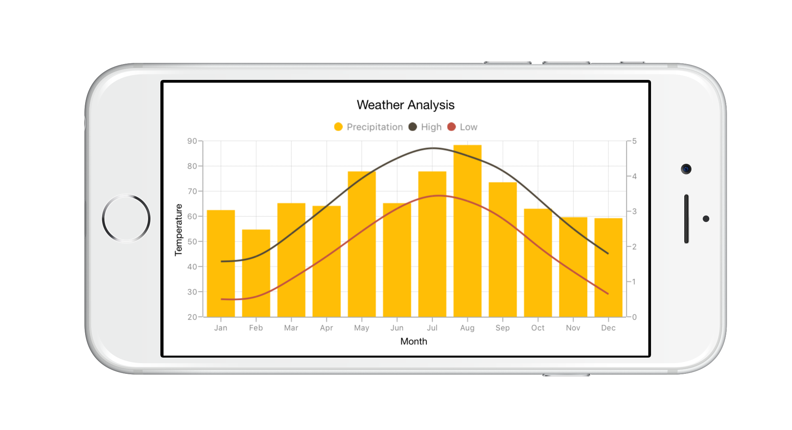

# Getting Started 
## Create your first Chart in Xamarin.iOS

This section provides a quick overview for working with Essential Chart for Xamarin.iOS. It walks you through the entire process of creating a real-world Chart.

This section is to help you visualize the weather data for Washington, DC, during the period 1961-1990. The raw sample data is given as follows.

Table 3: Weather Data Sample

<table>
<tr>
<th>
Month</th><th>
High</th><th>
Low</th><th>
Precipitation</th></tr>
<tr>
<td>
January</td><td>
42</td><td>
27</td><td>
3.03</td></tr>
<tr>
<td>
February</td><td>
44</td><td>
28</td><td>
2.48</td></tr>
<tr>
<td>
March</td><td>
53</td><td>
35</td><td>
3.23</td></tr>
<tr>
<td>
April</td><td>
64</td><td>
44</td><td>
3.15</td></tr>
<tr>
<td>
May</td><td>
75</td><td>
54</td><td>
4.13</td></tr>
<tr>
<td>
June</td><td>
83</td><td>
63</td><td>
3.23</td></tr>
<tr>
<td>
July</td><td>
87</td><td>
68</td><td>
4.13</td></tr>
<tr>
<td>
August</td><td>
84</td><td>
66</td><td>
4.88</td></tr>
<tr>
<td>
September</td><td>
78</td><td>
59</td><td>
3.82</td></tr>
<tr>
<td>
October</td><td>
67</td><td>
48</td><td>
3.07</td></tr>
<tr>
<td>
November</td><td>
55</td><td>
38</td><td>
2.83</td></tr>
<tr>
<td>
December</td><td>
45</td><td>
29</td><td>
2.8</td></tr>
</table>

This is how the final output looks like on iOS devices.

### Reference Essential Studio Components in your Solution

After installing Essential Studio for Xamarin, you can find all the required assemblies in the installation folders, typically:

{Syncfusion Installed location}\Essential Studio\{version number}\lib

N> Assemblies are available in unzipped package location in Mac.

You have to add the following assembly reference to the iOS unified project

ios-unifed\Syncfusion.SfChart.iOS.dll

### Add and Configure Chart

The following steps explain how to create a Chart and configure its elements.

1. Create an instance of SfChart.

 

public override void ViewDidLoad ()
{
    base.ViewDidLoad ();

    //Initialize the Chart with required frame. This frame can be any rectangle, which bounds inside the view.
    SFChart chart = new SFChart ();
    chart.Frame   = this.View.Frame;
}


2.Add the primary and secondary axes for the Chart as follows.

 

//Adding Primary Axis for the Chart.
SFCategoryAxis primaryAxis = new SFCategoryAxis ();
primaryAxis.Title.Text     = "Month";
chart.PrimaryAxis          = primaryAxis;

//Adding Secondary Axis for the Chart.
SFNumericalAxis secondaryAxis = new SFNumericalAxis ();
secondaryAxis.Title.Text      = "Temperature";
chart.SecondaryAxis           = secondaryAxis; 


3.A title for the Chart is set using the Title property as follows.

  

//Define the title for the Chart.

chart.Title.Text = "Weather Analysis";


### Add a Chart series

In this example is visualized the temperature over the months using a Spline Series. Before creating the series, you have to create the data source representing the climate details. 

In SFChart, series, the data source must be the collection of SfChartDataPoint__objects. Add the following class by inheriting from SfChartDataSource, for generating the data points.



/// 

/// Class acts as a data model for the chart by inheriting 'SFChartDataSource'.
/// 

public class ChartDataModel : SFChartDataSource
{
    NSMutableArray highTemperature;
    NSMutableArray lowTemperature;
    NSMutableArray precipitation;

    public ChartDataModel ()
    {
     	highTemperature   = new NSMutableArray ();
        lowTemperature    = new NSMutableArray ();
        precipitation     = new NSMutableArray ();

        AddDataPointsForChart ("Jan", 42, 27, 3.03);
        AddDataPointsForChart ("Feb", 44, 28, 2.48);
        AddDataPointsForChart ("Mar", 53, 35, 3.23);
        AddDataPointsForChart ("Apr", 64, 44, 3.15);
        AddDataPointsForChart ("May", 75, 54, 4.13);
        AddDataPointsForChart ("Jun", 83, 63, 3.23);
        AddDataPointsForChart ("Jul", 87, 68, 4.13);
        AddDataPointsForChart ("Aug", 84, 66, 4.88);
        AddDataPointsForChart ("Sep", 78, 59, 3.82);
        AddDataPointsForChart ("Oct", 67, 48, 3.07);
        AddDataPointsForChart ("Nov", 55, 38, 2.83);
        AddDataPointsForChart ("Dec", 45, 29, 2.80);
    }

    void AddDataPointsForChart (String month, Double high, Double low, Double ppt)
    {
        highTemperature.Add (new SFChartDataPoint (NSObject.FromObject (month), NSObject.FromObject (high)));
        lowTemperature.Add (new SFChartDataPoint (NSObject.FromObject (month), NSObject.FromObject (low)));                                                                                       
        precipitation.Add (new SFChartDataPoint (NSObject.FromObject (month), NSObject.FromObject (ppt)));
    }
}


Then you need to override the following four methods to generate series for the Chart.

* NumberOfSeriesInChart- Returns an integer that represents the number of series to be added to SfChart.
* GetSeries- Returns a series object, like the SfSeries, for the Chart at a particular index.
* GetDataPoint- Returns each data point to be plotted in the series.
* GetNumberOfDataPoints- Returns the number of data points required.

There is also an optional method.

* GetDataPoints- Returns an array of data points to be plotted in the series based on series index.

The following is the code example to implement the SfChartDataSource.



[Export ("numberOfSeriesInChart:")]
public override int NumberOfSeriesInChart (SFChart chart)
{
    return 3; //returns no of series required for the chart.
}

[Export ("chart:seriesAtIndex:")]
public override SFSeries GetSeries (SFChart chart, int index)
{
    //returns the series for the chart.
    SFSplineSeries series  = new SFSplineSeries ();
    series.Label           = "High";
    return series;
}

[Export ("chart:dataPointAtIndex:forSeriesAtIndex:")]
public override SFChartDataPoint GetDataPoint (SFChart chart, int index, int seriesIndex)
{
    //returns the datapoint for each series.
    return highTemperature.GetItem<SFChartDataPoint> (index);
}

[Export ("chart:numberOfDataPointsForSeriesAtIndex:")]
public override int GetNumberOfDataPoints (SFChart chart, int index)
{
    return 12;
    //No of datapoints needed for each series.
}


Since the ChartDataModel class implements SfChartDataSource, you can create the new instance of ChartDataModel class and then set the instance of ChartDataModel to data source for SfChart. Also, SfChart can be added as sub-view of View Controller’s view as follows.



//Defining the data source for the Chart.
ChartDataModel dataModel  = new ChartDataModel ();
chart.DataSource          = dataModel as SFChartDataSource;

//Adding our Chart as a sub view.
this.View.AddSubview (chart);


### Add Legend 

Legend can be enabled in SfChart by setting the Legend Visible property to True as follows.



//Adding legend to the Chart.

chart.Legend.Visible = true;


### Add Multiple Series to the Chart

You can add two SfSplineSeries for displaying high and low temperatures and a SfColumnSeries for displaying the precipitation.

Visualized so far, is the high temperature data over time. You can visualize other data such as low temperature and precipitation.



[Export ("chart:seriesAtIndex:")]
public override SFSeries GetSeries (SFChart chart, int index)
{
    //returns the series for the chart.
    if (index == 1) 
    {
    	SFSplineSeries series   = new SFSplineSeries ();
       	series.Label            = "High";
        return series;
    } 
    else if (index == 2) 
    {
        SFSplineSeries series   = new SFSplineSeries ();
        series.Label            = "Low";
        return series;
    } 
    else 
    {
        SFColumnSeries series = new SFColumnSeries ();
        series.Label          = "Precipitation";
        return series;
    }
}


From the data source implementation methods you need to change the number of series to be added to SfChart as follows.



[Export ("numberOfSeriesInChart:")]

public override int NumberOfSeriesInChart (SFChart chart)
{
    return 3; //returns no of series required for the chart.
}


Then you need to add SfSeries objects for low temperature and precipitation to SfChart by using the chart:seriesAtIndex method as follows.



[Export ("chart:seriesAtIndex:")]
public override SFSeries GetSeries (SFChart chart, int index)
{
    //returns the series for the chart.
    if (index == 1) 
    {
        SFSplineSeries series    = new SFSplineSeries ();
        series.Label             = "High";
        return series;
    } 
    else if (index == 2) 
    {
         SFSplineSeries series   = new SFSplineSeries ();
         series.Label            = "Low";
         return series;
    } 
    else 
    {
        SFColumnSeries series   = new SFColumnSeries ();
        series.Label            = "Precipitation";
        SFNumericalAxis axis    = new SFNumericalAxis ();
        axis.OpposedPosition    = true;
        axis.ShowMajorGridLines = false;
        series.YAxis = axis;
        return series;
    }
}



Finally, you need to set low temperature data points and precipitation data points, to the series, based on series index as follows.



[Export ("chart:dataPointAtIndex:forSeriesAtIndex:")]
public override SFChartDataPoint GetDataPoint (SFChart chart, int index, int seriesIndex)
{
    //returns the datapoint for each series.
    
    if (seriesIndex == 1) 
    {
        return highTemperature.GetItem<SFChartDataPoint> (index);
    } 
    else if (seriesIndex == 2) 
    {
        return lowTemperature.GetItem<SFChartDataPoint> (index);
    } 
    else 
    {
        return precipitation.GetItem<SFChartDataPoint> (index);
    }
}


### Add Multiple Axes to the Chart

You can add a secondary axis, y-axis, to the chart by setting the yAxis property of SfSeries. In the above code example, you can add axis to the series as follows.



// Adding the SFColumnSeries with different scale 

SFColumnSeries series      = new SFColumnSeries ();
series.Label               = "Precipitation";
SFNumericalAxis axis       = new SFNumericalAxis ();
axis.OpposedPosition       = true;
axis.ShowMajorGridLines    = false;
series.YAxis               = axis; 


The opposedPosition is set to True to place the secondary axis on the opposite side.

The following is the code example for creating the Chart.



public partial class GettingStarted_iOSViewController : UIViewController
{
    public GettingStarted_iOSViewController (IntPtr handle) : base (handle)
    {
        
    }

    public override void DidReceiveMemoryWarning ()
    {
        // Releases the view if it doesn't have a superview.
        base.DidReceiveMemoryWarning ();

        // Release any cached data, images, etc that aren't in use.
    }

    #region View lifecycle

    public override void ViewDidLoad ()
    {
        base.ViewDidLoad ();
        //Initialize the Chart with required frame. This frame can be any rectangle, which bounds inside the view.
        SFChart chart      = new SFChart ();
        chart.Frame        = this.View.Frame;

        //Define the title for the Chart.
        chart.Title.Text   = "Weather Analysis";

        //Adding legend to the Chart.
        chart.Legend.Visible = true;

        //Adding Primary Axis for the Chart.
        SFCategoryAxis primaryAxis = new SFCategoryAxis ();
        primaryAxis.Title.Text     = "Month";

        chart.PrimaryAxis   = primaryAxis;

        //Adding Secondary Axis for the Chart.
        SFNumericalAxis secondaryAxis = new SFNumericalAxis ();
        secondaryAxis.Title.Text      = "Temperature";

        chart.SecondaryAxis           = secondaryAxis;

        //Defining the data source for the Chart.
        ChartDataModel dataModel      = new ChartDataModel ();
        chart.DataSource              = dataModel as SFChartDataSource;

        //Adding our Chart as a sub view.
        this.View.AddSubview (chart);

        // Perform any additional setup after loading the view, typically from a nib.
    }

    public override void ViewWillAppear (bool animated)
    {
       base.ViewWillAppear (animated);
    }

    public override void ViewDidAppear (bool animated)
    {
       base.ViewDidAppear (animated);
    }

    public override void ViewWillDisappear (bool animated)
    {
       base.ViewWillDisappear (animated);
    }

    public override void ViewDidDisappear (bool animated)
    {
       base.ViewDidDisappear (animated);
    }

      #endregion
    }

/// 

/// Class acts as a data model for the chart by inheriting 'SFChartDataSource'.
/// 

    public class ChartDataModel : SFChartDataSource
    {
        NSMutableArray highTemperature;
        NSMutableArray lowTemperature;
        NSMutableArray precipitation;

        public ChartDataModel ()
        {
            highTemperature   = new NSMutableArray ();
            lowTemperature    = new NSMutableArray ();
            precipitation     = new NSMutableArray ();

            AddDataPointsForChart ("Jan", 42, 27, 3.03);
            AddDataPointsForChart ("Feb", 44, 28, 2.48);
            AddDataPointsForChart ("Mar", 53, 35, 3.23);
            AddDataPointsForChart ("Apr", 64, 44, 3.15);
            AddDataPointsForChart ("May", 75, 54, 4.13);
            AddDataPointsForChart ("Jun", 83, 63, 3.23);
            AddDataPointsForChart ("Jul", 87, 68, 4.13);
            AddDataPointsForChart ("Aug", 84, 66, 4.88);
            AddDataPointsForChart ("Sep", 78, 59, 3.82);
            AddDataPointsForChart ("Oct", 67, 48, 3.07);
            AddDataPointsForChart ("Nov", 55, 38, 2.83);
            AddDataPointsForChart ("Dec", 45, 29, 2.80);
        }

/// 

/// Method to populate the array required for all the series.
/// 

/// <param name="month">Month.</param>
/// <param name="high">High Temperature.</param>
/// <param name="low">Low Temperature.</param>
/// <param name="ppt">Precipitation.</param>
      void AddDataPointsForChart (String month, Double high, Double low, Double ppt)
      {
            highTemperature.Add (new SFChartDataPoint (NSObject.FromObject (month), NSObject.FromObject (high)));

            lowTemperature.Add (new SFChartDataPoint (NSObject.FromObject (month), NSObject.FromObject (low)));

            precipitation.Add (new SFChartDataPoint (NSObject.FromObject (month), NSObject.FromObject (ppt)));
      }

      [Export ("numberOfSeriesInChart:")]
       public override int NumberOfSeriesInChart (SFChart chart)
       {
            return 3; 
            //returns no of series required for the chart.
       }

       [Export ("chart:seriesAtIndex:")]
       public override SFSeries GetSeries (SFChart chart, int index)
       {
            //returns the series for the chart.
            if (index == 1) {
                SFSplineSeries series       = new SFSplineSeries ();
                series.Label                = "High";
                return series;
            } 
            else if (index == 2) {
                SFSplineSeries series       = new SFSplineSeries ();
                series.Label                = "Low";
                return series;
            } 
            else {
                SFColumnSeries series       = new SFColumnSeries ();
                series.Label                = "Precipitation";

                SFNumericalAxis axis        = new SFNumericalAxis ();
                axis.OpposedPosition        = true;
                axis.ShowMajorGridLines     = false;
                series.YAxis = axis;

                return series;
            }
        }

        [Export ("chart:dataPointAtIndex:forSeriesAtIndex:")]
        public override SFChartDataPoint GetDataPoint (SFChart chart, int index, int seriesIndex)
        {
            //returns the datapoint for each series.
            if (seriesIndex == 1) {
                return highTemperature.GetItem<SFChartDataPoint> (index);
            } else if (seriesIndex == 2) {
                return lowTemperature.GetItem<SFChartDataPoint> (index);
            } else {
                return precipitation.GetItem<SFChartDataPoint> (index);
            }
        }

        [Export ("chart:numberOfDataPointsForSeriesAtIndex:")]
        public override int GetNumberOfDataPoints (SFChart chart, int index)
        {
            return 12; 
            //No of datapoints needed for each series.
        }
    } 


### Output:

