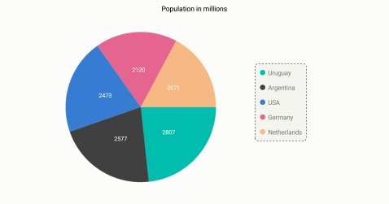
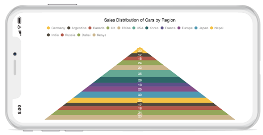

# Legend

The [`Legend`](https://help.syncfusion.com/cr/cref_files/xamarin-ios/Syncfusion.SFChart.iOS~Syncfusion.SfChart.iOS.SFChart~Legend.html) contains list of chart series/data points in the chart. The information provided in each legend item helps in identifying the corresponding data series in chart.

Following code example shows how to enable legend in a chart.



chart.Legend.Visible = true;


## Customizing background & border

The [`Legend`](https://help.syncfusion.com/cr/cref_files/xamarin-ios/Syncfusion.SFChart.iOS~Syncfusion.SfChart.iOS.SFChart~Legend.html) provides following properties to customize the legend area border and background. 

* [`BackgroundColor`](https://help.syncfusion.com/cr/cref_files/xamarin-ios/Syncfusion.SFChart.iOS~Syncfusion.SfChart.iOS.SFChartLegend~BackgroundColor.html) - used to change legend background color.
* [`BorderColor`](https://help.syncfusion.com/cr/cref_files/xamarin-ios/Syncfusion.SFChart.iOS~Syncfusion.SfChart.iOS.SFChartLegend~BorderColor.html) - used to change legend border color.
* [`BorderWidth`](https://help.syncfusion.com/cr/cref_files/xamarin-ios/Syncfusion.SFChart.iOS~Syncfusion.SfChart.iOS.SFChartLegend~BorderWidth.html) - used to change legend border width. 
* [`Dashes`](https://help.syncfusion.com/cr/cref_files/xamarin-ios/Syncfusion.SFChart.iOS~Syncfusion.SfChart.iOS.SFChartLegend~Dashes.html) - used to render legend border line with dashes.
* [`EdgeInsets`](https://help.syncfusion.com/cr/cref_files/xamarin-ios/Syncfusion.SFChart.iOS~Syncfusion.SfChart.iOS.SFChartLegend~EdgeInsets.html) - used to change the margin of the legend.
* [`CornerRadius`](https://help.syncfusion.com/cr/cref_files/xamarin-ios/Syncfusion.SFChart.iOS~Syncfusion.SfChart.iOS.SFChartLegend~CornerRadius.html) - used to add the rounded corners to the legend border rectangle. The TopLeft, TopRight, BottomLeft and BottomRight of ChartCornerRadius properties are used to set the radius value for each corner.



chart.Legend.BackgroundColor = UIColor.FromRGB(245, 245, 240);
chart.Legend.BorderColor = UIColor.Black;
chart.Legend.BorderWidth = 2;
chart.Legend.EdgeInsets = new UIEdgeInsets(5, 5, 5, 5);
chart.Legend.CornerRadius = new ChartCornerRadius(5);

NSObject[] dashes = new NSObject[2];
dashes[0] = (NSNumber)3;
dashes[1] = (NSNumber)3;
chart.Legend.Dashes = NSArray.FromObjects(dashes);



## Customizing Labels

The [`Label`](https://help.syncfusion.com/cr/cref_files/xamarin-ios/Syncfusion.SFChart.iOS~Syncfusion.SfChart.iOS.SFSeries~Label.html) property of [`SFSeries`](https://help.syncfusion.com/cr/cref_files/xamarin-ios/Syncfusion.SFChart.iOS~Syncfusion.SfChart.iOS.SFSeries.html) is used to define the label for the corresponding legend item of series. The appearance of the label can be customized using the [`LabelStyle`](https://help.syncfusion.com/cr/cref_files/xamarin-ios/Syncfusion.SFChart.iOS~Syncfusion.SfChart.iOS.SFChartLegend~LabelStyle.html) property.

* [`Color`](https://help.syncfusion.com/cr/cref_files/xamarin-ios/Syncfusion.SFChart.iOS~Syncfusion.SfChart.iOS.SFLegendLabelStyle~Color.html) – used to change the color of the label.
* [`Font`](https://help.syncfusion.com/cr/cref_files/xamarin-ios/Syncfusion.SFChart.iOS~Syncfusion.SfChart.iOS.SFLegendLabelStyle~Font.html) – used to change the text size, font family and font weight.
* [`Margin`](https://help.syncfusion.com/cr/cref_files/xamarin-ios/Syncfusion.SFChart.iOS~Syncfusion.SfChart.iOS.SFLegendLabelStyle~Margin.html) - used to change the margin size for labels.



chart.Legend.LabelStyle.Color  = UIColor.Blue;

chart.Legend.LabelStyle.Font   = UIFont.BoldSystemFontOfSize (18);

chart.Legend.LabelStyle.Margin = new UIEdgeInsets (0, 5, 0, 5);


## Legend Icons

The legend icons are enabled by default, however, you can control its visibility using [`IsIconVisible`](https://help.syncfusion.com/cr/cref_files/xamarin-ios/Syncfusion.SFChart.iOS~Syncfusion.SfChart.iOS.SFChartLegend~IsIconVisible.html) property. The icon type also can be specified using the [`LegendIcon`](https://help.syncfusion.com/cr/cref_files/xamarin-ios/Syncfusion.SFChart.iOS~Syncfusion.SfChart.iOS.SFSeries~LegendIcon.html) property in [`SFSeries`](https://help.syncfusion.com/cr/cref_files/xamarin-ios/Syncfusion.SFChart.iOS~Syncfusion.SfChart.iOS.SFSeries.html). Default icon type is [`Circle`](https://help.syncfusion.com/cr/cref_files/xamarin-ios/Syncfusion.SFChart.iOS~Syncfusion.SfChart.iOS.SFChartLegendIcon.html). [`IconWidth`](https://help.syncfusion.com/cr/cref_files/xamarin-ios/Syncfusion.SFChart.iOS~Syncfusion.SfChart.iOS.SFChartLegend~IconWidth.html) and [`IconHeight`](https://help.syncfusion.com/cr/cref_files/xamarin-ios/Syncfusion.SFChart.iOS~Syncfusion.SfChart.iOS.SFChartLegend~IconHeight.html) properties are used to adjust the width and height of the legend icons respectively.



chart.Legend.IsIconVisible  = true;
chart.Legend.IconHeight     = 20;
chart.Legend.IconWidth      = 20;

SFPieSeries series          = new SFPieSeries ();
series.LegendIcon           = SFChartLegendIcon.SeriesType;


## Legend Title

The following properties are used to define and customize the [`Title`](https://help.syncfusion.com/cr/cref_files/xamarin-ios/Syncfusion.SFChart.iOS~Syncfusion.SfChart.iOS.SFChartLegend~Title.html) of legend.

* [`Text`](https://help.syncfusion.com/cr/cref_files/xamarin-ios/Syncfusion.SFChart.iOS~Syncfusion.SfChart.iOS.SFChartTitle~Text.html) – used to change the title text.
* [`TextColor`](https://help.syncfusion.com/cr/cref_files/xamarin-ios/Syncfusion.SFChart.iOS~Syncfusion.SfChart.iOS.SFChartTitle~TextColor.html) – used to change the color of the title text.
* [`Font`](https://help.syncfusion.com/cr/cref_files/xamarin-ios/Syncfusion.SFChart.iOS~Syncfusion.SfChart.iOS.SFChartTitle~Font.html) – used to change the text size, font family and font weight of the title.
* [`EdgeInsets`](https://help.syncfusion.com/cr/cref_files/xamarin-ios/Syncfusion.SFChart.iOS~Syncfusion.SfChart.iOS.SFChartTitle~EdgeInsets.html) – used to change the margin size for title.
* [`TextAlignment`](https://help.syncfusion.com/cr/cref_files/xamarin-ios/Syncfusion.SFChart.iOS~Syncfusion.SfChart.iOS.SFChartTitle~TextAlignment.html) – used to change the alignment of the title text, it can be start, end and center.
* [`BackgroundColor`](https://help.syncfusion.com/cr/cref_files/xamarin-ios/Syncfusion.SFChart.iOS~Syncfusion.SfChart.iOS.SFChartTitle~BackgroundColor.html) – used to change the title background color.
* [`BorderColor`](https://help.syncfusion.com/cr/cref_files/xamarin-ios/Syncfusion.SFChart.iOS~Syncfusion.SfChart.iOS.SFChartTitle~BorderColor.html) – used to change the border color.
* [`BorderWidth`](https://help.syncfusion.com/cr/cref_files/xamarin-ios/Syncfusion.SFChart.iOS~Syncfusion.SfChart.iOS.SFChartTitle~BorderWidth.html) – used to adjust the title border width.



chart.Legend.Title.Text             = "Years";	

chart.Legend.Title.TextColor        = UIColor.Red;

chart.Legend.Title.Font             = UIFont.BoldSystemFontOfSize (20);

chart.Legend.Title.TextAlignment    = UITextAlignment.Center;

chart.Legend.Title.BackgroundColor  = UIColor.Gray;

chart.Legend.Title.BorderColor      = UIColor.Blue;

chart.Legend.Title.BorderWidth      = 3;


## Toggle the series visibility

You can control the visibility of the series by tapping on the legend item. You can enable this feature by using [`ToggleSeriesVisibility`](https://help.syncfusion.com/cr/cref_files/xamarin-ios/Syncfusion.SFChart.iOS~Syncfusion.SfChart.iOS.SFChartLegend~ToggleSeriesVisibility.html) property.



chart.Legend.ToggleSeriesVisibility = true;


## Legend visibility

The [`Visible`](https://help.syncfusion.com/cr/cref_files/xamarin-ios/Syncfusion.SFChart.iOS~Syncfusion.SfChart.iOS.SFChartLegend~Visible.html) property of [`SFChartLegend`](https://help.syncfusion.com/cr/cref_files/xamarin-ios/Syncfusion.SFChart.iOS~Syncfusion.SfChart.iOS.SFChartLegend.html) is used to toggle the visibility of legend.



chart.Legend.Visible  = false;



## Legend item visibility

You can control the visibility of particular series legend item by using the [`VisibleOnLegend`](https://help.syncfusion.com/cr/cref_files/xamarin-ios/Syncfusion.SFChart.iOS~Syncfusion.SfChart.iOS.SFSeries~VisibleOnLegend.html) property of series. Default value of [`VisibleOnLegend`](https://help.syncfusion.com/cr/cref_files/xamarin-ios/Syncfusion.SFChart.iOS~Syncfusion.SfChart.iOS.SFSeries~VisibleOnLegend.html) is True.



SFColumnSeries series 	= new SFColumnSeries ();

series.VisibleOnLegend 	= true;


## Item margin

The [`ItemMargin`](https://help.syncfusion.com/cr/cref_files/xamarin-ios/Syncfusion.SFChart.iOS~Syncfusion.SfChart.iOS.SFChartLegend~ItemMargin.html) property is used to set the spacing between the legend items.



chart.Legend.ItemMargin = 20;



## Legend Wrap

The legend items can be placed in multiple rows by using [`OverflowMode`](http://help.syncfusion.com/cr/cref_files/xamarin-iOS/Syncfusion.SFChart.iOS~Syncfusion.SfChart.iOS.SFChartLegend~OverflowMode.html) property if size of the total legend exceeds the available size. The default value of [`OverflowMode`](http://help.syncfusion.com/cr/cref_files/xamarin-iOS/Syncfusion.SFChart.iOS~Syncfusion.SfChart.iOS.SFChartLegend~OverflowMode.html) property is [`Scroll`](https://help.syncfusion.com/cr/cref_files/xamarin-ios/Syncfusion.SFChart.iOS~Syncfusion.SfChart.iOS.ChartLegendOverflowMode.html).



    chart.Legend.Visible = true;

    chart.Legend.OverflowMode = ChartLegendOverflowMode.Wrap;



### Legend Width

The legend width can be specified by using [`MaxWidth`](http://help.syncfusion.com/cr/cref_files/xamarin-iOS/Syncfusion.SFChart.iOS~Syncfusion.SfChart.iOS.SFChartLegend~MaxWidth.html) property. This property works only when the [`OverflowMode`](http://help.syncfusion.com/cr/cref_files/xamarin-iOS/Syncfusion.SFChart.iOS~Syncfusion.SfChart.iOS.SFChartLegend~OverflowMode.html) is [`Wrap`](https://help.syncfusion.com/cr/cref_files/xamarin-ios/Syncfusion.SFChart.iOS~Syncfusion.SfChart.iOS.ChartLegendOverflowMode.html). The default value of [`MaxWidth`](http://help.syncfusion.com/cr/cref_files/xamarin-iOS/Syncfusion.SFChart.iOS~Syncfusion.SfChart.iOS.SFChartLegend~MaxWidth.html) property is double.NAN.



    chart.Legend.Visible = true;

    chart.Legend.OverflowMode = ChartLegendOverflowMode.Wrap;

    chart.Legend.MaxWidth = 280;



## Positioning the Legend

You can position the legend anywhere inside the chart. Following properties are used to customize the legend positions.

* [`DockPosition`](https://help.syncfusion.com/cr/cref_files/xamarin-ios/Syncfusion.SFChart.iOS~Syncfusion.SfChart.iOS.SFChartLegend~DockPosition.html)– used to position the legend relatively. Options available are: [`Left`](https://help.syncfusion.com/cr/cref_files/xamarin-ios/Syncfusion.SFChart.iOS~Syncfusion.SfChart.iOS.SFChartLegendPosition.html)., [`Right`](https://help.syncfusion.com/cr/cref_files/xamarin-ios/Syncfusion.SFChart.iOS~Syncfusion.SfChart.iOS.SFChartLegendPosition.html)., [`Top`](https://help.syncfusion.com/cr/cref_files/xamarin-ios/Syncfusion.SFChart.iOS~Syncfusion.SfChart.iOS.SFChartLegendPosition.html)., [`Bottom`](https://help.syncfusion.com/cr/cref_files/xamarin-ios/Syncfusion.SFChart.iOS~Syncfusion.SfChart.iOS.SFChartLegendPosition.html). and [`Floating`](https://help.syncfusion.com/cr/cref_files/xamarin-ios/Syncfusion.SFChart.iOS~Syncfusion.SfChart.iOS.SFChartLegendPosition.html). If the dock position is Floating, you can position the legend using x and y coordinates.
* [`OffsetX`](https://help.syncfusion.com/cr/cref_files/xamarin-ios/Syncfusion.SFChart.iOS~Syncfusion.SfChart.iOS.SFChartLegend~OffsetX.html)– used to move the legend on x coordinate by the given offset value, this will work only if the dock position is [`Floating`](https://help.syncfusion.com/cr/cref_files/xamarin-ios/Syncfusion.SFChart.iOS~Syncfusion.SfChart.iOS.SFChartLegendPosition.html).
* [`OffsetY`](https://help.syncfusion.com/cr/cref_files/xamarin-ios/Syncfusion.SFChart.iOS~Syncfusion.SfChart.iOS.SFChartLegend~OffsetY.html) - used to move the legend on y coordinate by the given offset value, this will work only if the dock position is [`Floating`](https://help.syncfusion.com/cr/cref_files/xamarin-ios/Syncfusion.SFChart.iOS~Syncfusion.SfChart.iOS.SFChartLegendPosition.html).
* [`Orientation`](https://help.syncfusion.com/cr/cref_files/xamarin-ios/Syncfusion.SFChart.iOS~Syncfusion.SfChart.iOS.SFChartLegend~Orientation.html) - used to change the legend items ordering direction. Options available are: [`Horizontal`](https://help.syncfusion.com/cr/cref_files/xamarin-ios/Syncfusion.SFChart.iOS~Syncfusion.SfChart.iOS.SFChartLegendOrientation.html) and [`Vertical`](https://help.syncfusion.com/cr/cref_files/xamarin-ios/Syncfusion.SFChart.iOS~Syncfusion.SfChart.iOS.SFChartLegendOrientation.html).



chart.Legend.DockPosition   = SFChartLegendPosition.Float;

chart.Legend.OffsetX        = 70;

chart.Legend.OffsetY        = 90;

chart.Legend.Orientation    = SFChartLegendOrientation.Vertical;


## Event

**LegendItemClicked**

The [`LegendItemClicked`](https://help.syncfusion.com/cr/cref_files/xamarin-ios/Syncfusion.SFChart.iOS~Syncfusion.SfChart.iOS.ChartBase~LegendItemClicked_EV.html) event is triggered when the chart legend item is clicked. This argument contains the following information.

* [`LegendItem`](https://help.syncfusion.com/cr/cref_files/xamarin-ios/Syncfusion.SFChart.iOS~Syncfusion.SfChart.iOS.ChartLegendItemClickedEventArgs~LegendItem.html) - Used to customize the label and appearance of individual legend item. 

**LegendItemCreated**

The [`LegendItemCreated`](https://help.syncfusion.com/cr/cref_files/xamarin-ios/Syncfusion.SFChart.iOS~Syncfusion.SfChart.iOS.ChartBase~LegendItemCreated_EV.html) event is triggered when the chart legend item is created. This argument contains the following information.

* [`LegendItem`](https://help.syncfusion.com/cr/cref_files/xamarin-ios/Syncfusion.SFChart.iOS~Syncfusion.SfChart.iOS.ChartLegendItemCreatedEventArgs~LegendItem.html) - Used to customize the label and appearance of individual legend item.

You can customize the legend item by using following properties of [`ChartLegendItem`](https://help.syncfusion.com/cr/cref_files/xamarin-ios/Syncfusion.SFChart.iOS~Syncfusion.SfChart.iOS.ChartLegendItem.html).

* [`Label`](https://help.syncfusion.com/cr/cref_files/xamarin-ios/Syncfusion.SFChart.iOS~Syncfusion.SfChart.iOS.ChartLegendItem~Label.html) - Used to get or set the legend item label.
* [`LabelStyle`](https://help.syncfusion.com/cr/cref_files/xamarin-ios/Syncfusion.SFChart.iOS~Syncfusion.SfChart.iOS.ChartLegendItem~LabelStyle.html) - Used to customize the appearance of legend labels. The properties listed in [`customizing label`](https://help.syncfusion.com/xamarin-ios/sfchart/legend#customizing-labels) can be customized using LabelStyle property.
* [`IconColor`](https://help.syncfusion.com/cr/cref_files/xamarin-ios/Syncfusion.SFChart.iOS~Syncfusion.SfChart.iOS.ChartLegendItem~IconColor.html) - Used to get or set the legend icon color.
* [`Index`](https://help.syncfusion.com/cr/cref_files/xamarin-ios/Syncfusion.SFChart.iOS~Syncfusion.SfChart.iOS.ChartLegendItem~Index.html) - Used to get the legend item index.
* [`DataPoint`](https://help.syncfusion.com/cr/cref_files/xamarin-ios/Syncfusion.SFChart.iOS~Syncfusion.SfChart.iOS.ChartLegendItem~DataPoint.html) - Used to get the legend item data point for accumulation series only.
* [`Series`](https://help.syncfusion.com/cr/cref_files/xamarin-ios/Syncfusion.SFChart.iOS~Syncfusion.SfChart.iOS.ChartLegendItem~Series.html) - Used to get respective chart series.
* [`View`](https://help.syncfusion.com/cr/cref_files/xamarin-ios/Syncfusion.SFChart.iOS~Syncfusion.SfChart.iOS.ChartLegendItem~View.html) - Used to get or set the legend item view.