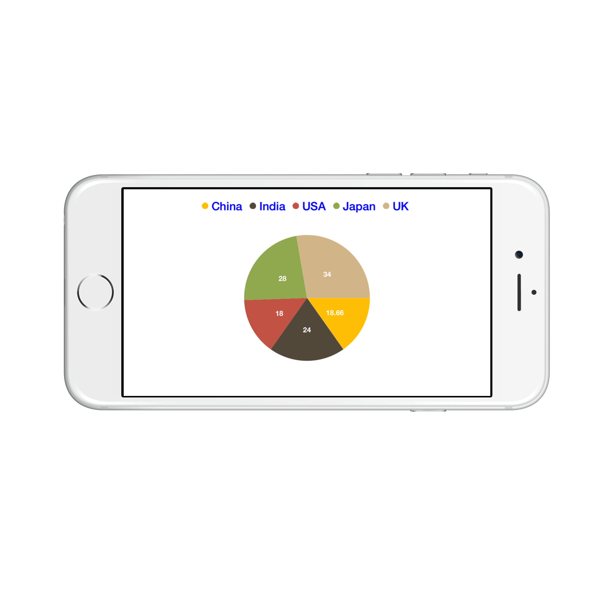

# Legend

Legend contains list of chart series/data points in the chart. The information provided in each legend item helps in identifying the corresponding data series in chart.

Following code example shows how to enable legend in a chart.



chart.Legend.Visible = true;


## Customizing Labels

`Label` property of `SFSeries` is used to define the label for the corresponding series legend item. The following properties are used to customize the legend items label appearance.

* `Color` – used to change the color of the label.
* `Font` – used to change the text size, font family and font weight.
* `Margin` - used to change the margin size for labels.



chart.Legend.LabelStyle.Color  = UIColor.Blue;

chart.Legend.LabelStyle.Font   = UIFont.BoldSystemFontOfSize (18);

chart.Legend.LabelStyle.Margin = new UIEdgeInsets (0, 5, 0, 5);


## Legend Icons

Legend icons are enabled by default, however, you can control its visibility using `IsIconVisible` property. Also you can specify the icon type using `LegendIcon` property in SFSeries. `IconWidth` and `IconHeight` properties are used to adjust the width and height of the legend icons respectively.



public override void ViewDidLoad ()
{
    chart.Legend.IsIconVisible  = true;

    chart.Legend.IconHeight     = 20;

    chart.Legend.IconWidth      = 20;
}

public override SFSeries GetSeries (SFChart chart, nint index)
{
    SFPieSeries series          = new SFPieSeries ();

    series.LegendIcon           = SFChartLegendIcon.SeriesType;

    series.DataMarker.ShowLabel = true;

    return series;
}



## Legend Title

Following properties are used to define and customize the legend title.

* `Text` – used to change the title text.
* `TextColor` – used to change the color of the title text.
* `Font` – used to change the text size, font family and font weight of the title.
* `EdgeInsets` – used to change the margin size for title.
* `TextAlignment` – used to change the alignment of the title text, it can be start, end and center.
* `BackgroundColor` – used to change the title background color.
* `BorderColor` – used to change the border color.
* `BorderWidth` – used to adjust the title border width.



chart.Legend.Title.Text             = new NSString ("Years");	

chart.Legend.Title.TextColor        = UIColor.Red;

chart.Legend.Title.Font             = UIFont.BoldSystemFontOfSize (20);

chart.Legend.Title.TextAlignment    = UITextAlignment.Center;

chart.Legend.Title.BackgroundColor  = UIColor.Gray;

chart.Legend.Title.BorderColor      = UIColor.Blue;

chart.Legend.Title.BorderWidth      = 3;


## Toggle the series visibility

You can control the visibility of the series by tapping on the legend item. You can enable this feature by using `ToggleSeriesVisibility` property.



chart.Legend.ToggleSeriesVisibility = true;


## Legend item visibility

You can control the visibility of particular series legend item by using the `VisibleOnLegend` property of series. Default value of `VisibleOnLegend` is True.



SFColumnSeries series 	= new SFColumnSeries ();

series.VisibleOnLegend 	= true;


## Positioning the Legend

You can position the legend anywhere inside the chart. Following properties are used to customize the legend positions.

* `DockPosition`– used to position the legend relatively. Options available are: Left, Right, Top, Bottom and Floating. If the dock position is Floating, you can position the legend using x and y coordinates.
* `OffsetX`– used to move the legend on x coordinate by the given offset value, this will work only if the dock position is Floating.
* `OffsetY` - used to move the legend on y coordinate by the given offset value, this will work only if the dock position is Floating.
* `Orientation` - used to change the legend items ordering direction. Options available are: Horizontal and Vertical.



chart.Legend.DockPosition   = SFChartLegendPosition.Float;

chart.Legend.OffsetX        = 70;

chart.Legend.OffsetY        = 90;

chart.Legend.Orientation    = SFChartLegendOrientation.Vertical;


