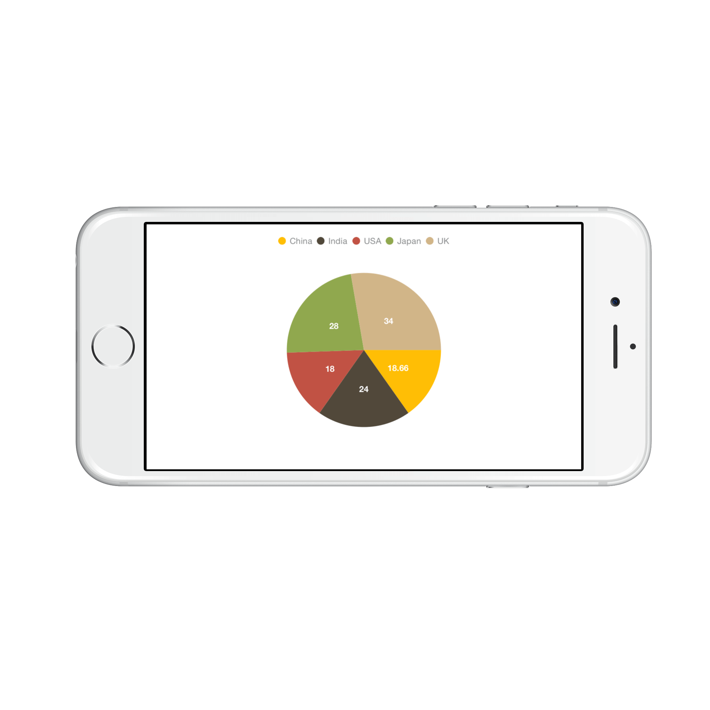
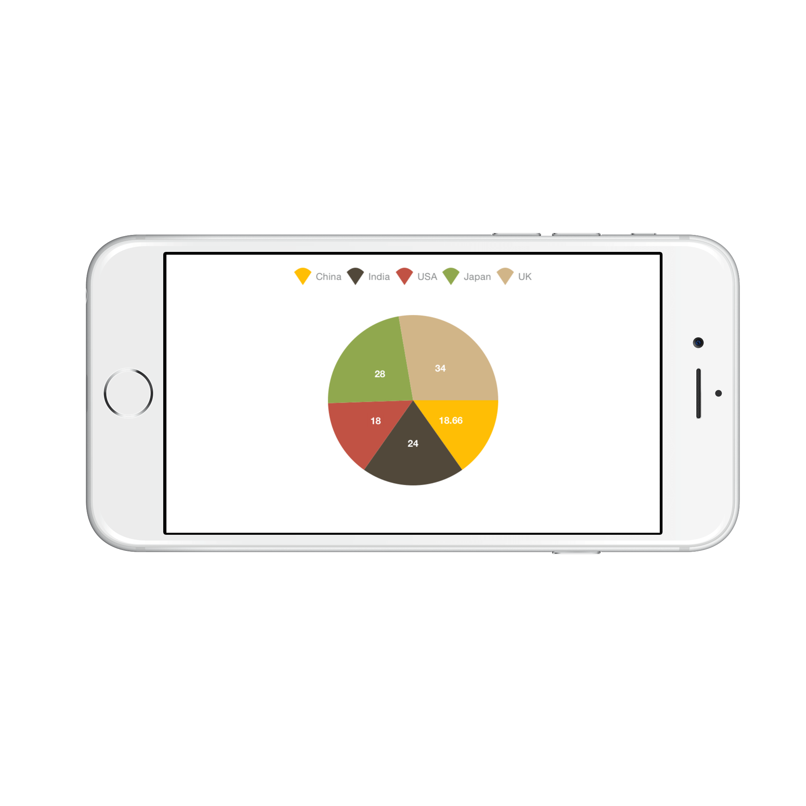
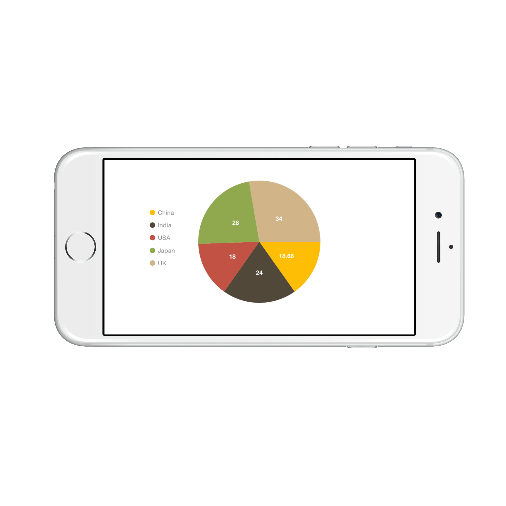

# Legend

Legend contains list of chart series/data points in the chart. The information provided in each legend item helps in identifying the corresponding data series in chart.

Following code example shows how to enable legend in a chart.



chart.Legend.Visible = true;


## Customizing Labels

[`Label`](https://help.syncfusion.com/cr/cref_files/xamarin-ios/sfchart/Syncfusion.SFChart.iOS~Syncfusion.SfChart.iOS.SFSeries~Label.html) property of [`SFSeries`](https://help.syncfusion.com/cr/cref_files/xamarin-ios/sfchart/Syncfusion.SFChart.iOS~Syncfusion.SfChart.iOS.SFSeries.html) is used to define the label for the corresponding series legend item. The following properties are used to customize the legend items label appearance.

* [`Color`](https://help.syncfusion.com/cr/cref_files/xamarin-ios/sfchart/Syncfusion.SFChart.iOS~Syncfusion.SfChart.iOS.SFLegendLabelStyle~Color.html) – used to change the color of the label.
* [`Font`](https://help.syncfusion.com/cr/cref_files/xamarin-ios/sfchart/Syncfusion.SFChart.iOS~Syncfusion.SfChart.iOS.SFLegendLabelStyle~Font.html) – used to change the text size, font family and font weight.
* [`Margin`](https://help.syncfusion.com/cr/cref_files/xamarin-ios/sfchart/Syncfusion.SFChart.iOS~Syncfusion.SfChart.iOS.SFLegendLabelStyle~Margin.html) - used to change the margin size for labels.



chart.Legend.LabelStyle.Color  = UIColor.Blue;

chart.Legend.LabelStyle.Font   = UIFont.BoldSystemFontOfSize (18);

chart.Legend.LabelStyle.Margin = new UIEdgeInsets (0, 5, 0, 5);


## Legend Icons

Legend icons are enabled by default, however, you can control its visibility using [`IsIconVisible`](https://help.syncfusion.com/cr/cref_files/xamarin-ios/sfchart/Syncfusion.SFChart.iOS~Syncfusion.SfChart.iOS.SFChartLegend~IsIconVisible.html) property. Also you can specify the icon type using [`LegendIcon`](https://help.syncfusion.com/cr/cref_files/xamarin-ios/sfchart/Syncfusion.SFChart.iOS~Syncfusion.SfChart.iOS.SFSeries~LegendIcon.html) property in [`SFSeries`](https://help.syncfusion.com/cr/cref_files/xamarin-ios/sfchart/Syncfusion.SFChart.iOS~Syncfusion.SfChart.iOS.SFSeries.html). [`IconWidth`](https://help.syncfusion.com/cr/cref_files/xamarin-ios/sfchart/Syncfusion.SFChart.iOS~Syncfusion.SfChart.iOS.SFChartLegend~IconWidth.html) and [`IconHeight`](https://help.syncfusion.com/cr/cref_files/xamarin-ios/sfchart/Syncfusion.SFChart.iOS~Syncfusion.SfChart.iOS.SFChartLegend~IconHeight.html) properties are used to adjust the width and height of the legend icons respectively.



chart.Legend.IsIconVisible  = true;
chart.Legend.IconHeight     = 20;
chart.Legend.IconWidth      = 20;

SFPieSeries series          = new SFPieSeries ();
series.LegendIcon           = SFChartLegendIcon.SeriesType;


## Legend Title

Following properties are used to define and customize the legend title.

* [`Text`](https://help.syncfusion.com/cr/cref_files/xamarin-ios/sfchart/Syncfusion.SFChart.iOS~Syncfusion.SfChart.iOS.SFChartTitle~Text.html) – used to change the title text.
* [`TextColor`](https://help.syncfusion.com/cr/cref_files/xamarin-ios/sfchart/Syncfusion.SFChart.iOS~Syncfusion.SfChart.iOS.SFChartTitle~TextColor.html) – used to change the color of the title text.
* [`Font`](https://help.syncfusion.com/cr/cref_files/xamarin-ios/sfchart/Syncfusion.SFChart.iOS~Syncfusion.SfChart.iOS.SFChartTitle~Font.html) – used to change the text size, font family and font weight of the title.
* [`EdgeInsets`](https://help.syncfusion.com/cr/cref_files/xamarin-ios/sfchart/Syncfusion.SFChart.iOS~Syncfusion.SfChart.iOS.SFChartTitle~EdgeInsets.html) – used to change the margin size for title.
* [`TextAlignment`](https://help.syncfusion.com/cr/cref_files/xamarin-ios/sfchart/Syncfusion.SFChart.iOS~Syncfusion.SfChart.iOS.SFChartTitle~TextAlignment.html) – used to change the alignment of the title text, it can be start, end and center.
* [`BackgroundColor`](https://help.syncfusion.com/cr/cref_files/xamarin-ios/sfchart/Syncfusion.SFChart.iOS~Syncfusion.SfChart.iOS.SFChartTitle~BackgroundColor.html) – used to change the title background color.
* [`BorderColor`](https://help.syncfusion.com/cr/cref_files/xamarin-ios/sfchart/Syncfusion.SFChart.iOS~Syncfusion.SfChart.iOS.SFChartTitle~BorderColor.html) – used to change the border color.
* [`BorderWidth`](https://help.syncfusion.com/cr/cref_files/xamarin-ios/sfchart/Syncfusion.SFChart.iOS~Syncfusion.SfChart.iOS.SFChartTitle~BorderWidth.html) – used to adjust the title border width.



chart.Legend.Title.Text             = "Years";	

chart.Legend.Title.TextColor        = UIColor.Red;

chart.Legend.Title.Font             = UIFont.BoldSystemFontOfSize (20);

chart.Legend.Title.TextAlignment    = UITextAlignment.Center;

chart.Legend.Title.BackgroundColor  = UIColor.Gray;

chart.Legend.Title.BorderColor      = UIColor.Blue;

chart.Legend.Title.BorderWidth      = 3;


## Toggle the series visibility

You can control the visibility of the series by tapping on the legend item. You can enable this feature by using [`ToggleSeriesVisibility`](https://help.syncfusion.com/cr/cref_files/xamarin-ios/sfchart/Syncfusion.SFChart.iOS~Syncfusion.SfChart.iOS.SFChartLegend~ToggleSeriesVisibility.html) property.



chart.Legend.ToggleSeriesVisibility = true;


## Legend item visibility

You can control the visibility of particular series legend item by using the [`VisibleOnLegend`](https://help.syncfusion.com/cr/cref_files/xamarin-ios/sfchart/Syncfusion.SFChart.iOS~Syncfusion.SfChart.iOS.SFSeries~VisibleOnLegend.html) property of series. Default value of [`VisibleOnLegend`](https://help.syncfusion.com/cr/cref_files/xamarin-ios/sfchart/Syncfusion.SFChart.iOS~Syncfusion.SfChart.iOS.SFSeries~VisibleOnLegend.html) is True.



SFColumnSeries series 	= new SFColumnSeries ();

series.VisibleOnLegend 	= true;


## Legend Wrap

The legend items can be placed in multiple rows by using [`OverflowMode`](http://help.syncfusion.com/cr/cref_files/xamarin-iOS/sfchart/Syncfusion.SFChart.iOS~Syncfusion.SfChart.iOS.SFChartLegend~OverflowMode.html) property if size of the total legend exceeds the available size. The default value of [`OverflowMode`](http://help.syncfusion.com/cr/cref_files/xamarin-iOS/sfchart/Syncfusion.SFChart.iOS~Syncfusion.SfChart.iOS.SFChartLegend~OverflowMode.html) property is [`Scroll`](https://help.syncfusion.com/cr/cref_files/xamarin-ios/sfchart/Syncfusion.SFChart.iOS~Syncfusion.SfChart.iOS.ChartLegendOverflowMode.html).



    chart.Legend.Visible = true;

    chart.Legend.OverflowMode = ChartLegendOverflowMode.Wrap;



### Legend Width

The legend width can be specified by using [`MaxWidth`](http://help.syncfusion.com/cr/cref_files/xamarin-iOS/sfchart/Syncfusion.SFChart.iOS~Syncfusion.SfChart.iOS.SFChartLegend~MaxWidth.html) property. This property works only when the [`OverflowMode`](http://help.syncfusion.com/cr/cref_files/xamarin-iOS/sfchart/Syncfusion.SFChart.iOS~Syncfusion.SfChart.iOS.SFChartLegend~OverflowMode.html) is [`Wrap`](https://help.syncfusion.com/cr/cref_files/xamarin-ios/sfchart/Syncfusion.SFChart.iOS~Syncfusion.SfChart.iOS.ChartLegendOverflowMode.html). The default value of [`MaxWidth`](http://help.syncfusion.com/cr/cref_files/xamarin-iOS/sfchart/Syncfusion.SFChart.iOS~Syncfusion.SfChart.iOS.SFChartLegend~MaxWidth.html) property is double.NAN.



    chart.Legend.Visible = true;

    chart.Legend.OverflowMode = ChartLegendOverflowMode.Wrap;

    chart.Legend.MaxWidth = 280;



## Positioning the Legend

You can position the legend anywhere inside the chart. Following properties are used to customize the legend positions.

* [`DockPosition`](https://help.syncfusion.com/cr/cref_files/xamarin-ios/sfchart/Syncfusion.SFChart.iOS~Syncfusion.SfChart.iOS.SFChartLegend~DockPosition.html)– used to position the legend relatively. Options available are: Left, Right, Top, Bottom and Floating. If the dock position is Floating, you can position the legend using x and y coordinates.
* [`OffsetX`](https://help.syncfusion.com/cr/cref_files/xamarin-ios/sfchart/Syncfusion.SFChart.iOS~Syncfusion.SfChart.iOS.SFChartLegend~OffsetX.html)– used to move the legend on x coordinate by the given offset value, this will work only if the dock position is Floating.
* [`OffsetY`](https://help.syncfusion.com/cr/cref_files/xamarin-ios/sfchart/Syncfusion.SFChart.iOS~Syncfusion.SfChart.iOS.SFChartLegend~OffsetY.html) - used to move the legend on y coordinate by the given offset value, this will work only if the dock position is Floating.
* [`Orientation`](https://help.syncfusion.com/cr/cref_files/xamarin-ios/sfchart/Syncfusion.SFChart.iOS~Syncfusion.SfChart.iOS.SFChartLegend~Orientation.html) - used to change the legend items ordering direction. Options available are: Horizontal and Vertical.



chart.Legend.DockPosition   = SFChartLegendPosition.Float;

chart.Legend.OffsetX        = 70;

chart.Legend.OffsetY        = 90;

chart.Legend.Orientation    = SFChartLegendOrientation.Vertical;


