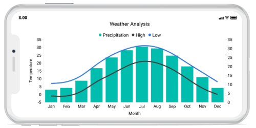

# Overview

Essential Chart for Xamarin.iOS provides the perfect way to visualize data with a high level of user interactivity that focuses on development, productivity and simplicity of use. Essential Chart also provides a wide variety of chart features that are used to visualize large quantities of data, flexible data binding and user customization.

           

Essential Chart for Xamarin.iOS
{:.caption}

## Key features

* Chart supports more than 20 different types of series, ranging from simple bar series to complex financial charts. Each type of chart represents a unique style of representing data that is user-friendly and has greater UI visualization.
* Data can be plotted against multiple scales that help visualize the mixed types of data in a single Chart.
* Chart provides support to render multiple series at the same time, with options to compare and visualize two different chart series, simultaneously.
* User-friendly customization support. SfChart provides various options for you to customize Chart features like axis, labels, legends, series and visualize them accordingly.
