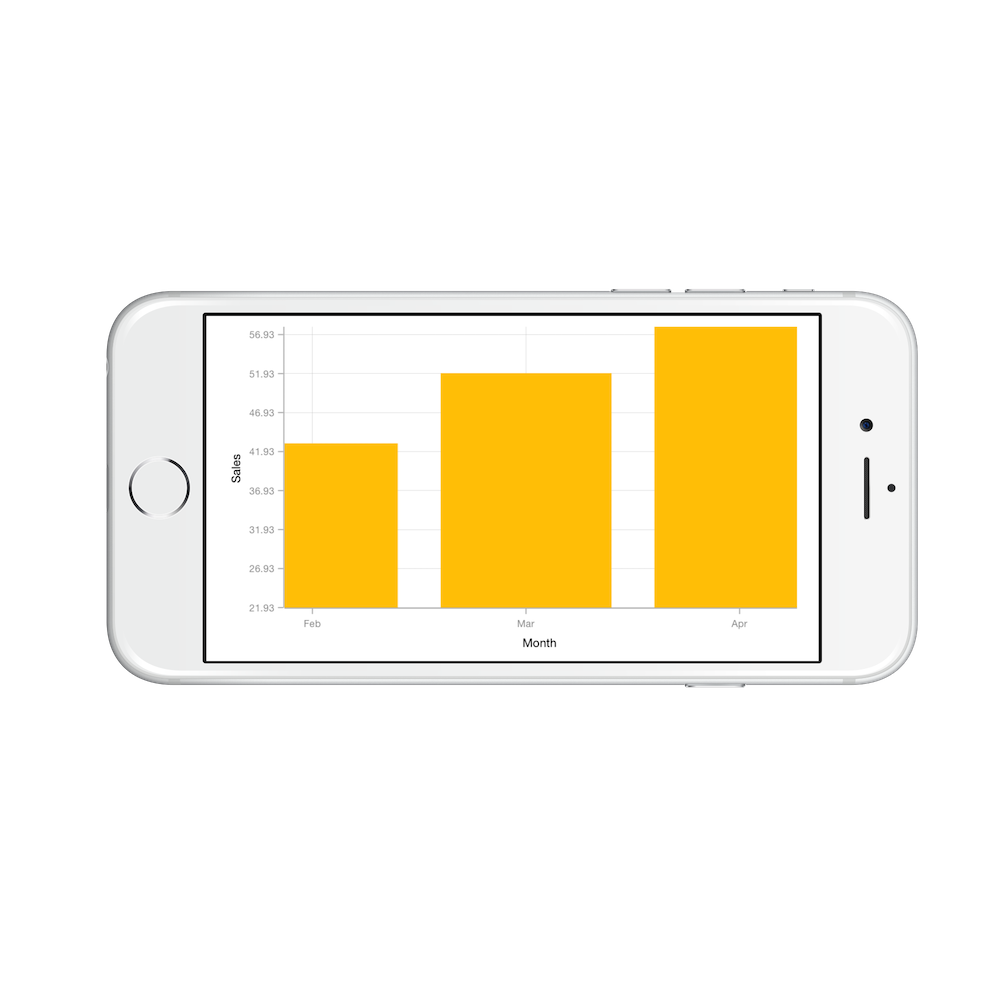

# Zooming and Panning

## Enable Zooming

Chart supports zooming to view the data clearly. To enable this feature, you need to add an instance of `SFChartZoomPanBehavior` to the `Behaviors` collection using the `AddChartBehavior` method of `SFChart`.

Following properties are used to configure the zooming feature,

* `EnableZooming` – used to enable/disable the pinch zooming. Default value is true 
* `EnableDoubleTap` – when you enable this property, you can double tap on the chart to reset it to the original size or zoom in by one level
* `EnableSelectionZooming` – when this property is set to true, you can double tap and drag to select a range on the chart to be zoomed in
* `EnablePanning` – used to enable/disable the panning. Default value is true

Following code snippet illustrates how to enable zooming.



SFChartZoomPanBehavior zoomPan = new SFChartZoomPanBehavior ();

chart.AddChartBehavior (zoomPan); 



Following code snippet illustrates how to enable the box selection zooming,



SFChartZoomPanBehavior zoomPan = new SFChartZoomPanBehavior();
zoomPan.EnableSelectionZooming = true;
chart.AddChartBehavior (zoomPan); 



Following screenshot shows the box selection on chart area,

Following screenshot shows the zoomed area,

## Zoom Mode

The `ZoomMode` property specifies whether chart should be allowed to scale along horizontal axis or vertical axis or along both axis. The default value of `ZoomMode` is `SFChartZoomMode.XY` (both axis).

Following code example illustrates how to restrict the chart to be zoomed only along horizontal axis,



SFChartZoomPanBehavior zoomPan = new SFChartZoomPanBehavior();

zoomPan.ZoomMode               = SFChartZoomMode.X;

chart.AddChartBehavior(zoomPan); 



## Delegates

We need to implement delegate to deal with the user interactions in chart for zooming and panning. In order to do this,you need to adopt the `SFChartDelegate` protocol through the class extension as shown below.



public override void ViewDidLoad ()
{
    chart.Delegate = new ChartDelegate ();
}

public class ChartDelegate : SFChartDelegate
{
    public override void WillZoom (SFChart chart, SFChartZoomingInfo info)
    {

    }
}



**WillZoom**

This delegate is called when the axis object has started a zoom operation and it returns the following values.

* `SFChartZoomingInfo` – used to get the zooming state.

**DidZoom**

This delegate is called when the axis object has finished a zoom operation and it returns the following values.

* `SFChartZoomInfo` – used to get the zoomed state.

**WillPan**

This delegate is called when the axis object has started a scroll operation and it returns the following values.

* `SFChartPanningInfo` – used to get the scrolled state.

**DidPan**

This delegate is called when the axis object has finished a scroll operation and it returns the following values.

* `SFChartPanInfo` – used to get the zoomed state.

**WillSelectionZoom**

This delegate is called when the axis object has started a selection zoom operation and it returns the following values.

* `SFChartSelectionZoomingInfo` – used to get the selection zoom state.

**DidSelectionZoom**

This delegate is called when the axis object has finished a selection zoom operation and it returns the following values.

* `SFChartSelectionZoomInfo` – used to get the selection zoom state.

**DidResetZoom**

This delegate is called when the axis object has reset the zoom level and it returns the following values.

* `SFChartResetZoomInfo` – used to get the reset object.

## Methods

Zooming and panning can be performed programmatically with the following methods:

### ZoomIn

[`ZoomIn`](https://help.syncfusion.com/cr/cref_files/xamarin-ios/sfchart/Syncfusion.SFChart.iOS~Syncfusion.SfChart.iOS.SFChartZoomPanBehavior~ZoomIn.html) method is used to increase the magnification of the plot area to view the data clearly.



SFChartZoomPanBehavior zoomPan = new SFChartZoomPanBehavior();

zoomPan.ZoomIn();



### ZoomOut 

[`ZoomOut`](https://help.syncfusion.com/cr/cref_files/xamarin-ios/sfchart/Syncfusion.SFChart.iOS~Syncfusion.SfChart.iOS.SFChartZoomPanBehavior~ZoomOut.html) is used to decrease the magnification of the plot area to reset the default view.



SFChartZoomPanBehavior zoomPan = new SFChartZoomPanBehavior();

zoomPan.ZoomOut();



### Zoom

**Zoom(factor)**

This method is used to change the zoom level by using zoom factor.



SFChartZoomPanBehavior zoomPan = new SFChartZoomPanBehavior();

zoomPan.Zoom(0.5f);



**Zoom(CGRect)**

This method is used to zoom the chart for a given rectangle value.



SFChartZoomPanBehavior zoomPan = new SFChartZoomPanBehavior();

zoomPan.Zoom(new CGRect(10, 10, 200, 350));



**Zoom(chartAxis, zoomPosition, zoomFactor)**

This method is used to change the zoom level by using zoom position and zoom factor. Zoom position value specifies the starting point of zooming, and zoom factor value specifies the level of zooming.



SFChartZoomPanBehavior zoomPan = new SFChartZoomPanBehavior();

zoomPan.Zoom(axis, 0.5f, 0.5f);



**Zoom(chartAxis, start, end)**

This method is used to zoom the given axis to given range.



SFChartZoomPanBehavior zoomPan = new SFChartZoomPanBehavior();

zoomPan.Zoom(axis, 20, 25);



### ZoomWithCumulativeScale(cumulativeLevel, origin, chartAxis)

[`ZoomWithCumulativeScale`](https://help.syncfusion.com/cr/cref_files/xamarin-ios/sfchart/Syncfusion.SFChart.iOS~Syncfusion.SfChart.iOS.SFChartZoomPanBehavior~ZoomWithCumulativeScale.html) method is used to change the zoom level of given axis to the specified level and origin.



SFChartZoomPanBehavior zoomPan = new SFChartZoomPanBehavior();

zoomPan.ZoomWithCumulativeScale(0.5, 0.5, axis);



### Reset

[`Reset`](https://help.syncfusion.com/cr/cref_files/xamarin-ios/sfchart/Syncfusion.SFChart.iOS~Syncfusion.SfChart.iOS.SFChartZoomPanBehavior~Reset.html) method is used to return the plot area back to its original position after zooming. 



SFChartZoomPanBehavior zoomPan = new SFChartZoomPanBehavior();

zoomPan.Reset();


